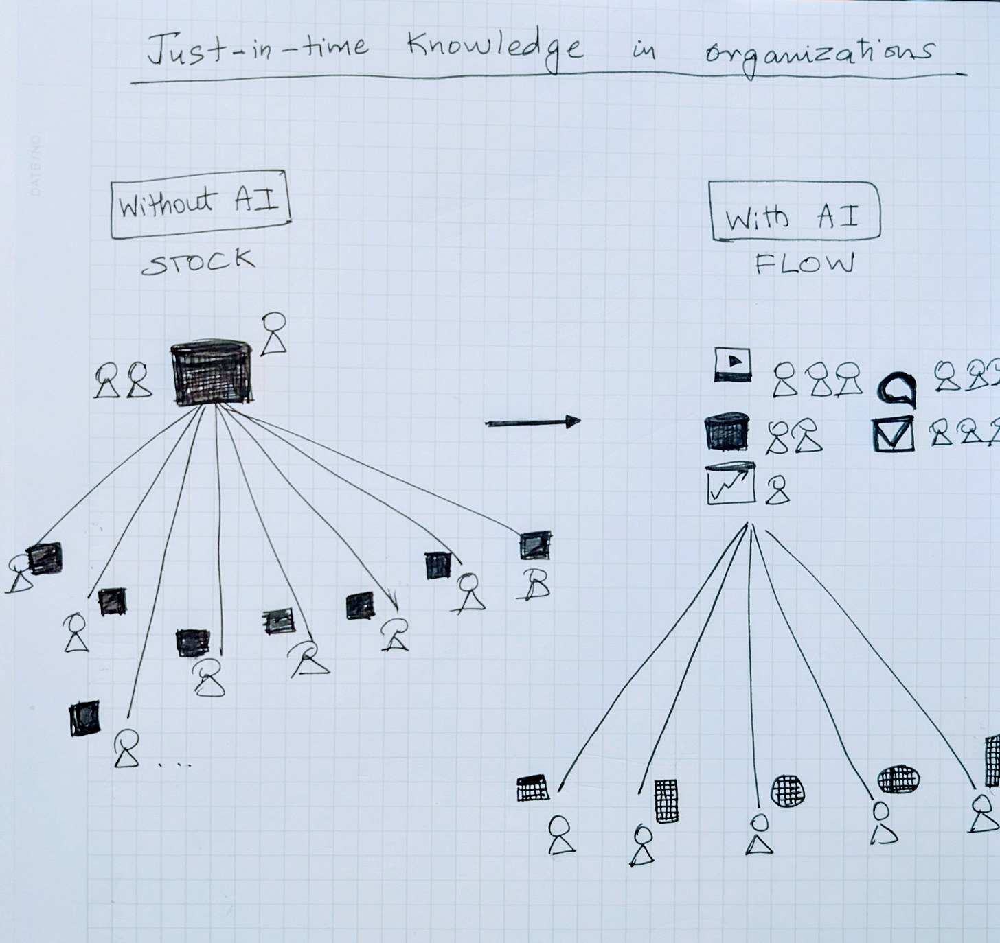

# Just-In-Time Content

Recently, I used Microsoft 365’s Researcher to get the latest design decisions on an internal project. Instead of digging through old decks or asking colleagues for the latest updates, it assembled the most current information, tapping into chats, documents, and meeting summaries, into a single living brief.

It showed me what knowledge looks like when it’s drawn directly from flow, rather than hunted down from stockpiled artifacts.

#### **From Stock to Flow in Manufacturing**

In *The Machine That Changed the World*, the MIT researchers studying Toyota captured the power of lean production:

“Lean production uses less of everything compared with mass production—half the human effort, half the space, half the inventory…”

Toyota’s breakthrough was the recognition that stockpiles create hidden waste. Warehouses full of parts looked safe, but they slowed responsiveness and masked problems. By reorganizing around flow, Toyota reduced waste and enabled faster, better decisions.

This shift from stock to flow reshaped global supply chains and created entirely new operating models and infrastructure.

#### Knowledge Work Has the Same Problem

For decades, content in organizations has been managed as STOCK:

Documents, decks, and PDFs created once and shared broadly. Even when feeds and search personalized what people saw, the underlying content remained static.

That was the environment where the work we did at Akamai thrived. The early web scaled precisely because content was static. CDNs could cache those artifacts and distribute them like inventory.

But inside organizations, the most valuable knowledge doesn’t sit in static files. It moves continuously, in meetings, chats, real time business intelligence graphs, and customer calls. The doc captures a snapshot, but the flow keeps moving.

The cost shows up as wasted energy:

* Leaders and teams spend time asking for “the latest numbers.”
* People search across systems for fragments of updates.
* Decisions get made on incomplete or outdated context.

Stock in knowledge work ties up storage, creates coordination overhead and decision drag.

#### Just-In-Time (JIT) Content

AI makes it possible to flip this model. Instead of stockpiling artifacts, organizations can stage the ingredients e.g. data, knowledge, brand voice, information across conversations, and assemble the right content when it’s needed.

The document itself doesn’t disappear and remains a central container. But instead of being a frozen snapshot, it becomes a living output of the flow.

At Microsoft, much of my focus is on what it means for productivity to be AI-native. Reimagining the supply chain for knowledge as just-in-time is one of the most important pieces I see ahead.

#### A New Information Supply Chain

Moving to JIT Content requires rethinking the stack:

* Authoring tools where creation and consumption blur.
* Infrastructure that isn’t built around static storage and downloads.
* Edge generation close to the moment of need.

#### Why This Is Inevitable

Toyota’s move to flow was inevitable because it was structurally superior: less waste, higher quality, greater adaptability. Once the benefits became obvious, the entire industry had to follow.

The same inevitability applies here. Stockpiles of content create hidden costs in coordination and decision-making. Flow reduces those costs by delivering knowledge in the moment, tailored to context. Manufacturing learned to trade inventory stock for flow of information. Knowledge work is about to do the same.

The future of content for productivity is Just-in-Time knowledge, enabled by a new information supply chain stack.