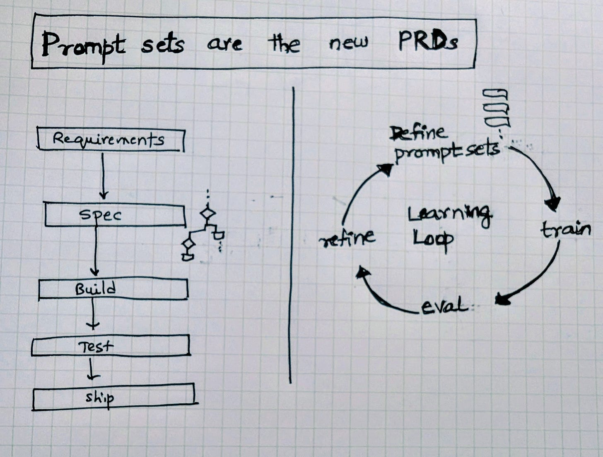

# Prompt sets are the new PRDs

A lot of folks have heard me say (on [Lenny’s podcast](https://youtu.be/HbbfXAWcuUo?si=VSHTEoR-jFndaTLk) , for example, that **Prompt sets are the new PRDs.**

At Microsoft, our teams have been building M365 Copilot and agents that can *come to work for you at work*: a Researcher, an Analyst, a Project Manager, and many others are in the works. And as these agents take shape, the question I keep returning to is: what does a “spec” really mean in this new world?

---

### Human intent as the spec

“How would you ask your coworker for this?”

This is the..uh..prompt..I posed to folks in a meeting the other day .

I asked this not to arbitrarily anthropomorphize agents but because my intuition is this question forces the right granularity for the agents.

In some sense I see this as a variant of Ilya Sutskever’s observation: *“Predicting the next token well means that you understand the underlying reality that led to the creation of that token.”*

Next-token prediction worked because the task itself demanded depth: to predict words well, a model had to capture structure, context, and causality.

My hunch is that prompts that reflect **human intent** set a similar expectation for agents. They push the system toward *usefulness* rather than rote mechanics.

* *Good:* “Tell me the most important things from the customer meeting. what were the key risks, and how did sentiment trend?”
* *Bad (too mechanical):* “Summarize the transcript in 5 bullets.”
* *Bad (too tool-specific):* “Run sentiment analysis on transcript.json and output JSON.”
* *Bad (too coarse):* “Handle all my email.”

The difference lies in whether the prompt encodes judgment and priorities, the elements a human colleague would naturally understand and more importantly the level at which  *you* would operate at.

---

### Prompt sets as teaching tools

Traditional PRDs were written for programmers. They locked requirements down in advance, then handed them off to be built. Prompt sets work differently. They are living artifacts: part specification, part training data.

Each prompt is an example that shapes how the agent behaves. Together, I almost see them form a curriculum teaching the system what “good” looks like, how to correct mistakes, and where the boundaries are.

---

### A multi-round game

Writing prompt sets is never a one-shot exercise. You start with a few, test them, see where the agent falls short, and refine. Each round closes the gap between what you asked for and what the system delivers.

It feels less like drafting a rigid contract and more like coaching. The spec can continuously evolve, and most importantly, I am finding that you need to put human intuition at the center guiding, adjusting, raising the bar.

---

That’s why I keep coming back to this idea: **Prompt sets are the new PRDs.** They encode intent, they teach, and they set the rhythm for iteration.

