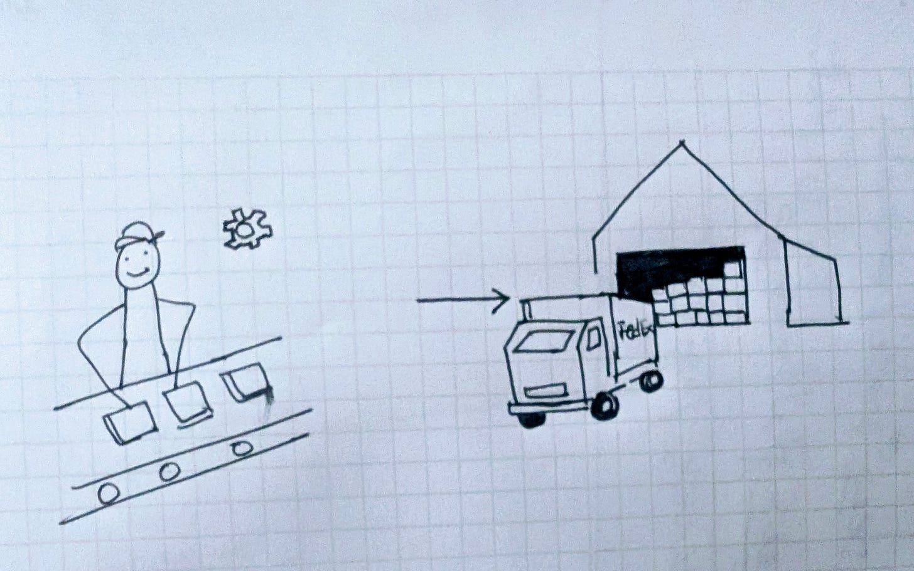
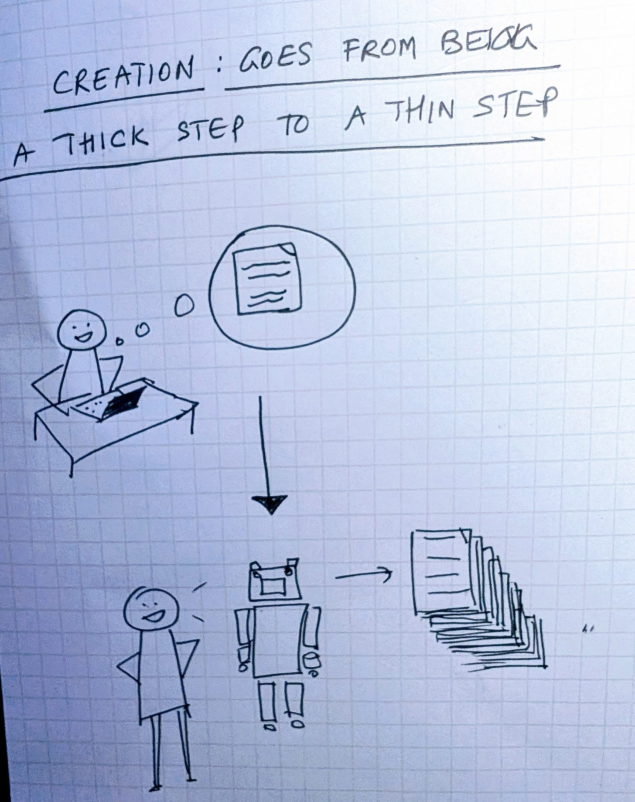
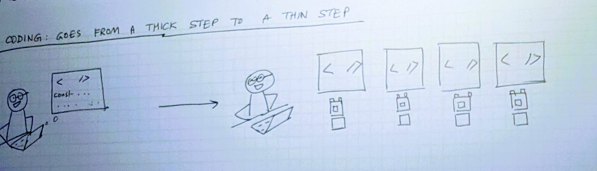
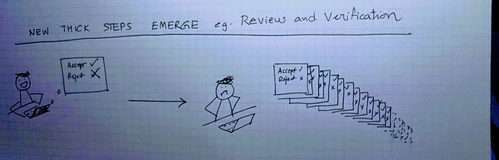

# Thick Steps and Thin Steps in the AI era

*What are the Fedex and Sears of the Intelligence Age? *

In the early industrial age, mechanization altered the structure of production in a direct and measurable way. Tasks that once relied on craft were reorganized into repeatable motions along an assembly line, increasing throughput and lowering cost. **A thick step became thin**, and the pace of work shifted accordingly.

Thanks for reading ACD! Subscribe for free to receive new posts and support my work.

As production accelerated, the constraints shifted as well. Factories could now create goods faster than the surrounding system could move or absorb them, and the pressure migrated to the steps that followed.

* Warehouses accumulated finished products because output exceeded retail capacity.
* Rail networks reorganized around freight to keep up with rising volumes.
* Sears grew by aggregating national demand and redirecting surplus
* Later companies such as FedEx developed the coordination systems required to move goods reliably at scale.

Economic historian David S. Landes summarized this dynamic in *The Unbound Prometheus*: **“The factory system increased the speed of production beyond what existing channels of distribution could absorb.”** Mechanization relocated friction, in that as production became thin, new thick steps emerged around storage, movement, coordination, and demand shaping. Entirely new businesses and industries formed to support these parts of the process.

I see a similar pattern that can emerge in the Intelligence Age and knowledge work.

The early steps of knowledge work have become lighter. Drafts, outlines, diagrams, and prototypes appear almost immediately. Work that once began slowly now starts with several plausible options. **Here too, a thick step has become thin.**

Coding follows the same trajectory. Developers often begin not by writing a function but by reviewing the alternatives an assistant proposes. Microsoft reports that its internal AI reviewer now participates in nearly 600,000 pull requests each month, supporting the majority of code changes across the organization. Implementation—long the thickest step in software development—moves faster because scaffolding and variation are easy to produce. **Another thick step has become thin.**

As in the industrial case, reducing the effort of early steps increases the number of attempts. Teams explore more directions because exploration is inexpensive. Drafts accumulate, code paths proliferate, and design variations multiply. The volume grows because the friction that once limited iteration has diminished.

Reviewing, verifying, grounding in context, and aligning with architectural or policy constraints become the steps where complexity gathers. These stages absorb the effort that implementation once carried. **When multiple thick steps become thin, the downstream steps thicken in response.**

Three things follow.

**Bottlenecks shift.**  
Way easier and faster production and creation in the early phases means that new bottlenecks emerge downstream e.g. review, curation, verification.

**Resources shift.**  
Time, attention, and tooling concentrate where coherence, correctness, and coordination now reside.

**New solutions and companies form.**  
In the industrial age, thinning production created new thick steps in logistics, warehousing, distribution, and demand aggregation, and these became big meaningful industries! I think the intelligence age will generate its equivalents: For example, in coding, we will need much more scalable software systems for evaluation, selection, provenance, orchestration, integration, and governance.

The pattern is consistent across eras.  
**A thick step becomes thin.  
Thin steps expand volume.  
New thick steps emerge to absorb it.**

The opportunity lies in addressing those new thick steps, and in building the solutions and companies that unblock the new bottlenecks.

Thanks for reading! Subscribe for free for new posts.