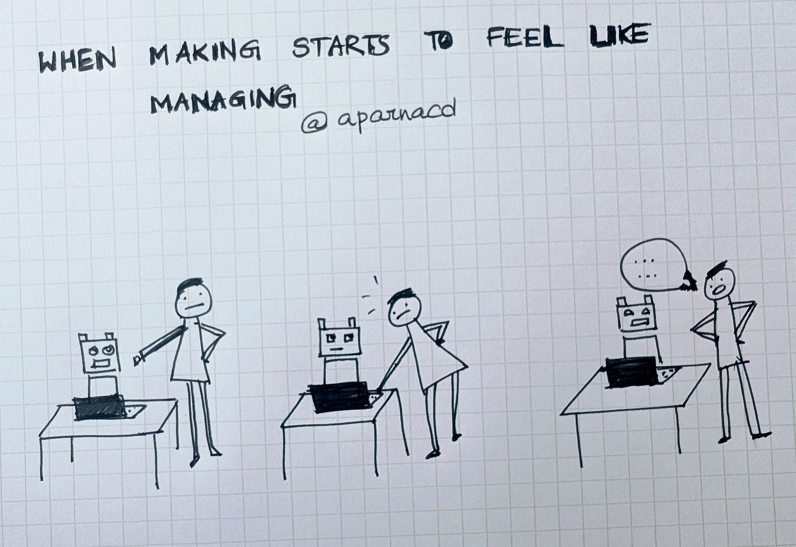
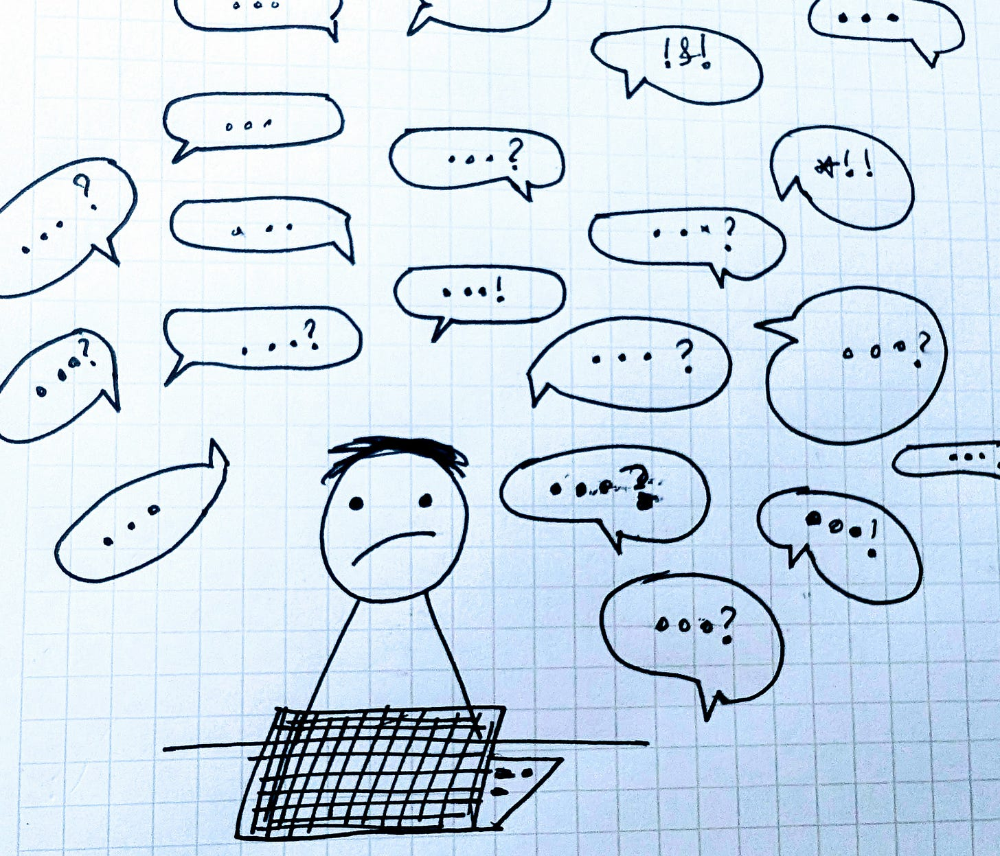
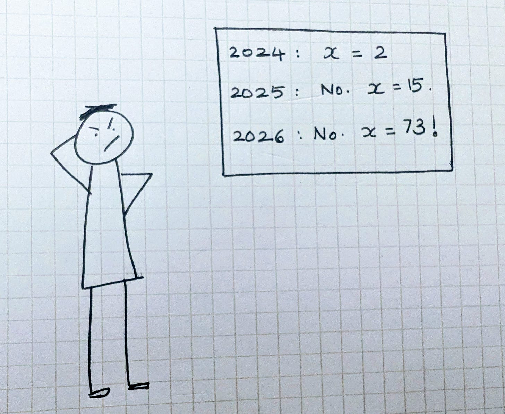
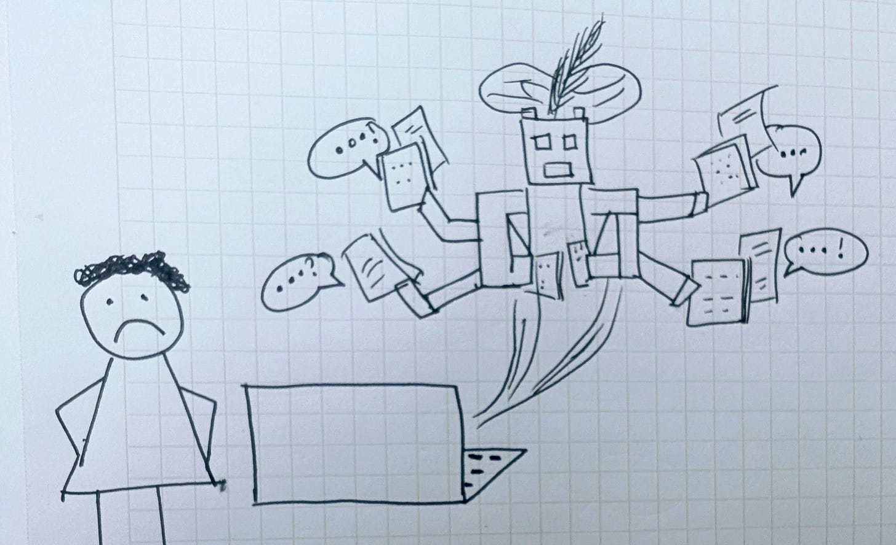
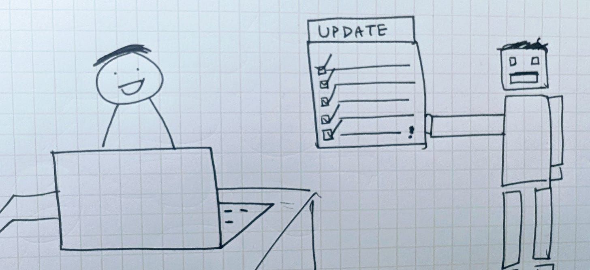

# Every Maker Is Now a Manager (of AI)

*RIP Maker Schedule. Unless we invent calmer human-AI interfaces.*

## 

A few nights ago, I was one prompt away from a working app.

The agent had already done most of the heavy lifting. I expected to make one small adjustment, run it, and be done. When I checked the time again, it was one in the morning, and I was still going back and forth with the CLI.

Thanks for reading ACD! Subscribe for free to receive new posts and support my work.

This week, I came across this *Harvard Business Review* [article](https://hbr.org/2026/02/ai-doesnt-reduce-work-it-intensifies-it) arguing that AI doesn’t reduce work so much as it intensifies it. It was less about longer hours or lower productivity and more about how work feels when much of the execution is delegated to systems that run 24/7.

---

### 1. Every maker is now a manager

Paul Graham once [described](https://paulgraham.com/makersschedule.html) the difference between a maker’s schedule and a manager’s schedule. Makers rely on long, uninterrupted stretches to stay immersed. Managers operate through review, coordination, and decisions that happen at boundaries.

Working with agents increasingly pulls makers into that second mode. We are no longer fully inside the work. We are supervising it. Instead of moving through a problem continuously, we spend more time reviewing outputs and deciding when and where to intervene.

There’s a well-established finding in work psychology that helps explain why this feels heavier. Stress increases when responsibility remains high while control over execution decreases. Karasek’s Demand–Control model captures this dynamic: roles with high accountability and low execution control reliably produce more cognitive strain than roles where effort and control move together.​

​

---

### 2. All communication, little execution

Agents are easy to talk to and respond immediately. Each interaction feels reasonable on its own. A prompt leads to an answer. An answer suggests a refinement. A refinement leads to another prompt. The work starts to resemble a long message thread. It doesn’t feel urgent, but it also doesn’t naturally conclude.

There’s good evidence for why this is draining. Research on language production and dialogue shows that conversation is a high-effort cognitive activity. Speaking and writing require ongoing planning, monitoring, and context management, even for experts.

Work by researchers like Willem Levelt and Herbert Clark shows that conversation is a joint activity that keeps participants mentally engaged, even when little is happening.

When work is routed primarily through dialogue, I think our attention never really fully disengages.

​

​

---

### 3. The shrinking half-life of expertise

For a long time, maker skills became more valuable with use. Experience compounded, and knowledge stayed relevant long enough to justify the effort it took to acquire.

That stability is harder to rely on now. Techniques that felt advanced a year ago may already be assumed. Problems that once required deep expertise increasingly collapse into default model capabilities. The challenge shifts from mastering a domain to tracking how the domain itself keeps being redefined.

Cognitive psychology frames this as a belief-updating problem. Humans rely on heuristics because they reduce mental effort. When environments change slowly, those heuristics remain useful. When environments change quickly, expectation violations become frequent, and belief updating turns into an ongoing task.

As Daniel Kahneman has described, repeated violations of expectation push thinking into slower, more effortful system 2 modes. Having to continually reassess and update is fatiguing.

​

​

---

### From restless genie to high-performing employee

There’s an old Indian story about a genie that can instantly and perfectly do anything its master asks. When the genie has nothing to do, it becomes dangerous, undoing the very work it just completed. The only way to keep it contained is to give it an endless task.

Modern agents can feel similar. The work progresses, but the interaction never quite pauses. Many agents today are always available. Always eager to respond. Always ready with partial output. The capability is real, but so is the sense that you need to stay nearby, prompting, clarifying, and supervising as the work unfolds.​

​

### Human-AI Interface for Deep Work

A lot of my day job is focused on building “the IDE for Knowledge Work”. Part of my goal is to design and build a calmer, less-frenzied interaction model for humans working with AI, especially on deep meaningful work. One that feels less like managing a genie in real time and more like working with a high-performing colleague. Someone you give a well-scoped piece of work to, who goes away for a while, you can steer at the right altitude, and comes back with something coherent.​

​In that mode, interaction has a higher signal-to-noise ratio. Questions are batched, updates arriving at natural breakpoints, and the work showing up as an artifact rather than a running commentary.

That way, we spend our attention evaluating results instead of supervising the process. As we would with a capable colleague!

Thanks for reading ACD! Subscribe for free to receive new posts and support my work.