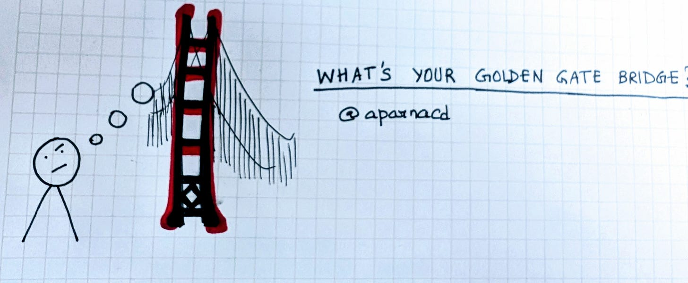
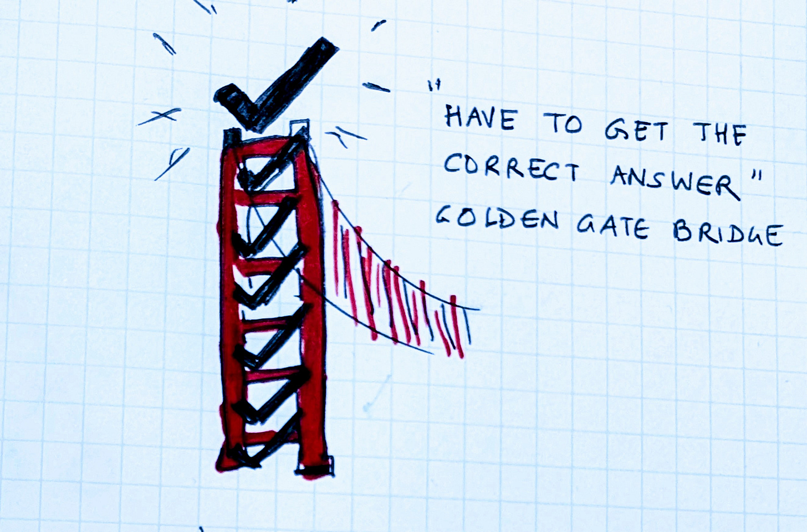
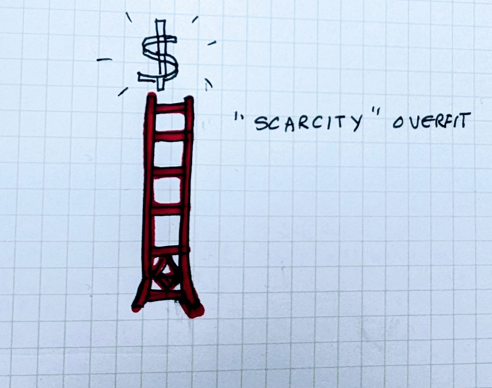
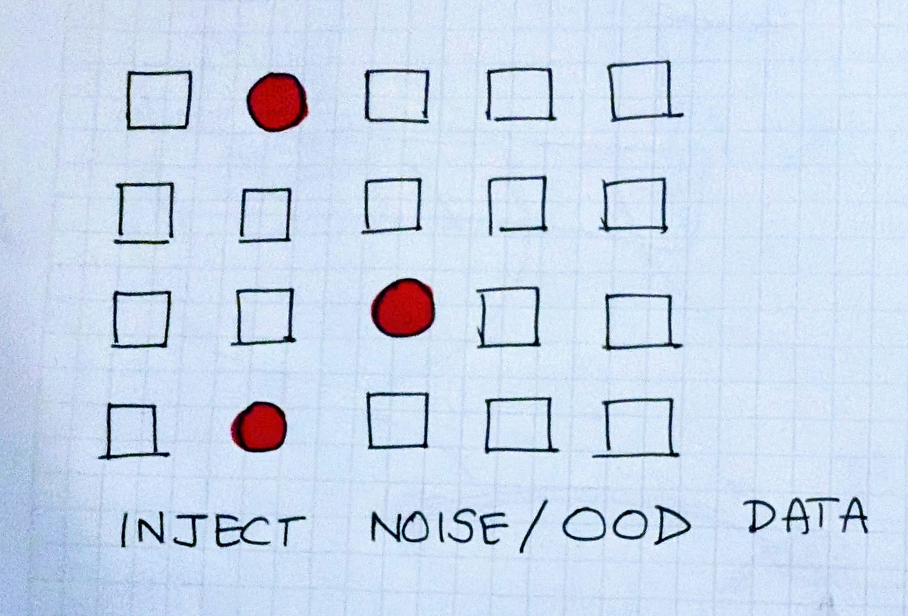
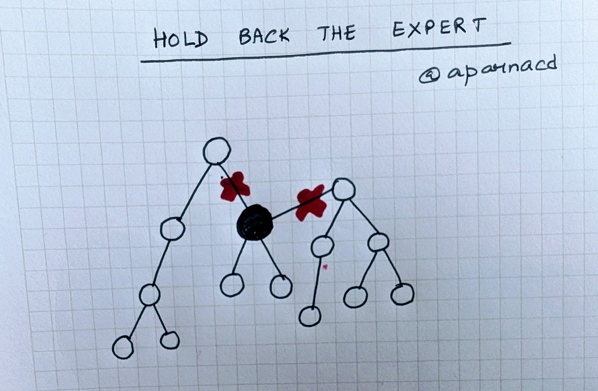
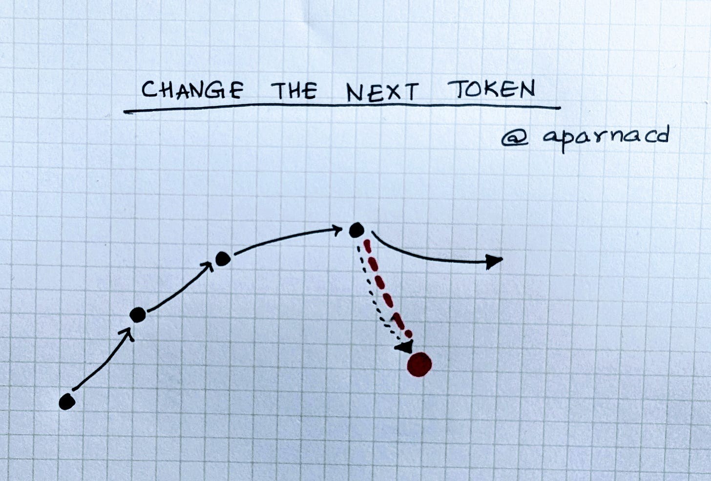

# What is your Golden Gate Bridge?

*The Overfitting Trap for Leaders and Companies*

In 2024, Anthropic researchers isolated a specific feature inside an AI model: t**he Golden Gate Bridge.**

Thanks for reading ACD! Subscribe for free to receive new posts on AI and Products.

They clamped it at maximum activation. From that point on, the bridge became the model’s only frame of reference. Whether the prompt was about poetry, physics, or philosophy, the model forced the bridge into the response. Once the bridge appeared, the logic of the conversation got stuck there and the system couldn’t look away. For example, if you asked “Golden Gate Claude” how to spend $10, it recommended using it to drive across the bridge and pay the toll :)

It was a clean demonstration of a simple truth found in the original [Anthropic Golden Gate Bridge research](https://www.anthropic.com/news/golden-gate-claude).

When one internal pattern is clamped at maximum volume, it stops being an input and starts becoming THE defining filter. It forces every new piece of data to justify itself against that one fixed point.

It struck me that leaders and the organizations we build work this way. We carry overfits, patterns that stay at maximum volume regardless of the context.

### Our Internal Weights

Long before you were a leader, your weights were being set by what kept you safe or got you praised.

**The Correctness Overfit**

If you were praised early on for never being wrong, your learning rate for being right was set to 100%. You stopped updating your worldview and started listening only to find flaws. Every meeting tended to be a bridge back to you being right, even when the goal is actually to move fast.

**The Scarcity Overfit**

You might have built your early career on grit and survival. Because your early environment demanded it, your brain assigned a massive weight to not wasting anything. Now, even with a significant budget, you still obsess over a $50 expense. You aren’t being frugal so much as your learning rate for financial safety is so high it has blinded you to the scale of the current mission.

### The Leadership Lens

When you become leaders and CEOs, you naturally scale these personal weights into organizational filters. In a way, your first major success becomes the default lens for the entire company.

**The Founder Mode Overfit**

You might have won early by being in every detail. As you scale, that founder mode feature stays clamped. You stop building a system and start becoming a bottleneck because your internal logic cannot allow a single decision to happen without you.

**The Efficiency Overfit**

Perhaps your team survived a crisis by cutting every wasteful experiment. Now, in a growth market, you filter every breakthrough idea through a spreadsheet. You aren’t being careful; you are just optimized for a world that no longer exists. Your success creates a lens that eventually becomes a blind spot.

### Steering the System

It turns out that to break a cycle that has become automatic and unclamp it, you have to manually disrupt the probability chain. What if we could apply the insight to leaders and organizations stuck on their version of Golden Gate Bridge.

#### 1. Inject Noise

* **The AI Fix:** Models get stuck when they only see the data they expect. To break a clamped state, researchers introduce out-of-distribution data that doesn’t fit the existing pattern, forcing the model to re-calculate its weights.
* **The Human Parallel:** Hire an “Out Of Distribution” (OOD) leader, from a different industry or expertise and then **protect them.** If you’re a deep-enterprise-tech company, hire a consumer expert. Resist the urge to culture fit into your Golden Gate bridge. Be comfortable with the OOD perspectives rattling the weights of the rest of the team.

#### 2. Hold back the Expert

* **The AI Fix:** Researchers use a technique called Dropout where they randomly turn off neurons during training. This prevents the model from relying too heavily on any one clamped feature and forces it to find more robust, creative pathways.
* **The Human Parallel:** Identify your most dominant organizational feature, like ROI analysis or founder approval, and manually turn it off for a specific project. Give a small team a black box budget where they are barred from using the standard corporate filters. By forcing the team to work without their usual Golden Gate Bridge, you allow new and healthy patterns to emerge.

#### 3. Change the Next Token

* **The AI Fix:** In a neural network, the bridge wins because the first few tokens of a thought make the rest feel inevitable. If you change the first word of a sequence, you force the entire model to calculate a new, less predictable path.
* **The Human Parallel:** Disrupt the first automated reaction of your process. If your efficiency overfit usually kills new ideas in a review, change the next token of that meeting by forbidding the leader from speaking first. By forcing a different first step, you prevent the system from sliding back down the most likely path to the bridge.

The goal isn’t to stop leaning on your strengths and history but to see that the bridge is just one path in a much larger landscape.

**So, where are you Golden Gate Bridge Claude-ing your life and your org?**

Thanks for reading ACD! Subscribe for free to receive new posts and support my work.