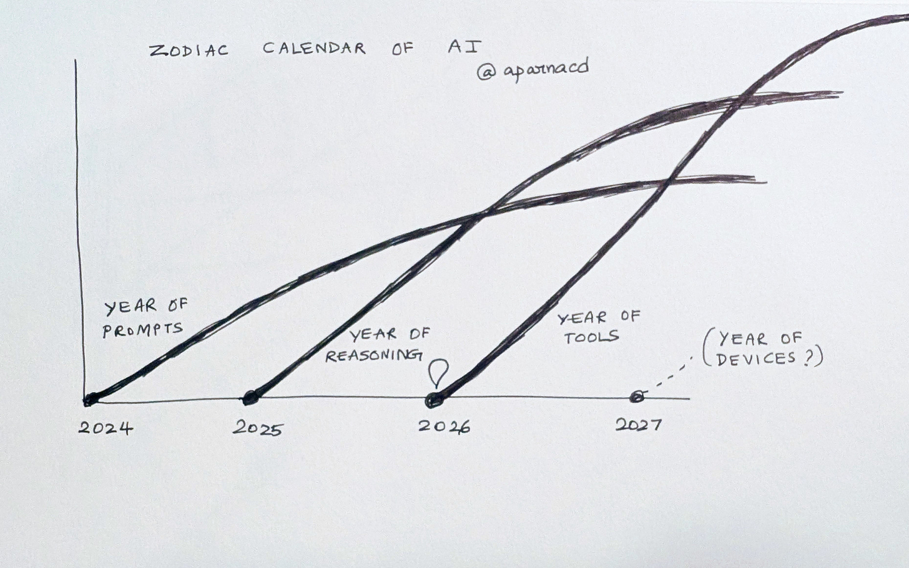
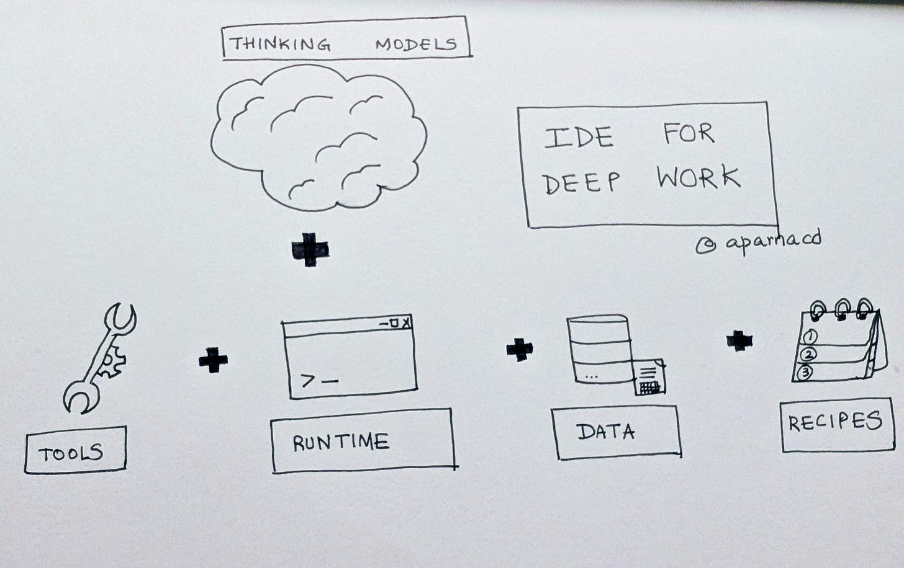

# 2026: Year of Deep Work

*(I spent some time during the holidays building with GitHub Copilot, Claude Code, and thinking about what's next for the agents our team builds at Microsoft, such as Researcher. I then wrote this essay to capture a specific conviction: 2026 is the year we move beyond the chat box and into the era of **Deep Work.***

*Before I got around to posting it, the frenzy around Claude Code and Claude Cowork broke out in the last few weeks. Which is further exciting evidence that we are going to go beyond AI that talks to one that does.)*

### **The Zodiac Calendar of AI Years**

I view the progression of the last three years as a sequence of model unlocks. Each new capability collapses a product category and demands a radically different interface. The shape of the model determines the shape of the product, which eventually determines the shape of work itself.

**2024**: **The Year of Prompts.**

Defined by next-token prediction. Interactions were reactive, stateless, and single-turn. Chat was the viable UI because models lacked the capacity to sustain intent over time.

**2025: The Year of Reasoning**.

The focus shifted to durability. Models began to hold internal logic long enough to produce "artifacts" for plans, code, and research.

**2026: The Year of Tools**.

Models now call APIs, run code, and update state. The center of gravity has moved from the response to the execution.

### **The Shallow Work Ceiling**

AI utility currently plateaus at "shallow work." It remains an excellent tool for summarizing documents, drafting emails, and compressing messy notes. These applications lower the "blank-page tax" and smooth the edges of the day, yet they leave the fundamental architecture of work intact.

The industry has treated every interaction as a single-turn transaction. Real work is rarely stateless. It accumulates, branches, creates social obligations, and carries historical weight. This is the realm of **Deep Work** -- a domain where "chat + artifacts" inevitably breaks down.

### **The 4Cs of Deep Work**

Deep work moves the needle for an individual, team or an organization. To me, it goes well beyond a single-turn single-player single-shot interaction with AI. It is defined by four pillars:

**Cognition**: Expert judgment, synthesis, and analysis. If you are trying to help a team close a deal, you aren't just looking for a script. You need an analysis of the prospect’s procurement hurdles and a strategy to navigate the internal politics of the account.

**Complexity**: Multi-modal, multi-step, and multi-tool. To “help you nail the all-hands”, you must synthesize product roadmaps, financial performance, and cultural milestones. A change in the financial data in hour one must ripple through the speech notes in hour ten.

**Criticality**: These tasks are core to the business function. They aren't "nice to haves"; they are the work that defines the quarter.

**Collaboration**: Context is distributed. To resolve a customer escalation, an agent must stitch together CRM notes, engineering commitments, and real-time telemetry to draft a resolution that aligns Sales, Product, and Support.

Deep work requires persistence and memory, properties shallow AI never quite needed.

### **From Output to Outcomes**

Software engineers use IDEs because coding is too complex for a single session. Knowledge work shares these properties, yet it remains scattered across disparate inboxes and spreadsheets. We have surfaces; we lack an environment.

We need an **IDE for Deep Work.**

In this environment, "tasks" replace "chats" as the first-class primitive. A task is a system that can run, pause, resume, and branch. It creates a space where a swarm of specialized agents can work in parallel—researching, synthesizing, and verifying, until they converge on a result.

"Task → New" is an instruction to resolve an escalation or finalize a quarterly plan. These are requests for a system to translate a messy reality into a coherent plan and a state change.

This is the direction of Researcher, the agent my team is building for long-running, high-cognitive tasks. Excited to evolve the product toward this IDE model where tasks are persistent, tools are integrated into the execution, and the output is a living artifact.

It may be the era of adolescence of technology :) but still infancy of product!