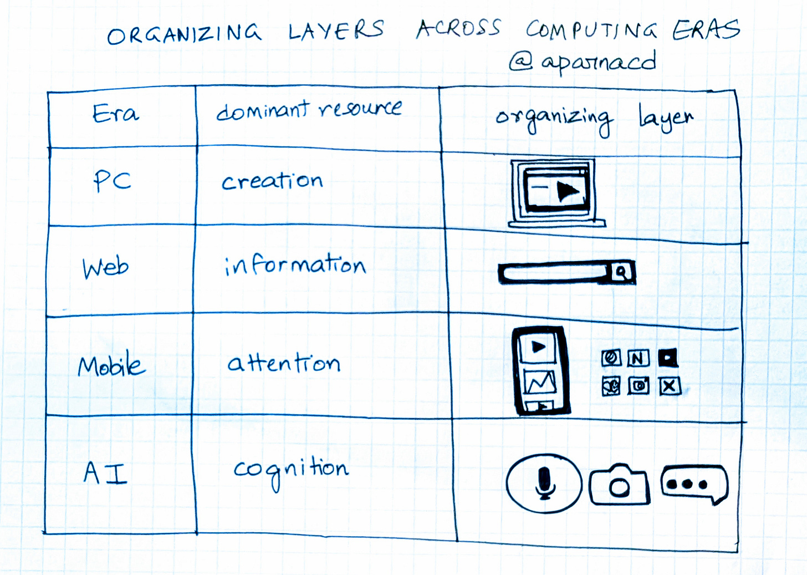
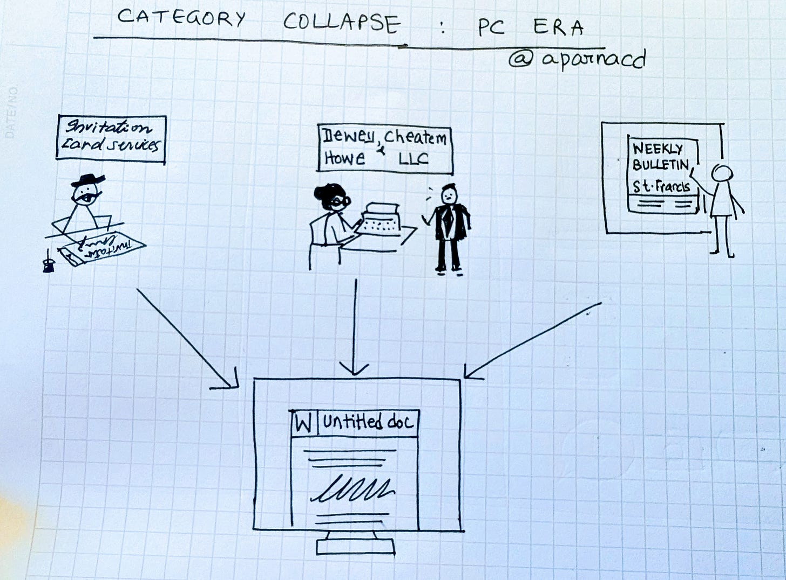
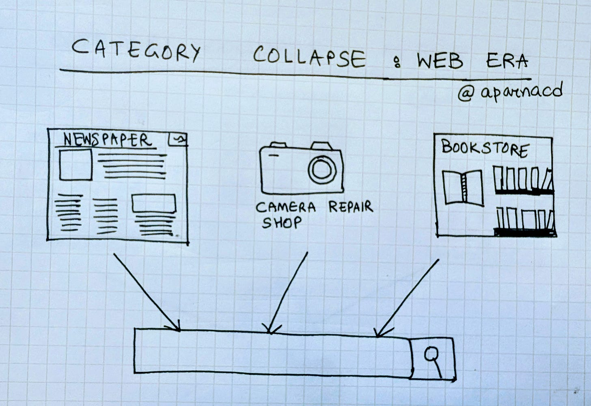
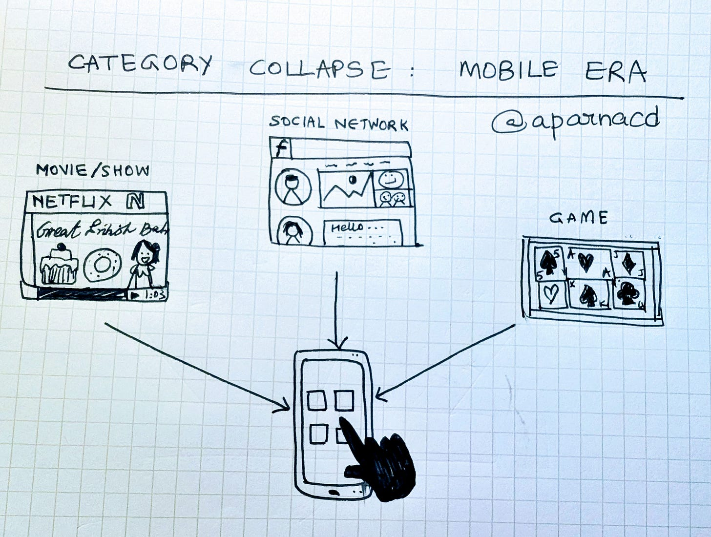
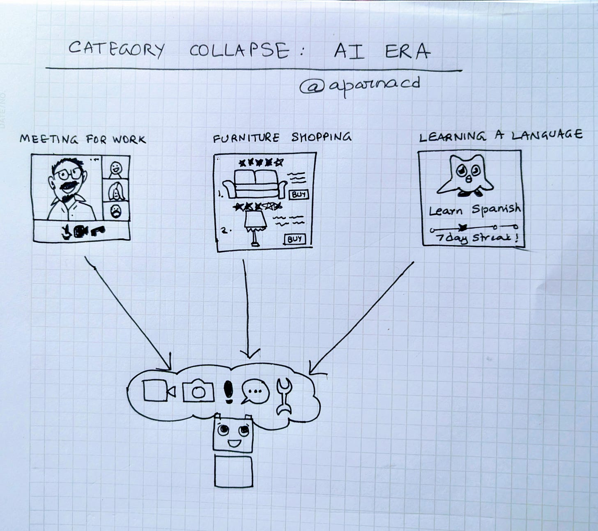

# Designing Intelligent Products: Category Collapse

**Designing for Impact:**

**Investment Thesis #1: Bet on Category Collapse**

This is part of the ongoing *Designing Intelligent Products* series. The essays so far focused on how to design AI products for intent, for trust, for learning. The next few essays will focus on how to design AI products for impact. I.e. **what are some investable theses on where new value gets created and captured,** as AI platform shift reorganizes industries, products, and human behavior?

The first thesis looks at a recurring pattern in technology’s evolution: **CATEGORY COLLAPSE**. When a new medium matures, industries that once stood apart begin to share the same interface, getting reduced to suppliers for a new organizing layer between humans and computing.

---

### **Organizing Layers Across Computing Eras**

Each era of computing has two things:

1. A **dominant resource,** the element around which competition and creativity concentrate.
2. an **organizing layer** that channels it.

* The **PC era** organized around ***creation***, through the desktop and the document.
* The **web era** organized around ***information***, through the browser and the search bar.
* The **mobile era** organized around ***attention***, through the touchscreen and the feed.
* The **AI era** is beginning to organize around ***cognition***, through conversation, camera, and mic.

Every shift redefined for a business, what it meant to build and to compete.

### **Category Collapse: PC Era**

The personal computer absorbed professions that had little to do with one another e.g. design studios, legal typing services, and community printers, and drew them into a single act of authorship. The blank digital page became a common surface for creativity, administration, and communication. Making things became a universal act rather than a specialized service.

### **Category Collapse: Web Era**

The web organized around browsing for and finding information. A local newspaper, a camera repair shop, and a bookstore once served completely different needs. When information became searchable and distribution became free, these industries were drawn into the same frame, they are 10 blue links in a search engine and a URL away in the browser.

### **Category Collapse: Mobile Era**

The smartphone collapsed entertainment, communication, and play into a single organizing layer.

A game, a video platform, and a social app once belonged to different markets. They are now adjacent icons on your phone home screen, one tap away. The dominant resource for this era has been *attention* and the infinite scroll of a feed is its ultimate sink.

### **Category Collapse: AI Era**

A new collapse is underway. A video call, a furniture shopping session, and a language lesson come from entirely different domains, yet I predict that they will soon coexist and collapse into the same interface: **AI that can see, listen, reason and respond.**

Productivity, Search, Communication and Commerce were all previously disparate giant categories of products and businesses and will collapse into a single organizing layer of cognition: a system that mediates between intent and outcome.

### **The Broader Pattern**

Each technological shift has created a new way for human intention to meet capability. As those interfaces gained power, industries began to converge around them, and the companies that defined them became the organizing institutions of their time.

The desktop gave rise to Microsoft. The browser gave rise to Google. The feed gave rise to Meta and ByteDance. The next generation of companies will emerge from the **cognitive** **interface**: the layer that blends seeing, listening, and reasoning into a single surface.

##### Next Up: Investment Thesis #2: Latent Long Tails

*Category collapse is about how value concentrates at the organizing layer, collapsing* **existing** *disparate businesses and categories. **Latent long tails** will explore what* **new** *products and businesses can be built when the tech shift unlocks previously latent demand.*