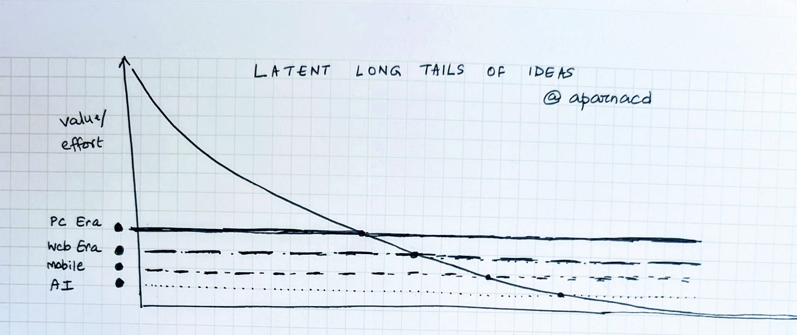
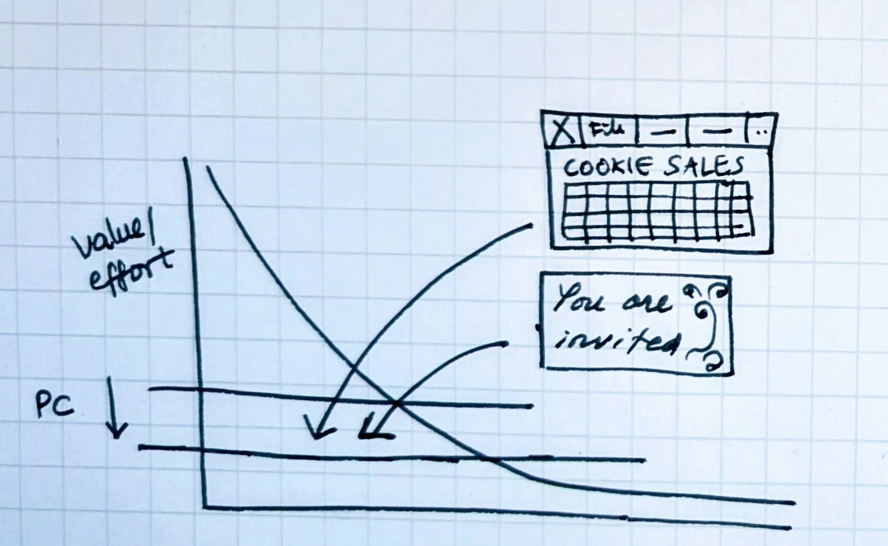
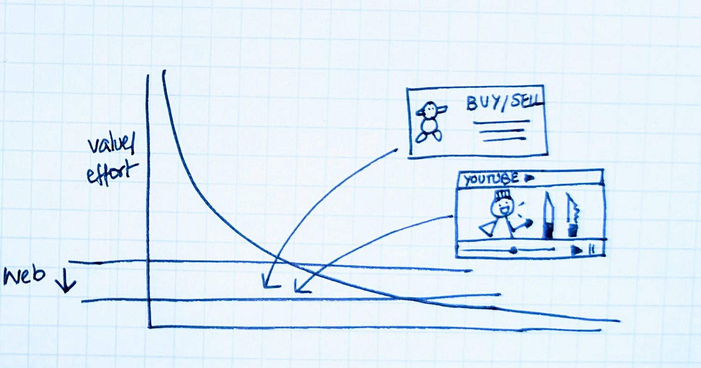
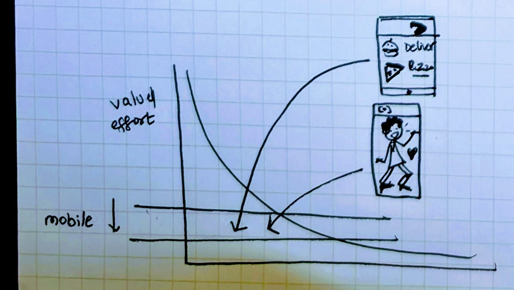
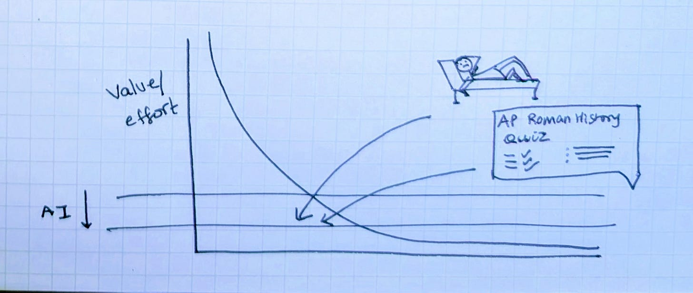
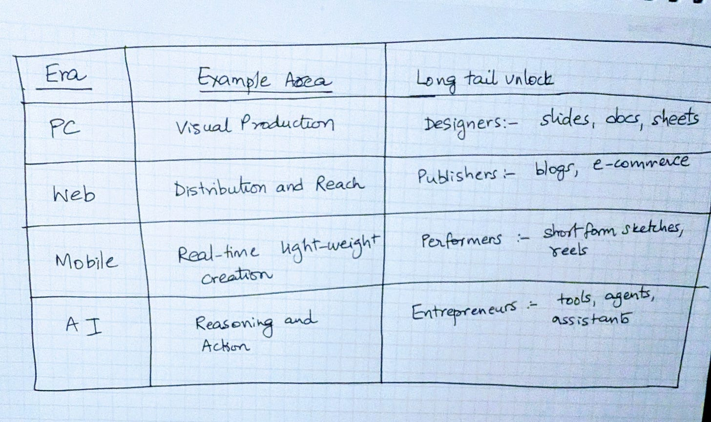

# The Latent Long Tail of Ideas

Investable thesis #2: Bet on tools and platforms enabling the next set of long tail amateurs.

(this essay is part of the series called Designing intelligent Products, about product making in the AI era. You can start with the introduction [here](https://open.substack.com/pub/aparnacd/p/designing-intelligent-products)).

We all live with more ideas than we act on. We imagine a clearer way to teach something. We sketch a plan for a neighborhood gathering. We picture a tool that would save time at work, or a study guide that might help a child prepare for a test. These thoughts appear easily and often, and many of them stop in the same place: the long stretch between having the idea and knowing how to carry it forward.

That stretch contains the real work e.g. structuring, drafting, designing, coordinating etc. and it has usually been the point where momentum fades.

Technology has always been a bridge across the valley between an idea and its execution. Over the history of personal computing, each era has bridged a different part of that gap, and when the required effort lowere, the set of ideas we act on blows up, and new amateurs step forward. For anyone thinking about where to place strategic bets, the signal is simple: follow the tools that draw these new amateurs in, and build platforms that organize discovery of these long tails.

### The PC era: the arrival of the amateur designer

Before personal computers, anything with visual structure required institutional support. Presentations involved typed manuscripts, photographic slides, film cutters, and projectors. Flyers and newsletters required print shops. The tools were specialized, and the workflows were linear and rigid.

When software like PowerPoint, PageMaker, and Photoshop arrived on personal machines, the barrier to shaping ideas visually fell sharply. A teacher could adjust a diagram the night before class. A community group could assemble a simple bulletin. A student could sketch a prototype for a science project that felt more real than a drawing in a notebook.

This was the moment when amateur designers began to appear at scale. They were not professionals, yet they created artifacts that shaped classrooms, workplaces, and neighborhoods. The PC era broadened the set of ideas that could cross the valley into execution.

PC apps like PPT lowered the effort for long tail of design ideas

### The web era: the rise of the amateur publisher

By the mid-1990s, creation had outpaced distribution. People could make more things than they could share. Most work lived on hard drives or remained confined to physical spaces because publishing channels were still controlled by institutions.

The web changed this dynamic. Anything with a link became distributable. Tutorials, product listings, commentaries, and niche creations could reach people who cared. The distance between a thought and an audience shrank dramatically.

One of my favorite examples of a long tail creative niche that the web unlocked is *Kiwami Japan*, the [YouTube creator](https://youtube.com/@kiwami-japan?si=NurmCp0Cq4wyAY2m) who makes knives from Tofu, Jell-O, aluminum foil (and ice!). There was NO medium in the pre-web world that would have supported such an idea, yet online it found millions of viewers who appreciated its craft, humor, and specificity.

This era surfaced a wide population of amateur publishers. Platforms such as Blogger, YouTube, Etsy, and eBay became natural habitats and marketplaces for this set of long tail of ideas.

Web made distribution free, unlocking micro merchants and micro publishers

### The mobile era: the emergence of the amateur performer

### 

Mobile computing brought creation directly into the flow of daily life. A camera within reach and a feed a swipe away made it easy to record observations or expressions as they occurred. The moment itself became a unit of creation.

Short-form video allowed performances to be small and self-contained. Many people found themselves acting, commenting, dancing, and creating micro-scenes simply because the medium invited it.

The amazingly talented [Elle Cordova’s](https://www.instagram.com/reel/C2cZBIAr24m/?igsh=MzRlODBiNWFlZA==) sketches demonstrate this shift. She plays typefaces and AI tools as characters, each rendered with a distinct personality. These short performances feel complete inside sixty seconds. They would NOT have found a place in earlier media environments but fit naturally within the rhythms of mobile screens. The mobile era revealed a broad long tail of amateur performers who treated brief, expressive fragments as legitimate creative output. Platforms like Instagram, TikTok, and Snapchat became the stages where these scenes lived.

Mobile unlocked new latent long tails of ideas - micro performers to mom and pop kitchens

### The AI era: the ascent of the amateur entrepreneur

A key gap in turning ideas into action though is ***cognitive***. People can make, publish, and perform easily, yet many ideas still stall because the work of thinking and follow-through to actually have something up and running is demanding. Planning, drafting, analysis, coordination, and reflection require time, thinking and structure that are often unavailable.

AI is beginning to bridge that gap. A person can describe what they want, and a system can generate a workable draft, a structured plan, or a prototype. A neighborhood event can be organized through a simple agent that manages RSVPs, menus, supplies, and schedules. A parent can create a custom study tutor for one subject and one test. A person seeking clarity can use AI to organize reflections that once felt too heavy to process alone.

These are small acts of what I think of as *micro-entrepreneurship*: individuals assembling tools, workflows, assistants, and cognitive companions sized to their own needs. They do not resemble startups. They resemble people finally acting on ideas that used to remain in the valley because execution was too demanding.

Platforms such as OpenAI, Anthropic, Copilot, and Replit have the potential to be the tools and platforms where these amateur entrepreneurs begin.

AI can unlock a new latent long tail of ideas / entrepreneurs

### The pattern

Across eras, capabilities once reserved for specialists move outward, and the set of ideas that can be carried through expands along with them. These patterns do not necessarily eliminate experts. They instead vastly increase participation from those with latent supply of ideas and skills. As technology lowers the effort to turn ideas into action, the bar for what people attempt moves dramatically lower.

### Why it matters

Platforms become important when they meet a new group of amateurs at the moment their capabilities expand. Designers in the PC era, publishers in the web era, performers in the mobile era, all found their footing on the platforms that lowered the effort required for their first attempts.

We seem to be at a similar moment again. The number of people trying to assemble small, useful systems is growing. AI provides a path for these efforts to begin and, often, to succeed. The next influential platforms will likely be the ones that recognize this shift early and make it easy for amateur entrepreneurs to turn more of their ideas into finished work.

(*Next up is Investable lens #3: Thin steps and Thick steps in a token-rich world).*