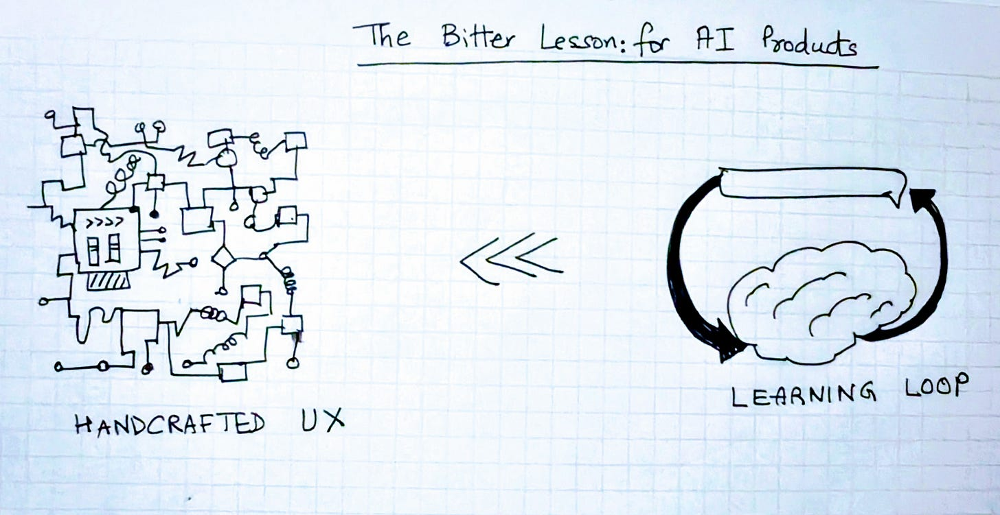
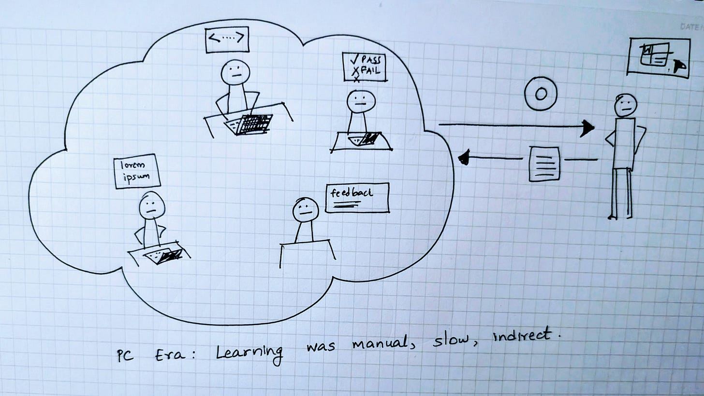
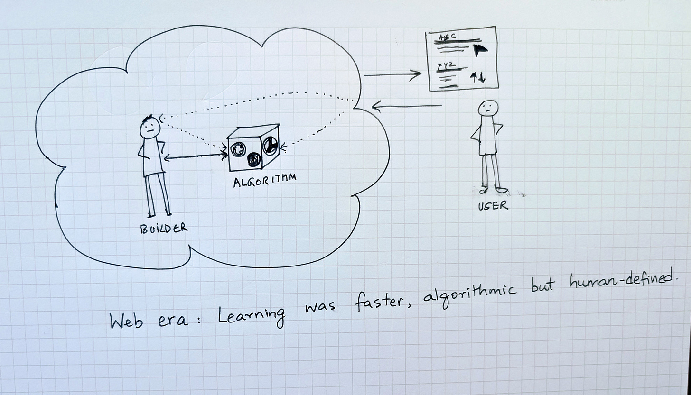
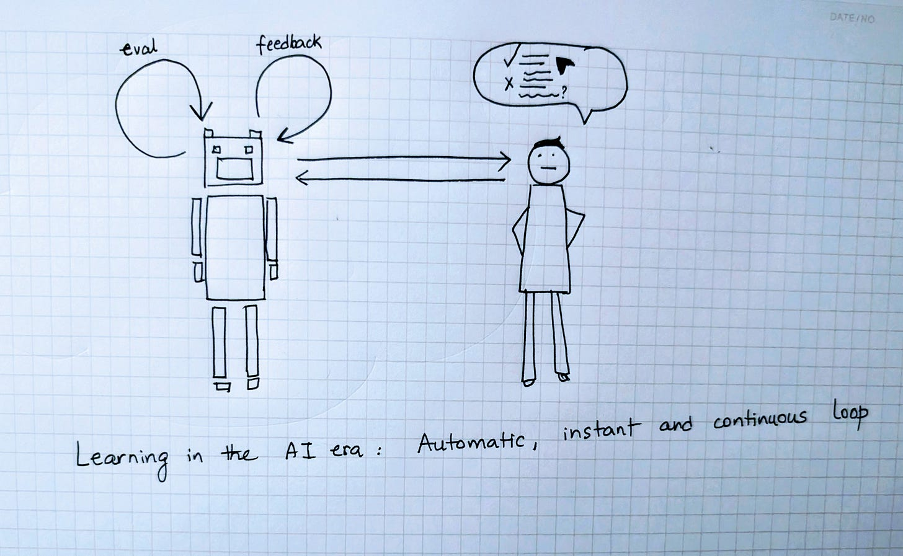
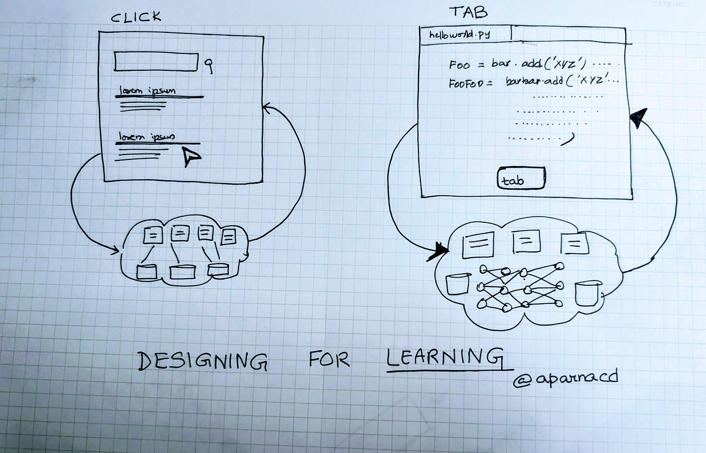
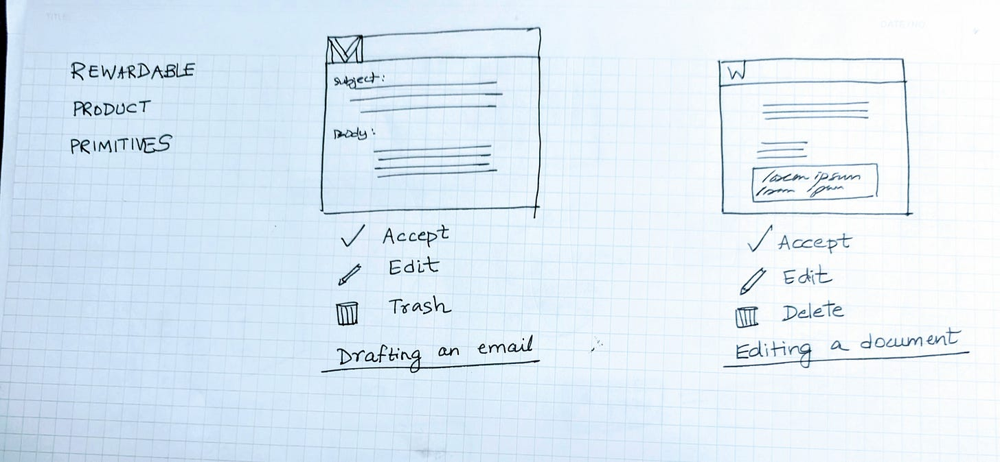
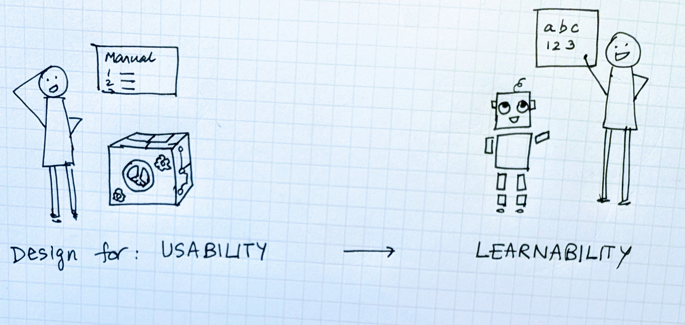

# Design for Learning

*(Part of the “Designing Intelligent Products” series, the first part starts [here](https://open.substack.com/pub/aparnacd/p/designing-intelligent-products)).*

Richard Sutton’s Bitter Lesson observed that systems built to learn eventually surpass those built by hand. I’ve [previously](https://open.substack.com/pub/aparnacd/p/the-bitter-lesson-product-version) wondered whether that same law applies to design. Will simpler, learned interfaces eventually outperform the most polished handcrafted ones?

But what does it mean to design an intelligent product for ***learning***?

Every product relies on two learning loops.

1. The **feedback** loop turns user interaction into data for improvement.
2. The **evaluation** loop ensures that the improvement actually happened in the product.

Both these learning loops have always existed through the eras of computing. What's changed over time though is where the learning happens, and who performs it.

### **PC Era: Manual Learning Loops**

In the beginning, all learning happened outside the software itself. Developers wrote rules, QA teams discovered flaws and verified fixes and users shared feedback, but spread across months if not years.

Manual feedback loops: bug reports, checklists, manual QA

### **Web Era: Programmatic Learning Loops**

The web era compressed the distance between use and improvement.

In the PC era, learning was slow and sequential. A bug had to be reported, fixed, tested, and shipped. The web introduced feedback that was continuous and machine-readable. User interactions could be logged automatically, aggregated, and analyzed. The learning loops became **programmatic** instead of **manual**.

The **click** to me was the most universal of these learning primitives of the web era. It was small, clear, and measurable and every click represented a trace of intent, and when billions of them accumulated, patterns emerged.

When I worked on Google Search, we saw this transformation firsthand. Clicks, dwell time, and query reformulations all flowed back into the ranking algorithms. The system started to adapt at the pace of usage. At first, engineers still closed the loop by hand, studying data and tuning ranking signals. Over time, machine learning models start to absorb those same signals automatically, predicting which results would satisfy a query.

Web Era: Programmatic Learning Loops

The evaluation loop evolved in parallel as well. QA was no longer just about whether buttons worked or pages loaded. It was about the relevance of results and the quality of ranking. Each proposed algorithmic change was tested against a fixed set of queries, and human raters judged whether the new results improved the experience.

We talk about the importance of evals and benchmarks a lot these days, but to me this was the real beginning of the **era of evals** that are automated, continuous, and grounded in data rather than manual inspection. Yet even here, the signals remained indirect. Clicks and rater judgments shaped algorithms statistically and in aggregate, not through a direct understanding of cause and effect.

### **AI Era: Self-learning Loops**

The AI era pushes learning inside the model system. Models now determine the algorithms that determine behavior. Each user action e.g. accepting, editing, or rejecting a generated output, becomes a signal that can update the model’s internal policy. Reinforcement learning ties each reward to the reasoning that produced it.

Instead of a human deciding to tweak the algorithm based on user actions like clicks, you can feed the rewardable actions directly back into the model. In other words, learning no longer happens *around* the model and instead happens *within* it.

AI Era: Self Learning Loops

### **From Usability to Learnability**

The goal of UX design has typically been about **usability**, teaching users how to use the product.

With AI products, UX design has an equally important other goal of **learnability**, teaching products how to learn from people.

It begins with defining **rewardable product primitives,** small, clear, frequent actions that map directly to model improvement.

For example:

* In coding tools, a Tab acceptance or edit creates a high-fidelity learning signal.

* In writing assistants, keeping or deleting generated text trains the model on tone and relevance.
* In productivity tools, confirming or dismissing a suggestion calibrates confidence.

I think we have the opportunity to design new product primitives that are the grammar of learnable systems, turning user interaction into structured, targeted, high-quality feedback to the model without burdening the user.

The evaluation loop also evolves alongside feedback. Evals can now run continuously, blending human and automated judgment. Benchmarks provide the standard of “what does good look like” and a regression baseline. Live telemetry and LLM-based scoring can measure the intelligence and performance.

Bottom line?

#### **When the model IS the product, all UX is RLHF.**

Every click, tab, press, accept shapes not only the user experience but improves the model intelligence.

### **Design for Learning**

Across the eras, software products have always had learning loops. In the PC era, it was manual and slow through people. In the web era, the learning was programmatic through user clicks and data aggregation. In the AI era, the opportunity is to design products to enable self-learning within the model.

Designing for learning means shaping both loops with intention i.e. UX primitives that teach the model, and evaluation that keeps learning grounded in human judgment.

Designing for learning also means not just focusing on usability on day one but learnability to day 100 and beyond.

*Next up: Designing for Impact.*

*In the next essay in this series, we will shift the focus from product design to strategy and business I.e. what AI products are worth building in the first place.*