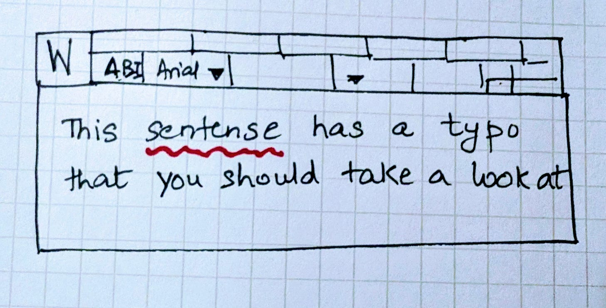
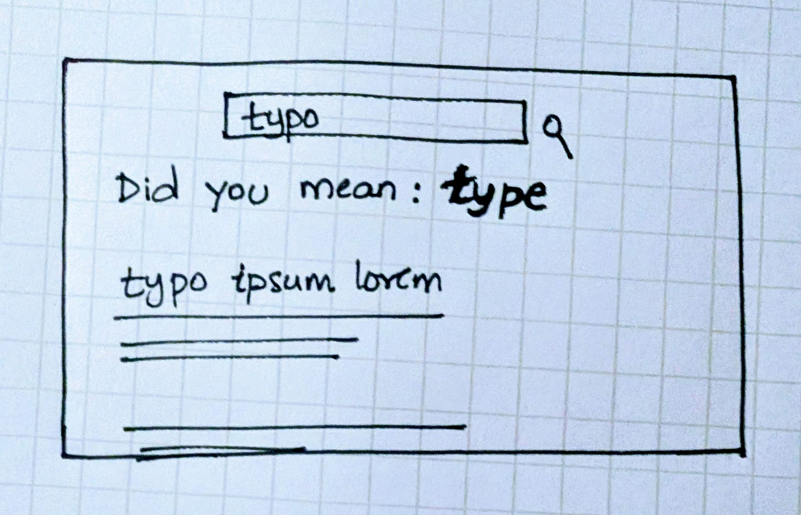
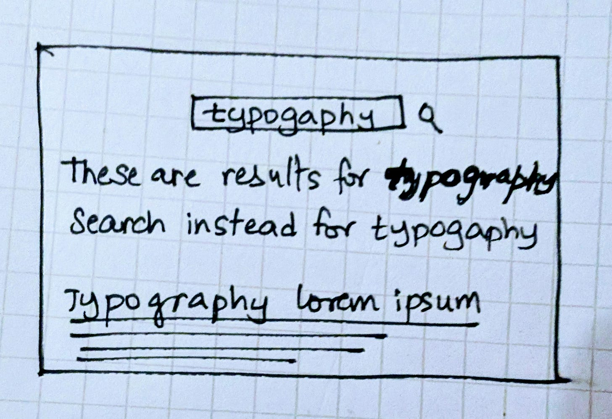
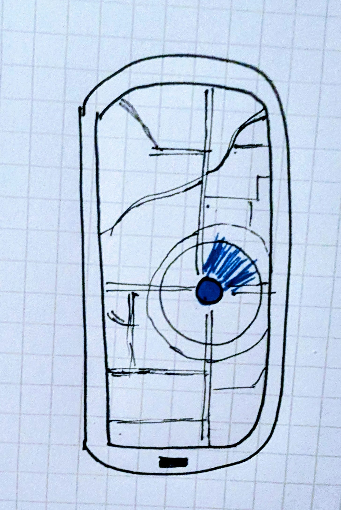
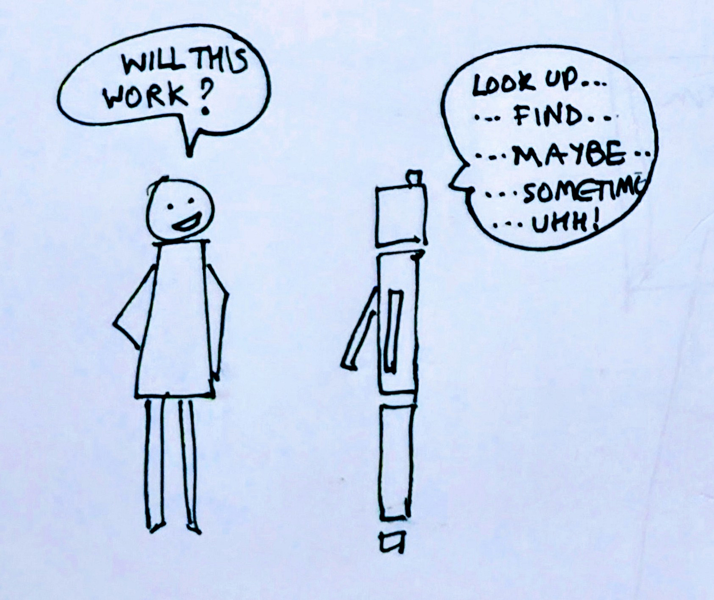
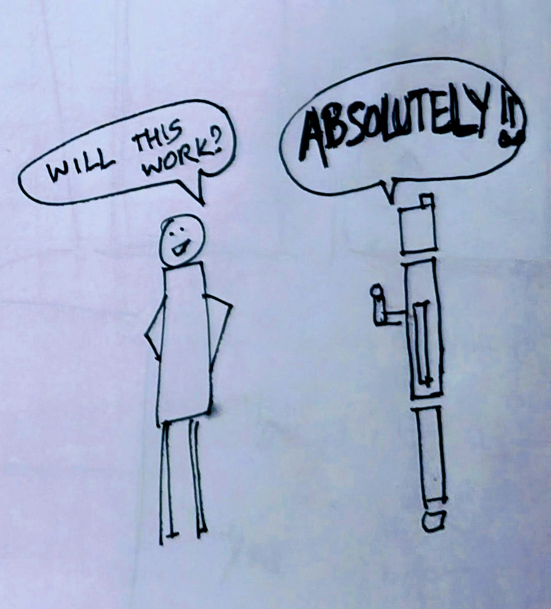
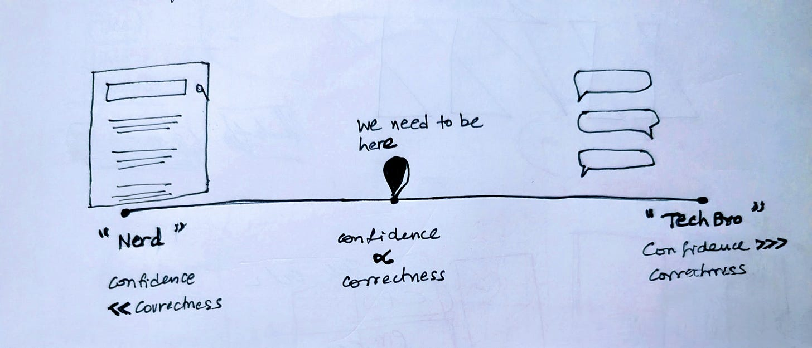
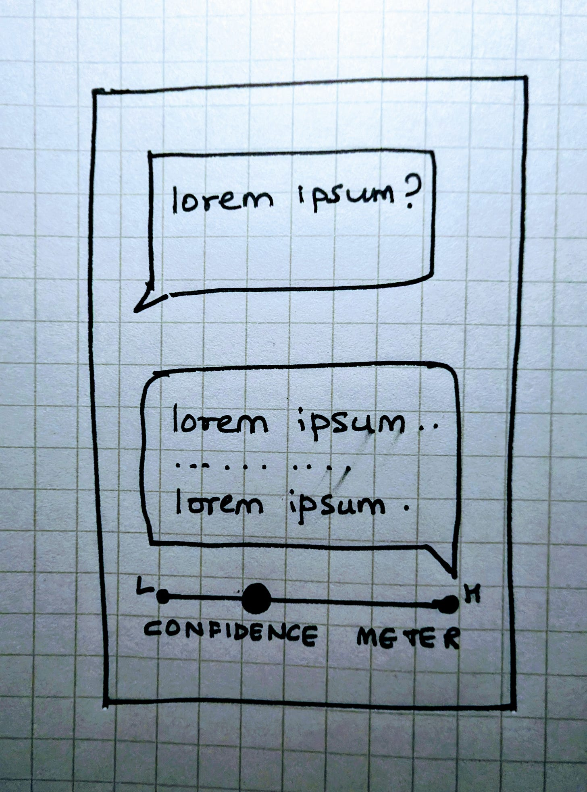
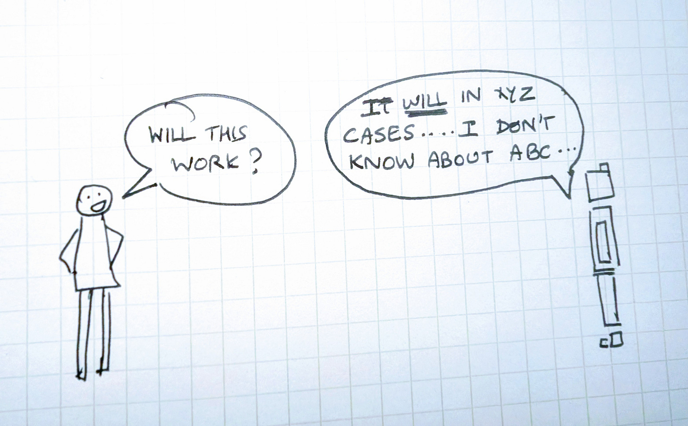

# Designing Intelligent Products: Design for Trust

### Principle: Make the UI Proportional to the AI

In the previous essay in the Designing Intelligent Products series, I talked about how showing your work, i.e. visible reasoning, can build trust.

Another key element of trustworthiness, in products as in people, is the ability to say “I don’t know” when unsure. Trust grows with proportional UX, when ***confidence*** ***feels*** ***proportional*** ***to*** ***correctness***.

### Proportional UX in prior eras

Each era of computing had its own small ways to make this proportional UX legible.

In the desktop era, the red squiggly underline in word processors signaled that a word or a phrase might be wrong, while leaving the final decision with the user.

The red squiggly line

On the web, search engines incorporated the ability to spell correct queries users typed. When a query was ambiguous, they asked “Did you mean …?” and when the error was obvious, they corrected it automatically.

Low confidence spell correct UX

High confidence spell correct UX

In mobile, a good example of proportional UX is the blue dot in Maps, drawn with a shaded radius, that showed not just the location but also the precision of the location estimation.

Blue dot in maps, radius indicating precision

### The AI era primitives — Nerd mode vs. Tech Bro mode

Today’s AI systems oscillate between two extremes. Search engines stay in what I call the “Nerd mode”: generally right but hedged and cautious, while Chatbots slip into “Tech Bro” mode: fluent, confident, persuasive even when wrong.

Nerd mode

Tech Bro mode

Overconfidence is particularly problematic because of *Gell-Mann* *amnesia* -- When we read something in our own area of expertise, we spot the errors instantly e.g. the numbers that don’t add up, the shaky logic, the oversimplifications that miss the point. Then we move on to a topic we know less about and accept it completely, forgetting how unreliable the previous page was. It’s a cognitive reset that erases skepticism the moment the subject changes. AI chatbots play out this dynamic. We could spot the hallucinations in an area we know very well and discount the answer, but a few prompts later, on a subject we can’t easily verify, we trust them again.

Recent papers show that hallucination isn’t some glitch in the model, it is structural in that the loss functions and benchmarks that train the models reward producing some output over none. This means we have to explicitly design for this in the product.

### Toward new primitives

So what is the squiggly line for the AI era? It is yet to be built IMO but here a few directional ideas that might work.

Example 1: confidence meter, a consistent signal that surfaces how sure the model is about its output, using the uncertainty it already tracks internally (flatter probability distributions, narrower logit margins, diverging reasoning paths etc).

Another idea is using different tone or specific catch phrases, depending on how confident the product is in underlying responses.

Designing for trust means designing for proportion: confidence that reflects correctness, interfaces that reveal uncertainty, and systems that know when to say “I don’t know.”

*Next up: Designing for Trust (Part 2c): The WOW/WTH Ratio*