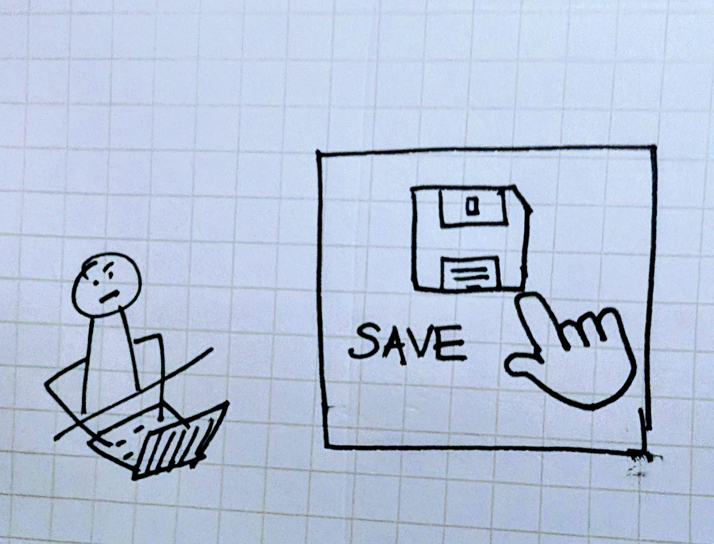
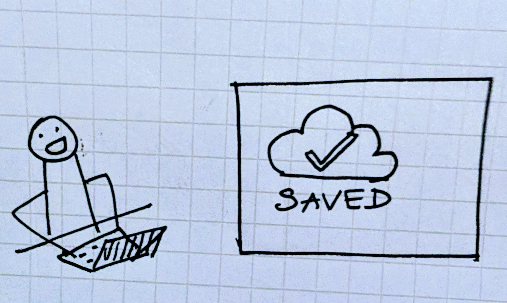
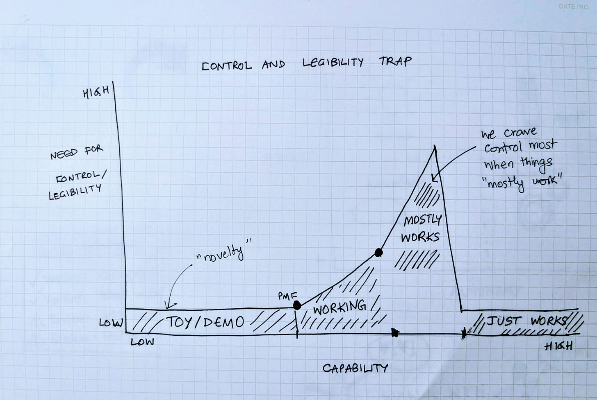
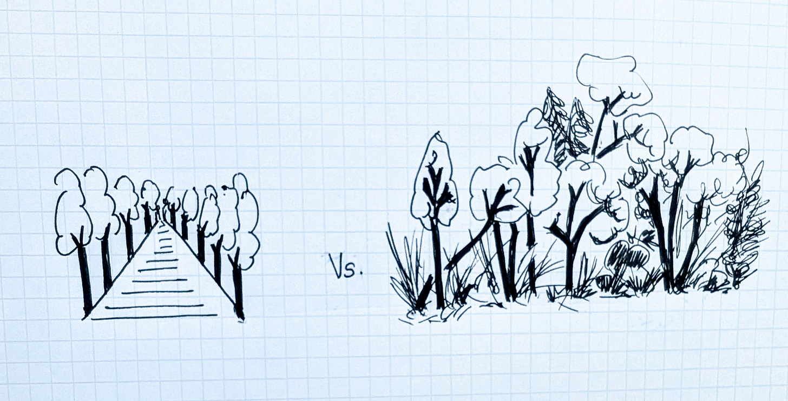
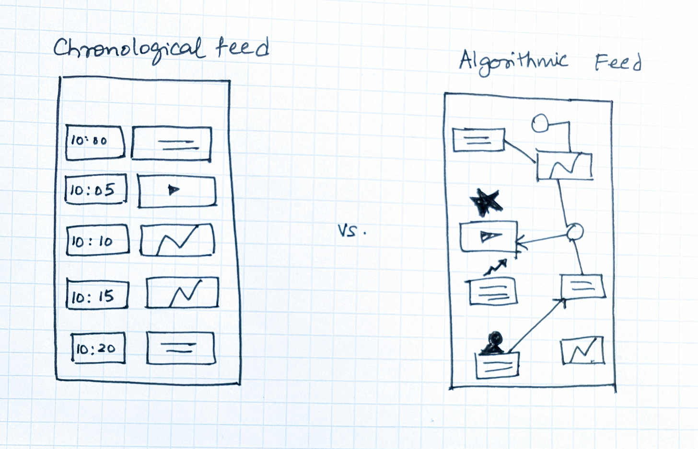

# The Legibility and Control Trap

**How We Mistake Control for Confidence**

(*This is part of my essay series on Designing Intelligent Products. You can start with the introduction [here](https://open.substack.com/pub/aparnacd/p/designing-intelligent-products)).*

I still remember the quiet panic from years ago, of realizing that a document I had been working on for hours hadn’t been saved. For years, pressing **Save** every few minutes felt like a small act of control. When autosave appeared, it took a bit of time for me to trust it but once it proved reliable, my reflex to manually keep hitting the save button simply went away.

In the PC era, we pressed Save obsessively until autosave just worked.

In the web era, we clicked Save draft in email editors until autosaving drafts just worked.

In the mobile era, we claim to want chronological feeds with controls and knobs, but metrics and studies repeatedly show that once algorithmic feeds just worked, we universally prefer them to any manual controls.

And in the AI era, today we look for citations and reasoning traces because models mostly work but still need oversight. As reliability improves, I expect that much of that scaffolding will also quietly fall away.

Every technology seems to follow a similar curve. Early demos are novel and forgiven for their flaws. As they become useful, expectations rise and as reliability starts to matter, and especially when it’s uneven, people reach for control e.g. toggles, settings, explanations. My intuition is that the need for legibility and control peaks when a system mostly works but not quite well enough to be blindly trusted. Once it does cross that invisible threshold into “just works,” the need for visible control actually fades.

Seen this way, controls are part of a product’s lifecycle: a bridge between uncertainty and trust. When systems are new, novelty trumps control. When they mostly work, controls compensate for inconsistency. When they fully mature, controls become redundant again.

This tussle between control and effectiveness reminds me of my friend  whose essay referred to James C. Scott’s book *Seeing Like a State*. James described how governments once replanted forests in perfect grids so that officials could count and manage the trees. From above, the order looked rational. On the ground though, the forests weakened. The very uniformity and control that made them legible also stripped away the variety that made them resilient.

Legible and limited vs Messy and adaptive

Chronological feeds, dashboards, and reasoning traces make systems visible and manageable, but I think they can limit their capacity to learn. Legibility creates comfort, yet does it come at the cost of adaptability? Algorithmic feeds, like wild forests, are opaque but self-correcting messy systems that thrive precisely because they are not over-managed.

Control vs Effectiveness in Feeds

The question I keep coming back to is where do we continue to use control as a substitute for true confidence. Once something genuinely works, do we still need explainability, control, and legibility or are those just relics of an earlier stage of trust?

*This was part 2d on Designing for Trust.*

*Next up is Part 3 in Designing Intelligent Products. “**Design for Learning: All AI UX is RLHF”.***