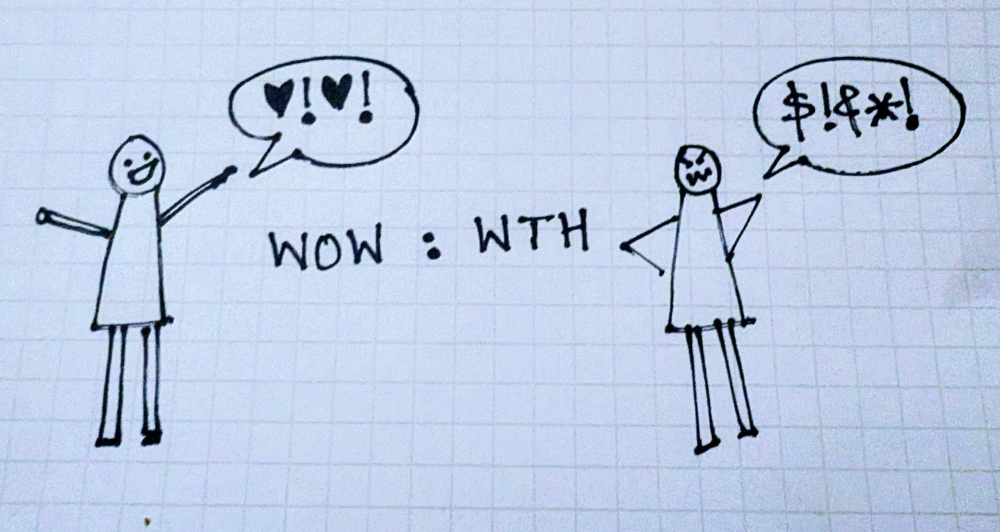
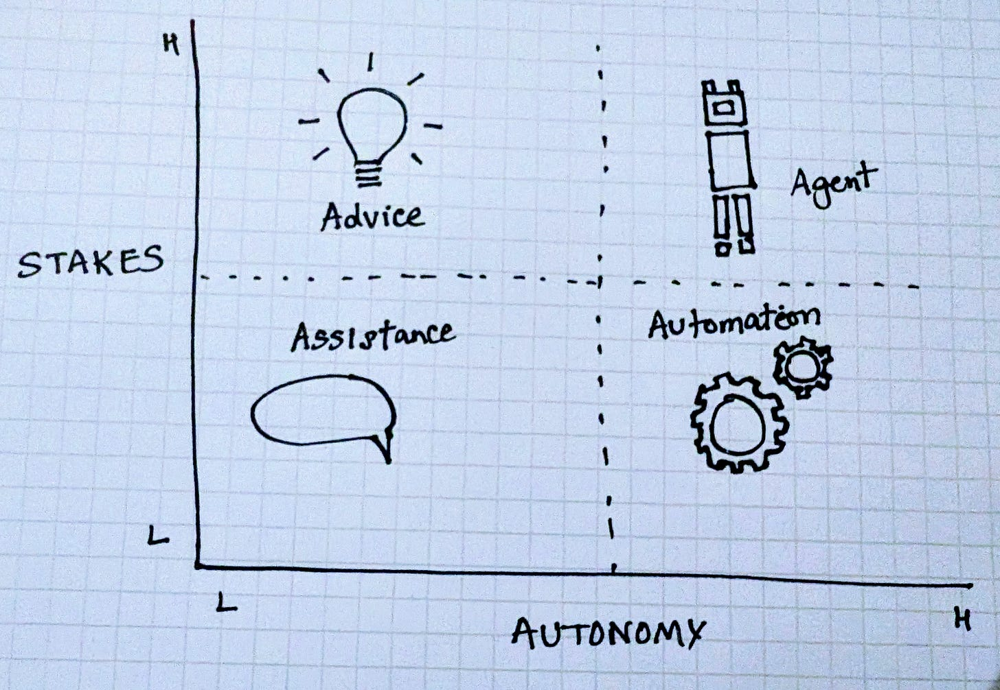
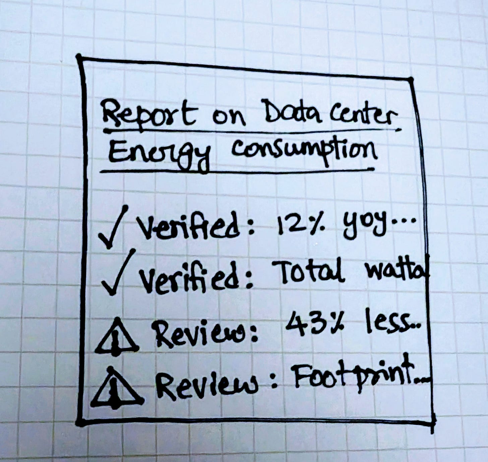
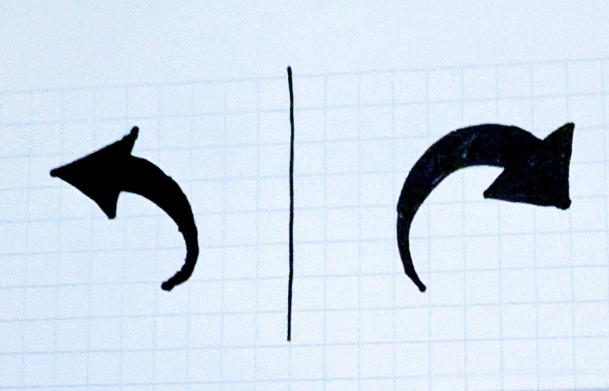
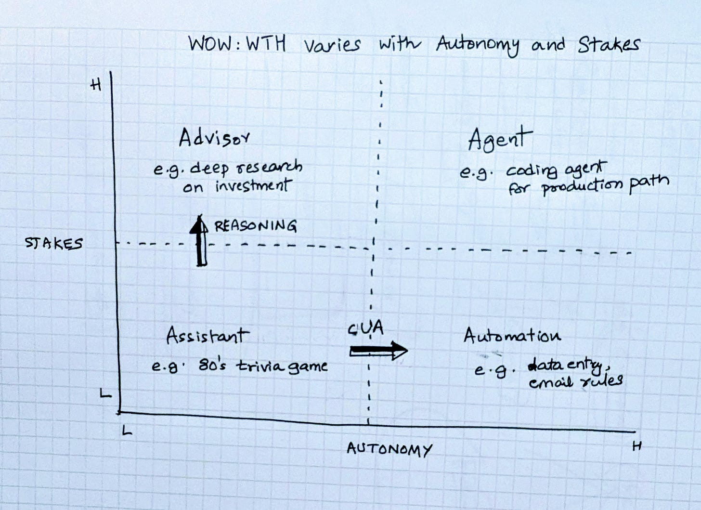

# What's your WOW:WTH ratio

*(This essay is part of the ongoing “Designing Intelligent Products” series, introduction [here](https://open.substack.com/pub/aparnacd/p/designing-intelligent-products))*

### Design for Trust Principle 2c:

### Watch out for the WOW:WTH ratio

When I worked on Google search, we measured precision, recall, latency, all the usual metrics. But the one that I’d often talk about in addition is the WOW/WTH ratio: how often the product made someone say “wow” versus “what the hell.”

Every WTH moment undoes the trust built up by several wows. And its impact depended on context. If a less relevant news article bout Taylor Swift ranked above a better one, it was a mild annoyance to all but the most die hard swifties. But if the search engine navigated you to a Home Depot that had closed years ago, it was a bigger WTH moment!

With AI products, we’ll see the same dynamic. Only now, we are building products that no longer just answer questions but also assist, advise and act.

### Autonomy and Stakes

I find it useful to think about AI products on two dimensions.

* **Autonomy**: how freely the system can act without a person in the loop.
* **Stakes**: how much it matters if it’s wrong, and how reversible the outcome is.

### How WOW and WTH vary

* Low stakes and Low Autonomy - For example: Asking, “What’s a good trivia game for an 80s-themed party?” and getting a silly or offbeat answer. You move on or maybe try again. Here, users reward speed and novelty more than accuracy. Small wows matter; small WTHs don’t.

* As stakes rise, WTHs need to be reviewed before they cause harm. Example: An AI advisor drafting a policy brief on renewable energy or estimating compute needs for a data center. If a single assumption is wrong, it cascades. The system must show its reasoning so a human can verify it.

* As autonomy rises, WTHs need to be reversible. For example, a workflow tool that automatically accepts LinkedIn requests, files expense receipts, or reschedules meetings. If it makes a mistake, UNDO should be one click away.

* At the top-right, high stakes and high autonomy agents, every WTH needs a plan: to be caught, reviewed, or rolled back. For example: A sales or operations agent closing deals, issuing refunds, or restarting production servers. At this level, a WTH is basically an incident.

### Designing for trust

Designing for trust means caring as much about how a system fails as you do about when it shines.

Every intelligent product will create moments of wow and moments of what the hell.

The work lies in managing the latter, through review when stakes are high, and through recovery when autonomy is high.

In the world of AI agents, it may never be possible to eliminate WTHs entirely. But it is possible to design for recovery and to make sure that when things go wrong, the path back to trust is visible and quick.

*Next up: Designing for Trust 2d: The Legibility and Control trap*