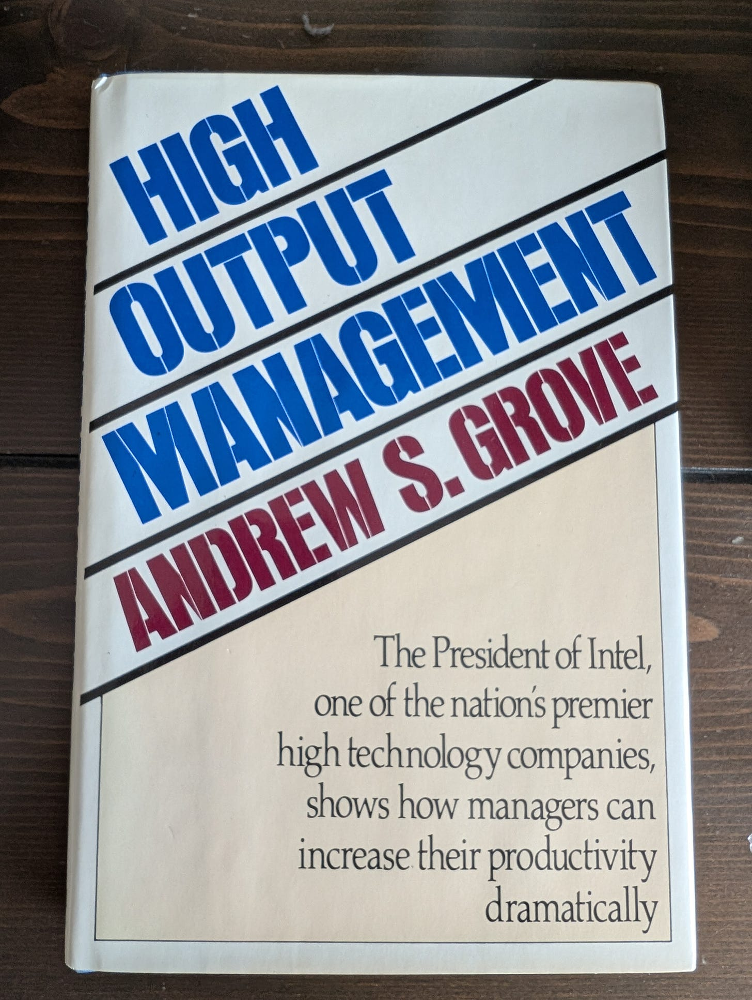
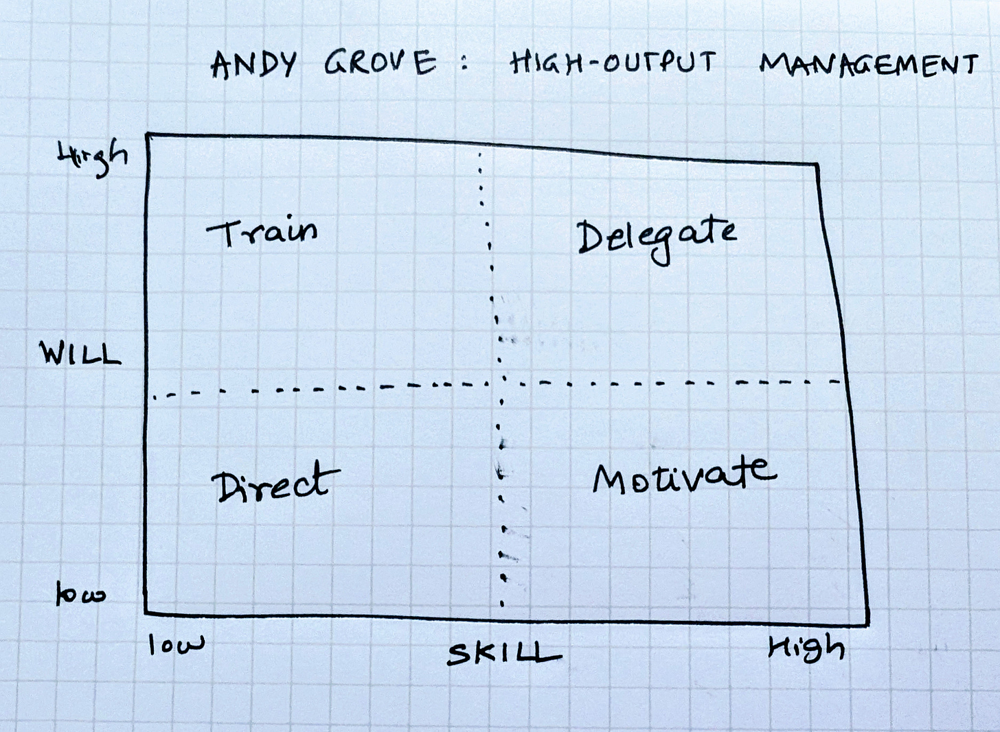
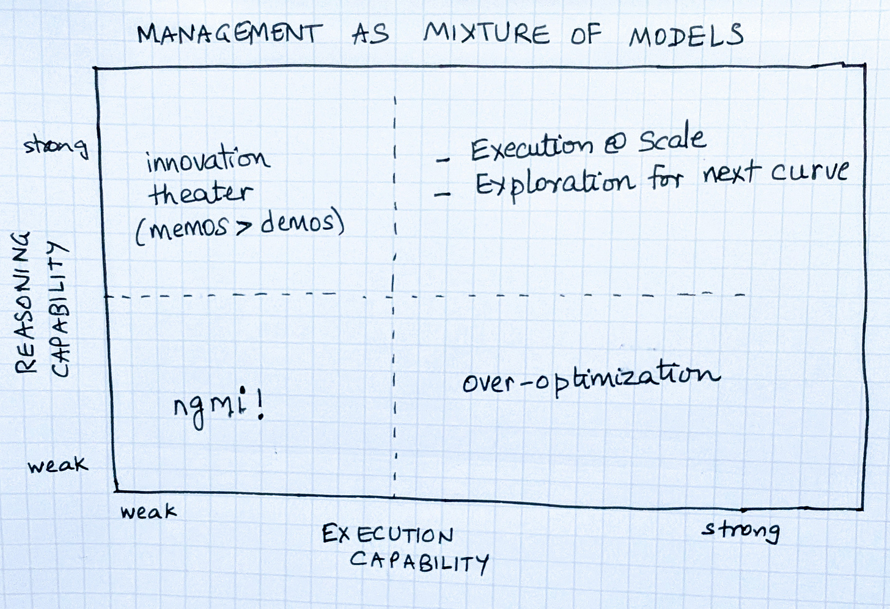

# All Leaders are GPT-5s

*Balancing between instruction followers and reasoners *

One of my favorite management books is Andy Grove’s *High Output Management*. For years I gave a copy to every senior leader who joined my team.

Grove had a gift for frameworks that were simple but profound.

His classic two-by-two plotted **skill** on one axis and **will** on the other:

* High skill / high will→*delegate*
* High skill / low will → *motivate*
* Low skill / high will → *train*
* Low skill / low will → *direct*

It was pragmatic guidance for managers: adapt your style to the quadrant someone is in.

What strikes me now is how the same principle can apply at the level of whole organizations, and how AI models are good metaphors.

---

## Leadership as GPT-5

Every company is, in essence, a **mixture of models**, and by that I mean people.

* Some behave like **instruction-followers**: fast, efficient, disciplined. They make playbooks sing and scale what works.
* Others operate like **reasoners**: slower, more demanding, but capable of navigating ambiguity and finding the next curve.

The leader’s job is not to privilege one or the other, but to act like **GPT-5**: dynamically deciding when to route challenges into reasoning and when to lean into execution.

---

## Balancing Reasoning and Execution

Just as GPT-5 decides which sub-model to call depending on the task, leaders must rebalance their mix of people depending on stage. Each stage has its posture and its predictable risks.

* **Early stage / pre-PMF:** reasoning dominates. Exploration matters more than efficiency. *Risk: tilting too soon into execution locks you into local maxima playbooks before the right problem is truly identified and solved.*
* **Growth:** execution rises. Playbooks must harden, throughput must scale, but reasoning capacity must stay alive. *Risk: too much reasoning means pilots pile up, memos trump demos, momentum slows while competitors grow.*
* **Scale:** execution becomes the engine. But a small, protected reasoning pocket must survive to catch inflection points. *Risk: over-execution results in optimizing yesterday’s processes while tomorrow’s curve arrives to disrupt.*
* **Transition / Shock:** when markets flip or new technologies arrive, the mix must swing back toward reasoning. *Risk: staying in execution mode through a shock will mean you can hit every OKR on the old curve and still miss the new one entirely.*

Industry history offers examples of these shifts: AWS moving from reasoning to execution, Netflix oscillating between bold reasoning leaps and operational engines, SpaceX toggling between breakthrough bets and launch cadence.

---

## Distillation: The Leader’s Real Output

Reasoning sparks discovery and deep thinking and execution compounds it. But the real leverage lies in **distillation**, that is, turning high-cost insights from reasoning cohorts into repeatable playbooks for execution engines.

This is also why I think **distillation velocity** matters: how quickly an idea at the edge becomes an executable process at the core.

* Too slow, and you drown in exploration without throughput.
* Too fast, and you ossify half-baked ideas into brittle routines.

The leader’s role, like GPT-5’s, is to manage this tempo..how do you protect scarce reasoning tokens while distilling those insights into concrete playbooks that the rest of the organization can tap into.

(At the risk of going meta: when o3 class reasoning models emerged, our own product teams realized it wasn’t enough to simply run the old AI product roadmap harder. We had to carve out small teams to post-train models for agents and experiences on the new curve and are distilling the lessons back to main troops).

---

## Management by mixing models

Andy Grove’s principle still holds: leadership is leverage. His two-by-two helped managers adapt to individuals. The AI metaphor simply extends to the collective.

Leaders are GPT-5s, orchestrating mixtures of reasoning and instruction-following cohorts. The art isn’t choosing one or the other. It’s knowing when to rebalance, how to protect scarce thinking tokens, and how to ensure what’s learned at the edge is distilled into the operating system of the organization.

That is how a company can have its token and eat it too. 🙂