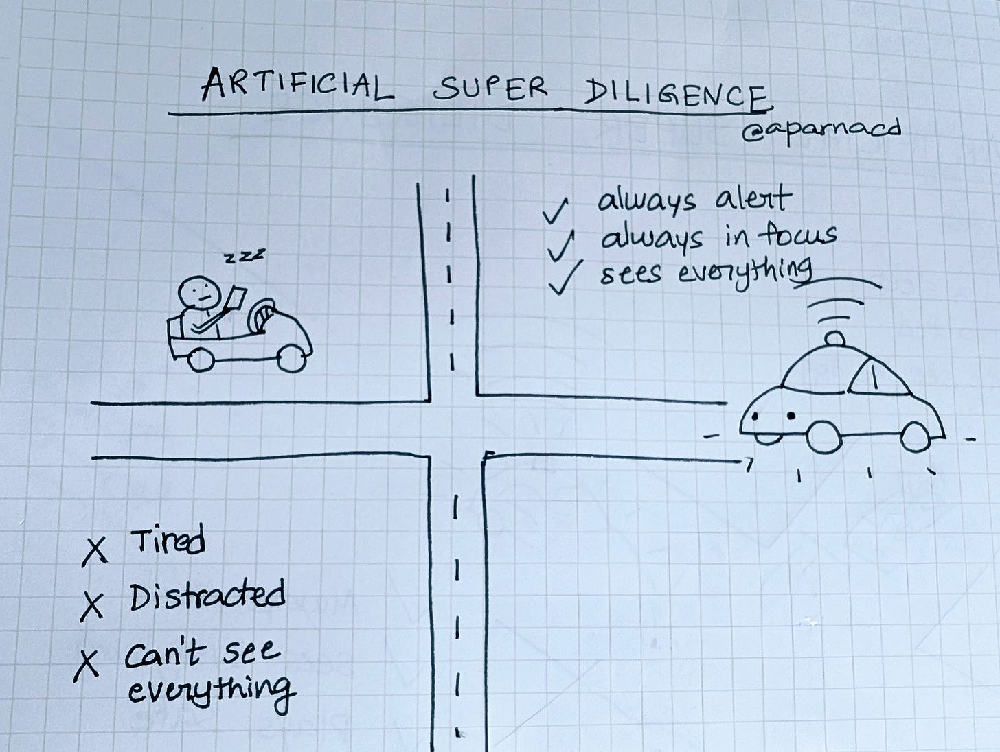

# Artificial Super Diligence - The Waymo lesson

We spend so much time debating Artificial Super intelligence (ASI) but the biggest value today is in Artificial Super ***Diligence***. It's the idea hiding in plain sight: AI that never tires, never skips, never lets small mistakes snowball into catastrophe.

Waymo’s latest safety results are a great example. This weekend, I spent time digging through the latest study and the in-depth analysis by neurosurgeon [Jon Slotkin](https://x.com/slotkinjr/status/1968381717934391309?t=1cm1eSMtK_fp39sn6NFgQg&s=19).

The number that leapt out at me is this: across 56.7 million rider-only miles, Waymo’s cars recorded a **96%** reduction in injury crashes at intersections compared to human drivers ([Waymo study](https://arxiv.org/abs/2505.01515)).

Intersections concentrate the limits of human attention. Fatigue, distraction, impatience, they all show up in the moment when the cost of error is highest. Waymo’s system doesn’t share those vulnerabilities. It perceives in every direction, runs thousands of simulations in real time, and defaults to patience. The result is extraordinary in my mind - almost erasing one of the deadliest categories of accidents.

Atul Gawande made the same point in *The Checklist Manifesto.* Surgical disasters rarely came from ignorance. They happened when fatigue or stress led to skipped steps: an antibiotic missed, a sponge uncounted, a patient not confirmed. A “checklist”, simple, repeatable, always there, dramatically changed the odds. In some ways, Waymo’s cars offer an always-on checklist for intersections.

Human lapses versus Always-on AIchecklists

Here's the thing.

Every field has its “intersection crashes”.

* A confidential file sent to the wrong distribution list.
* A deployment that takes production offline because a safeguard was bypassed.
* An engineer at three in the morning, eyes heavy, typing one command that takes millions of users down.

These failures don’t happen because people are careless. They happen because people are human.

That’s a huge business opportunity to apply AI: embedding artificial super diligence into the workflows where vigilance breaks down and the human cost is highest, and deploying systems that don’t drift, don’t turn off, and don’t fall asleep at the wheel.

So here’s a prompt for thought:

What are the **intersection crashes** in your world?

And how can you apply **Artificial Super Diligence** to eliminate them?