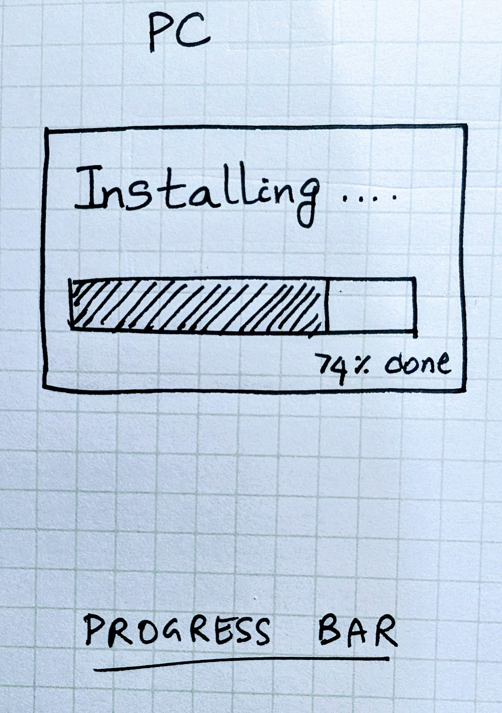
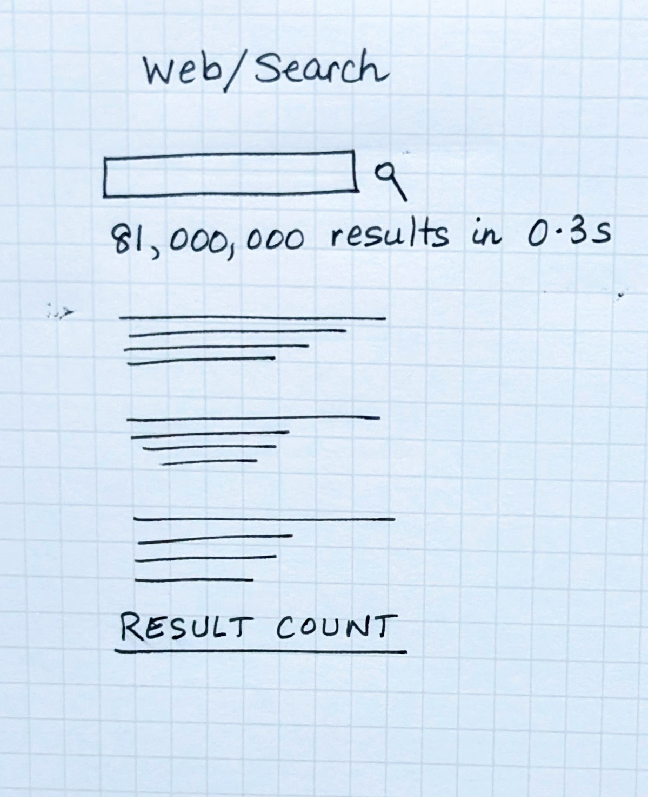
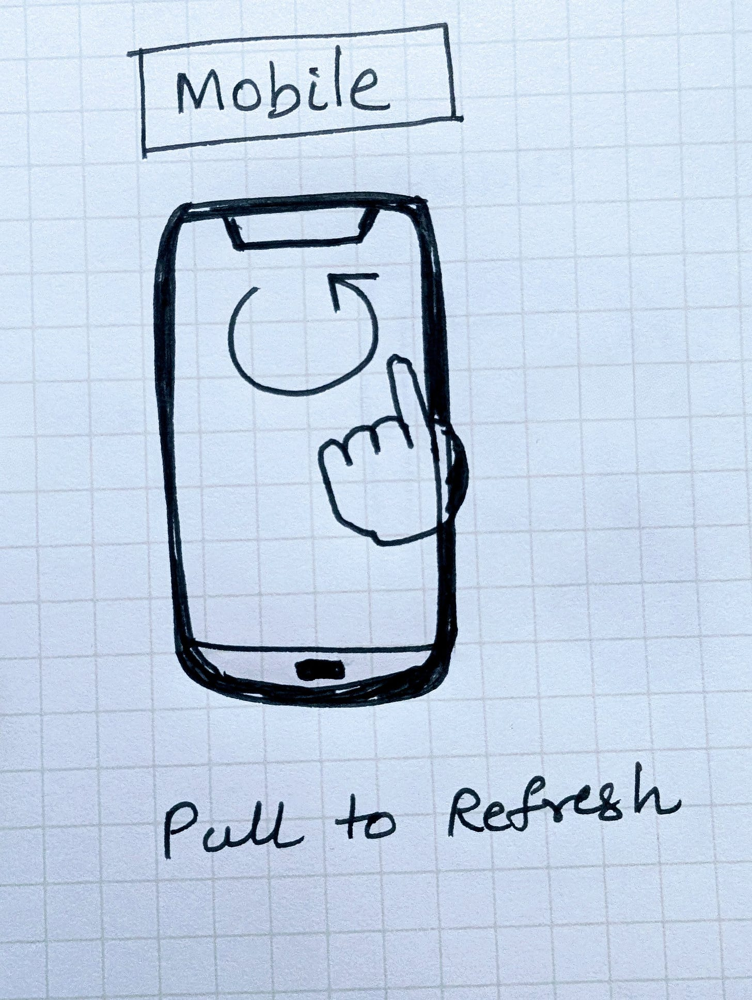
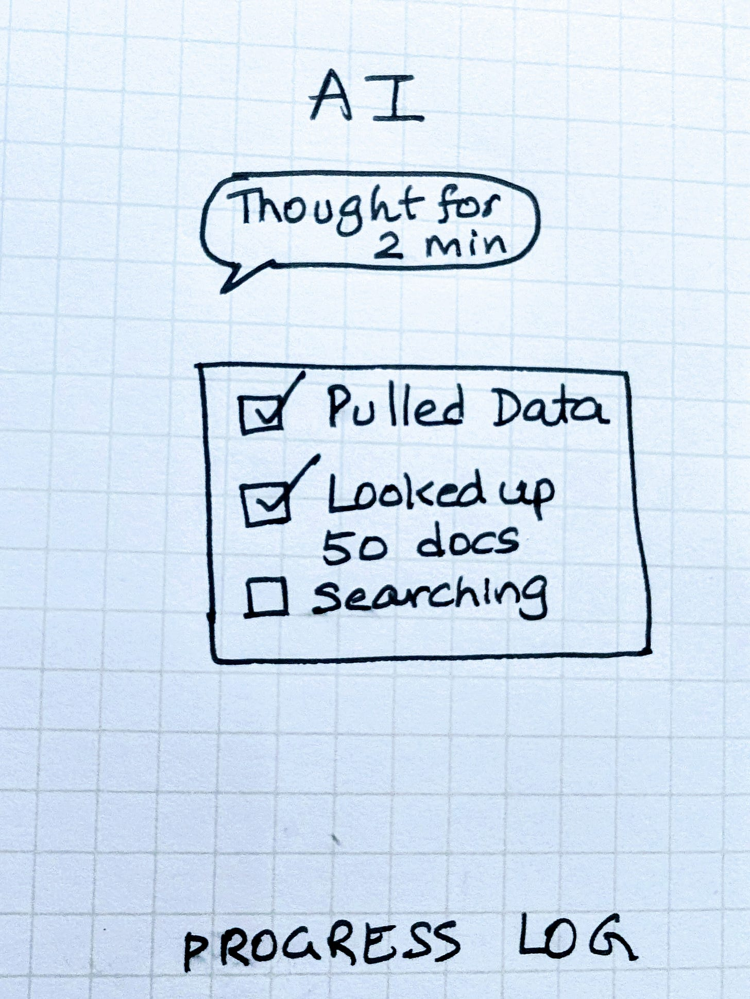
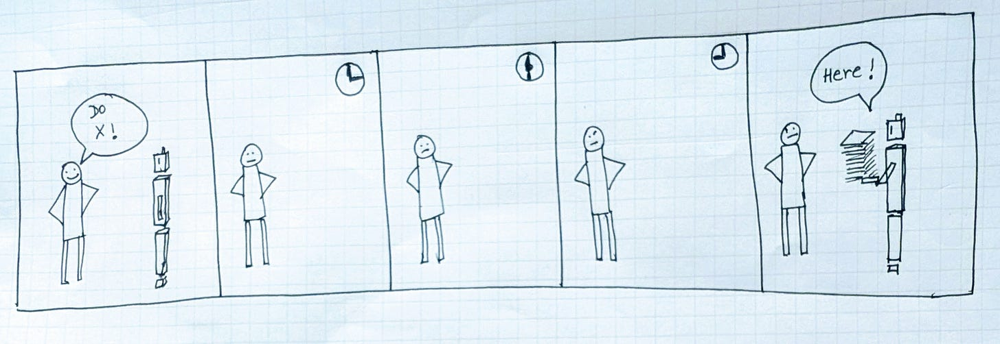
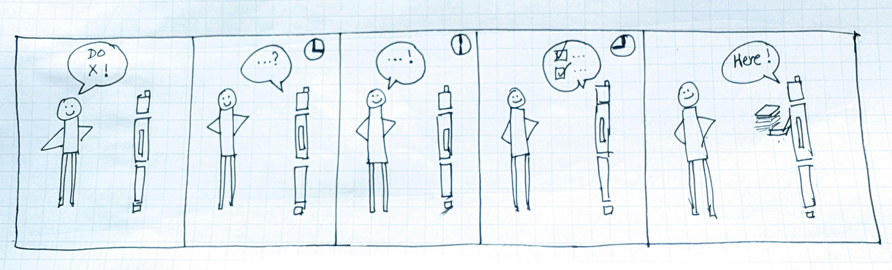

# Designing for Trust

*Principle #1 Show Your Work*

(This is Part II of my series on **Designing Intelligent Products.** Start with the [Introduction and Part I: Designing for Intent](https://open.substack.com/pub/aparnacd/p/designing-intelligent-products))

If *Designing for Intent* was about how people express what they want, *Designing for Trust* is about whether they can believe what they get.

In the next few essays, I’ll talk about a few product design principles for building trust.

## Trust Principle #1: Show Your Work

### Every era had its receipts

Computing systems have always relied on small, legible signals to prove they were working on our behalf:

* **PC era** → the **progress bar.** Watching a bar creep forward made invisible computation tangible.

* **Web/Search era** → the result count and query time. “About 81,000,000 results in 0.28 seconds” became shorthand for scale and diligence.

* **Mobile era** → the pull-to-refresh spinner and the red notification badge. Tiny rituals that reassured users the system was alive and fetching something new.

These cues turned invisible processes into visible effort.

### What “show your work” could look like in the AI era

In reasoning systems, milliseconds and counts aren’t enough. Users want new signals that convey that the system has thought, explored, and followed a process.

Emerging receipts include:

* **Progress reports** — narrating steps as they unfold: *“Pulling data → Cleaning → Running regression → Drafting summary.”*
* **Reasoning time** — *“Thought for 2 minutes, evaluated 3 alternatives.”*
* **Work traces** — *“Queried 5 tables,” “Ran 2 simulations,” “Generated 3 drafts.”*

These don’t necessarily prove correctness but they do show diligence and effort.

## Why this matters

Without receipts, AI feels like a black box.

* A finance leader reviewing forecasts expects to see which steps were run.
* A product manager delegating a workflow wants to preview the sequence of actions.
* An operations lead investigating an incident needs the trace, not just the conclusion.

Trust begins when users can see the work behind the answer.

Think:

Versus

## Prompt for Thought

*Imagine working with a teammate. You hand them an assignment, and they disappear for a week before dropping the final deliverable on your desk. Contrast that with a teammate who checks in in between: “Here’s the data I pulled,” “Here’s the model I ran,” “Here’s the draft I’m working on.” Who do you trust more in absence of other performance data? Systems are no different. The ones that show their work earn our belief especially when users are starting out.*

Next up:

Designing for Trust Principle #2: