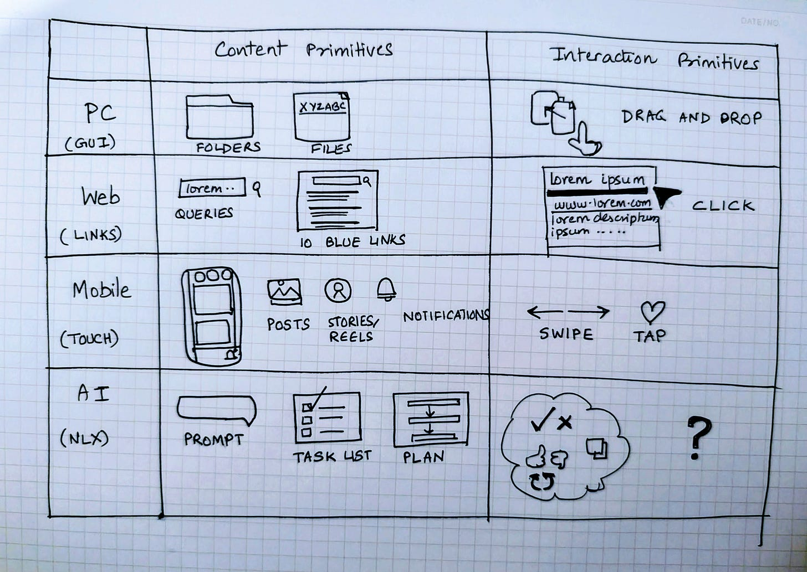
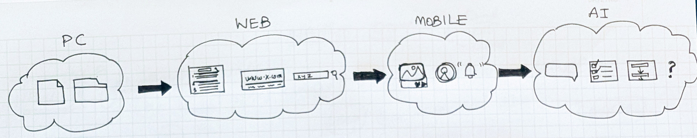
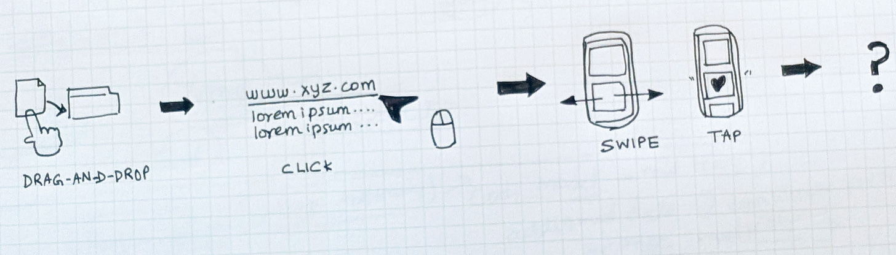

# Designing Intelligent Products

*NLX is the New UX*

We are at the beginning of a profound shift in how people and machines work together. For half a century, software forced humans to learn ***its*** language, such as menus, commands, clicks. Now, the software systems are learning ***ours***.

This is the essence of AI product making --

Building in a model-first world where the interface is no longer a screen to navigate but a collaboration to steer. The primitives aren’t dropdowns or checkboxes. They are instead prompts, tasks, plans, proofs of work, and feedback loops.

To me, this isn’t a matter of UX polish or usability craft. It is an entirely new discipline and body of work to design intelligent product systems which people will trust, adopt, and rely on as core parts of their work and life.

In this series, I will outline three foundations of designing intelligent products:

1.**Intent**: how AI products can capture what people actually mean.

2. **Trust** -- how AI products can make reasoning visible and believable.

3. **Learning** -- how AI products can get smarter with every interaction.

Each essay is one step toward a playbook for building intelligent products that are powerful and worthy of use.

## Part 1: Designing for Intent

*Helping users say what they actually mean*

Traditional products captured intent through menus, forms, and filters. Users clicked through hierarchies until they narrowed the task.

Natural language experiences (NLX) change that. Intent can now be expressed directly in language:

“Draft a one-page press release for our Series A raising $15M…”

“Refactor this Python file into idiomatic Rust and add tests.”

“Build a front-end app prototype that lets you swipe right or left on product ideas.”

### **The Primitives of Each Era**

Every paradigm of computing crystallizes around a small set of ***content*** primitives (the atomic units people create/consume) and ***interaction*** primitives (the universal gestures that manipulate those units).

Take the PC era. The Content primitives were files and folders. The main interaction primitive was drag-and-drop.

In the Web/Search era, the content primitives were things like queries, 10 blue links, result snippets, query refinements. The main interaction primitive was the click.

The Mobile era was defined by content primitives such as posts, stories/reels, notifications. Because of touch affordances and social feeds, we saw interaction primitives like swipe and tap.

For the AI era products, we are starting to see new content primitives such as prompts, tasks, plans. None that are sharply locked in. The interaction primitives are all over the place too today. We see thumbs up/down, accept/reject completions, regenerate, inline edits, copy/export. But none yet as universal as drag-and-drop, click, or swipe.

Dominant Product Primitives across Tech Eras

### **The Open Opportunity**

In NLX, even the content primitives are still being defined, and the interaction primitives haven’t emerged at all. Today’s thumbs, retries, and accepts/rejects are scattered experiments, not exactly universal grammar. This is what makes the current moment so rich for product design.

The wide-open opportunity is to define both:

* Which content atoms will endure and become universal as the human writable, human readable atomic units. The “files and folders” of the era, if you will.

* Which interaction gesture will become the “drag,” “click,” or “swipe” of the NLX era. The gesture people will use everywhere, across products, until it becomes muscle memory.

### **Why NLX matters**

In productivity and enterprise workflows, intent clarity is critical. A financial analyst needs to know what steps a model will take before generating a forecast. A sales leader wants visibility into which data sources inform pipeline projections. A product manager handing an agent a design task wants to confirm the plan before the first wireframe appears.

Good NLX captures messy intent and makes it actionable by surfacing the tasks and plans behind it.

Prompt for thought: “Imagine explaining an idea to a new teammate. Do you start with keywords on a sticky note, or a full sentence that captures your intent?”

*This essay is part of my series on Designing Intelligent Products: NLX is the New UX.*

*Next up: Designing for Trust i.e. how proofs of work and proportional UX can overcome the Gell-Mann Amnesia effect and make AI product systems more credible.*