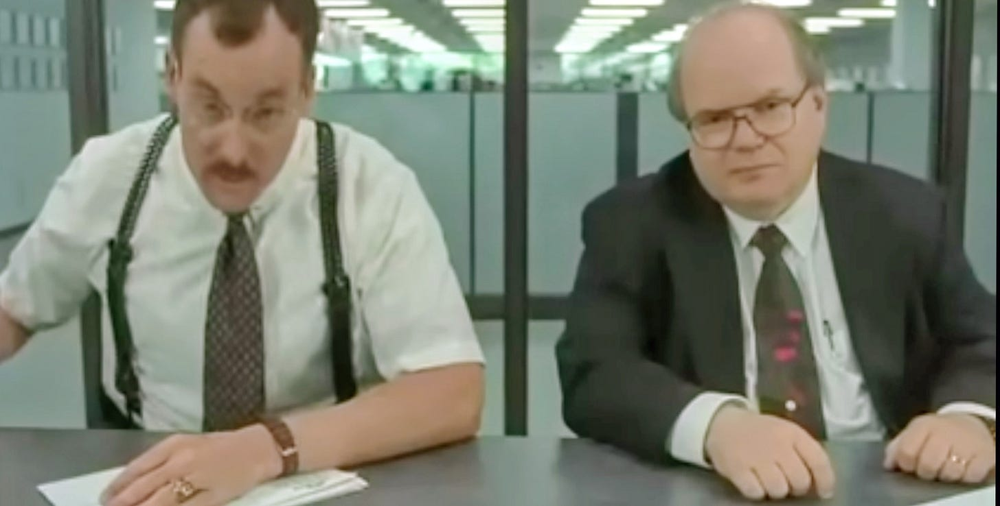
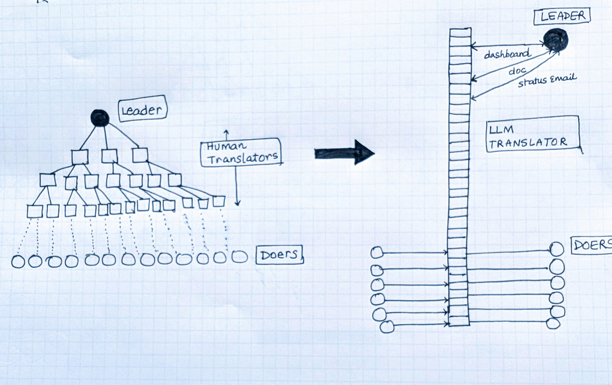

# Most Work is Translation 

### ***And LLMs are the first universal translators for work.***

I keep coming back to a scene from Office Space:

 “What would you say...you do here, Bob?”

“I take the requirements from the customers… and I bring them to the engineers… so the engineers don’t have to.”

It’s a joke, but the more you look at how organizations actually run, the more you realize Bob isn’t an exception. He’s in fact the archetype.

We tell ourselves we’re creating, building and executing, but when you zoom out, most of the day isn’t invention or execution. It’s TRANSLATION: taking something in one form and turning it into another form that someone else can act on.

A soap formula becomes a manufacturable soap bar, then a marketing claim, then a retail SKU, then a line on a P&L.

A search algorithm becomes code, then a UI, then an ad unit, then a compliance report, then a board deck.

Once you see it, you can’t unsee it. Lawyers translating risk into clauses. Engineers translating specs into code. PMs translating activity into status updates. Analysts translating logs into narratives. Finance translating transactions into statements. Sales translating pain points into proposals. Executives translating market noise into bets.

## The Org Chart as a Translation Machine

The numbers are telling:

Only 39% of the workday is spent on core job duties. The rest is emails, meetings, and admin.

Knowledge workers spend 57–60% of their time coordinating and communicating.

Developers write new code just 10–16% of their week. Most of their time is debugging, planning, or searching for context.

Meetings alone consume 14.8 hours per week, about 37% of working hours, costing nearly $30,000 per employee each year.

No wonder org charts look the way they do. They’re pyramids: leaders at the top, doers at the bottom, and a thick middle band of human translators carrying information up and down.

## **Enter the Universal Translator**

Now something fundamental has shifted with AI: translation has gotten way cheaper, way faster and way better.

Large language models are useful not just tor translating across languages but much more generally, can translate across forms of work.

A 20-page research paper can instantly be translated into a one-page “so what” memo.

A 60-minute call translated into a four-minute decision brief.

A spreadsheet translates into a chart and a headline.

A brainstorm whiteboard picture translates into a roadmap doc.

Requirements translate into a code scaffold with tests.

To me, LLMs have the potential to be the ***Babel fish*** of work, the little creature from Hitchhiker’s Guide that instantly translates whatever goes into your ear. Except here, it’s not speech alone. It’s papers into briefs, meetings into memos, data into charts, ideas into roadmaps etc.

For the first time, the unit cost of translation is close to zero. Humans still need to and will provide judgment, taste, and accountability. But the blank-page tax that fills so much of modern work is close to zero.

## **From Pyramid to Backbone**

This shift of instant universal translation at work is going to save time and money. But more importantly, I predict, it is going to fundamentally change the structure of teams and entire organizations.

Org charts have traditionally had to be pyramids because translation was expensive. Thick middle layers of managers, coordinators, and analysts existed to carry that cost. When translation becomes cheap, the middle collapses into AI infrastructure.

## **What does this future of work look like?**

For individuals: Less time producing artifacts, more time reviewing and directing them. Drafting matters less than judging fidelity and making calls.

For teams: Less time patching broken handoffs in meetings, more time moving quickly from messy outputs to usable inputs. Coordination loops shrink.

For organizations: Middle layers compress. Throughput rises, decisions accelerate, and more energy flows back into building and shipping. Scale looks different. It is not a given that big firms win just by carrying translation costs. Smaller, leaner orgs can now coordinate at scale too!

Creation and execution are why a business exists. Translation has always been the cost of doing business.

With AI as the universal translator backbone for work, that cost is going to dramatically collapse, resizing and reshaping the entire org chart.