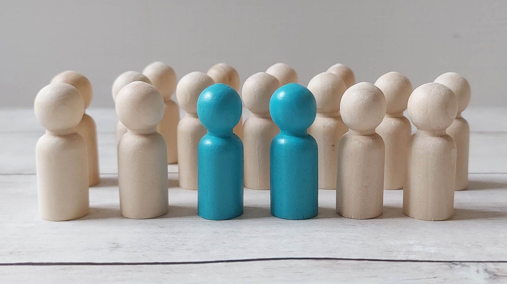

# An Open Secret I Wish We Could Talk About 

*How affinity bias and the fundamental attribution error affect our workplaces *

[Share](https://debliu.substack.com/p/an-open-secret-i-wish-we-could-talk?utm_source=substack&utm_medium=email&utm_content=share&action=share)

A friend and I were once working on the same team for the same manager. We are both minorities in an environment without many minorities in leadership. My friend quipped, “We have to roll heads at every turn, or we're out.” I thought about it for a while, and then I went to our manager and asked him outright if this was true. I cited a few examples of how my friend and I had needed to build massive products in order to get promoted, while others were promoted despite building products that had less impact—or even failed to achieve product-market fit altogether.

That was when my manager looked me in the eye and said something I have kept with me ever since: “When someone looks like you and thinks like you, if they make a mistake or fail, you attribute it to circumstances. But when someone looks and thinks completely differently than you, you blame failure on their choices.”

It's worth noting that I had completely different product instincts from my manager. I chose to work on products (mostly 0 to 1) that I had a deep connection to, and in spaces I knew well. He was an intellectual leader, one with more of an academic view of building. We often openly and actively disagreed on product direction.

I asked him, “How is this fair? I work on risky projects, and if they don’t work out, I know I will likely have to leave. But you promote people who are like you, even if they fail. That is the fundamental attribution error in action.”

His first response was to thank me for raising the issue, and to commit to ensuring this didn't happen. He then pointed out that I would do exactly the same thing in his position. He even noted someone on my team who was an Asian American female PM as an example, saying that I was more likely to give her a pass than not. I smiled and replied, “That may be true, but companies are rarely led by people who look like me.”

I learned a hard truth that day, something that no manager had ever told me before, and I am deeply grateful for it. When I tell this story to others, many of them are mad or upset at my manager's words, but I see them as a gift. His candor brought our relationship to a new place and allowed us to thrive in partnership with each other. In the end, he was one of my greatest allies, and I owe a lot in my career to his sponsorship.

I return to this conversation with my manager from time to time, because it is a reminder that this cognitive bias exists in all of us, even if it goes unacknowledged. It is an open secret to those around us, one that we rarely talk about. But what's behind this bias? How does it affect our workplaces, teams, and relationships, and what steps can we take to combat it?

## **What is the affinity bias?**

The affinity bias continues to be a taboo subject in the workplace, but that doesn't make its impact any less real. But how does this bias work, and why is it such a problem?

To start, let's define our terms:

* **Affinity bias:** According to Wikipedia, the affinity bias is our "tendency to be favorably biased toward people most like ourselves" ([ref](https://en.m.wikipedia.org/wiki/Cognitive_bias#:~:text=Affinity%20bias,toward%20people%20most%20like%20ourselves)).
* **Fundamental attribution error:** This is the idea that you are more likely to excuse the behavior of yourself or someone in your "in group" vs those in your "out group" ([ref](https://en.m.wikipedia.org/wiki/Attribution_bias#:~:text=The%20fundamental%20attribution%20error%20refers,the%20influence%20of%20situational%20factors.)).

Affinity bias means that if you don’t look like other people in your organization, or you are in some other way "the odd person out," you are more likely to be the victim of the fundamental attribution error. That means you're less likely to get sponsored, and you'll have a harder time getting ahead.

Human beings are communal in nature, and we thrive in groups. Different cultures play this out in different ways. In Chinese culture, this is called guanxi, or “closed system” ([ref](https://en.wikipedia.org/wiki/Guanxi)). The nature of this trusted network is that you can do business and help those who are in the “in group,” but you also exclude those who are outside. This informal system of trust was created to counter the lack of rule of law to fall back on in dynastic China, but it persists to this day ([ref](https://en.wikipedia.org/wiki/Guanxi)). In Victorian England, those who were part of the high society did not allow anyone into their circles without a formal introduction. However, the system of patronage served as an endorsement of someone from the outside into the upper class, and it opened doors for business contracts or intermarriage.

## **Why this is problematic**

In today's society, how can you tell if someone is trustworthy? As humans, we are built to look for signs of things we share with others as a way to find common ground. We use these commonalities as a way to filter for goodness and worthiness. But this practice has its dark side.

Let's take resume screening as an example. I have spent years doing it, and I can confirm that your eye is immediately drawn to things you have in common with someone. This means that someone who went to the same college as you, worked at a company you were at, or who shares a similar civic activity immediately makes you more likely to feel an affinity toward them. If you have little to nothing in common with them, you are more likely to set their resume aside.

Hiring managers often look for things they have in common with applicants, overlooking more important factors. Managers unintentionally favor those who would make similar decisions as them. Sponsors, likewise, look for people who remind them of themselves earlier in their careers. This unconscious bias happens every day as a shortcut to help us make decisions.

We are more likely to forgive the sins of people who think like us, and we are more likely to blame those who are different. Needless to say, this reduces the diversity of opinion and limits creativity. So how can we overcome this in the workplace?

## **Hacking the affinity bias**

While the affinity bias is unfair, it is a natural human state. That said, there are a few things we can do to overcome it. These include:

### 1. Building relationships

When you and your manager or your peers have a strong relationship, the superficial differences matter a lot less. Chris Cox, CPO of Meta, once told me that he never has one-on-ones where he sits on the opposite side of the table as his reports. Instead, he sits 90 degrees away from them or on the same side of the table. He explained that when you're looking directly at somebody, the interaction carries an adversarial undertone. But when you're sitting on the same side, you can look to the future together and solve problems as a team.

My husband did a training recently highlighting the three elements of trust: 1) relationships, 2) expertise, and 3) consistency. Among these three components, relationships have the biggest impact on trust, because they are the filter through which we see one another.

My manager and I were able to thrive despite our differences because we had a strong relationship that was built on trust. The conversation I discussed earlier, and everything it led to, increased our sense of trust and our ability to see the world through each other’s eyes.

### 2. Making it explicit

Think of how many times you've driven between your home and your workplace, only to arrive without noticing anything that happened in between. The route is almost reflexive, and you're on autopilot. Our muscle memory dictates a lot of what we do, and that is important because being able to take quick, instinctive action is what helps us survive and thrive as a species.

But the flipside is that our instincts can fail us, gradually morphing into unconscious biases. One way to overcome this is to force our automatic assumptions and reactions to come into salience. Instead of giving in to our knee-jerk reactions, we can pause to assess whether what we're saying, doing, or thinking is accurate. Making the implicit explicit means taking something from the realm of instinct to the realm of conscious decision-making.

One of the things we often struggle with is understanding bias. For example, a 2021 study published by the American Psychological Association showed that police officers speak in a more negative and less respectful tone of voice when talking to a black male driver vs. a white male driver ([ref](https://www.apa.org/news/press/releases/2021/07/officers-tone-racial-disparities)). This is likely not intentional, but without objective measurement, this implicit bias can’t be retrained. By making it explicit, we may be able to better address these unconscious biases.

### 3. Finding connection points

When I was in my [Touchy-Feely Class at Stanford](https://www.inc.com/jessica-stillman/the-5-most-important-lessons-from-stanford-biz-schools-most-popular-class-nicknamed-touchy-feely.html), I was told by pretty much everyone in my group that I was hard to get to know. I didn't really understand what they meant, but over the years, I came to realize that I was an extremely closed-off person. I didn't know how to open up to people or be vulnerable because of how I had grown up. I was told repeatedly by manager after manager that I needed to learn to connect with others. I initially scoffed, since I knew I was good at my work, so why did it matter? But over time, I slowly began to realize that I was doing a disservice to myself and those around me.

One thing I committed to was being more open. I've hosted monthly dinners since I joined Ancestry, events where about 10 people meet up to talk about various facets of the organization. I never set the invite list, and instead, ask others to suggest interesting people to learn from. I've asked the same question every dinner, and I have gotten 100 different responses, many of which have helped me to pinpoint issues and address them. This has also opened the door to getting to know people whom I may rarely encounter given our flexible work arrangements.

As a result of this, I have gotten new ideas, tons of feedback, and a lot of interesting perspectives on how we serve our customers. And as time passes, people have started to feel more comfortable reaching out to talk about challenges they are facing—all because we have met and connected live.

When you connect with somebody on a human level, you are changing the relationship from a transactional one to a relational one. Even if you just encounter each other casually, the more you spend time together, the more affinity you build.

[Subscribe now](https://debliu.substack.com/subscribe?)

---

Despite what some may believe, the affinity bias is alive and well, and it can cause problems for our work relationships and our ability to work effectively.

As companies transition to hybrid and remote workplaces, this bias will continue to grow if we are not careful. Proximity drives affinity, so we should be thoughtful about what this means for all of us at work, and how we can counteract its negative effects. We owe it to each other to talk about this open secret and take steps to address it, so we can all do our best work together.

[Share Perspectives](https://debliu.substack.com/?utm_source=substack&utm_medium=email&utm_content=share&action=share)