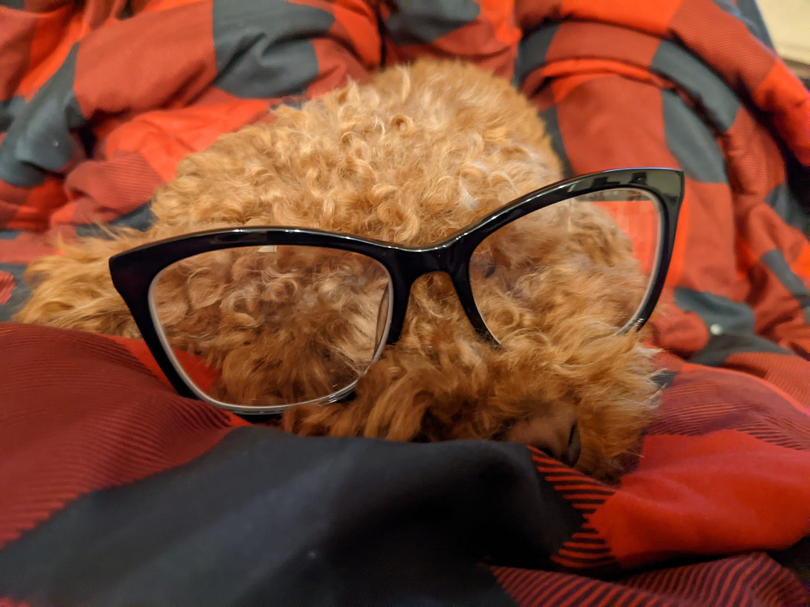

# Reading the Room 

*A key skill we should be teaching everyone *

[When I first started getting coaching from Katia](https://debliu.substack.com/p/career-coaching-how-an-outside-perspective), I would often explain to her how frustrating it was for me to work with people at Facebook. I had previously worked at PayPal and then eBay, where I had been there for a long time, knew everybody there, and understood how everything worked. I had grown up at both of those companies, only to suddenly be thrown into an environment where everybody was different, acted differently, and worked differently.

This was all compounded by the fact that I was terrible at reading rooms. I had such a hard time understanding what other people were saying, it was as if they were speaking a foreign language—one that I only had a tentative grasp on. I remember telling Katia that I felt like I needed glasses; I was having to squint just to figure out what was going on.

The other day, a PM called me to get coaching. We spoke for about fifteen minutes about her struggle to break through and make her work shine. At one point, I stopped her and asked, “Is your manager really difficult to work with?”

She replied, “How did you know? I didn’t say anything about my relationship with my manager.”

It wasn’t like I was psychic, but rather her frustration was palatable. And it was clear something or someone was blocking her progress. Eventually, she recounted how challenging this manager was to work with, and how she and her peers had a thread going in Slack discussing how to manage the relationship and how unhappy they all were.

I recounted this story to Katia, and she pointed out how far I had come in learning how to read people. She quipped that perhaps I no longer needed glasses. I laughed because anyone who knows me knows I am still somewhat awkward and hard to work with. Nevertheless, that conversation made me reflect on how I was able to improve my ability to read people. This critical skill can serve us well time and again in our careers, but so often, we never get the chance to consciously develop it.

That’s why, for today’s post, I’ve decided to explore reading the room in more depth: why it’s an important ability, ways of developing it, and how we can use it to get to the truth in important interactions.

[Share](https://debliu.substack.com/p/reading-the-room?utm_source=substack&utm_medium=email&utm_content=share&action=share)

## **Why reading the room matters**

One day, I asked one of my PM directors to present to a meeting of executives, including the CEO. These execs were my peers, so I had a good understanding of their thoughts about what was going to be presented. I had prepped this PM on the content, honed the slides with him, and helped him with his talk track.

What I didn’t prepare him for, however, were the executives’ individual points of view and the relationships between them. Because I had spent time with them, I could understand the deeper conversation behind the words they were saying, but this particular PM couldn’t. He was missing crucial context, and as a result, he struggled. Seeing him flounder reminded me of so many meetings I had attended where the conversations had three levels:

1. **What words were being said**
2. **What each person actually meant**
3. **What it meant in the context of their relationship and history**

[I’ve written extensively about these levels in the past](https://debliu.substack.com/p/tough-love-how-hard-feedback-changed), and how they add complexity and the potential for conflict to seemingly-benign interactions. Without a clear understanding of what is happening behind the scenes, you can't meaningfully contribute to a discussion. You are a fish out of water. As a result, your input sounds out of touch and disconnected at best, and downright tone-deaf at worst.

This is where being able to read the room becomes an invaluable skill: having the ability to see the conversation behind the conversation, and the relationships that exist beyond the obvious, can help you contribute in a much more impactful way.

## **Reading people as a skill**

I once struggled mightily with my relationship with a peer, Boz, who later became my manager. Things were so bad that I nearly quit rather than have to report to him. But our relationship went through a massive evolution in the following months, and we ended up working really well together over many years. (I share this story in more detail in [my book](https://www.amazon.com/Take-Back-Your-Power-Rules/dp/031036485X), in the chapter on forgiveness.)

One day, I came into Boz’s team meeting, and the only seat available was right next to him. I stood in the doorway, frozen. He gestured to the seat and invited me to sit beside him. I could feel every cell in my body reject the notion. I blurted out that I could not sit there. By then, everyone had turned to look at me, so I reluctantly made my way over. Sheepishly, I ended up sitting down, saying, "I never sit next to Boz."

Here's the thing, though: I never realized that I had never sat next to Boz until that exact moment. During all those years of conflict, I always sat across the room from him so that I could look at him directly and gauge his reaction to everything. It was so instinctual that I had never even consciously noticed I was doing this. The distance between us was a way for me to get more information on what he thought and how he was receiving what people were telling him. I was physically reading the room, and him in particular.

As a result, I could sense when the conversation was taking a turn. On the flip side, I could also see what was landing. It was like going to a foreign country where I had learned the language, and I could start to understand large parts of what had previously sounded like gibberish to me. And that wasn’t something I had known how to do before. Consciously or not, I had been developing my ability to read the room, which became a valuable tool for surviving one of the toughest work relationships I’ve ever had.

## **How to read rooms**

There’s a common misconception that you have to be naturally intuitive in order to read the room. But the truth is that reading people is a learned skill, which means that with time and practice, you can develop and improve it. This will help you in countless ways in your job and career.

So, how do you go from always feeling like you’re missing something to interpreting words and gauging reactions like a pro? The good news is, unlike with me and Boz, you don’t always have to be sitting in just the right spot or religiously watching the other person’s body language. Instead, try these four methods for learning to effectively read the room:

1. **Place yourself in the other person’s shoes**. In your effort to understand others, you also need to understand the context of their interactions with you. I grew up very much inside my own head. I was from a small town in the South where very few people looked like me. As a result, I spent a lot of time shuffling and reshuffling my own deck of emotions, always holding the cards close to my chest. I struggled to understand the people around me, and this made me feel like a foreigner, no matter what I did or what I said. I eventually learned to embrace that while working to understand the other person’s perspective, no matter how different it might have been from mine.

   None of this is to say you have to *agree* with someone else’s point of view. But in order to read them accurately, you do need to make an effort to *understand* it. That means visualizing the situation from their perspective, including looking at what you’re saying and how you’re reacting through their eyes. You may discover that, from a different perspective, what seemed like a casual remark or offhand comment to you came across the wrong way to the other person.
2. **Understand what motivates the other person**. If you don't know what’s driving someone, you're not going to be able to accurately interpret their reactions. I’ve known people who were terrified of making mistakes because their managers punished mistakes harshly. There have been others who felt they were falling behind their peers, so they did whatever it took to get promoted. I remember one person I worked with who had an intense desire to be liked. Finally, I pulled them aside and pointed out that, although their reactions in meetings seemed to stem from wanting to be liked, they were unintentionally undercutting their impact, influence, and effectiveness. Once I saw what motivated them, I could help them address it.

   If you want to understand what people are saying, it’s critical to understand *why* they’re saying it. This will give you important insight into why they might be acting or reacting in a certain way.
3. **Reflect on your own biases**. We all carry our own biases, and these can color our interactions with others. We walk into a room with all the experiences of our life trailing behind us, influencing how we judge the situation—rightly or wrongly. If we're not careful, we can end up taking these biases and placing them on others.

   Learning to read a room means opening the door and saying to yourself, “I'm going to leave some of these things that I believe outside so that I can come in with fresh eyes.” Needless to say, this is often hard to do, because we have so much history shaping our personality and beliefs. But this also allows us to open our minds to the possibility of reading things differently. As you start to draw conclusions about what someone else is saying or how they are acting, it can be helpful to take a step back and ask yourself how much of that interpretation is being influenced by your perspective and history. This can help you ensure that you’re reading people as objectively as possible.
4. **Speak the other person’s language**. Finally, it's important to learn to speak other people's languages. Lingo and jargon can vary between teams, departments, and companies, so always seek clarity on definitions if there’s any ambiguity.

   This rule extends to actual language as well. Often, when two people come from different regions of the US, there is a disconnect due to differences in dialect. I once ordered a “Coke” while I was spending a summer in Michigan for an internship. My friend laughed and said, “We call it ‘pop’ ‘round here. I mean, what if you want a Sprite?” I explained that where I was from, we called Sprite “Coke,” too—as in, a generic term for “soda.” She looked at me quizzically.

   Learning someone else's language reduces distance and helps you connect with them. It also helps you understand what they are really trying to say, which is invaluable for avoiding miscommunications.

[Link](https://www.rd.com/list/regional-sayings-phrases-words/) to regional sayings

---

Reading the room is an essential interpersonal skill, one that can help you accurately interpret what other people are saying while preventing conflict, connecting with others, and contributing meaningfully to the conversation.

Learning to read rooms is a skill like any other -- one that can be practiced and honed over time. Likewise, it can also degrade if you do not actively make an effort to improve it. By placing yourself in others’ shoes, understanding their motivations, being mindful of your own biases, and paying attention to the language they speak, you can develop these skills to become a better communicator and collaborator.

The next time you find yourself in a meeting or conversation, make an effort to read the room and those around you. You might be surprised by just how much you can learn.

[Share](https://debliu.substack.com/p/reading-the-room?utm_source=substack&utm_medium=email&utm_content=share&action=share)

Perspectives is a reader-supported publication. To receive new posts and support my work, consider becoming a free or paid subscriber.