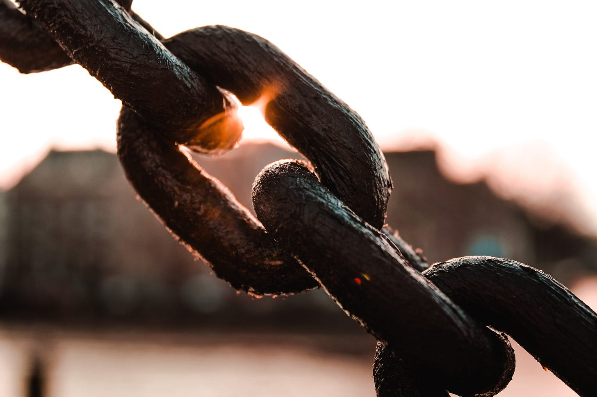
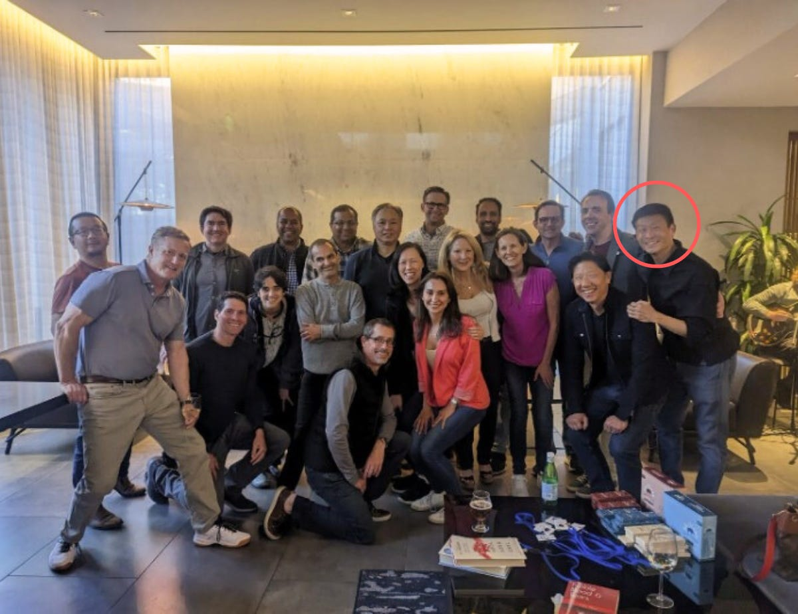
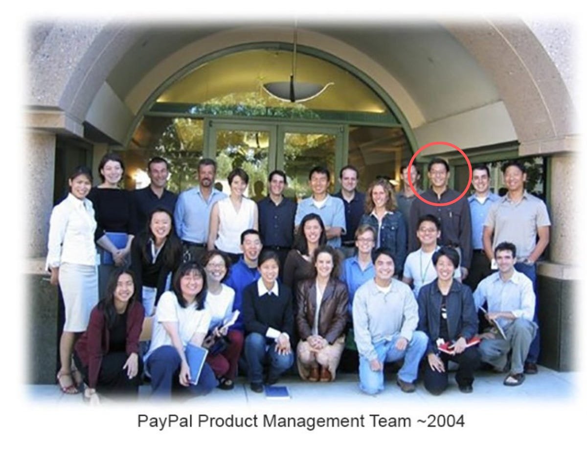

# The Importance of Linchpins, and Why You Should Become One

*How being a critical connector creates new opportunities for you and others *

Photo by [Miltiadis Fragkidis](https://unsplash.com/@_miltiadis_?utm_source=unsplash&utm_medium=referral&utm_content=creditCopyText) on [Unsplash](https://unsplash.com/photos/2zGTh-S5moM?utm_source=unsplash&utm_medium=referral&utm_content=creditCopyText)

## **Linchpin**

**Noun**

*The most [important](https://dictionary.cambridge.org/us/dictionary/english/important) [member](https://dictionary.cambridge.org/us/dictionary/english/member) of a [group](https://dictionary.cambridge.org/us/dictionary/english/group) or [part](https://dictionary.cambridge.org/us/dictionary/english/part) of a [system](https://dictionary.cambridge.org/us/dictionary/english/system), that [holds](https://dictionary.cambridge.org/us/dictionary/english/hold) together the other [members](https://dictionary.cambridge.org/us/dictionary/english/member) or [parts](https://dictionary.cambridge.org/us/dictionary/english/part) or makes it [possible](https://dictionary.cambridge.org/us/dictionary/english/possible) for them to [operate](https://dictionary.cambridge.org/us/dictionary/english/operate) as [intended](https://dictionary.cambridge.org/us/dictionary/english/intended).*

(Definition from the [Cambridge Dictionary](https://dictionary.cambridge.org/us/dictionary/english/linchpin))

I remember when, in 2002, a couple of months after I joined PayPal, I interviewed a new product management candidate named [Alan Tien](https://www.linkedin.com/in/alantien/). He was more seasoned than the rest of us at the time—especially me. After all, I had been a PM for all of two months. Later, he would joke that mine was the toughest interview he had during the process, which I found funny, because I had no idea what to ask during a PM interview, having barely been one myself.

Alan and I worked together for many years, and he is the same lovable jokester today as he was when we first met. But over the past years, he has also come to occupy a critical space in our PayPal community. He has become our linchpin.

It started when Alan moved abroad to work in China, then Singapore, before eventually settling in Hawaii. When he came back into town, he set up a PayPal reunion so that the early PMs could periodically gather and hang out. While he quipped that this was the only way for him to see people when he came to town, that reunion became a touchstone for all of us to get together, stay connected, and help one another over the following years.

Over time, those meetings became moments when we were able to see others whom we rarely saw otherwise. They became the heart of our community. When I pointed out to Alan that I wanted to write about this in my newsletter, he shrugged and said he didn't feel like he had done anything special. He said, "After all, it's just an Evite and a call to set up a location." But organizing these reunions is so much more than that. It's the thoughtfulness that goes into maintaining the invite list. It’s the intentionality of choosing when to make it happen. It’s actually showing up every time and being an amazing host.

Without Alan, we would not have built this community to draw on during good times and hard times. Through this PayPal reunion, we have helped each other find jobs, investors, and employees. We’ve had a place to share our lives and our challenges. We’ve been able to weather the ups and downs of our roles, companies, and industries together. Because of Alan, we have had a chance to find success and support over the course of our careers.

[I’ve previously written about the importance of being a connector](https://debliu.substack.com/p/how-to-become-a-connector), but Alan represents a very specific type of connector: the linchpin, the person who keeps communities running. By becoming a linchpin, you can bring—and keep—others together, foster collaboration, gain mutual support, and help your community thrive.

[Subscribe now](https://debliu.substack.com/subscribe?)

## **Who are your linchpins?**

Every community needs to have a linchpin: the glue that holds it together. A linchpin could be a teammate, a group leader, or simply the one friend who always makes the meetups happen. Regardless, the linchpin is incredibly important, because they are the one who keeps the group moving toward a common goal. Without linchpins, communities would fall apart as inertia sets in and people drift away from one another.

Some of the greatest events that I attend throughout the year are hosted by just one or two people who care enough to make them happen. There's one event, hosted by a prominent leader for women in Silicon Valley, where we spend an evening together each summer. There is another party that happens around Labor Day where I get a chance to reconnect with friends I rarely see. There is an annual holiday party where distant connections and old friends collide. I look forward to each of these events and make time to be there, because they are some of the highlights of my year. But these events wouldn’t be possible without the linchpins who go out of their way to make them a reality.

Who is the linchpin for the something you care about—whether a community gathering, a club, a nonprofit, or a team? Who is the person in this group who goes above and beyond to make things happen? If you can’t name one, then ask yourself, why isn't it you? Yes, it can be easier to sit on the sidelines and be a spectator, but when it comes to achieving a common goal, there is always a need for activation energy. This is what creates these groups and holds them together in the long run.

When we first started Women in Product, we didn’t have some grand purpose. We were a small group of women at dinner one night who said to one another, “Wouldn’t it be great to have our own Grace Hopper for women in product management?” From there, we started a Facebook group and put out a call for people who wanted to meet up. Suddenly, we were flooded with thousands of women who wanted one of the 300 slots, and that was when we realized the deep need for this community in order to connect with and help one another. We thought Women in Product would be a conference of a few hundred people, and that would be it. Now, however, we are over 30K women strong, with a presence in two dozen cities.

I never saw myself as an organizer or a connector, and that is exactly why Women in Product was so surprising. You never know when something will resonate with people—and you *can’t* know if you don’t work to make it happen.

For everything you care about or participate in, there is someone who spent time to create it and sustain it over time. That nurturing over long periods is necessary to make things grow and thrive, and that is precisely what a linchpin does.

Look around and think about who the linchpins are in your life. Who sets up the events you attend year after year? Who organizes the dinners for your group of friends? Who do you rely on to set up your reunions? Each of those people creates value in important ways, ways that are often invisible to the rest of us. We attend, enjoy, and then move on, without much thought for the people who make it possible. Take an audit of the linchpins in your life, and think about how much value they create for you. Then, take it a step further: where could *you* be a linchpin?

## **Why being a linchpin pays dividends**

While there is often no direct reward for bringing people together, becoming a linchpin can be indirectly valuable in numerous intangible ways. Every person who goes to Alan’s events knows him and would answer his call if he ever needed anything. We are closer to each other, and to him because he took the initiative to send out that first Evite—and every Evite after that. Whenever any of the hundred or so attendees asked about Alan, they have nothing but good things to say. This is the power of being a linchpin: you become indispensable to a community of other people, and that value can have huge professional and personal rewards.

People always say, “**let’s get together soon,**” but there are only certain people who actually get the ball rolling and make it happen. These critical connectors become culture carriers in organizations and groups. They gain visibility, opportunity, and warm feelings from those around them. In the world of influence, there is nothing more powerful than helping others. It opens the door to reciprocation and positive affinity. It also enables you to ask for help when you really need it.

That said, I don’t suggest you do this just for the rewards. Instead, start by focusing on the impact, and the dividends will come in time.

## **How to become a linchpin**

Becoming a linchpin always starts with the same questions: What is a community that's important to you? What do you want to see more of in the world? This could range from something as simple as gathering a group together for drinks to something as impactful as building a Lean In group to foster peer coaching or creating an organization to effect change in your industry. Alan created a repeatable process using an Evite and a simple venue. Yes, he thinks this is trivial, but it’s actually brilliant, because it is marrying intentionality and execution. Alan was the person who said, “We should get together more often,” and then actually made it happen.

I have a friend who told me that he invites people to his house for dinner all the time.  I expressed my horror, citing the messiness of a home with six people and a Wonton. He replied, “It's about connecting with people. No one cares how your house looks.” (They might change their view if they saw my kids’ pile of school stuff at the end of the dining room table.) Still, I love this philosophy of caring more about people than about tidiness—and he had a point. Being a linchpin is easier than it sounds.

If you’re interested in becoming a linchpin in your own community, start by asking yourself, “If I had to make a list of people I wish I could spend more time with, who would they be?” Then brainstorm an appropriate setting. Here are a few suggestions:

* Create an alumni group for people you’ve worked with before, and set up annual meetups. Our team has a Facebook group to catch up on where everyone is and how we’re all doing.
* Host a dinner once a month for interesting people you wish you could spend more time with. (Don’t worry about a clean house. Focus on the company.)
* Set up a peer mentoring circle that meets monthly or quarterly. The four Lean In groups I’ve been a part of have been transformational to my career. Coaching circles could be transformational to yours as well.
* Start a Facebook group or chat thread for people with whom you share a passion. This could be a sport, hobby, or other non-work related activity. Share information and build a community. You can even meet up in person!

Each of these things may seem small, but in the right hands, and with the right initiative, they can be transformational to your life and the lives of others. What they need is one person to be the linchpin that makes it happen. What they need is you.

---

Linchpins are often overlooked, but they play an invaluable role in creating groups and keeping them together. The question for each of us is, what community can we help thrive by becoming its linchpin? What idea have we had that we’ve never acted on to bring interesting people together?

There is an opportunity for each of us to create our own PayPal reunion and watch the magic that unfolds from it. It all starts with one person who cares enough to plant the seed and watch things grow from there.

[Leave a comment](https://debliu.substack.com/p/the-importance-of-linchpins-and-why/comments)

