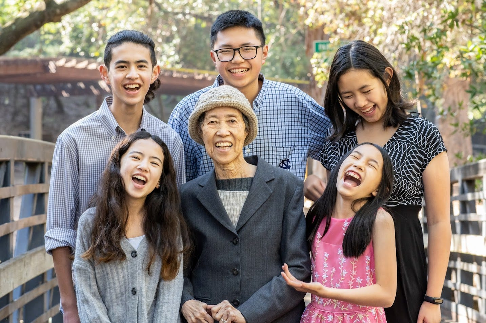
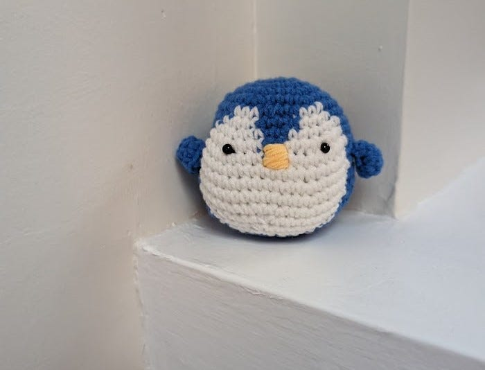

# Dealing with Grief

*And how to support those grieving *

My mom passed away at the beginning of last month after a long battle with cancer. She had been in the hospital for a while after having Stage IV cancer for several years. This loss came on the heels of the loss of my mother-in-law in October, and my father-in-law in July of last year. It’s been devastating.

Part of me has been in denial. I often stick my head into her room and expect her to still be sitting there, smiling at me. But the room is now sitting there empty, with all of her things just as she left them. I've been slowly picking up one or two items when I pass by to take to the kitchen. I think, “This is the last cup she ever drank from,” or, “This is the toothbrush that I have to throw away.” Every day, there's a little less of her in there.

I started by giving away the things that were the least personal, like some of her medical equipment, because those things didn't define her life. I then started sorting through some of the other things that she no longer needs. But when I look at her favorite pink turtleneck, or the hat she crocheted for herself when she lost all her hair to chemo, I pause.

[Subscribe now](https://debliu.substack.com/subscribe?)

The loss feels all at once overwhelming and like a low current, humming in the background. My mom has lived with us for over ten years, and she's been a part of every family meal, from the day she moved in until the day she could no longer make it to the dinner table. I still go to the grocery store and think about making something she'll want to eat, only to realize that she's not here to eat it.

As I slowly sort through her things, I contemplate whether I could have been a better daughter somehow. If I could have helped her more, if I could have traveled less. Like many Asian parents, my mother was not the most affectionate or emotional. I knew she loved me. She would tell me that I worked too much, or that I needed to eat more—all words of affection from someone who shows their love through what they do, not what they say. I started to get increasingly frustrated when she couldn't remember things, or when she would repeat the same story ten times in one day. I had always known her to be this fierce woman who came to this country with almost nothing and made a life for herself. I wondered why I had to persuade her to eat to stay alive.

## **The complexity of grief**

I got mad at David after his parents died because he refused to clean out their house. Their deaths were so overwhelming, but their house was full of all their memories and all their things. It was a house we had built for our family over a decade ago, but when we had our third child and my mom moved in, it was no longer big enough for us. For months after the deaths of his parents, David wouldn't even go over there if I didn’t instigate it, even to look for their financial papers or to try to file their taxes.

I spent months trying to clear out the house with the kids in my spare time, just to take one thing off his plate. But now, as I stare down my mom's room, I understand exactly why he did what he did, even if it seemed completely irrational to me at the time. Part of me wants to keep that time capsule of who she was forever in my home. Another part of me realizes how crazy that seems.

Our daughters have shared a room for basically their whole lives because their grandmother lived with us. By now, they've reached an age where one of them needs to go to bed early, and the other has to stay up late to do homework, and they constantly fight. But neither one of them wants to move into their grandma’s room. To them, that is her room, her space. A place for them to visit, not to live. And nothing I say can persuade them to reconsider.

As I slowly give away all the medical equipment, wheelchairs, walkers, and oxygen, that room is starting to look more like home again. But the soul is no longer there. I can't stop by to say hi in the morning, or ask her if she wants to drink a cup of tea together.

Loss is a little bit like that. Your memory hangs on to the small things but discards the big things. It sorts through and filters things out. Sometimes it's dates or memories, and other times it's just feelings.

[Leave a comment](https://debliu.substack.com/p/dealing-with-grief/comments)

## **Supporting those who are grieving**

The thing about grief is that it’s a journey we go on alone. Others might understand our pain, but they aren’t living it. They hesitate to bring it up, and when they do, they often struggle to find the right words beyond the old standby: “I’m sorry for your loss.” Actions speak louder, but it can still be difficult to know how to help, as much as we might want to.

When we are uncomfortable, sometimes we disengage because we don’t know what to say or do. But rather than pulling away, lean into the relationship. Rather than dancing around the subject or settling for a canned response, consider the following strategies the next time someone you know is going through a loss:

* **Get clarity on what they need.** Because grief is so individual, support can look different for everyone, so start by asking, “What does support look like right now?” Let them tell you what they need. Some might want a listening ear to talk about the memories. Others might simply want help with cleaning around the house. Whenever possible, let the other person take the lead.
* **Make your support specific.** That said, grief can also be overwhelming. That’s why it’s not always helpful just to say, “Let me know if there’s anything I can do.” That puts the cognitive load back on the other person. Instead, make your offers of help specific. Something as simple as “Would you like me to watch the kids tomorrow?” can go a long way.
* **Let them decide how much they want to talk.** Some people process grief by talking—about the other person, about the loss, or about the emotions they’re feeling. Others prefer to avoid the topic. Instead of making assumptions, ask the person how much they do or don’t want to share.
* **Take initiative.** Remember that there are always things you can do that don’t require the other person to think through a decision at all. Consider ways you can show your support without needing to be asked. Send them a DoorDash gift card. Bring them dinner. Listen when they talk, even if you aren’t sure what to say. Being there for them can take many different forms, but even the small ones can make a difference.

I discussed some of these tips in [my earlier post about empathy](https://debliu.substack.com/p/what-i-learned-about-empathy). In the aftermath of my mother’s passing, I think they bear repeating. When someone is in pain after a loss, it can be hard to know what to do, but these simple acts of support can go a long way.

---

I don't know how to mourn a mother who has been slowly fading away from me for years, with moments of lucidity that came and went. There was a day she told me that my dad was waiting for her in the living room and that he wanted to see her. I once caught her getting out of bed and trying to go outside by herself to meet him. My father has been dead for 12 years, but I said nothing. I had spoken to a nurse who works with memory care patients, who told me it doesn't make sense to contradict somebody when they want to see someone who's passed. The grief is fresh for them each time you correct them.

My mom knew my dad was dead until a few weeks before her own passing. Then she was sure he was returning to visit her. I suspected that maybe this was her way of saying she wanted to see him, and very soon.

Or maybe she knew the day was coming.

The last night before she died, I got a crocheting kit to crochet with her. She had taught me to crochet when I was six, and I thought it was something we could do to while away the long hours of sitting together. She had the State of the Union on, and I started crocheting a penguin. After she fell asleep, I finished the penguin and set him aside so I could bring him to her the next morning. She never got to hold him because she had already passed.

On her table sits that little blue penguin and a crocheted anthropomorphic corn my sister made on her last visit. I guess when I finish tidying her room, that penguin will be the last thing that remains. It was the last thing we did together while she was here.

[Share](https://debliu.substack.com/p/dealing-with-grief?utm_source=substack&utm_medium=email&utm_content=share&action=share)

Here is a look at my mom’s life. I hope we continue to honor her with our words and actions.