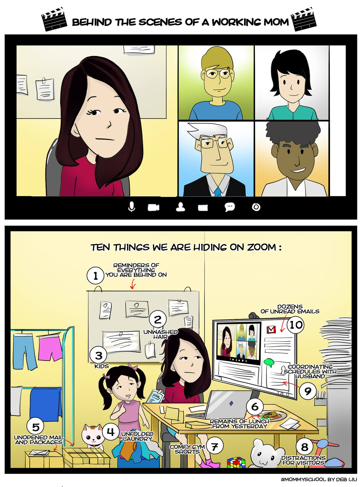
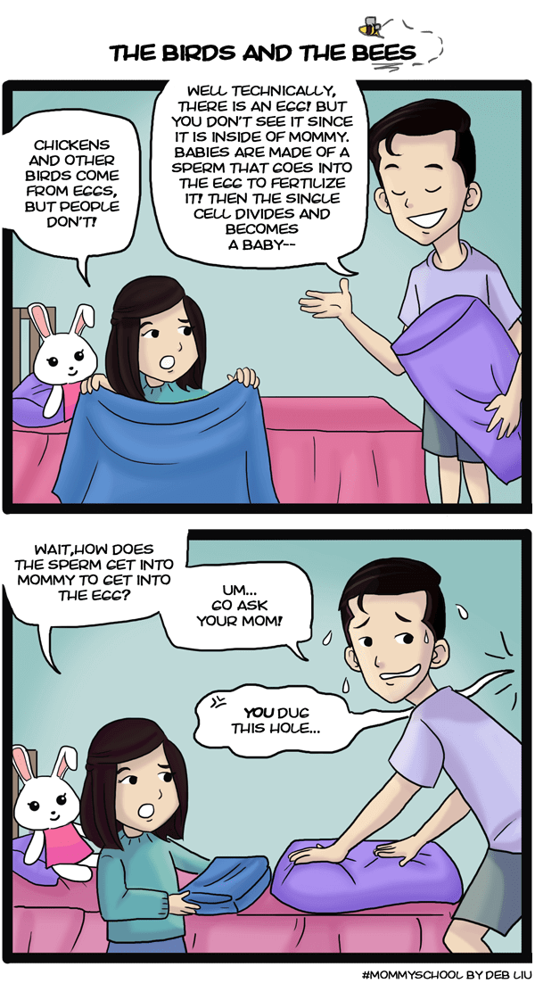

# Naming as a Tool for Impact

*How giving something a name gives it power—sometimes too much*

When my kids were small, I liked to name things. Simple, silly games we played. Activities in the car. Covert math assignments. They all had names: *Mommy School. Cookie Math. Lightning Q&A.*

When we did an activity with just one kid, we would call it *Only Child Time*. On *Karaoke Nights*, we sang our hearts out, and we hosted regular *Liu Family Movie Nights*. The child in charge of making sure the laundry was done was *Laundry Boy*, and the one who had to put away the utensils was *Silverware Girl*. When I called out, *Seaweed Girl*, the right child would come running, cut the seaweed for Sushi Night, and voila! It was done.

Naming is a powerful thing. It creates an image with just a word or two. A name means something to those in the know; it acts as a cultural touchstone by creating a joint experience. In our family, we marked things by giving them a name, and we used that to create a family language that memorialized our traditions and activities. It’s such a normal part of our lives, it can be easy to forget how much power a name really holds.

## **Naming as a tool**

Take a moment to think about your company. What is its name? Just as importantly, what are the names you use *within* your company? At Ancestry, we have Ancestry Collaboration Days, MBIs, Quarterly Business Reviews, The Flash, Summer Party… To someone outside the company, these words probably seem meaningless. But to those within it, they have a history and a meaning. This creates a sense of community, and with community comes a sense of shared responsibility.

Most companies have a name for onboarding, but Facebook took it one step further. They called it “Bootcamp” and created an entire mythos around it—one that’s become larger-than-life, to the point where even non-employees are familiar with it. But this idea of naming does more than just drum up excitement; it also inspires people to take ownership.

People have ideas all the time, but not everyone will set aside time to start projects of their own. But build a tradition around it and call it “Hackathon,” and you get people feeling inspired. Engineers fix bugs, but how many get to celebrate the “Fix of the Week” in front of the whole company?

I remember hanging out one time with David's law firm friends. The things they kept referencing meant nothing to me. I felt like I was listening to a bunch of people from another country as they complained about “billable hours” and “document review.” But those shared experiences and terminology were what bound them together, making them more invested in their work, community, and shared goals than they would have been without them.

This is the power of naming: It creates intimacy. It draws lines between insiders who are in the know and outsiders who are not. It creates culture and cohesion. So what does it look like to harness that power?

## **The responsibility of naming**

When something is given a name, it is given power. It has its own brand, and that word means something when others hear it. Companies pay millions to evoke an emotion when their name is heard.

Close your eyes and think about what comes to mind when you hear *Hilton* versus *Airbnb*. *YouTube* versus *TikTok*. *Target* versus *Walmart*. How do you feel when you're trying to order a Coke and they offer you a Pepsi, or the other way around? What are your emotions when you think about flying Southwest versus Delta? What would be your first impression if someone told you that they drove a Honda Odyssey versus a Tesla Model 3?

The power in the name is what it evokes in other people. It is all of the associations both good and bad. Your name is your brand. It’s what you represent—and it’s what you mean to the rest of the world, too.

I once worked on a team called Neko. Our mascot was the Maneki Neko, the fortune cat that you see in Asian restaurants. We didn't actually know what product we were working on; we just knew that we wanted to solve mobile monetization. So we tested a bunch of things until we built a billion-dollar ads business within the company. Had we named our team after a product, we would have felt confined by it. Perhaps our innovation would have even suffered as a result. But instead, we named our team something really broad. This gave us the mental space to try a bunch of things and see what worked—and that was what led to our eventual breakthrough.

Sometimes you see teams name themselves too narrowly, and they end up stuck with names that dictate their charter. So use naming carefully. This isn’t to say there’s a single perfect balance; sometimes a narrow focus is needed, and too broad of a name can make you lose direction. The best advice I can give is to know what it is that you're trying to define, but also know what it is that you're excluding.

[Leave a comment](https://debliu.substack.com/p/naming-as-a-tool-for-impact/comments)

## **Naming gone wrong**

Pop psychology has taken the realm of therapy and turned it into a common parlance—sometimes to the detriment of us all.

I was bullied relentlessly as a child. I went to a school where I was one of the only Asian kids in the entire school system. This made me an easy target. It was ruthless. Very few days went by when I was not verbally attacked for being different. This went on for years and years and years. I remember describing this experience to somebody who was interviewing me, and they asked me how I could deal with such trauma.

I paused. I had never allowed myself to use the now [oft-used word “trauma”](https://www.vox.com/the-highlight/22876522/trauma-covid-word-origin-mental-health) to describe my experiences. In fact, I rejected the word fully. These things happened, and they were bad. But naming them gave them more salience and meaning than they deserved.

I used to have panic attacks in high school. I had a great deal of anxiety, partly because of the bullying, but my solution was to treat it like allergies. I live with severe allergies, but I really don't think about them that much on a day-to-day basis. I certainly don't define myself by them—just like I don't define myself by the anxiety or other negative experiences I had as a child.

*Trauma. Trigger. Narcissist. PTSD. OCD.*

The thing about giving a name to something is that it can cause us to dwell on it—and with time, it can start to consume us.

Sometimes people really do have trauma, just like some people really do have narcissistic personality disorder, panic disorder, or any of the other disorders you hear about. But when we misuse these clinical terms, it can cheapen them for those who do live with these challenges. By using them too much, ironically, we’re taking *away* the power of their names. And so often, when we do, they start to define who we are.

I refused to allow that to happen. Yes, it sucked that I spent so much of my young life being bullied, and I wouldn't want it to happen to others. But I also refuse to give it the power of naming it, so I never have.

Naming something makes it powerful. It defines its place in your life. It gives it shape. For me, as long as my experiences were something in the distant past, I made the choice not to let them become a thing that I could name. That would make them too real, and give them power they didn’t deserve.

What are you naming in your life that doesn't deserve a name?

[Subscribe now](https://debliu.substack.com/subscribe?)

## **Using the power of names**

So, with all that being said, how do we take advantage of the power of naming while avoiding the biggest pitfalls that come with it? Here are my biggest tips.

1. **Think about what you want to have permanence.** Naming gives things permanence. This, of course, can influence people’s thoughts and actions, so don’t just name things because you can. Instead, give careful thought to which things you want to stick and which things you want to leave behind.
2. **Leverage naming for ownership and accountability.** Giving a name to a specific project, role, task, or responsibility gives it importance. This encourages people to take ownership and pride in it. Try leveraging this to foster a sense of community, inspire teams, and build accountability.
3. **Avoid being too restrictive.** Be careful to avoid using overly narrow names. This can limit creativity and lead people to subconsciously restrict themselves. Instead, aim for names that are broad enough to encompass a wide range of ideas and directions.
4. **Reflect on your vision and values.** Names reflect your direction, principles, and vision, both directly and indirectly. They remind everyone what you want to achieve and what values guide you. Before choosing a name, consider how it comes across from multiple points of view.
5. **Be flexible.** Even the best name can stop being a good fit as a project, title, or team changes and grows. Allow for the names you pick to evolve and adapt as needed, and you won’t have to worry about them losing relevance or meaning as time passes.

Names can be useful, but they can also hinder you if you aren’t careful. By being thoughtful about how you name things—and whether you should name them in the first place—you can leverage them as a tool without tripping yourself up.

---

It can be easy to forget the power in a name. I put out a book a couple years ago called *Take Back Your Power.* Now, every time the kids want to disagree with me or get out of doing chores, they tell me they want “take back their power” and they assert their point of view. They leverage the name and concept to push back. Turns out naming works.

[Share](https://debliu.substack.com/p/naming-as-a-tool-for-impact?utm_source=substack&utm_medium=email&utm_content=share&action=share)