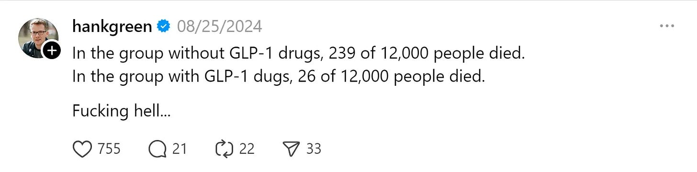

# How I'm Improving My Health (and How Your Can Improve Yours)

Photo by [Emma Simpson](https://unsplash.com/@esdesignisms?utm_content=creditCopyText&utm_medium=referral&utm_source=unsplash) on [Unsplash](https://unsplash.com/photos/woman-walking-on-pathway-during-daytime-mNGaaLeWEp0?utm_content=creditCopyText&utm_medium=referral&utm_source=unsplash)

Growing up, I never thought much about my health. [I was sick often (now I know it was due to allergies)](https://debliu.substack.com/p/what-we-learn-from-sickness?utm_source=publication-search), but otherwise was just a normal child. I didn’t eat excessively, but I also didn’t pay close attention to what I put in my body. I was skinny but weak. I hated working out or doing anything strenuous. I chalked it up to not being an athletic person, and since it didn’t interfere with my life, I left it alone. Outside of my three pregnancies, where I gained about 45 pounds each time, I maintained a steady weight most of my adult life. I lost the baby weight quickly each time and didn’t think twice about it.

That all started to change 13 years ago, when I had my youngest child. She had trouble sleeping, and the only thing that soothed her was the sound of the elliptical machine next to her crib. I became her human white noise machine, and thus began my daily workout routine.

The elliptical ended up being the first of many habits I started incorporating into my daily life to support my health. Over the years, I started adding little things to my [New Year’s Resolutions](https://debliu.substack.com/p/ten-ways-you-can-use-new-years-resolutions?utm_source=publication-search): I stopped drinking sugary drinks, worked out every night (even after my youngest stopped struggling to sleep), and got serious about eating less sugar. I started practicing intermittent fasting and getting more sleep. I began cooking more at home.

My blood tests were coming back mostly fine, so I chugged along. In the last few years, I had already started taking my health more seriously; I began reading books on health and longevity like *[Outlive](https://www.amazon.com/Outlive-Science-Longevity-Peter-Attia-ebook/dp/B0B1BTJLJN?crid=2DFGGMFDXQOF&dib=eyJ2IjoiMSJ9.YWcODSNrmJD4_f_aarkGm53wikWZreT9qlYHX46fBeYPmF1K8bSyvAXA4BBkfixuHA_d3bciI0uxRGzSVASAOMVALi1h5w3Ws6zQgiIi9Umu9Z9MWIiW6KDRwfZ_pkZWfcvTP6I0MJlx1uFCXdPqrq3C-ykDeCXasIZBeSnJiQoOS46Pgcbhp_90lbvFEYH7aZyZHJdyIIo4ViMeq86YbHUnMsLZIDv2SftK7i2WARc.M64S3Rm_cU9ES5rerPOOLObhNZKMc_mrKvKe8C5nRx8&dib_tag=se&keywords=outlive&qid=1741052305&s=books&sprefix=outlive,stripbooks,214&sr=1-1&linkCode=sl1&tag=makerheart-20&linkId=a75584103b49826b78c286dd4b3b09da&language=en_US&ref_=as_li_ss_tl),* *[The Obesity Code](https://www.amazon.com/dp/B01MRKEO0U?bestFormat=true&k=the+obesity+code&crid=32H6TD2BIO9AV&sprefix=the+obesity+code&linkCode=sl1&tag=makerheart-20&linkId=40ce0331bd00bbbab273454cda98038e&language=en_US&ref_=as_li_ss_tl)*, *[Fast. Feast. Repeat](https://www.amazon.com/Fast-Feast-Repeat-Comprehensive-Fasting-Including-ebook/dp/B0818B89T8?crid=21E356LJHPVWR&dib=eyJ2IjoiMSJ9.tYXnXFWnROJU25q_lqBZoLQ5Ic2h2cvwpR6sSdFwFmU1hUgZ0oUcEhWz-PYZNeyVtrkuvjBGr-NxIx9yUW_DtXg2hfIA2XTABUMb4mtm3y1t5ouq6Y3HpaiS7JvX76DJL_PVkfjT9VsAj4B-_z7-Tsjbcg4h5ooyHL7E5m80vVDxDEm7yI4fuJw1z8v_gh6KLTYD4BcmqyhcMY_N5q0N2No-pUadzmXisx10HDtlYVI.Jetb0sgI9NfTi-Sqr1lS7PFNx_L0J9kpRi6ePs-3hBo&dib_tag=se&keywords=Fast.+Feast.+Repeat.+By+Gin+Stephens&qid=1741053990&sprefix=fast.+feast.+repeat.+by+gin+stephens,aps,222&sr=8-1&linkCode=sl1&tag=makerheart-20&linkId=0e2f57f347cf6993f0ea66a83baf0e4a&language=en_US&ref_=as_li_ss_tl).*, *[Young Forever](https://www.amazon.com/Young-Forever-Secrets-Longest-Healthiest/dp/B0B84DPT6N?dib=eyJ2IjoiMSJ9.vXqM1outSdcUfL9hRIK-ON2Py5_zC85V8KiMUT9s4gRLvqz4peWK2Gq-f8WtTZJe7sbQDowAnztVDcdgrbDnlqx329bCOGgXCNR4-XLnF4r4FN2z2T5-Ln9dyZWLLd67xFSTql9l9GESz7ZZWO4qER6j5fn8f-OvsRKRlcDP5S3_6EhiN1WL_w1qrXeYCNBXxhdpREHXFDafnvJ353wyYOt_vcFUsSALeiYO12AZnD0.2LynR_5fXUlPTFlzFtPWqCQIr8jGyXzp-RJ3CFn0CrY&dib_tag=se&keywords=Dr.+Mark+Hyman+MD&qid=1741053565&s=audible&sr=1-1&linkCode=sl1&tag=makerheart-20&linkId=4ce84d0e6835eba9406f4ff5b9665426&language=en_US&ref_=as_li_ss_tl)*, *[Why Calories Don’t Count](https://www.amazon.com/Why-Calories-Dont-Count-Science-ebook/dp/B08WM3W56N?crid=3U4FNQ79BKJK4&dib=eyJ2IjoiMSJ9.0LPOu_6o-rUyDhW-UwKoOwEaegl2oQac1Cx11vq8tFLXBNcAEDLoMf0lofLu48haM9LAGHfTr6p4zJ1dcTBLPkIc9g2SNYNuohQMvOzsH0KYG8nsShra0-z4i1IplJws.f0Wtv-W1H3UlR8Cts18j5cCUC5JiIGZznp2iI6Ea_84&dib_tag=se&keywords=why+calories+don%27t+count+giles+yeo&qid=1741054623&sprefix=why+calories+,aps,200&sr=8-1&linkCode=sl1&tag=makerheart-20&linkId=41e43715bb9551ea5acfd34739f05fe1&language=en_US&ref_=as_li_ss_tl)*, *[Lifespan](https://www.amazon.com/Lifespan-audiobook/dp/B07QGH1Q43/ref=sr_1_1?crid=1ZFNPAU3TKJRJ&dib=eyJ2IjoiMSJ9.R6um1cc5I2eqffz0cK5iFu0GJ6z9WqCcaQLcPO7X4W24zSXzcKc5WgwwUFrNF2E5307HyAfgcefEUd3NJcJHbBTLgt5dqusTR4-U9uM7IJDQrPZeoTQEwWCy0S-_mXySmuRPlYCrw0UahJ_lR0Pl0RtRrST0nHQQoIV-yML_00c6k5J6mSiTj0wECDQpYw5VxtXxbyqiiaCH0kDMaI1SJvbhNXTxT5OBUvS4dvPgk6Dypot6u7ywyKnlV2FbkuoSDuZqXm_elPw00ntOpU1F1pIdX6Mh8fk5uvWzbXqnGM0.CYrGamMfiBIcFdaVVvxMnpM1O_Xx0Llwkb83tAtrkUc&dib_tag=se&keywords=lifespan&qid=1745436586&s=books&sprefix=lifespan%2Cstripbooks%2C143&sr=1-1), [How Not to Die](https://www.amazon.com/How-Not-Die-Discover-Scientifically/dp/1250066115)*, and the like.

What struck me most was how much these books had in common (even if they did contradict each other at times). I started focusing on the throughlines, the practices they all seemed to agree on, and began incorporating them into my life. Watching my mom and my in-laws decline in the last five years of their lives gave me an added sense of urgency. [My recent cancer diagnosis](https://debliu.substack.com/p/drawing-the-cancer-card?utm_source=publication-search) was another wake-up call to take this all much more seriously. The goal wasn’t just to recover; it was to build a longer, healthier “health-span.”

You are an accumulation of your days. The choices you make don’t immediately have consequences, but they add up to who you are and how you feel. While you can’t always go back and fix the past, you can start making changes today and move forward in a healthier way. Here are a few ways I’ve been doing this in my own life.

[Leave a comment](https://debliu.substack.com/p/how-im-improving-my-health-and-how/comments)

### **Routines: Making Health a Part of Your Life**

**Sleep:** For years, I ran on 5 or 6 hours of sleep every night. I’d go to bed after 2:00 AM and wake up just in time for work. I used to say, “I’ll sleep when I’m dead.” I felt like by sleeping less, I was creating time out of nothing. That all caught up with me after a bout of insomnia, when I realized just how precious good sleep is. Once I started prioritizing sleep, I felt the difference. Seven to eight hours a night is now a non-negotiable.

Sleep is one of the easiest and most effective ways to reduce cortisol levels and improve both brain and body function. Getting enough is the best way to safeguard your physical health, mental health, and neurocognitive ability at any age.

**Intermittent fasting:** At the start of this year, I committed to taking intermittent fasting more seriously. I had done it off and on for years, but never tracked it consistently, so I wasn’t sure if I was doing it effectively. As with anything, you get more of what you measure. I downloaded the Zero app and started tracking every single day, recording exactly when I stopped eating and when I started again. That visibility made all the difference.

Time-restricted eating helps your body enter a state called autophagy, where it begins to recycle damaged cells and burn fat for fuel instead of sugar. It typically takes around 14 hours of fasting for your body to start making this metabolic switch. Do it often enough, and you’ll get used to going longer periods without eating.

**Testing and Screenings:** Before turning 50, I asked my doctor for a DEXA scan. She hesitated at first, because it was early according to general guidelines, but I persisted. That’s how I discovered I had osteopenia (reduced bone density). Asian women are at a higher risk, so catching it early meant I could take action and not end up like my mom and mother-in-law, who struggled with this in their later years. I bought a Tonal and started strength training to help reverse it. I also did a full bloodwork panel to check for risks like heart disease, metabolic issues, and cholesterol.

Routine screenings like colonoscopies, mammograms, and blood panels are essential. Our healthcare system is better at reacting to disease than preventing it, but early detection can absolutely make a difference. As with my mammogram story, catching changes early can shift the outcome. Don’t wait. Make sure you’re proactive.

[Share Perspectives](https://debliu.substack.com/?utm_source=substack&utm_medium=email&utm_content=share&action=share)

### **Food: You Are What You Eat**

**Real, fiber-rich foods:** “Eat food. Not too much. Mostly plants.” That’s the advice from Michael Pollan in *[The Omnivore’s Dilemma](https://www.amazon.com/dp/0143038583?bestFormat=true&k=omnivore%27s+dilemma+book&crid=2BBTKRIS84MSP&sprefix=omnivores+&linkCode=sl1&tag=makerheart-20&linkId=34f55d2371a9ba3189aeb23449b7db1a&language=en_US&ref_=as_li_ss_tl)*, one of the most thoughtful books on how we eat. One of the things he emphasizes is to eat minimally processed food with ingredients you can pronounce and recognize. This is easier than it might sound: Focus on making food at home, where you know exactly what’s going into each dish.

But while people are passingly familiar with the benefits of avoiding processed foods, one of the most overlooked parts of our diet is fiber. Over 90% of Americans don’t get enough fiber, which increases the risk of heart disease, metabolic issues, and some cancers. We eat too many refined carbohydrates and processed ingredients, but not enough vegetables, fruit, legumes, and whole grains. I have been working to get this balance right—and you can, too.

**Protein is important (meat optional, fish okay):** There’s a lot of debate about whether we should eat meat, and if so, how much. Many of the authors whose work I mentioned above are vegetarian or vegan, largely due to health concerns and the unclear data about the impact of animal protein on our diets. Some also caution against seafood as well.

What they all agree on, however, is that no matter what form it takes, protein is essential to overall health. Personally, I’ve chosen to reduce my meat intake, especially red meat, largely for environmental reasons. But I haven’t cut it out completely. I try to be intentional about where my protein comes from and how often I eat it.

**Limit alcohol:** Large-scale studies, including [research published in](https://www.thelancet.com/journals/lanpub/article/PIIS2468-2667(22)00317-6/fulltext) *[The Lancet](https://www.thelancet.com/journals/lanpub/article/PIIS2468-2667(22)00317-6/fulltext)*, have shown that even moderate alcohol consumption increases the risk of several health issues, including cancer, heart disease, and liver damage. For years, we were told that a glass of wine a day might be good for your heart. Newer studies have challenged that, showing that the risks outweigh the benefits, especially when it comes to cancer and brain health.

I’ve never been much of a drinker—not for moral reasons, but because I get a headache almost immediately after more than a sip—so this hasn’t been a major shift for me.

**Avoid ultra-processed foods:** We’ve created an industry around “food-like substances.” They look like food, taste like food, and are marketed as food, but they’re often engineered to mimic the real thing. These ultra-processed foods have additives, preservatives, and artificial flavors designed for shelf life and palatability, rather than nutrition.

Many ultra-processed foods haven’t been around that long, and we still don’t fully understand the long-term effects of eating them as a large part of our diet. Research has shown that diets high in ultra-processed foods are correlated with an increased risk of obesity, type 2 diabetes, and heart disease.

One change I’ve made to combat this has been trying to eat fewer things that come from bags and boxes, and more that come from my own kitchen. It takes a little more planning, but it’s well worth it.

[Subscribe now](https://debliu.substack.com/subscribe?)

### **Exercise: Use It or Lose It**

**Move your body:** Many studies have shown that while exercise alone does not help you lose much weight, it *does* help your heart health, regulate your insulin levels, and reduce depression. It boosts your mood and cognitive function and prevents multiple chronic diseases like strokes, cancers, and heart problems.

It also helps us age better. We lose 3 to 5% of our muscle mass each decade starting in our 30s, so moving is non-negotiable. Regular exercise helps preserve muscle mass and improves energy levels and sleep quality, which are foundational to longevity. You don’t have to be an athlete or run races each weekend. Just make movement a regular part of your day. Even if it’s just for 20 minutes, it will make a difference.

**Lift heavy things:** I was always really weak for most of my life. I couldn't lift very much for very long. But the DEXA scan was my wake-up call. I started adding weight training to my exercise routine. I used to mostly focus on cardio, but that was not going to help with bone density, which declines annually between 0.3% to 0.5% for both genders starting in your 40s (and accelerates to 2% during menopause).

Lifting weights not only strengthens your bones, but has the positive impact of improving your balance and reducing the risk of falls, which increases as you age. It also helps your metabolic health and ensures you maintain your mobility long-term.

**Keep your balance:** Falls are no joke. For adults over 65, breaking a hip [carries a one-in-five chance of death within the following year](https://www.verywellhealth.com/how-dangerous-is-a-broken-hip-when-youre-older-2223520). Watching how a small fall set off a cascade of complications for my mother was a sobering reminder of just how important balance and stability become as we age.

After I told her I was clumsy and fell a lot, my friend and fellow Substack author, [Ami Vora](https://amivora.substack.com/), suggested I buy a balance board. I wasn’t sure what to expect, and sure enough, within five seconds, I fell off. Then I fell off again. And again. I couldn’t last more than a few seconds without needing to catch myself on a chair I’d strategically placed nearby. But over time, something surprising happened. After a month of trying, I was able to stay on for 30 seconds. Then, after a few more weeks, I got it up to a minute. Then 10 minutes. Now, I can stand on it indefinitely without worrying about losing my balance.

It didn’t happen overnight, but the progress was real. This experience reinforced something important: balance is a skill you can build. Like any other muscle, your balance improves the more you use it. It’s one of the best investments you can make in your future mobility and independence.

### **Supplements, Vitamins, and Certain Medications: The Jury’s Still Out**

There’s a lot of conflicting advice when it comes to supplements and vitamins. To be honest, I don’t feel qualified to draw a firm conclusion here after reading the books, especially given how mixed the research is. Many supplements don’t do what they promise, and the industry itself is very lightly regulated. Some experts advocate for things like metformin, resveratrol, and rapamycin. Others focus on more traditional supplements such as turmeric, vitamin D, and Omega-3s.

Nutrition, food intake, and supplements are notoriously hard to study. You can’t lock someone in a room and control their diet for decades. Most of the studies we do have are short in duration or rely on self-reported data, which limits what we can conclude.

Bryan Johnson, the founder of Braintree, is trying to live past 100, and takes a heavy stack of supplements to get there. He reportedly swallows over three or four dozen pills a day ([here’s the full list](https://jakesjourney.co/bryan-johnsons-supplement-stack-a-comprehensive-guide/)). It’s a wonder he has any appetite left for actual food.

As for medicines, GLP-1 drugs do seem to increase lifespan. We still don’t fully understand the mechanism, but the early data is promising.

<https://debliu.substack.com/p/ten-charts-i-cant-stop-thinking-about-855>

Personally, I only take a calcium and vitamin D supplement for bone health. For the rest, I rely on eating a balanced diet of whole foods to get the nutrition I need. In the end, I’m keeping an open mind on this until there is more definitive information. But for now, I’m focusing on what I can control: real food, good sleep, movement, and routine testing.

---

### **Start Where You Are**

Health isn’t built in a day. Your health is the product of hundreds of small decisions you make over time. What I’ve learned is that you don’t need to overhaul your life overnight. You just need to start with simple steps.

Eat real food, move your body, get enough sleep, and don’t skip your checkups. Pay attention to what your body is telling you. Measure what matters. Be proactive instead of reactive. Start with one habit and build from there. Take it from me: Your future self will thank you. Which habit will you start with today?

[Share](https://debliu.substack.com/p/how-im-improving-my-health-and-how?utm_source=substack&utm_medium=email&utm_content=share&action=share)