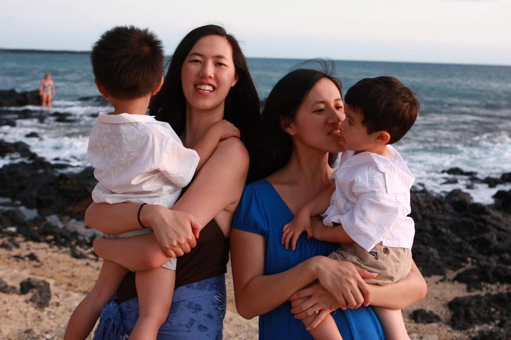
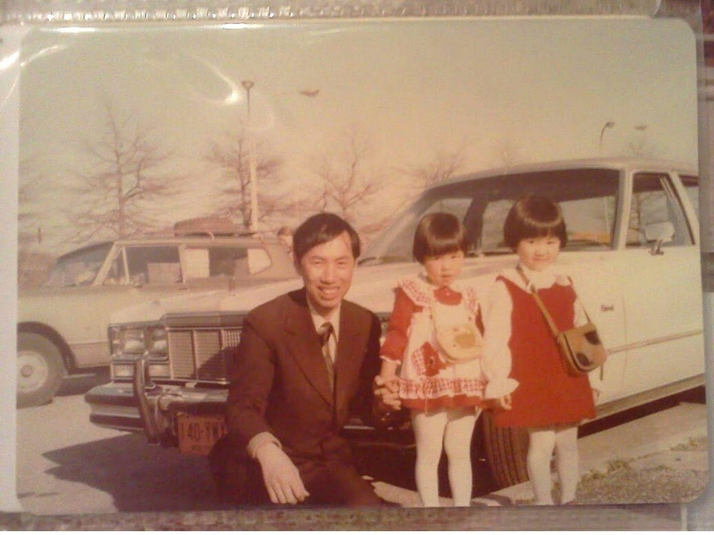
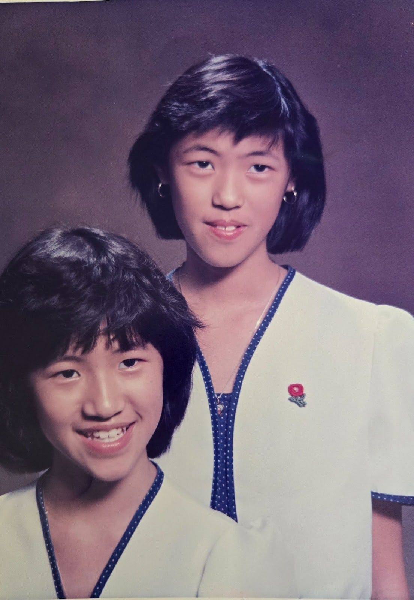
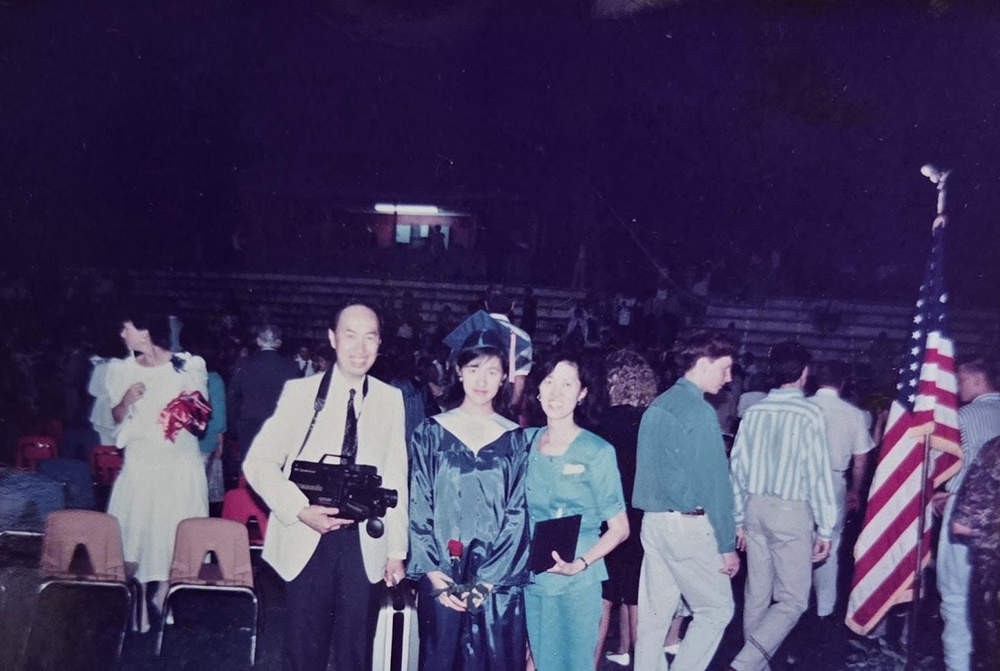
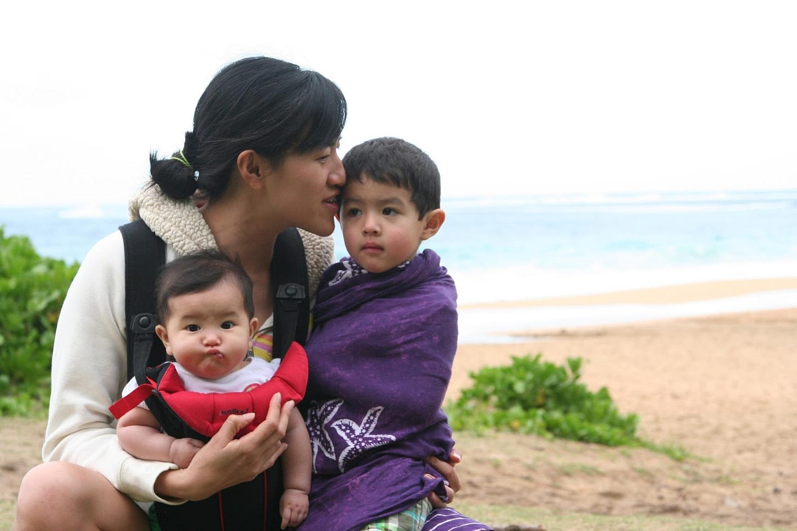
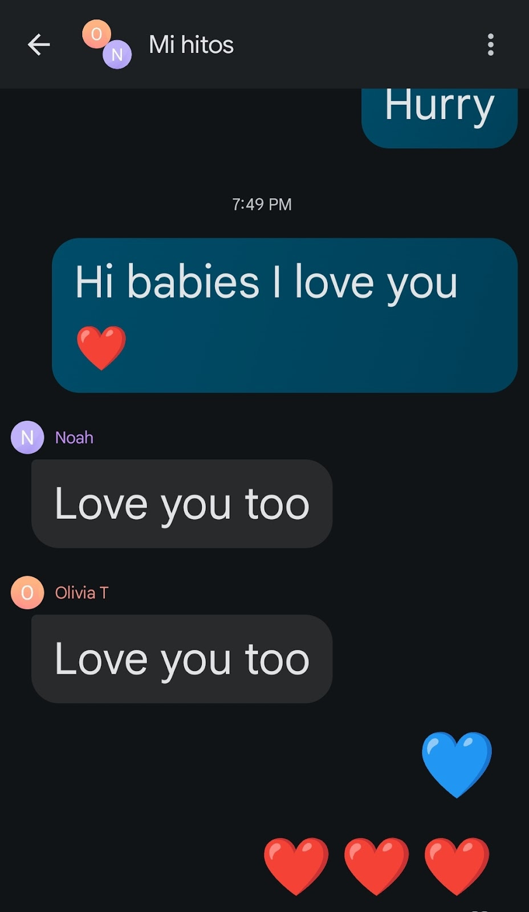

# Success, Rewritten: My Life Behind the Spotlight

*Stepping out of the background to share a few things I’ve learned along the way*

**Hi everyone, I’m Caroline—Deb’s sister—and I’m filling in for her today with a slightly different post.**

Usually, I’m more of a behind-the-scenes presence, quietly cheering her on. But today, I’m stepping into the spotlight to share a few reflections of my own.

I want to talk about life’s trajectory—the winding paths we each take. My journey looks very different from Deb’s, and for a long time, I felt the need to explain or justify that contrast. I haven’t been a CEO, VP, or product manager. But over the years, I’ve come to understand something important: different doesn’t mean less meaningful.

The choices I’ve made, the priorities I’ve held, and the life I’ve built may not follow the same arc, but they matter just as deeply to me as hers do to her. We each define success, purpose, and fulfillment in our own ways. And in a world that often celebrates one kind of story, it’s worth pausing to honor the uniqueness of our own.

Am I a CEO? No. And that’s okay. I’m deeply proud of Deb—there’s no rivalry or resentment here. Just love, admiration, and a lot of cheering from the background.

[Subscribe now](https://debliu.substack.com/subscribe?)

### **Nature vs. Nurture?**

It’s the age-old question—did Deb and I take different paths because of nature or nurture?

We grew up with the same parents, in the same home, under the same roof. And yet, from the beginning, we were wired a bit differently. Deb was a bundle of drive and anxiety over every grade and detail. I was more laid-back. I cared about school and worked hard, but if I got a 95, I was happy. Deb always aimed for 100.

Did I also do the Pizza Hut Book It reading club? Absolutely. But while I was thrilled with my three personal pan pizzas each summer, Deb racked up 25. I remember thinking, ***When are we even going to have the chance to eat 25 pizzas?***

Being the oldest wasn’t always easy. I came into the world just 16 months before Deb. Because we were so close in age—and, thanks to our matching outfits and identical haircuts—everyone assumed we were twins. Deb caught up to me in height by the time I was four or five, and we were treated as equals from then on. In fact, people often assumed *she* was the older sister. Her confidence, drive, and maturity made that assumption feel natural.

Still, I like to joke that I helped her become bold. I had anxiety about talking on the phone or ordering at restaurants, so I recruited Deb to do it for me. Need to make an appointment or speak to a manager? Deb was on it. I like to think I gave her the early reps in speaking up.  
  
But after while I learned to be bold too; perhaps inspired by her. I’ll never forget when Deb was being bullied by someone in her Spanish class. She’d come home in tears, and eventually, I’d had enough. I was a senior then and she was a sophomore. I found the guy in the hallway, tapped him on the shoulder, and told him if he ever messed with my sister again, we’d settle it outside. He was easily twice my size—but the bullying stopped that day.

We were both high achievers, graduating at the top of our classes in South Carolina. At my graduation, I received some awards and scholarships. At Deb’s, it was dubbed the “Deb Awards Ceremony” because she swept practically every category. From there, our paths began to diverge.

[Share Perspectives](https://debliu.substack.com/?utm_source=substack&utm_medium=email&utm_content=share&action=share)

I chose Georgia Tech to study Chemical Engineering, and that decision helped me come into my own. It was where I figured out who I was and where I truly began to thrive. I still remember when Deb visited for her Presidential Scholarship interview at Georgia Tech. One of my friends who was one of the Presidential Scholars at GT mentioned this spectacular student and of course, she was talking about Deb. I remember asking my sister what she thought about GT she told me everyone seemed “so unhappy”; which most people would have probably been offended by. I gave it some thought and told she probably would be much happier at Duke. And with that she made her decision to go to Duke on scholarship.

## **So What Have I Learned?**

I have so many more stories I could share (and will when I guest post again!), but today I want to leave you with three reflections that have helped me stay true to my own path. I will be back soon with more

### 1. Embrace Your Starting Point

Your journey doesn’t have to begin with a grand vision, a five-year plan, or a 30-60-90 framework. It begins right where you are—shaped by your experiences, values, and interests.

I stopped measuring my path against someone else’s back in high school. Your story is valid, even if it looks nothing like those around you. Want to be a founder or CEO? That’s amazing. But your life can be equally valuable and meaningful even if it follows a different blueprint.

### 2. Let Go of the “Shoulds”

There’s so much pressure to chase titles, climb ladders, and check the boxes. But when I let go of the “shoulds”—what success was *supposed* to look like—I found freedom.

I worked in the chemical industry for years before pivoting to help start our family business (I think they call that a “founder” now). It was one Deb and I started. Our husbands also joined. As Deb and her husband saw their careers grow, my husband and I left our corporate roles to run the company. We grew it into a seven-figure wholesale company with no funding and no outside support.

But my greatest accomplishment? My family.

I was there from the moment my son and daughter were born - I had left the corporate world by then. We had just the occasional help from grandparents who all lived hundreds of miles away and daycare; but I was the room mom, the relay race mom, the popcorn mom, the theater mom—all while running a business. My husband left the corporate world a couple of years after I did. Today, my kids are incredibly close to me. I (lovingly) spam-text them every day, and they still talk to me (even at the ages of 15 and 18). That closeness is one of the greatest joys of my life.

### 3. Own What Makes You You

You don’t need to be the loudest voice in the room or stand in the spotlight to make a difference.

For a long time, I believed that working behind the scenes meant I wasn’t doing enough. But over the years, I’ve come to appreciate the quiet power of consistency, encouragement, and building a life anchored in what truly matters to me.

When Deb gets stuck, I help her get unstuck. I’m the one who makes things happen—for her and for others. I show up when it counts. And I’ve learned that thriving behind the scenes isn’t just okay—it’s where I shine.

I don’t chase the spotlight or crave recognition. My joy comes from knowing things are running smoothly because I was there. I don’t need public praise. Honestly? Don’t even bother checking my LinkedIn—it hasn’t been updated in five years (no time, no interest).

This is me. And I’ve come to own it. Getting things done—quietly, consistently, and effectively—is my love language.

[Leave a comment](https://debliu.substack.com/p/success-rewritten-my-life-behind/comments)

---

Over the coming months, I’ll be sharing a little more from behind the scenes here on Deb’s blog, plus glimpses into what I’m working on and a few life lessons I’ve picked up along the way.

You won’t find a list of titles next to my name or a meticulously curated profile. But if you look closely, you’ll see a life built with intention—one shaped by love, grit, and the quiet satisfaction of knowing I’ve shown up for the people and projects that matter most.

[Share Perspectives](https://debliu.substack.com/?utm_source=substack&utm_medium=email&utm_content=share&action=share)

**Have a question for me? Leave me (Caroline) a comment.**