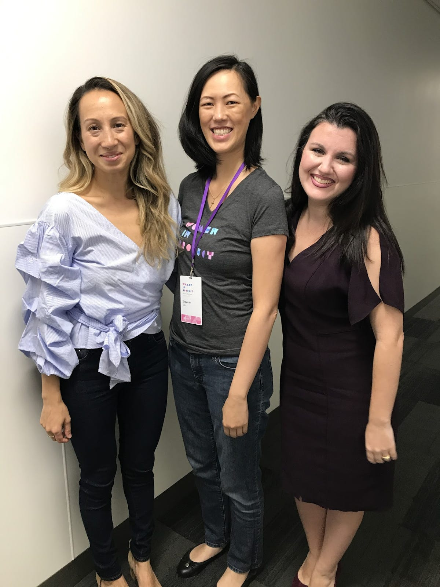

# The Path to CEO: An Interview with Fidji Simo, New CEO of Instacart

*A journey from a small town to the top job *

Naomi Gleit, Deb Liu, and Fidji Simo at the Women in Product Conference

Today, Fidji Simo starts her new job as the CEO of Instacart.

I have had the honor and pleasure of knowing Fidji since our days working in corporate strategy when she was at eBay and I was at PayPal. Our paths crossed again at Facebook many years later, where we both entered as Product Marketers, and later became Product Managers together. We have been colleagues, friends, and allies during all that time, and it is such a pleasure to see her succeed. During her decade-long tenure at Facebook, she built many well-loved products, including Live, Watch, Feed Ads, and News, before taking over leadership of the Facebook app. During that time, after seeing the dismal number of women PMs in the industry, we co-founded Women in Product together. Women in Product is now an organization of over 20,000 women strong, with a presence in two dozen cities.

As Fidji starts her new role today, I wanted her to share the story of her journey.

**Deb: I remember many years ago how I was frustrated about my career path. I came into your office and you told me, "Deb, we both know you will be a CEO someday.”**

**I laughed and replied, "I could never even imagine myself becoming a CEO. I’ve never really thought about it.”**

**You insisted, "You will definitely be a CEO someday, and I definitely plan on being a CEO as well. Maybe I'll be CEO of Instagram.” And here we are, only you got the latter half of the name wrong. Turns out you meant Insta*****cart*****.**

**Tell me the path from here to there.**

> Fidji: I was the first in my family to graduate high school, and despite our limited means, my parents instilled a deep belief in me that I could be anything I wanted when I grew up, as long as I worked hard and pursued my passions with a sense of wonder and eagerness to learn. My grandfather went from being a crew member to fulfilling his dream of being captain and owning his large fishing boat, and that always inspired me. So I’ve always set ambitious goals for myself — professionally and personally — and always subscribed to the philosophy that the only limits to my success are the ones I set myself.
>
> Fast forward many years later and here we are. I wasn’t really considering leaving Facebook, but after a decade there, I was ready to tackle a new challenge and see if I could take my years of experience and contribute to the broader tech industry. That’s why I joined Instacart’s Board earlier this year.
>
> I quickly fell in love with Instacart’s mission and the essential role it plays in bringing food to millions of families. This was a serendipitous opportunity to join and lead a company that I believe has the potential to be as transformational as Facebook has been.

**Deb: You have had such an incredible rise in Silicon Valley, from your days at eBay to running the biggest app in the world. What do you attribute your success to?**

> Fidji: I mentioned earlier how my family values are grounded in tremendous worth ethic; I grew up watching my fisherman dad wake up at 2 AM every day to go do one of the most dangerous jobs in the world. So I do think that giving my all to any new responsibility I took on at work, with passion and dedication, helped a lot. We have that in common, Deb. We’ve had way too many work conversations on late evenings over the years!
>
> I also think that I owe a big part of my success to my teams and the people around me who supported me. I have always thought of my success as an opportunity to lift up everyone around me, and with this approach I ended up getting so much support from incredible people who gave me opportunities or caught me when I failed.
>
> Finally, I’ve spent most of my career working in complex marketplaces with missions that I feel deeply aligned with — first eBay, then Facebook, and now Instacart — connecting people to the things they need, the people they love, and putting food on their tables. I do think that working on something you’re passionate about makes your enthusiasm contagious, which helps create great teams and great products.

**Deb: You have always been 100 percent yourself, no matter what people said or thought. I always admired that most about you: that you could live your truth and be yourself no matter what. I always felt so constrained by the rules, and you always encouraged me to think bigger, be more, and believe that more was possible. What gave you that confidence?**

> Fidji: Early on in my career, I spent a lot of time listening to other people’s perspectives on what would be best for my future. The classes I should take to change my French accent, the shoes I should wear (sneakers instead of high heels!), you name it. For a while, I tried it. I worked on my accent, dressed down a bit, wore less makeup. People hardly recognized me and I didn’t feel like myself. I quickly realized that the only way I was going to succeed was by being myself — accent and all.
>
> It’s something I think a lot about in how I build and lead my teams. Organizations are always the most successful when the people in them can be themselves, can shine their own magic as brightly as possible, and feel safe and confident enough to think bigger and build for the future. Diversity of background, thinking, culture, and points of view is so important when you’re building products for a global audience. It’s important for teams to be collections of unique individuals who shine in their own ways, and for leaders to help them shine even more — not diminish their light.

**Deb: You are open about the challenges you have faced, particularly with your health: from being on bed rest for months when pregnant with your little girl, Willow, to endometriosis, to POTS. You shared authentically and candidly about them, yet never let them slow you down. How have you been able to grow your career while facing these challenges?**

> Fidji: Health has long been a taboo topic in the workplace, and even more so for women. I realized early on that while it was a risk to be vocal about these challenges, I had also reached a position where I had a responsibility to talk about this. I needed to show that one can still lead, despite having health challenges, and still be effective and inspiring.
>
> I was initially very lonely when faced with these challenges. I had a miscarriage at work at a time when talking about it was completely taboo. I was on bed rest for five months due to complications during my pregnancy and was dialing in to meetings from my bed much before it became acceptable to work from home. With POTS, I often have to take meetings while reclining. By being open about these experiences, I have had hundreds of people reach out to me to say that they never thought they could reach a leadership position with their own health challenges, and that I was changing this perception for them.
>
> Everyone is going through challenges. What I have found is that being open about them fosters a sense of trust and community in the workplace that allows us all to work even better together. Being vulnerable is so often more powerful than we think. The dialogue and connections it opens up on teams can be transformational. I know it was for me.
>
> In general, advocating for women’s health — and the ability to be more open about it in the workplace — has become a personal cause and passion for me and something I look forward to continuing to champion.

**Deb: As you start this next career adventure, what is your hope for your next chapter? Where do you want to take Instacart from here?**

> Fidji: I was an Instacart customer long before I joined the Board and eventually decided to join as CEO. The role Instacart has played for my family — especially over the last 18 months as we’ve navigated the pandemic — has been life saving.
>
> As I think about what’s next, I believe that the way people think about food is going to fundamentally change over the course of the next decade. As part of that evolution, I truly believe that Instacart has an opportunity to help invent the future of food, alongside our retail partners.
>
> As with all aspects of our lives, people are increasingly looking for convenience, personalization, and inspiration, and Instacart can deliver on all of that as part of something everyone does every week: grocery shopping. We get to reimagine how people discover new food brands, recipes, retailers, and so much more.
>
> The opportunity goes beyond that as well. Instacart can become an even better ally to grocers as we help them adopt technologies that help move their businesses online. We can also help CPG brands of all sizes get discovered by new consumers. We can create more earnings opportunities for the hundreds of thousands of Instacart shoppers who are making the company's mission a reality every day.

**Deb: If you had to give one piece of advice to your younger self who just started her career, what would it be?**

> Fidji: Surround yourself with people who see the magic in you and make it shine brighter. And do the same for others.

I would not be where I am today without Fidji’s encouragement and support, and there are so many others she has touched in the same way. Her optimism and encouragement have amplified the power of women all over our industry.  Fidji has left her mark on Facebook and its more than two billion users, and now she goes on to leave an even greater mark as CEO of Instacart. I wish her all the best on her next career adventure.