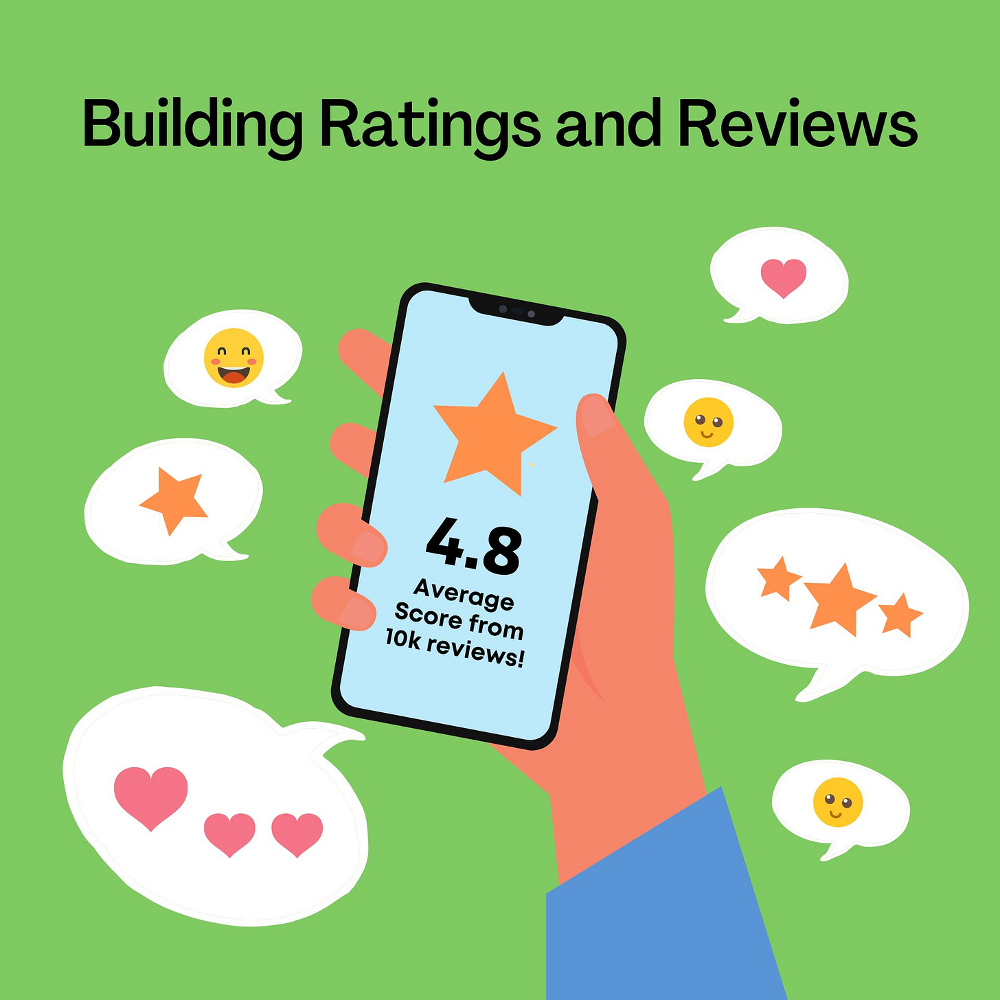
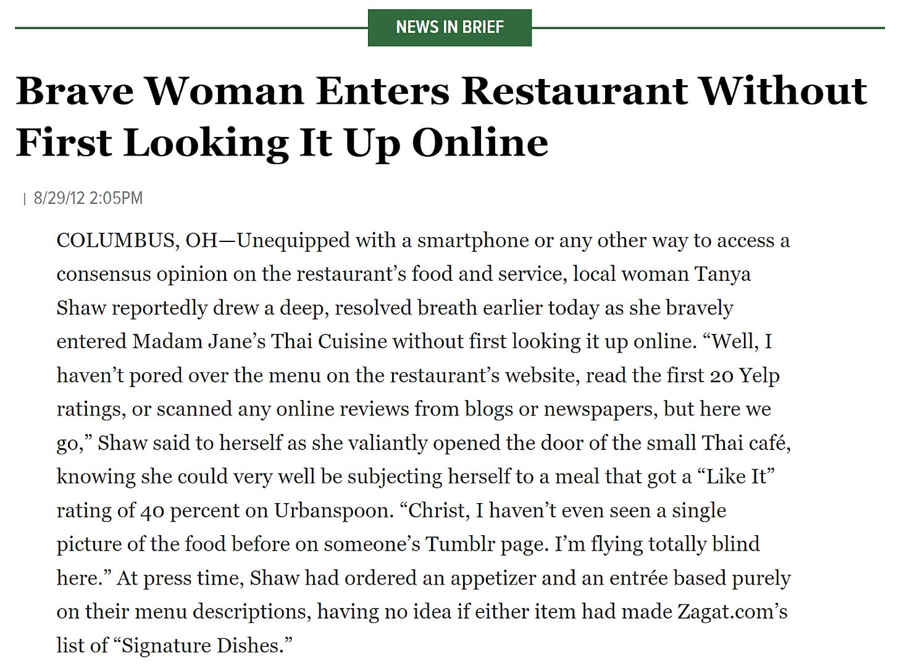
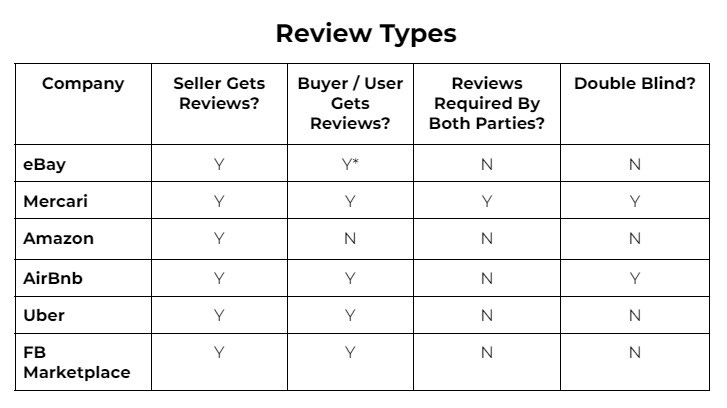
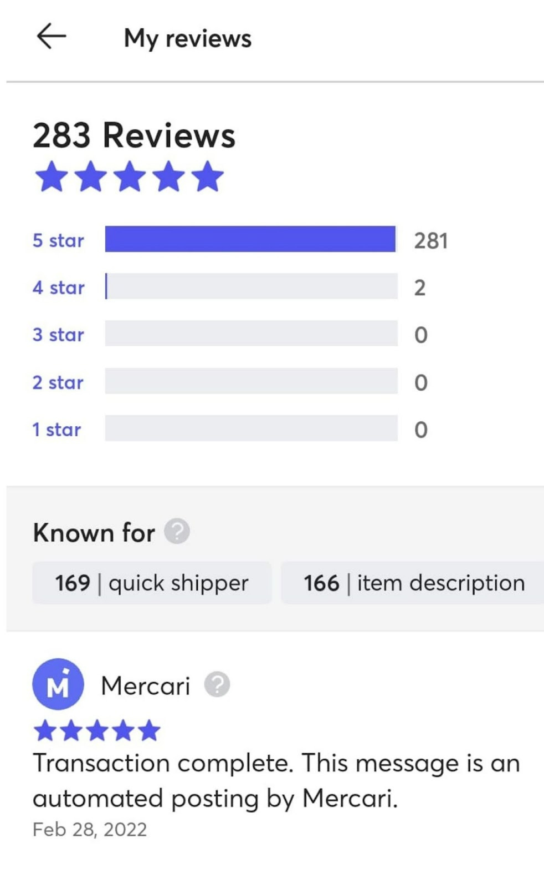
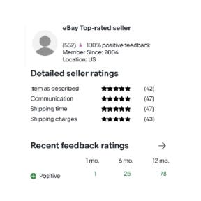
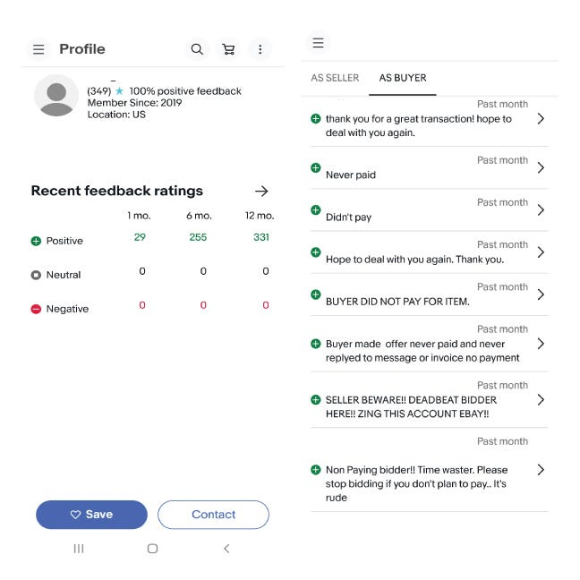
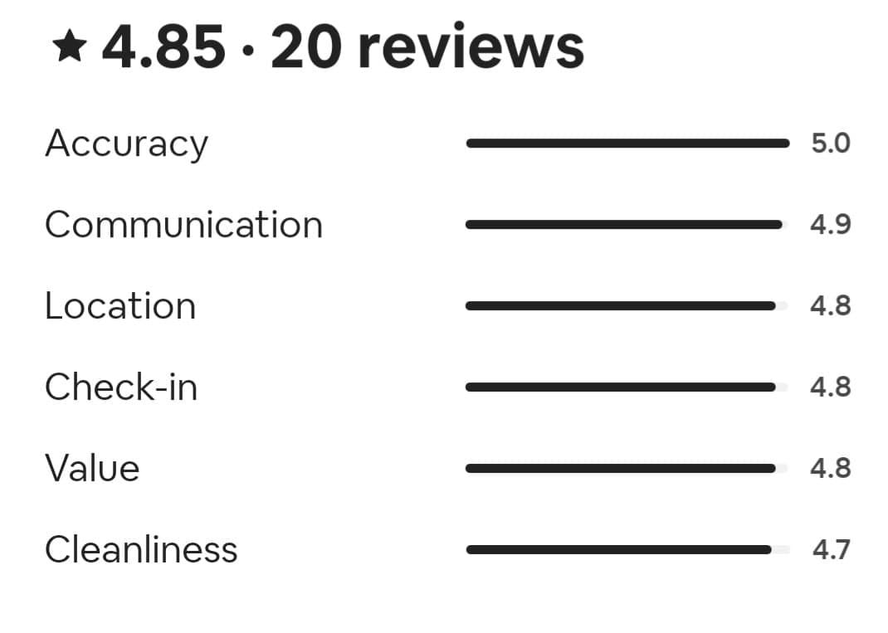

# How Ratings and Reviews Can Help or Hurt Your Product 

*Understanding this powerful tool for your product and customers *

How often do you order a product, go to a restaurant, or book a hotel before you read a single rating or review? Would you book an Airbnb, ride in an Uber, or hire a freelancer if there were no ratings or feedback? What if they had only 3.5 out of 5 stars? Would that affect your decision?

Ratings and reviews are an integral part of our everyday lives, so much that they often go unnoticed. These signals of virtue, quality, and trust are built into our online world, but rarely do we think about how they work and what they mean. In reality, the design of these feedback systems actually affect the feedback we see. There are many lessons to be learned from what works in these systems, their inherent flaws, and, ultimately, changes that companies have made to improve them. By examining how ratings function, and how they impact business, we can design better review systems and improve on existing ones.

<https://www.theonion.com/brave-woman-enters-restaurant-without-first-looking-it-1819573824> (Remember, this is *The Onion!*)

Reviews are now such an integral part of the shopping experience that they greatly affect consumer behavior. [Business Insider reported in 2017](https://www.businessinsider.com/amazon-reviews-greatly-impact-online-shopping-sales-2017-3), “A product that has just one review is 65% more likely to be purchased than a product that has none, according to Power Reviews CEO Matt Moog. He added that one-third of online shoppers refuse to purchase products that have not received positive feedback from customers.”

Because reviews have become so important in driving business, they are now regularly gamed. Reports of buying positive reviews for your product or negative reviews for your competitor’s product run rampant. I once bought a digital pen for my daughter on Amazon, and the tip broke off after just a few uses in such a way that the item was useless. I couldn’t get a hold of someone to get it fixed, so I wrote a negative review. Immediately, I received a message offering me a new pen if I would remove my review or change it to a positive one. I have to admit, I was torn. The design of the first pen was flawed, but was changing my review really the only way to get a refund? Fortunately, the pen was redesigned, and the issue was fixed, but the problem remains: ratings can be manipulated in various ways, and the result is an erosion of customer trust.

## **Types of Ratings and Reviews**

There are multiple types of reviews, and they all solve different issues. These include:

* **Expert Ratings:** Wirecutter, Consumer Reports, *NY Times* food critics, Rotten Tomatoes
* **User Experience Reviews:** Travelocity, AllRecipes, Yelp, user reviews on Rotten Tomatoes
* **User Product Reviews:** Amazon
* **P2P Platform Reviews:** Uber/Lyft, eBay, Upwork, TaskRabbit
* **Seller/Buyer Reviews:** eBay, Amazon Marketplace, Facebook Marketplace
* **Content quality:** YouTube Like/Dislike, TikTok Hearts, Instagram Likes

Once upon a time, we relied on reviews from experts, like food or movie critics. Then, with the dawn of the internet, users started to make their voices heard. This emergent behavior made it possible for strangers to interact online with a modicum of trust. Rather than spend hours cooking an elaborate recipe only to watch it fail, you can now read about the experiences of others and avoid making the same mistakes. Some would say this is the loss of expertise, but it also provides useful information. While I still have a copy of *The Joy of Cooking*, I gravitate toward online recipes precisely because the reviews can give me details and pitfalls no one would include in a cookbook.

## **Mistakes To Learn From**

One of eBay’s earliest innovations was the way they set up ratings and reviews. You could leave positive, neutral, or negative feedback for both sellers and buyers. Keeping your positive feedback high was incredibly important. Early on, there was limited difference between the seller and buyer feedback. That meant that a bad seller could buy a lot of small items to build up a good reputation and then “go bad” by selling a laptop and shipping a brick. eBay separated buyer and seller feedback to help address this. So sellers then started selling a lot of small items to build up a number of positives before turning into a bad seller.

For buyers, something called retaliatory negative feedback came into play. Because it was so damaging to receive negative feedback as a buyer, sellers would use the threat of bad feedback to ensure buyers left them positive reviews. A study showed that many buyers who left negative feedback for a seller never returned to the site. Think about that: they were willing to burn their account to give sellers negative feedback and then not use the site again or start over with a new account. This created a ton of buyer churn after they were treated poorly by bad sellers. Most sellers are good, but bad sellers were gaming the system to hurt both the good buyers and the good sellers.

At the same time, positive, neutral, and negative feedback was difficult to parse. There could have been many reasons for bad feedback, such as pricing or poor condition, so one thing that eBay did was categorize the different feedback. That still didn’t address the issue, because most buyers had learned to just click five stars for everything.

The secret eBay employees of that era knew was that they should never buy items from sellers with less than 4.8 stars. On most platforms, that would be a very high rating, but the etiquette on eBay was different. As a result, almost all sellers looked amazing to the inexperienced buyer.

Perspectives is a reader-supported publication. To receive new posts and support my work, consider becoming a free or paid subscriber.

We learned an entirely different lesson on Facebook Marketplace. What we found was that a lot of the feedback, especially for shipped items, did not distinguish between the item and the seller. Thus you could have a great seller with a poorly-performing item, or a great item with a terrible customer service experience. Initially, we wanted to keep it simple and not categorize too much, but that made it hard to tell what a piece of feedback was for.

A Groupon PM once shared with me that having item ratings and reviews for their e-commerce products initially lowered sales, because there were some items that were performing poorly. Over time, however, having ratings increased sales, because better items rose to the top, and they would sell more of those, resulting in more happy buyers. This is an example of how short-term and long-term incentives are very different for teams in building ratings and reviews.

Recently, Amazon launched the ability to just give a star rating without having to write a review as well. This increased the volume of ratings significantly, which increased the confidence of buyers that other people had good experiences with the products. I suspect that, in general, those willing to go back to an item and write a review are often the less satisfied folks. In theory, this should increase the net rating on the platform overall, which should give buyers more confidence.

As you can see, different review systems create different pitfalls. This is why it’s so important to look at how reviews affect the user experience in the context of the platform they use—and to learn from the mistakes of other platforms.

## **Building a Great Two-Way Feedback System**

To build a great feedback system, it is important to know what you are optimizing for. Some examples of this include:

* Reinforcing prosocial behavior in buyers and sellers (e.g. Uber, Lyft)
* Discernment between choices of varying quality (e.g. Yelp, Airbnb)
* Improving overall service (e.g. Uber, Lyft)
* Increasing trust in the counterparty (e.g. TaskRabbit)
* Increasing overall trust in the platform (e.g. eBay)

These goals can work against each other, and any system you set up can—and will—be gamed. You need to know how to get the outcomes you want without paying the heavy price eBay eventually paid.

If you want to build a great rating system, you have to start by looking at what you want the ratings to accomplish. For example, on Lyft and Uber, you can’t choose between different drivers and riders who have different ratings. Thus, the ratings are merely to encourage good behavior and improve the overall service while removing low performers in the ecosystem. On platforms where buyers choose both the service provider and the item, ratings are there to raise the bar on quality. The ratings serve different purposes, although they may look similar on the surface.

## **Ensure Your Rating System Addresses Your Issue**

On [TaskRabbit](https://support.taskrabbit.com/hc/en-ca/articles/213301766-How-Do-I-Leave-a-Review-), you're choosing a service provider based on quality, as well as their suitability for that specific task. Someone who is amazing at running errands may be terrible at home organization, and vice versa. It’s important to look at overall ratings vs ratings that are related only to the specific task. This creates additional cognitive load, which is worth it if you are letting a stranger into your house and want to know they are trustworthy and capable.

Upwork took an interesting approach by implementing both public and private feedback. Upwork freelancers often have access to the details of your company or project. Some have credentials to your site, or know your final clients, so posting negative public feedback for them is not in your best interest as a client. To address this, Upwork allows you to give both public and private feedback. This lets you post one thing, which other users see, with the option of giving private feedback that downranks the service provider if you didn’t have a positive experience. As a result, many freelancers with glowing reviews may actually have low scores in the background, affecting their overall rating. This is a fascinating model that allows users to conform to social pressure while also providing an escape hatch to get to the truth.

[Upwork](https://support.upwork.com/hc/en-us/articles/211068438-Give-Feedback#:~:text=The%20feedback%20period%20is%2014,14%2Dday%20period%20has%20expired) and [Airbnb](https://www.ensourced.com/reviews-blues-the-pressure-to-be-perfect/?sfw=pass1661264192) both use double-blind systems. This means both parties can add feedback, and they cannot see each other's feedback until both have given it. If only one party leaves feedback, that single review is posted after a fixed window of time. This system keeps counterparties honest and reduces the issue of retaliatory negative feedback as described above.

## **A Guide to Rating Systems**

Each platform uses rating systems in a different way to drive a different result or solution. Let’s examine a couple of the ones I list above and look at the pros and cons of each:

### **MERCARI:**

Mercari is a marketplace mostly for individual sellers. Mercari does not pay out to sellers until the item reaches the buyer and the buyer has had a chance to review it and submit feedback. All transactions that are completed will have feedback given to both the buyer and seller.

**Here is how the Mercari flow works:**

1. Buyer purchases an item.
2. Seller ships the item within three days.
3. Buyer receives the item.
4. Buyer has three days to review the purchase and complete the transaction by leaving feedback.
5. The seller can receive funds after they review the buyer.
6. The feedback between the buyer and seller is hidden until feedback is left for both parties.
7. If no feedback is given, Mercari auto-rates in three days, completing the transaction and allowing the seller to get paid.

Here is an example of a Mercari seller’s feedback:

**Pros:** Every single transaction for the buyer and seller has feedback. Since neither party can see what feedback they received until they have both left reviews, there is a lower risk of retaliatory feedback. If a transaction is not rated within 3 days of the buyer receiving it, Mercari automatically rates it 5 stars for the buyer. Similarly if a seller does not rate a buyer within 3 days of a buyer rating a seller, Mercari will automatically give the buyer 5 stars.

**Cons:** As a buyer, you have to be ready to review and complete your transaction within three days of receiving the item. As a seller, you have to be ok with not receiving your payment until up to three days after the buyer receives the item (which, depending on the services, can be up to a month after you ship).

## **eBay:**

eBay is home to both company stores and smaller sellers. Feedback is optional for both the buyer and seller. All buyers receive five stars for their buying transactions. It is not possible to leave negative feedback for a buyer—the only option that sellers have is to leave a comment about the transaction.

**Here is the flow for eBay:**

1. Buyer purchases item.
2. Seller is paid for the item.
3. Seller ships the item.
4. Buyer receives the item.
5. Option for buyer to leave feedback and seller to comment on the experience.
6. Depending on the seller, returns can be made within 30 days for a refund.

On eBay, there is both an external and internal system for judging a seller. Here is an example seller: they have one review in the last month, yet they completed 10 transactions. That means about 10 percent of the buyers are leaving feedback.

As a seller, there is an internal top-rated status you can achieve, which is based on a number of parameters a buyer does not see. These include being active for a certain amount of time, reaching a threshold number of transactions and dollars exchanged within 12 months, falling below a specific defect and late shipment rate, and the amount of tracking that is validated for a set percentage of your transactions. While a buyer cannot see all this internal data, it affects incentives for the seller, as well as other opportunities when listing.

eBay did away with leaving negative reviews for buyers in 2008. Here is an example of a buyer who has 100 percent feedback, yet has failed to complete a transaction, as noted in the comment section.

In solving the buyer churn issue by eliminating negative feedback from sellers to buyers, a different issue was created: a seller now has to report buyers who do not complete transactions. The buyer then gets an unpaid item strike. As a seller, you can block those with more than two strikes in a year from buying from you.

**Pros:** Seller gets paid before the buyer receives the item. Buyers are not driven away by sellers who are holding feedback over their heads, which reduces churn.

**Cons:** Not every transaction is documented publicly, since not all sellers and buyers leave feedback. Buyers have been able to win auctions and make offers without actually completing the transaction, and this isn’t well documented in their feedback.

### **Airbnb:**

Airbnb is one of the largest online marketplaces for homestays. It doesn’t own any of the homes, but like eBay and Mercari, it takes a percentage of the transactions made on the platform. Feedback is optional for hosts and guests, and there is a window of about 14 days from when a stay is completed to when feedback and ratings can be left.

**Here is the flow for Airbnb:**

1. Guest requests to book a stay.
2. Host accepts the request.
3. Guest completes their stay and checks out.
4. Option to leave feedback for both host and guest.

For Airbnb, there is a system rating for guests that they cannot see on their profile. Hosts can leave reviews for guests, but the reviews that are displayed are only commentary—the star rating is not shown. Other hosts, however, can see the star ratings for guests they may be about to book with.

As a guest, you can see a breakdown of the reviews for a host, but there isn’t really a frame of reference for how the star ratings work. Is this for the entire lifetime of the listing? Is there a rolling average? What happens if an old issue is addressed, or a new one has recently appeared?

It is up to the guest to look back at all the reviews, as well as the timing of when they were posted, to get a sense of whether to book the stay.

**Pros:** Feedback isn’t dependent for the host to receive their payment. In fact a host gets their payout within 24 hours of a guest checking in. If there are issues there is another flow for the funds to be returned to the guests.

**Cons:** Not every transaction is documented publicly for a stay. You as a guest cannot see where star deficits come from and how long ago that it was.

---

As you can see, no rating system is without its flaws, and different flows create different problems.

As you are working on products that utilize reviews, consider what it is you are trying to accomplish with your ratings. Is it an awareness of the item? Do you want to help steer behaviors and elevate those who provide a high level of service to your customers? What do your external reviews show compared to your internal reviews? How do you drive consumer behavior with your reviews? Weigh options like one-way versus two-way ratings, double-blind reviews, and written feedback versus star ratings. Remember, the goal is to understand the purpose of your feedback system and align it with your business goals.

By taking the pros and cons of these features into account, you can make a more informed decision on how to best implement a useful, trustworthy rating system.

[Share](https://debliu.substack.com/p/how-ratings-and-reviews-can-help?utm_source=substack&utm_medium=email&utm_content=share&action=share)

[Leave a comment](https://debliu.substack.com/p/how-ratings-and-reviews-can-help/comments)