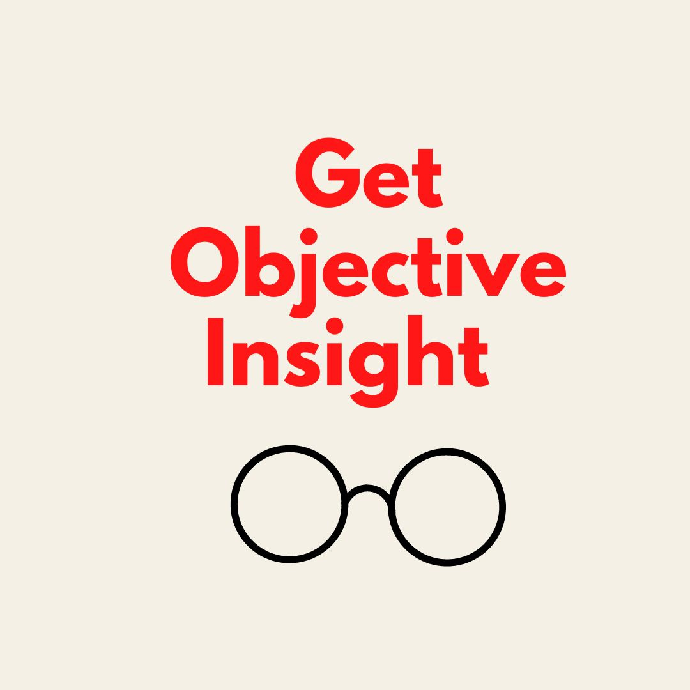
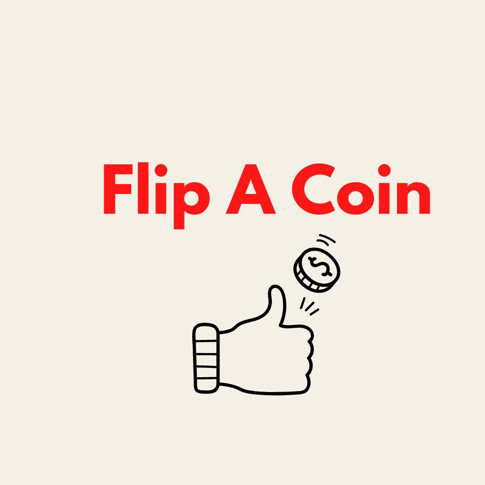
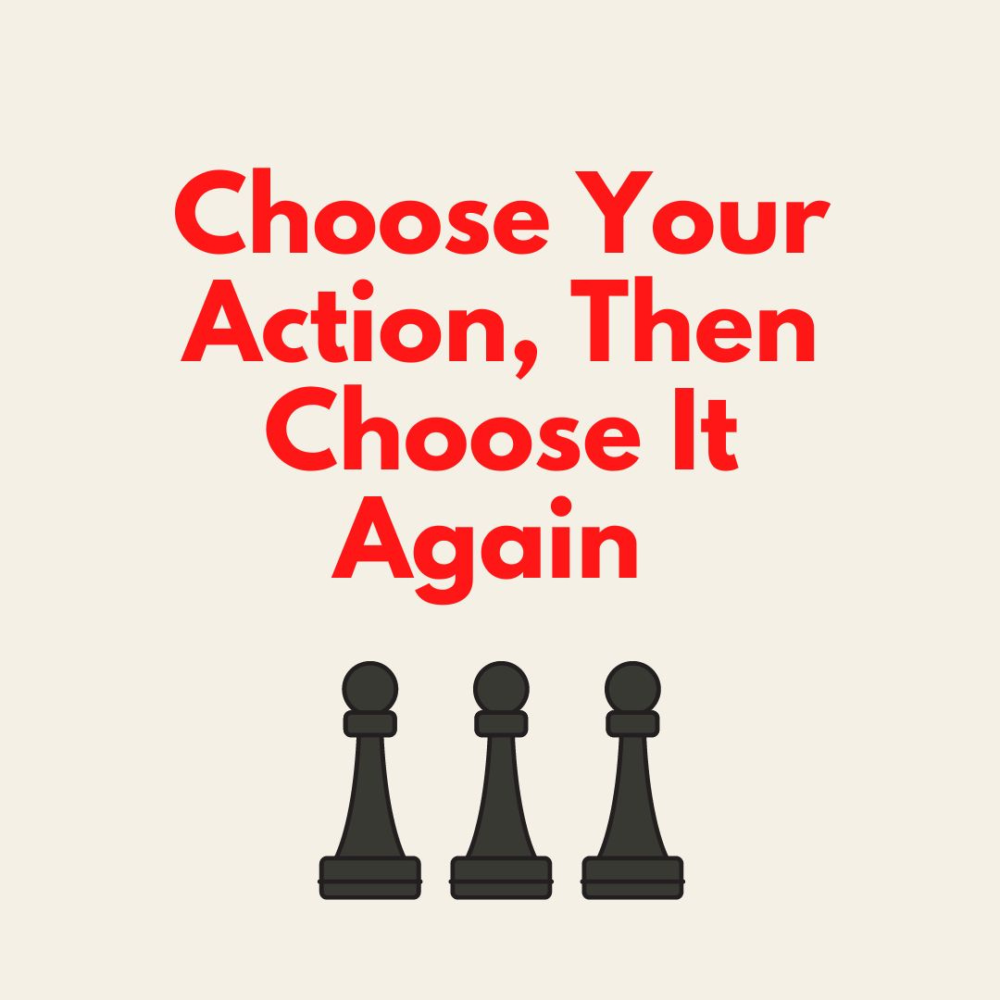

# Removing Blind Spots in Your Decision-Making

*Seeing the world clearly when you're making an important choice*

Photo by [Maarten van den Heuvel](https://unsplash.com/@mvdheuvel?utm_source=unsplash&utm_medium=referral&utm_content=creditCopyText) on [Unsplash](https://unsplash.com/s/photos/rear-view-mirror?utm_source=unsplash&utm_medium=referral&utm_content=creditCopyText)

Someone once reached out and asked me for advice on what she should do next in her role. We had never met, but I wanted to help. When we got on the phone, she explained that she had a senior position at a startup, but that she was being undervalued and underpaid. I listened as she shared how someone else on the team, who had been hired much later, was offered multiples of the options she had received. I was a bit surprised, since they were technically peers, and she had joined at a riskier phase of the company. She started rushing to explain all the possible reasons for the difference.

Finally, I stopped her and said, “We have never met. I don’t know anything about your company or the circumstances of how you were hired. I have no attachment to the people or product. But I just listened to you spend 20 minutes trying to justify them paying someone else three times what they are paying you.” I am usually not that blunt in my assessments, but it killed me to know she was being treated unfairly and defending it, rather than seeking to remedy it.

When you hit a fork in the road, it can be hard to see things objectively. You get attached to your company, team, or product, and your decision-making suffers. The more time you spend agonizing over it, the worse it gets. However, by employing a few simple strategies, you can interrupt that cycle and make the best choice for yourself.

## **Get objective insight**

We are bad at seeing our own blind spots, and we have a difficult time looking at ourselves neutrally. This becomes a problem when we have to make an important or hard decision. When we can't see the flaws in our own judgment, we need to get an outside perspective. Start by finding somebody you trust, who has a good sense of who you are, and get their candid advice.

I usually haven't met the people I coach before I speak to them. But in 15 to 30 minutes, I can get a sense of their challenges, questions, and concerns. My job is partly to reflect what they're telling me back to them. I have coached people who were struggling to decide which job to take, but as I summarized what they were telling me, it was pretty clear what their hearts were telling them. In the end, many of them have even tried to sell me on the job they wanted deep down, even though they weren't sure when they came in.

An outside advisor can hold up a mirror to what you are saying. They are not bound up in their own feelings, concerns, questions, or sunk cost fallacies. That objectivity is very freeing. When I coach people, I have an easy time assessing the situation, because I have no emotional tie to it. But when it comes to something that I'm deciding for *myself*, I lose all my ability to be objective. That is why a third party, like a coach, a mentor, or even a stranger, can be so valuable. They don't feel the weight of the loss aversion or the expense of the sunk cost. All they see are the paths ahead, whether you stay on your current road or take another fork.

Identify your blind spots by talking to somebody who has distance from you. Talk off the top of your mind, without a script. Share your feelings in real time. Then let them reflect what they're hearing back to you. You may find that the answer suddenly becomes clear.

## **Flip a coin**

Imagine you have two options in front of you. Perhaps you are weighing [whether you should stay where you are or move on](https://www.linkedin.com/pulse/dear-perspectives-should-i-stay-go-deborah-liu) from your current role. Maybe you're deciding between staying in your town or moving across the country, or whether you should continue your current relationship. This exercise works any time you're deciding between two choices.

Get a coin. Assign one of the options to heads and one for tails, then flip. Consider yourself committed to whatever fate decides. You can’t change it no matter what. This may seem to be a flippant way to decide something (pun intended!), but it is actually very revealing.

Once you see whether the coin lands on Option 1 or Option 2, take a step back and ask yourself, “How do I feel?”

* If you are relieved, then you know fate picked the right thing.
* If you desperately want to flip again to get the other outcome, then you have a new data point on what you really wanted to happen.

Whichever way the coin flipped, you now have more information, which you can use to make your decision with more perspective.

It can be easy to lose sight of your instincts when you're making a clinical choice. No pro vs con list can give you the gut feeling you get when fate has made your decision for you. It reveals a truth you might not have been able to see without backing yourself into a corner.

## **Choose your action, then turn around and choose again**

Amazon first popularized the concept of one-way and two-way doors. One-way doors are those which are fixed. Once you go through, you can’t go back, so you have to tread carefully.

Two-way doors swing both ways, so even if you enter, you can always return to where you were before. These are lower-risk decisions that you can back out of, if needed. They give you a chance at a do-over.

More things in life are two-way doors than we think. Sometimes we assume something is fixed, and that we can never pivot or change once we've started. But the reality is that many choices can be trial runs or short-term experiences that you can choose to leave or to make permanent.

For example, if you want to buy a car, consider renting one or borrowing one from a friend who has one. The other day, I spent many hours in my friend’s Tesla, and we talked through what she loved and didn’t love about it as she drove. It helped me understand a lot more about the pros and cons of owning this type of vehicle. Likewise, if you are thinking of moving somewhere, consider staying there for several weeks, or even months, before picking up your life to relocate. Someone also told me that before you marry someone, you should take an international trip with them to somewhere you don't speak the language. That will show you how your partner exists under stress and travel pressure.

Many more things are suited to a trial run than you think, but you have to be intentional about it. By testing a course of action before you commit, you are experiencing the outcome before you have to make a permanent move. (For more on this, check out my [article on painted doors](https://debliu.substack.com/p/how-painted-doors-can-be-a-powerful).)

---

Let's revisit the story of the PM who defended the company that was paying her peer three times what she was paid. I thought about her off and on in the months after we connected. Then, last week, she wrote to me, saying, “I ended up getting the CPO role [at my company] with additional equity, and also several other offers. I decided to take a senior role at [a larger company] instead and leave my current role. I received also many multiples the compensation at the new company. This helped me understand my own worth, and not shy away from embracing and advocating for it.”

I was incredibly proud of her for knowing her value and negotiating for what she was worth. She ended up in a much stronger position financially, and she was much happier at a company that valued her fairly relative to her colleagues.

Decision-making is hard because we are so close to the situation. We lack the ability to take a step back and see what is possible. That is why phoning a friend, flipping a coin, or just taking the plunge and giving it a try can be so powerful.

[Share](https://debliu.substack.com/p/removing-blind-spots-in-your-decision?utm_source=substack&utm_medium=email&utm_content=share&action=share)

Perspectives is a reader-supported publication. To receive new posts and support my work, consider becoming a free or paid subscriber.

---

Looking for more career advice? Here are some of my most popular shared posts:

**[Onboarding A New Role:](https://debliu.substack.com/p/a-guide-for-onboarding-into-a-new)** Written as I was starting my first days as CEO of Ancestry.

**[What Was The First Job You Ever Had?:](https://debliu.substack.com/p/what-was-the-first-job-you-ever-had)** Community advice on what others learned from their first job (including mine and includes regrettable 80s attire photo).

**[Growing Your Career A Little Bit Each Day:](https://debliu.substack.com/p/career-development-tips-for-growing)** You can invest in your career with small steps each day.

---

And finally, tomorrow is the big day! My book Take Back Your Power arrives. It has been a long 3 year journey and I am so excited it is finally here. Thank you all for all the encouraging emails and messages I have gotten!

[Buy My Book Here](https://amzn.to/3FmjU0v)

