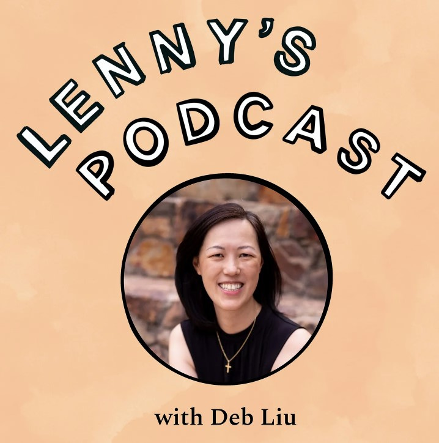
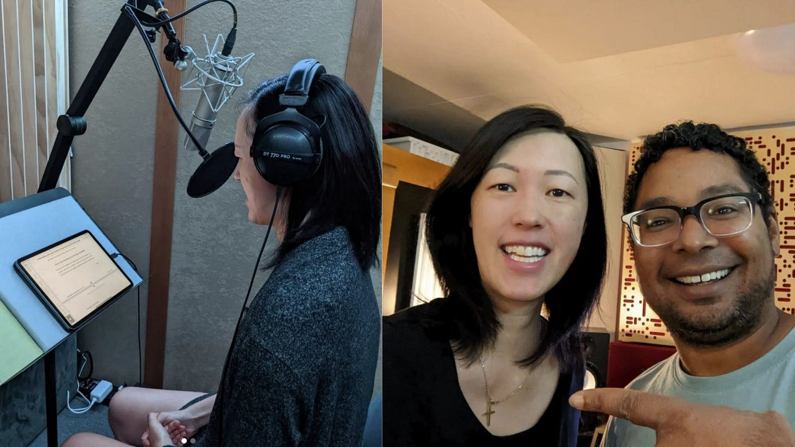

# What I Have Been Up To This Week

*Read, watch or listen to what I have been doing*

Today’s post will be a short one as I have been traveling all week. Here are some of the things which I have been working on which you can read, watch or listen too.

## 1. Lenny’s Newsletter Podcast

I love reading Lenny’s Newsletters because of his insight and community for the Tech world. He recently started a podcast and I was happy to speak to him on a number of subject matters from my early days at eBay/PayPal to when I built Facebook Marketplace and my transition to CEO of Ancestry.com. We also talked a bit about my book. If you have an hour, feel free to give it a listen.

[Lenny's Podcast with Me](https://www.lennysnewsletter.com/p/how-to-own-your-career-growth-and#details)

---

## 2. Interview on CBS Mornings

Earlier this week I got to speak on CBS Mornings (and meet the hosts) about my book. It was early for me as a West Coast person but perfect timing since I was in NYC for meetings. If you want to see the segment, click the button for the CBS Mornings YouTube channel.

[CBS Mornings Interview](https://www.youtube.com/watch?v=3HpxtpEZcY4)

---

## 3. Behind The Scenes On My Audiobook

My first book release next week will also be in conjunction with my audiobook! Do you know that audiobooks have been around since the 1930s? Recording the audiobook was a process and I talk more about it on LinkedIn

[LinkedIn Audio Book Post](https://www.linkedin.com/feed/update/urn:li:activity:6961375028680564737/)

---

Thank you for being on this journey with me. I get back to regularly scheduled postings next week!

[Share Perspectives](https://debliu.substack.com/?utm_source=substack&utm_medium=email&utm_content=share&action=share)

[Leave a comment](https://debliu.substack.com/p/what-i-have-been-up-to-this-week/comments)

Perspectives is a reader-supported publication. To receive new posts and support my work, consider becoming a free or paid subscriber.