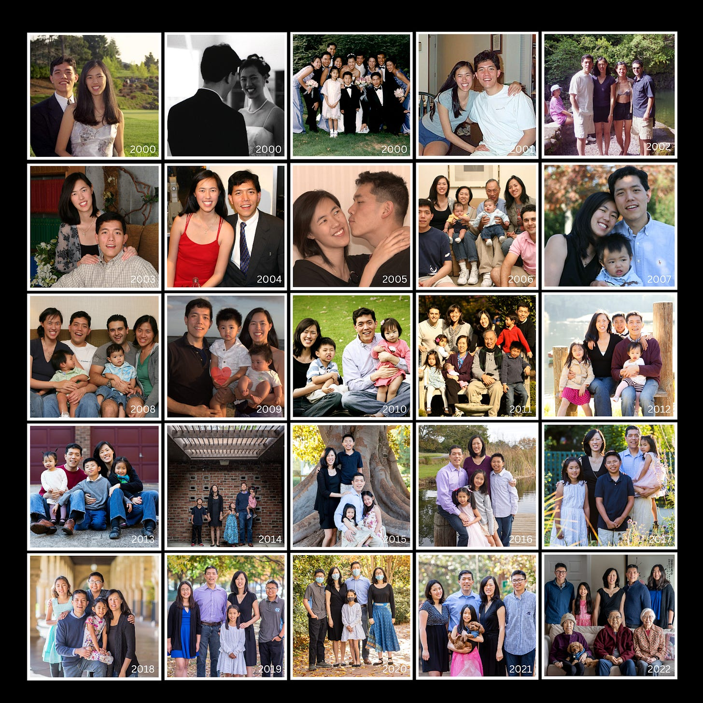

# Reigniting the Fire 

*Finding yourself after losing your way *

Remember your first day in college? Your first day at a new job? The first time you took on a new role? Your first date with your significant other?

Think back to that feeling. Things felt fresh. Full of optimism. You had a sense of infinite possibility and potential. Your anticipation and excitement were palpable. You had probably been looking forward to that moment for such a long time.

Now sit on that feeling for a second. Examine it, and ask yourself why you don't feel the same way a year or two—or even a decade—later.

Over the weekend, David and I celebrated our 23rd wedding anniversary. We’ve never been particularly romantic, so we don’t do much to celebrate, and we have been married for so long that it can be easy to take each other for granted.

All relationships tend to follow this trajectory. The honeymoon period fades, and as the freshness wears off, you settle into a routine. In fact, the actual chemical reaction of love in your brain only lasts between six and 24 months ([ref](https://www.verywellmind.com/the-four-stages-of-relationships-4163472#:~:text=How%20long%20does%20the%20romantic,10%20or%2015%20years%20later.)). Considering how most people have made a long-term commitment by that point, the fading of love on a brain chemistry level may lead someone to believe that their partner is not the right person for them, even if they are.

I think this is a great metaphor for life: there are moments when it feels like things are stagnant. Every day starts to feel rote and repetitive, and you don't know if you can continue on doing what you're doing. It’s the complete opposite of the excitement you feel when you first get started.

## **What is the sophomore slump?**

There is a phenomenon in college that you’ve probably heard of: the so-called “sophomore slump” ([ref](https://en.wikipedia.org/wiki/Sophomore_slump)). According to Wikipedia, this is a global phenomenon, known as the “second-year blues” in the UK and “second-year syndrome” in Australia. It refers to the period in college when the excitement and energy of freshman year wear off, and discontent and malaise set in. It doesn’t just happen in college, either. Second-year athletes struggle more than those in their first year. Musicians sell fewer of their second albums, and authors speak of struggling to find success in writing their second book.

I myself went through a sophomore slump in college. I grew up in a small town in South Carolina and graduated as part of a class of about 100 students. I was valedictorian and got a scholarship that put Duke within my reach. When I was deciding on a college, one of my friends told me, “We were all big fish in a small pond. You are going to be a small fish in a big pond.”

I showed up to college ready to take on the world. I plunged into various activities and took on my classes with gusto. I tried so hard that first year to prove I belonged there in the big leagues. But during my sophomore year, I struggled. I got my first B, and then my second. I flunked a final and was chewed out by my professor for not understanding the material (it didn’t help that my friend and study buddy got a 100 in the class).

**I felt lost. I hit the wall hard, and I didn’t know how to get past it.**

[Share](https://debliu.substack.com/p/reigniting-the-fire?utm_source=substack&utm_medium=email&utm_content=share&action=share)

## **Why the sophomore slump happens**

There are a number of reasons for the sophomore slump. As I was reading up on it for this article, I found several rationales, including:

1. **Reversion to the mean:** Those who go in with a bang are sometimes lucky and sometimes better. But by the second year, they experience a reversion to average performance ([ref](https://en.wikipedia.org/wiki/Sophomore_slump)). If you look at the best of the best athletes who have a breakout first year, they are more likely to show a decline in their second year ([ref](https://harvardsportsanalysis.org/2019/12/does-sophomore-slump-exist-in-the-nfl/)).
2. **Burnout:** When you are at the starting line of a marathon, you are full of excitement and energy. You burst out of the gate, you keep pushing forward, and you might even be having a strong run… until you hit the wall. Expending unsustainable energy and setting poor expectations can set you up for failure, and in some cases, it may even cause you to get [burned out](https://debliu.substack.com/p/burnout-the-silent-thief) ([ref](https://en.wikipedia.org/wiki/Sophomore_slump)).
3. **Getting lost/lack of direction:** When you start something new, you have goals and things to work toward. This can give you a sense of purpose. Eventually, though, once you settle in, there is less clarity about what you should be optimizing for. It becomes harder to find the motivation to work toward an unclear purpose.

What solved my sophomore slump in college was starting to date David. We met at church during my first weekend of college, and we started dating during winter break of my sophomore year. I felt lost at school, convinced that I was a small fish in a big pond and that failure was inevitable. But when David and I started dating, it changed everything. He helped me see that I had every right to believe I could succeed, and that I needed to find clarity of purpose. I had talked myself into believing I could not succeed and therefore was not doing so. I had to rewire myself.

My junior and senior years, I did better than I ever had. I no longer wondered if I was good enough or smart enough to succeed. I was no different, but my mindset had changed. I no longer felt like an imposter.

## **Recapturing the feeling**

I have experienced the sophomore slump many times during my two-decade career. I would slowly start to feel like I was stuck, aimless, and unable to escape that sense of stagnation.

This happened most acutely during the six years when I was having my children. I had lost the desire to even show up at work because I had so much going on at home. I had lost my sponsor, who had moved on to a new job. I was working for somebody who didn't have a clear plan for me to grow. I tried different things to reignite the fire, and yet each time, I felt like I was coming up empty. There have certainly been times in my career when I worked all the time under a great deal of stress. But this was worse. That feeling that you’ve lost all desire to even show up to work grinds you down. I felt like I was dragging myself in everyday.

It took taking a new job for me to reignite the spark during that period of my life. In fact, I took three new jobs on my mission to recapture the feeling that what I was doing had meaning. Looking back on that time, I realize now that I was trying to recapture that old feeling by starting something new over and over again.

Later on in my career, I began to struggle again. I was passed over for a promotion I had desperately wanted, and that feeling of stagnation started to set in once more. But this time, I decided not to run. I couldn't change jobs easily for a lot of reasons, so I decided to stand my ground and make things happen where I was. In some ways, the period after I was told that I would not get the job of my dreams turned into the best time of my career. With that door closed, I was able to focus on turning the job I had into the job I wanted.

Wherever you are, it is absolutely possible to reignite that fire—and sometimes all it takes is a shift in mindset, approach, or point of view. It is also possible to start anew. Either way, the choice to make that shift is up to you. As you're standing in that malaise and looking around, you have to decide which path is going to take you where you want to go.

---

As I mentioned, earlier this week David and I celebrated 23 years of marriage. Through the time, we've had a lot of joys—and a lot of sorrows, too. But we've been blessed. We’ve always believed that love is a choice, not a feeling. Love, like all things, requires intention, goals, and purpose.

Moving from the chemical high of first falling in love to the long-term connection of deep companionship requires purpose and investment. The same is true of moving from the excitement of any new start to a long-term investment of time and effort. Success isn’t always about the thrill of the new; sometimes it’s about taking a step back and reconnecting with what matters most.

[Leave a comment](https://debliu.substack.com/p/reigniting-the-fire/comments)

Perspectives is a reader-supported publication. To receive new posts and support my work, consider becoming a free or paid subscriber.