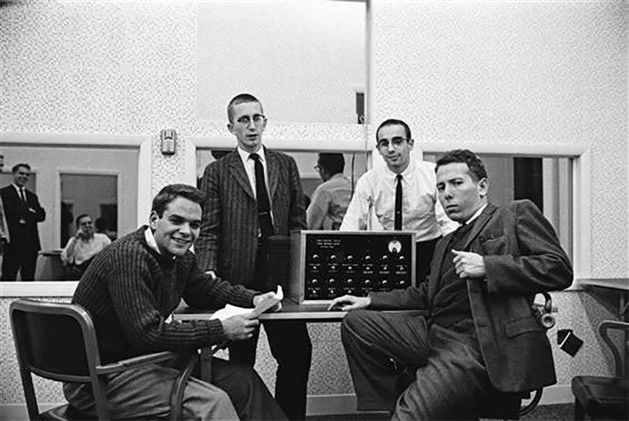
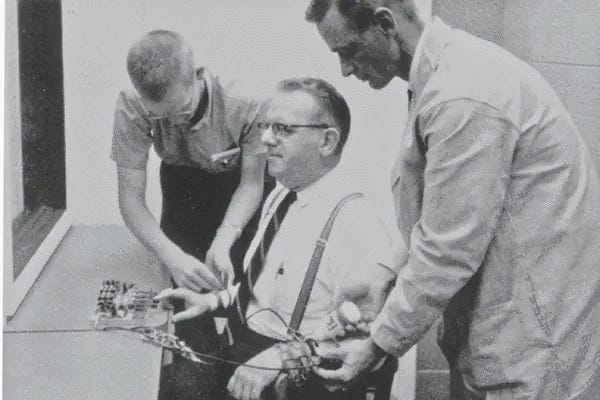

# The Dark Side of Influence: Understanding the Power of Requests

*What the 1960s Milgram experiment can teach us about asking and being asked *

Yale University Manuscripts and Archives

When I started writing my book, *[Take Back Your Power](https://amzn.to/3FmjU0v)*, one of the first things I did was make a list of incredible people whose stories I wanted to include in it.

And I was terrified to ask them.

Rejection sounded hard and harsh. As a first-time author, I was intimidated by the process. Eventually, though, I realized I was on deadline, and that I had to get it done one way or another, so I started sending out emails one at a time. Here's what happened: I asked a lot of people, and surprisingly, most of them said yes. Even the people who said no were very kind. Sometimes it would take me two or three connections to reach somebody so I could make the request, but I was able to get through to most of the people whose stories I wanted in the book. Several of them later even became friends.

A couple of years back, one of [my favorite podcasts](https://debliu.substack.com/p/podcasts-on-my-must-listen-list), “Hidden Brain,” interviewed Cornell Professor Vanessa Bohns, who studied the famous Milgram experiment: Yale Professor Stanley Milgram's attempt to understand what can make seemingly ordinary people do terrible things ([podcast](https://www.npr.org/2020/02/20/807758704/the-influence-you-have-why-were-blind-to-our-power-over-others), [transcript](https://www.npr.org/transcripts/807758704)). He sought the answer to the question, “Under what conditions would a person obey authority who commanded actions that went against conscience?” ([ref](https://www.npr.org/transcripts/807758704))

Milgram’s now-infamous experiment, conducted in the 1960s, examined the extent to which people would listen to authority figures, even if it meant hurting others. An authority figure in a white lab coat, acting as a scientist, would give a volunteer instructions to electrocute someone whenever they got a question wrong, using stronger and stronger electric shocks each time. Most people went along with this, even when the person getting shocked in the other room wailed in pain or complained of heart issues. This experiment showed that people tend to do things they wouldn't normally do when they are instructed to by someone with authority.

So how does this relate to requests in daily life?

[Subscribe now](https://debliu.substack.com/subscribe?)

## **From the perspective of the asker**

When we think about studies like the Milgram experiment, we often envision ourselves in the seat of the subject. We think about whether we would have the courage to stop the experiment and walk out. However, we rarely put ourselves in the shoes of the asker: the “authority figure” who was the one making the request of the volunteers. But what if we were to look at the experiment from the perspective of the person doing the asking?

There’s a saying that “You miss 100% of the shots you don't take,” and in some cases, that is absolutely true. The Milgram experiment proves this: the “scientist” asked the volunteers to do something that was cruel, even to the point of being dangerous, yet the volunteers went along with it, even after expressing frustration or doubt.

What Professor Bohns found was that, when it comes to asking people to do things, even unethical things, more people will do them than you might think. For example, one of her studies involved students asking other students to write in a library book, which was clearly against the rules ([ref](https://www.bbc.com/worklife/article/20211117-why-you-say-yes-to-requests-even-if-you-shouldnt)). She also tested this with other requests, such as having volunteers ask strangers to fill out a survey or try to raise money. Time and time again, participants overestimated how many people would say no and underestimated how many people would actually agree. Whether the ask is ethical or not, Bohns’ research suggests we are more likely to say yes to someone else’s request, as long as they seem to have a reason for making it.

Recently I was giving a talk. The host of the event explained that by asking me to be their first guest, she was taking back her power, because she had initially been unsure how to get me to agree. In fact, she had asked me several different ways, but since I've been inundated with requests, I didn’t even see hers until the last one. I said yes on a whim, since I had some time that week, and she was delighted. She noted that her efforts to ask had paid off.

## **From the perspective of the one being asked**

Everyone gets requests from time to time, asking for something or another. Bohns’ research supports the idea that the majority of us feel compelled to give an agreeable response. But here's the thing: just because someone asks you for something, that doesn't mean you owe them an answer.

I see this happen a lot in workplaces. Someone throws work over the fence at you, and suddenly it becomes your problem, not theirs. However, even though it’s free for them to ask, you have no obligation to answer if you don’t choose to do so.

Of course, this is often easier said than done. The asymmetry of cost and benefit tends to be on the side of the asker. After all, it cost the authority figure nothing to request that someone compromise their morals to hurt someone else in the Milgram experiment. A few words here, a question there, and suddenly, someone can have you dancing to their tune. But my question is, why do we dance?

You don't owe anyone your time, energy, or morals just because they ask. In some cases, you don't even owe them a response at all (Instagram private messages, I’m looking at you).

I once worked with someone brilliant who processed things by asking lots of questions and used queries as a tool to persuade or influence decisions. I noticed that people would try to answer on the fly to the best of their abilities. If that person wasn't satisfied, teams would follow up and invest time to confirm something. Over time, though, this created a situation where things rotated around the questions that *could* be asked in the next meeting, resulting in changing agendas and defensive postures. Eventually, when a question came up for the umpteenth time about a metric for another group's product, I frustratedly asked, “Can we revisit this on a six-month or annual basis instead of questioning it constantly?” This stopped that line of questioning and reduced the churn for that team. And even though I was not the recipient of the questions in that case, it was a reminder to me, too, that I don't owe everybody an answer to everything.

As humans, we tend to be extremely polite to each other. If somebody asks us a question, our reaction is to try to give them an answer. But there is a time and place for everything, including responding to requests. It is absolutely okay to say the question should be tabled or addressed offline. It is also absolutely okay to offer someone a way to get the answer themselves without throwing it in your lap. Perhaps most importantly, [it is also absolutely okay to say no](https://debliu.substack.com/p/ruthless-prioritization-and-the-art).

If you ever find yourself receiving a request, especially an unexpected one, asking yourself the following questions may help you decide how—and if—you will respond:

* **Is this worth my time?** Everything you say yes to comes at the cost of saying no to something else—either explicitly or implicitly. Before you respond to a request, ask yourself whether it is worthy of the time and investment of resources that you could be putting toward something else.
* **Who is the asker?** Context can be a key component of deciding how to respond to a question. If a stranger makes a request of you, versus somebody with whom you have a relationship, it may be worth factoring that into whether or not you do as they ask. This may not always be the only factor worth considering, but it can give you a good starting point for considering the situation.
* **Is this the time or place?** Sometimes a question is a good one, but when it’s asked, it's neither the time nor the place to address it. Whenever a request comes your way, it's important to ensure that this is an appropriate moment to take the time to answer it. If not, you can always table it for later.
* **How can I scale the answer?** Recently I had several friends who all started new jobs. They each asked me for my advice on preparing. I had written extensively about this when I first started this Substack, but it had been a while, [so I decided to compile everything I had already written into one post, which I published last week](https://debliu.substack.com/p/a-simple-guide-to-preparing-for-a). This way, all the relevant information is summarized and easy to share. If you ever find yourself being asked the same questions multiple times, see if there is a way to create a self-service system so people can get the answers for themselves.

  [Leave a comment](https://debliu.substack.com/p/the-dark-side-of-influence-understanding/comments)

---

When viewing Milgram's experiment from the perspective of the asker, you realize that there's great power in asking for what you want. If you are somebody who's afraid to make requests, remember: studies show that more than 50% of the time, people will say yes ([ref](https://www.bbc.com/worklife/article/20211117-why-you-say-yes-to-requests-even-if-you-shouldnt)).

On the flip side, if you are the person being asked for something, remember that the other person does not have power over you. Make a thoughtful and deliberate decision as to whether you want to reply in the affirmative, or even at all. In many cases, you owe the other person nothing. They may be playing the odds that somebody will say yes; you get to choose whether or not that person is you.

We are all human, and even strangers who ask us for favors can make us feel an obligation. I have changed many a seat on an airplane, even when I didn't want to, so that someone could sit with somebody they knew. But many others have done the same thing for me, especially when my kids were small. This is the power of making requests—and the power of making a conscious decision as to how we respond.

Knowing what you know now, make a point to think about each question you’re asked every day and reflect on what you want to do. You may find that you become better at managing requests—both as the asker and as the person being asked.

[Share](https://debliu.substack.com/p/the-dark-side-of-influence-understanding?utm_source=substack&utm_medium=email&utm_content=share&action=share)