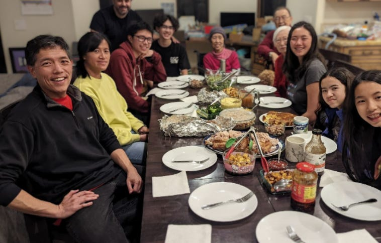
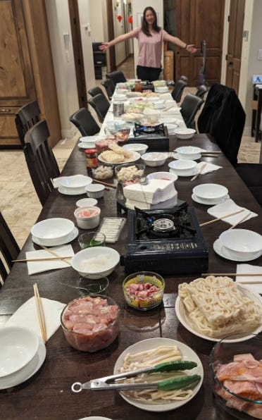

# Hitting Reset

*Lightening the weight of the past by starting a new chapter*

Photo by [Erwan Hesry](https://unsplash.com/@erwanhesry?utm_content=creditCopyText&utm_medium=referral&utm_source=unsplash) on [Unsplash](https://unsplash.com/photos/strawberry-on-wooden-surface-R5shsfdDG0M?utm_content=creditCopyText&utm_medium=referral&utm_source=unsplash)

David and I have been in an ongoing tussle. We bought a 10-seater dining table back in 2016, when my in-laws moved closer to us from North Carolina, so we would have seating for everyone—including my mom, our kids, and us. We kept this huge table open and in the middle of our great room for years. But in the past year, we lost my father-in-law, then my mother-in-law, and then my mom. Last week, we sent Jonathan off to Boston College for his freshman year.

I kept staring at this huge table with all its empty seats, feeling sad that we won’t be able to make new memories with those whom we’ve lost. Finally, I decided to fold down the leaves, thereby turning the 100” table into a 64” one—perfect for seating six. For the first time since we moved into this house, there is space to walk around the table without having to shuffle and contort ourselves. I felt a sense of relief in no longer having all those empty chairs staring back at me.

The problem? David and the girls grew very upset at the change. They hated the new “short, stubby table” and urged me to put it back the way it was. But I persisted. I asked them to give the new table a chance, since it’s only been a few days since I folded the leaves down. Slowly but surely, they are adjusting to our new life with a family of only four at home.

## **Collapsing the table**

We have been living in and among our parents’ things for some time now. My mom moved in with us nearly a dozen years ago, and with her move came many things she had accumulated with my dad over their forty years together. We stored much of it away in the attic and sheds, and then helped set up her room. When we moved to a larger house where she had her own space, we brought only a small portion of it with us, leaving behind a bulk of her things in our old house, where my in-laws relocated eight years ago. Meanwhile, they brought their own things from the home they had lived in for four decades. When they all passed, we moved everything they had collected over the course of their lives into our current house. We live among their artifacts, memories, and photos.

I spend 20 minutes a day going through their things. Sometimes, it’s a simple matter of sorting through their old clothing. Other times, I unearth a new treasure, like a collection of camera storage cards full of photos I’ve never seen before. I long for the day that I no longer have to do this daily, but for now, I feel like I am mourning them one box at a time.

Collapsing the dining table has been my way of saying good-bye to them so I would no longer be staring at their empty seats. It changes my physical relationship with their memories.

Everyone has a table in their life that they have to face sooner or later. For one person it was getting rid of the swag from a toxic job that was sitting in the closet. For another it may be ending a friendship that had turned sour. For yet another, it was clearing out things from a long-ago hobby. These monuments to loss are universal—but everyone must eventually choose how to deal with them.

[Leave a comment](https://debliu.substack.com/p/hitting-reset/comments)

## **Starting a new chapter**

We are (fingers crossed) moving in a few weeks, hence my desperate desire to clear out as much as I can before we relocate. In many ways, I want to start anew, and not carry the baggage of everything that is sitting in my house with us to the new place. But we have three households worth of things to sort through, and not much time.

We are not good at paring. Our minds see that as a loss, and humans feel loss more than they feel gain. Every time I ask David if I can donate or discard something from his parents, his first reaction is “No,” because he is still sitting at a table with empty seats. I want to collapse the table. [We debated endlessly about a wheelbarrow](https://debliu.substack.com/p/less-is-more) that his dad brought when they moved from North Carolina. Neither one of us needed it for eight years, but he used it once last week, and now suddenly, we *must* have it. We had a lengthy discussion about a dull hatchet and some gardening tools that I wanted to list on the local Buy Nothing Group on Facebook so they could go to someone who could actually use them. (It’s a dull hatchet, and in our two decades of marriage, he has not used a hatchet once.)

David sees each item I want to clear out as giving away memories of his parents, and I am not sure how to combat that. So we made an agreement: We will move into the new house and bring over the things that we need, then see what is left behind. The change of scenery will allow us to add, rather than subtract. We can frame it as a gain instead of a loss. I hope that this change of perspective will force us to add back what we want and discard what is no longer working for us.

Often, we think about our lives as fixed, unable to imagine something different until we reach a breaking point. We get stuck in our old patterns and behaviors, not sure how we could ever change things to get a different outcome.

A move, a new job, or change in venue can change your perspective. New chapters give us a blank slate to which we can bring what we want—as well as an opportunity to leave behind what we don’t.

[Share](https://debliu.substack.com/p/hitting-reset?utm_source=substack&utm_medium=email&utm_content=share&action=share)

## **Letting go and breathing anew**

If you find yourself in a similar situation, consider how you might be able to give yourself a fresh start. It doesn’t require moving your whole family to a new place, but rather hitting the reset button.

I was once at a company where we moved into a new building. All of the old meetings were automatically canceled and had to be manually readded to the schedule. Suddenly, calendars freed up. One-on-ones that had outlived their usefulness were removed. Standing meetings that no longer had the momentum of habit were deleted. This disruption in routine caused everyone to make an affirmative decision, rather than just resting on what had been happening previously. Instead of being bogged down by old habits, we could consciously add back what we needed, rather than just keeping what was already there.

Hitting the reset button is often hard because we are worried about what we’ll lose. If you’re facing this resistance, take a moment to ask yourself these questions:

* What am I afraid to change or let go of? What holds me back from making a change?
* What am I telling myself about the thing I’m afraid to lose? Is it really about the thing itself, or something under the surface? Is it really true?
* Is there a way to repurpose these things or give them a new life? (This can be especially helpful if you’re struggling to part with something sentimental.)
* What would my life look like if I hit reset and started over? (Some areas to consider include your friendships, your wardrobe, your diet, or even the apps on your phone.)
* If I could pick one thing to reset this week, what would it be? What might the possible outcome be?
* Is there something small and low-stakes I can start with as practice?

Letting go is challenging, even when we’re letting go of things that no longer serve us. But even the minor reset can give you breathing room and open up new possibilities. Start small, be patient with yourself, and—like I’m doing with my parents’ things—chip away at it a little at a time. The reset button can be intimidating, but it doesn’t have to be your enemy.

---

When I sit down at my dinner table now, it feels totally different than it did before. I am no longer thinking about who is missing at the meal, but rather who is present. Hitting the reset button has helped me honor those I loved without spending every meal grieving them.

We all have dining room tables we need to fold down. It isn’t easy. So often we find ourselves looking into the past, mourning what we’ll lose, but what if we could instead look ahead? We might see that with a little attention, the table no longer feels empty, but full of possibilities.

[Share](https://debliu.substack.com/p/hitting-reset?utm_source=substack&utm_medium=email&utm_content=share&action=share)