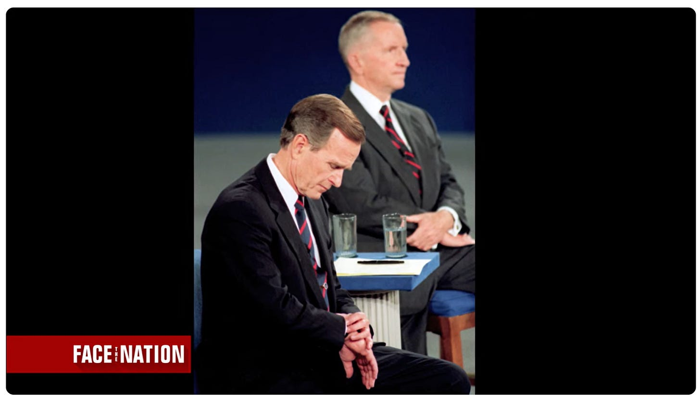

# The Hidden Message You’re Communicating

*How you appear to others affects how they feel*

Photo by [Andre Hunter](https://unsplash.com/@dre0316?utm_content=creditCopyText&utm_medium=referral&utm_source=unsplash) on [Unsplash](https://unsplash.com/photos/man-jumping-on-the-middle-of-the-street-during-daytime-p-I9wV811qk?utm_content=creditCopyText&utm_medium=referral&utm_source=unsplash)

During the 1992 election, a voter asked sitting president George H.W. Bush about how the national debt impacted him personally. The President fumbled the question, and was then seen looking at his watch as if he was bored and uninterested. In contrast, Bill Clinton got up, and walked over to the voter, and talked about how intimately he knew those who were hurting. The exchange was a masterclass in how body language can make or break an interaction—or even an election.

See the short video here:

Keep in mind that Bush was just looking at his watch, not kicking puppies. He most likely only wanted to check the time, but that small action opened the door for his challenger to paint him as “out of touch” with the average voter. No matter his intentions, Bush looked like he wanted to be anywhere but there. After all, he was President and had other things to do. Voters soon relieved him of that duty.

Body language matters. [In fact, studies have found that only 7% of communication is strictly words](https://online.utpb.edu/about-us/articles/communication/how-much-of-communication-is-nonverbal/#:~:text=The%2055%2F38%2F7%20Formula&text=It%20was%20Albert%20Mehrabian%2C%20a,%2C%20and%207%25%20words%20only). The rest is non-verbal: 55% body language and 38% tone of voice. Albert Mehrabian’s research has been debated extensively over the years, but the spirit of it is that words only account for a small portion of what the other person perceives in an interaction.

If someone says, “Congratulations on your promotion,” but they are frowning and looking away, what do you hear? Are they truly happy? Do they really support you? If someone smiles as they express their condolences, what are they conveying?

We spend so much of our time focusing on the content of what we say that we often overlook other aspects of our communication—aspects that, as we learned in 1992, can have far-reaching effects.

[Share](https://debliu.substack.com/p/the-hidden-message-youre-communicating?utm_source=substack&utm_medium=email&utm_content=share&action=share)

## **Learning the lesson the hard way**

Some people just make you feel good in their presence. They look you in the eye. You bask in their attention. When you’re speaking to them, you feel like you are the only thing that matters. A friend of mine once introduced me to a founder she works with. She pointed out how, at every meeting, he mentioned how amazing it was to be there. I happened to have a meeting scheduled with him later that week, and she was right. He brought his full energy and excitement to the table, even when it was just a small interaction. He made it seem like there was nothing he would rather do than be there with me. That sort of energy is infectious.

Energy that’s negative, standoffish, or subdued can be infectious, too. I learned that lesson the hard way when I was the executive hosting a product review with my team. A couple dozen people were squeezed into our team conference room to present the latest update about our progress on an important initiative.

The one thing you should know about our conference room was that it was freezing *all the time.* Unbeknownst to me, I had spent the entire presentation with my arms crossed to stay warm. Afterwards, a rumor went around that I was upset with the team and planning to fire them. I was appalled to learn this. I ended up having to apologize to everyone who had been in the room that day. From then on, I always brought a fleece or sweater to our product reviews and carried around a cup of hot tea for good measure.

## **How you leave people feeling**

Maya Angelou said, “People will forget what you said. People will forget what you did. But people will never forget how you made them feel.”

I once worked with a peer who left me feeling like I had disappointed him after every interaction. It was deflating. Nothing I said or did seemed to please him. I even considered giving up on engaging with him unless absolutely necessary. Then, one day, someone else who worked with both of us said, “Oh (name) was talking about your product and how well it’s doing. He thinks you’re great.”

I was flabbergasted. I had been working with him for years and years, and I had no idea he held me in high regard. Had I not heard this from someone else, I would have spent the rest of our working relationship thinking he thought I sucked based on our interactions.

Think about your last one-on-one conversation. Did you leave your manager with more or less confidence in your abilities? Did you bring your peers closer to you, or push them further away? Did you try to connect, or try to command?

Every time we interact with somebody, we're leaving an impression on them, whether we like it or not. Often we think nothing of it, just as I thought nothing of crossing my arms during a product review. But it's not that simple. Human nature is to try to make sense of stimuli. When someone interacts with you, they are trying to make sense of who you are and what you're trying to convey. That goes far beyond just the words you say. Every minute of the day, whether you like it or not, you are communicating something.

It took me a long time to realize this. I prided myself in being efficient and effective. I had no time for niceties and things that seemed like a waste of time. But those “peacetime relationships” [are what carry you through wartime](https://boz.com/articles/stars-guardians), and those relationships are built on humanity—those niceties, that connection. Without that foundation, you are constructing fragile, transactional relationships. You are setting yourself up for failure.

[Share](https://debliu.substack.com/p/the-hidden-message-youre-communicating?utm_source=substack&utm_medium=email&utm_content=share&action=share)

## **Body language is a language**

We call it “body language” for a reason. The way we move and carry ourselves communicates something about us, even if it gets lost in translation.

When you join a call on Zoom but keep your camera off, you are a disembodied voice without context. You can speak, but no one can derive the hidden messages from your facial expressions, hand gestures, or posture. It’s like someone singing without background music.

I remember when someone I hired called me out for looking at my phone during the interview. He was absolutely right; I seemed disinterested and disengaged. That was not my intention, but it was what he felt. What he didn’t know was that there was a scheduling issue, so I was unsure who was coming to interview next. Even still, the sense that I was dismissing him could have thrown him off his game and caused him to tank his interview. Even in the most innocuous situations, we are either leaning in or leaning out of a relationship.

130 newlywed couples were once studied by the Gottman Institute. Researchers found that the couples who were still married six years later [turned toward each other 86% of the time, while those who ended up getting divorced only turned toward each other 33% of the time.](https://www.gottman.com/blog/turn-toward-instead-of-away/) Turning toward someone means responding with affirmation, in either word or deed. Turning away indicates rejecting, missing, or dismissing a “bid” for connection. Those bids for connection are what inform our interactions, and our interactions inform our relationships. What you don’t say carries more weight than you might think.

[Share Perspectives](https://debliu.substack.com/?utm_source=substack&utm_medium=email&utm_content=share&action=share)

---

Humans are built to seek connection, but we often forget that our body language and tone convey more than the things we say. The next time you interact with someone, reflect on what you’re communicating without words. Are your shoulders slouched? Are you turned toward them? Are you making eye contact? Do you nod along to what they’re saying? Are your arms crossed? Do you keep checking your phone? We perform so many of these small gestures every day, without even thinking, and each one sends a message.

What message are you sending?