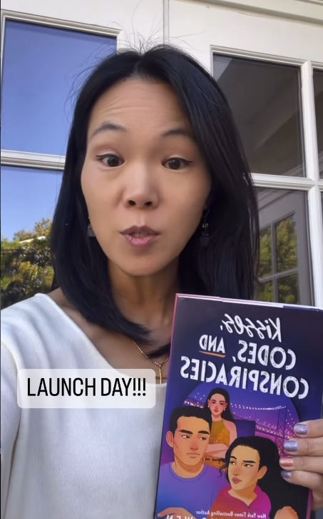
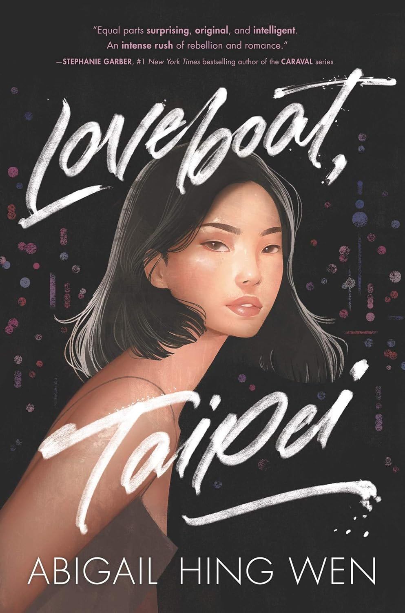
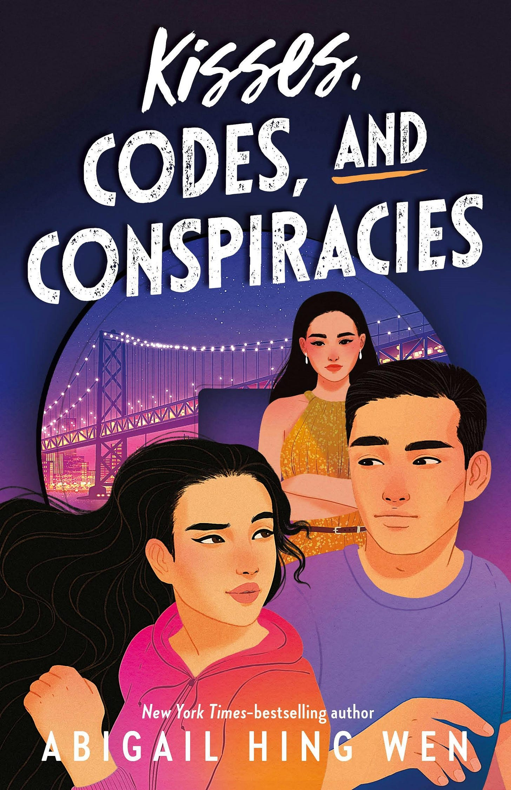
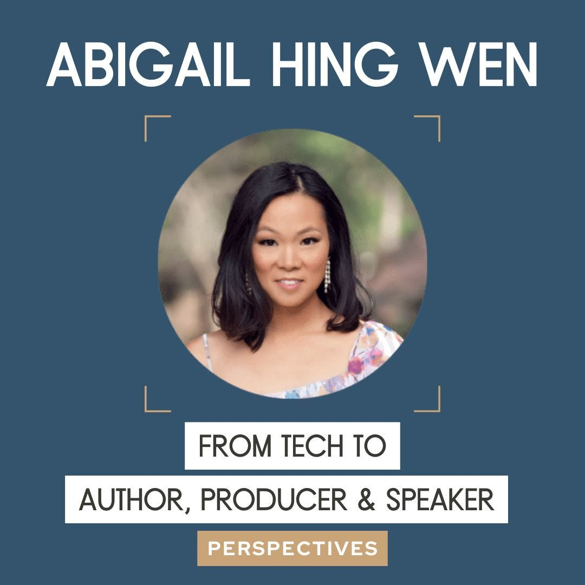

# The Unexpected Path 

*The long winding journey from a dream to reality *

I first met Abby on a campus bus when we were teens. She was a freshman at Harvard, and I was there visiting my then-boyfriend (now husband), David. Little did I know that it would be the start of a multi-decade friendship.

Life has a way of taking you places you don’t expect. Abby and I lost touch for a while. During that time, she married Andy Wen, someone who had diligently hosted Bible study for us lost D.C. interns my freshman summer. Many years later, we ran into Andy and Abby at the Chinese school where we were sending our kids. They invited us to their home for a housewarming. Turns out they had recently moved not far from where we lived, and we picked up where we left off.

We stayed up late, talking into the night. Abby—at the time a lawyer in tech and the mother of two elementary school students—shared how she quietly wrote for hours a day in the hopes of one day becoming a published author. I was shocked that she found time to write in her busy schedule. She explained how she got up early every morning to write before work so she wouldn’t disrupt the flow of her family life. She shared the stories she had inside of her, waiting to be told. I admired her courage and dedication.

Abby and I stayed connected throughout our Silicon Valley journeys. Year after year, she and I would meet up and talk. Over and over, she would share the disappointing news that nothing was happening with her books, but she persisted, writing whenever she could outside of her day job.

That day job, by the way, was being an expert in AI investments and acquisitions at Intel (this was a time well before the recent ChatGPT revolution). Abby continued to dream of being a writer while making a name for herself in the industry, hosting an [AI podcast](https://podcasts.apple.com/gb/podcast/relaunch-with-host-abigail-hing-wen-intel-on-ai-season/id1445844944?i=1000490586338) featuring leaders like [Andrew Ng](https://podcasts.apple.com/gb/podcast/the-future-of-ai-with-andrew-ng-intel-on-ai-season-2-episode-1/id1445844944?i=1000491444450), [Yann LeCun](https://podcasts.apple.com/gb/podcast/a-modern-history-of-ai-with-turing-award-winner/id1445844944?i=1000498162975), and [U.S. Congresswoman Robin Kelly](https://podcasts.apple.com/gb/podcast/ai-and-government-with-us-congresswoman-robin-kelly/id1445844944?i=1000509706077).

[Share Perspectives](https://debliu.substack.com/?utm_source=substack&utm_medium=email&utm_content=share&action=share)

One day, Abby reached out to have brunch, where she shared that her first book had been signed! It proved to be the first of many. That book went on to become the incredible *New York Times* bestseller *[Loveboat, Taipei](https://amzn.to/3WYJFiP)*, which came out in 2020. She went on to produce it into the Paramount feature film, *[Love in Taipei](https://www.netflix.com/title/81774657?source=35)*, which just dropped on Netflix. The book ended up going from a single story to a full [trilogy](https://amzn.to/3SLE2C0).

Abby was a law clerk on the D.C. Circuit, a successful woman leader in tech, and an accomplished AI leader. She went on to become a bestselling author and producer—all while being a mom to two incredible kids and a partner to someone with an equally demanding career.

Today marks the release of Abby’s newest book: *[Kisses, Codes, and Conspiracies](https://amzn.to/4dnafI6)*, a Silicon Valley thriller and romantic comedy. The book has already been featured in [People Magazine](https://people.com/read-an-excerpt-from-loveboat-taipei-author-abigail-hing-wen-exclusive-8654247) and is on [Amazon’s lists of Editor’s Picks and Best YA Books of the Month](https://amzn.to/4dnafI6).

I had the courage to write my own book, *[Take Back Your Power](https://a.co/d/8JIpOgR)*, thanks to Abby’s encouragement and support (I highlight her journey in Chapter 3!). As part of her latest launch, I asked her to share her unexpected path to success. I hope you will find her story as inspirational as I have.

[Subscribe now](https://debliu.substack.com/subscribe?)

**You wrote in obscurity for over a decade without anyone expressing interest in your work. What kept you going during those years?**

First of all, Deb, thank you for your friendship and support all these years! I admire your leadership journey to becoming one of the most senior women in Silicon Valley, and the ways you build generosity and giving back into your life. I’ve benefited from your example.

To answer your question, I knew from the start that publishing a book would be an uphill battle. I was told it would take 10 years, 10,000 hours, and 1 million words. On the days I was feeling more confident, I hoped I’d be a prodigy and shortcut it—but no, it took me exactly that. I wrote and shelved four novels on the way to publishing *Loveboat, Taipei.*

But I believed the stories I was writing needed to be told. Stories are powerful and can expand imaginations. The right story can make you rethink what is possible. At work, I saw the ways implicit bias worked against women and minorities, but I was inherently writing about strong women leaders, girls in tech, Asian Americans in romantic relationships, and neurodiverse people discovering their superpowers. These were characters and stories that I knew existed in the real world, but rarely got positive and well-rounded time on the page or on the screen. Changing these perspectives and building bridges between disparate people is a core part of my mission.

Despite the rejections of my first four novels, I did get nibbles along the way that kept me going. An agent who read the first novel wanted to see the second. Then I signed with an agent for that one. Editors read my second and third novels overnight but couldn’t get past marketing in acquisitions. Despite the rollercoaster of hopes and disappointments, those bites told me I was on the right track.

I also knew my reps had high standards and were only sending my work to big editors at big publishing houses. People encouraged me to self-publish, or even to submit my work to smaller houses. I did feel deep down that I wasn’t quite ready, but if *Loveboat, Taipei* hadn’t sold, I would have self-published it, because by then, I knew I was onto something really unique.

**You talk about your writing circle, your family, and your friends being critical to your success. How have allies been a part of your journey?**

*Loveboat, Taipei* was rejected by someone important at draft 25. That was a low point in my writing journey, but my critique partners rallied around me and put me back on my feet: [Sabaa Tahir](https://sabaatahir.com/), [IW Gregorio](http://www.iwgregorio.com/), [Stephanie Garber](https://www.instagram.com/stephanie_garber/?hl=en), [Stacey Lee](https://www.staceyhlee.com/), [Sonya Mukherjee](https://sonyamukherjee.com/), and [Kelly Loy Gilbert](https://kellyloygilbert.weebly.com/), brilliant authors who have left their marks on my writing. I revised the novel, which went on to a multi-house auction, was published at draft 31, and the rest is history.

Savvy friends in Silicon Valley have also strengthened me in an industry that can often feel brutal to creatives. Writing is an art, but publishing is a business. When I was launching my first novel, insecure about taking up space, [Mauria Finley](https://www.linkedin.com/in/mauriafinley/) said to me, “Abby, I’ve been in your home for two hours, and you haven’t asked me to buy your book yet.” She challenged me to email ten of our friends and ask them to preorder the novel, so I sent my first such email. And I learned that people want to help get our diverse stories out. That same launch, someone suggested I was posting too much on social media. I asked you, Deb, for your perspective, and your answer was decisive: *Post more!* These friendships have given me the courage to persevere.

The community has also rallied to get this diverse story out despite the inherent challenges, as well as some unexpected obstacles. The *Loveboat, Taipei* novel came out in January 2020, with a big in-store rollout marketing plan and big expectations, which any author is so lucky to have. But two months later, the COVID pandemic shut the world down. Suddenly my little unknown debut novel was sitting on shelves in Target, Costco, Barnes & Noble, independent bookstores, and airport bookshops—with no foot traffic to discover it. I still feel the impact of being a pandemic debut author today. But despite these bumps, we are now onto the fourth novel, with a beautiful movie adaptation, and more to come. It’s all thanks to the community for continuing to get the word out and support the books.

The *Love in Taipei* film also came out during an unprecedented double strike in Hollywood. Everyone was worried it would tank the movie, which features many new AAPI stars. But friends and allies rallied to get the word out. [Miriam Kim](https://www.mto.com/lawyers/miriam-kim/) organized a screening of influencers in the Bay Area. [Tony Wang](https://www.omm.com/professionals/anthony-wang/) in San Diego, [Ed Hsu](https://www.linkedin.com/in/edward-hsu-1002302a/) in DC, [Yao King](https://www.linkedin.com/in/yao-king/) and [Stephanie Sher](https://www.linkedin.com/in/stephaniesher/) in New York/Princeton, [Dave Lu](https://www.linkedin.com/in/davelu/) (he has a cameo in the third Loveboat novel!), and so many other individuals and organizations have supported me—more than I can name. It’s thanks to the community that *Love in Taipei* came out on [Netflix](https://www.netflix.com/title/81774657) this month.

Lastly, my church’s small group of five families has been meeting now for about 15 years. I wouldn’t be here now without their prayers and wisdom.

[Share](https://debliu.substack.com/p/the-unexpected-path?utm_source=substack&utm_medium=email&utm_content=share&action=share)

**What is your advice to those who have yet to achieve their dreams?**

Keep going and believe in yourself. All big dreams will face big obstacles, some of which I’ve described. But we can only really control the internal ones.

Imposter syndrome is an example—one that’s actually at the heart of *[Kisses, Codes, and Conspiracies](https://amzn.to/4dnafI6).* My main character, Tan Lee, doesn’t realize how good he is at cracking codes and cryptography, so much so that he can’t bring himself to apply for his dream job. It takes him the whole novel, and becoming an international target for his skills, to learn this about himself.

I’ve struggled with imposter syndrome for years. I often hear that I write things that no one else writes. Loveboat?! Cryptocurrencies hidden in Tang Dynasty coins?! That used to make me feel insecure—was I writing a *real* book?—but now I realize it’s what makes for a good read: a unique vantage point and perspective, and untold stories. That’s my job as an author and storyteller.

[Leave a comment](https://debliu.substack.com/p/the-unexpected-path/comments)

**I remember the day at Bill’s Cafe when you told me your book had been picked up by HarperCollins. I also remember when you said you were going to leave the safety of your tech career to pursue writing and producing. You are living a life you once could only dream of. Looking back, what lessons did you learn about perseverance and tenacity?**

It’s funny to think about this, because I still want to accomplish so much. I am constantly taking on newer and bigger challenges, and getting rejected every day. I forget I’m living a dream! So these lessons about perseverance and tenacity are good for me to reconsider myself.

The biggest is that failure is part of the journey. If I’m not getting rejected, it means I’m not stretching myself. That’s okay. It’s okay to take a break, and we need that, too. A writer’s and actor’s life is mostly rejection, actually—but let’s reframe it. Getting a “no” isn’t about your worth; it’s about finding the right partners to accomplish something together. And once you do, the synergies you unlock together are worth the effort of getting there in the first place.

**Tell us about your latest book. This is a project you worked on years ago and came back to after the success of the** ***Loveboat*** **series.**

*[Kisses, Codes, and Conspiracies](https://us.macmillan.com/books/9781250883230/https://amzn.to/3M8tuZT)* is the story of three Palo Alto teens on the run through the Bay Area from international hackers who are chasing them for the cryptocurrency keys that have come into their possession. It’s packed with my favorite locations, a badass nun, a band of misfits and tech-savvy Silicon Valley teens, as well as a family and sibling story with deeper themes.

This is a completely new story I never imagined I would write. I was invited by [Marissa Meyer](https://www.marissameyer.com/) to write a short story for her *[Serendipity](https://a.co/d/cJH7pPG)* anthology, inverting romantic tropes. I chose the trope of class warfare and wrote “The Idiom Algorithm,” about three Palo Alto High School teens: Tan Lee, the son of a scrappy security-tech family, Rebecca Tseng, a parachute girl from Shanghai who turned out to be the daughter of billionaires, and Winter Woo, the girl next door—literally, because she and her widowed mom rented out Tan’s family’s back rooms. It made for a fun love triangle!

Our editor, Liz Szabla, loved the characters and setup so much that she asked for a novel to continue the journey. She proposed a babysitting story, in which Tan and Winter had to babysit his younger sister, Sana. I began to write. The babysitting story turned into a thriller when ex-girlfriend Rebecca showed up on Tan’s doorstep with Tang dynasty coins she stole from her father and international thugs chasing her. It sends the four of them on the run, needing to use their wits to outmaneuver their pursuers. I had so much fun writing it!

***Kisses, Codes, and Conspiracies*** **is coming out today! It’s so close to home for me because I am raising three Asian American teens/tweens in Palo Alto. I can’t wait to hear what they think of it when it arrives at my house. How can we support your work?**

This first week’s hardcover sales are critical to a strong launch. Support your local [independent bookstore](https://bookshop.org/p/books/the-safe-side-of-tomorrow-abigail-hing-wen/20209602?ean=9781250883230) or [Barnes & Noble](https://www.barnesandnoble.com/w/kisses-codes-and-conspiracies-abigail-hing-wen/1143803365) by purchasing hardcover copies from them. And please spread the word. It’s hard for books to get discovered in this era of TV and YouTube, so interviews like this one, podcasts, and word of mouth go a long way. Rating the book on [Goodreads](https://goodreads.com/book/show/180634014-kisses-codes-and-conspiracies) and [Amazon](https://a.co/d/9ZDzw7g) helps push it out on the algorithms to avid readers.

You can also [join me on tour from August 13 to 17!](https://linktr.ee/kissescodesandconspiracies) Free Boba Guys for the early birds.

* [Linden Tree Books, Los Altos](https://form.jotform.com/241704797886171) - 6pm Tuesday
* [Barnes & Noble, Santa Rosa](https://stores.barnesandnoble.com/event/9780062171399-0) - 6pm Wednesday
* [Berkeley Central Public Library](https://www.mrsdalloways.com/events/offsite-abigail-hing-wen-launches-kisses-codes-and-conspiracies) - 4pm Thursday
* [Vroman’s Bookstore, Pasadena](https://www.vromansbookstore.com/Abigail-Hing-Wen-discusses-Kisses-Codes-and-Conspiracies) -  2pm Saturday

We have big ambitions, so if there are opportunities to scale outreach even more, please reach out. I’m all ears!

**You are the writer—write the next chapter of your story. Where do you go from here?**

My disparate lives are finally converging! I’m feeling really empowered as my tech, finance, legal, and creative backgrounds come together to build my next set of stories and films. I’ve finished an unannounced middle grade novel about artificial intelligence that I wrote in 2015, long before the present-day hype. It comes out in the fall of 2025. The world is only now ready for it! I’m also directing a short film prequel to that novel, which doubles as my directorial debut. Tech is key to bringing down costs and streamlining the process, including using a Discord channel for the whole production team and other proprietary approaches. We are gathering an amazing community of talent around it, and I’m grateful for your part in this secret project, Deb.

Excited to share more soon!

*Follow Abigail on social media across platforms ([@abigailhingwen](https://www.instagram.com/abigailhingwen/)) and sign up for her newsletter at [www.abigailhingwen.com](http://www.abigailhingwen.com)*