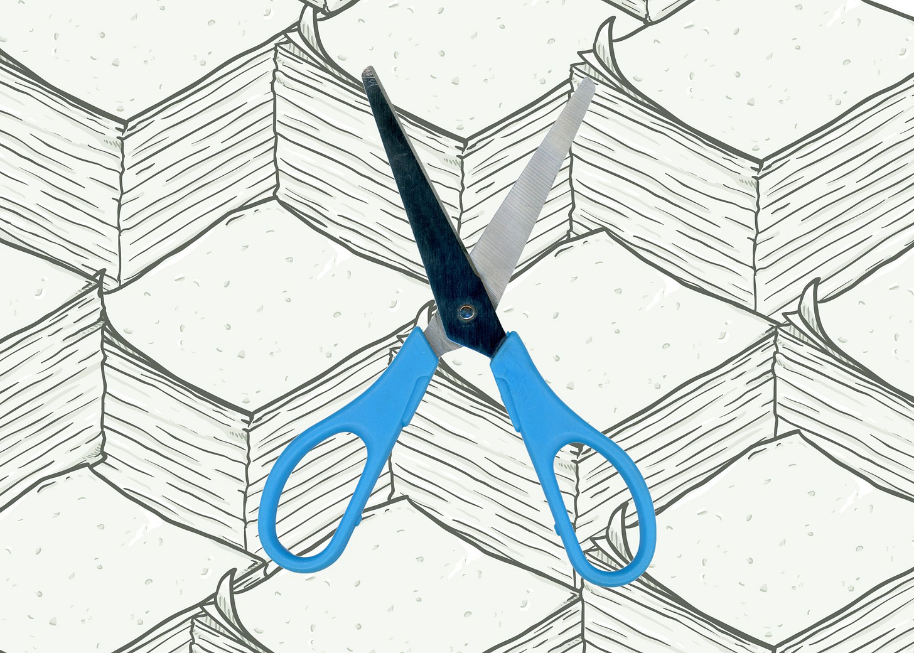
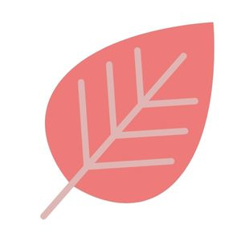

# Unlearning the Lessons That No Longer Serve Us

*How to stop doing the things that worked until they didn’t*

I was sitting at the dinner table cutting restaurant napkins in half, and my husband came by to ask me what I was doing.

When I was a child, I was in charge of cutting our napkins with a pair of giant metal scissors. My dad grew up poor, and he often didn’t have enough to eat. My parents openly expressed concerns about whether we would make the mortgage payments. Simply put, there was a lot of anxiety about money in our home.

Whenever my dad would buy packages of 500 store-brand napkins, or pick up a handful from a takeout place, he would make me sit down and cut them all in half. It wasn't like my dad bought super expensive napkins; they were as thin as tissue paper and very hard to cut. I remember explaining this to David. He thought it was crazy.

These behaviors stay with you. A few months ago, there were some napkins on the table that felt a little thick to me, so I took out a pair of scissors and started to cut. My husband told me I had to stop.

Old habits die hard. I remember my dad looking over my home and examining my napkins once. He didn't say anything or make any criticisms, which I appreciated, but I knew what he was thinking. Even now, part of me still feels a little guilty about using an entire napkin at dinner, although my dad passed away over a decade ago.

We all carry these lessons of our past that haunt us in little ways. Maybe we were once told that we were too aggressive by a former manager, so we changed our personality to fit in better. Maybe we were taught to be seen but not heard. Or maybe we grew up with an unhealthy relationship with money. These behaviors may have served us once, but so many of them have outlived their usefulness—and some may have even become harmful.

[Subscribe now](https://debliu.substack.com/subscribe?)

## **Identifying what to unlearn**

I once worked with somebody who was very hard to get to know. I really struggled with our relationship, because it felt like she was always keeping me at a distance. Finally, I asked a few people who were close to her how to work with her. Someone who reported to her said, “She has a singular API. You have to learn to tap into it.”

At first I thought it was a little strange that *I* was the one who had to bend, but this was an important relationship, so I learned to adapt to her. It wasn’t until later that I realized I had the same kind of rigidity. My API was just as fixed as hers, but in different ways and different areas. What that relationship taught me was that there’s no way for two people to dance together if they don't know each other's steps. I learned to adapt to hers, and she, in turn, adapted to mine.

We can see bad habits in others but not in ourselves. It’s so easy to identify the behaviors that are holding someone else back, but identifying them in ourselves is a completely different matter. They’re called “blind spots” for a reason. The first step toward unlearning these behaviors is to identify what exactly is holding us back—what’s no longer serving us.

I once went through a calibration session with my team. As we ran through the various people, there was one person who everyone was rating poorly. I couldn’t figure out why. He had been super successful in his career until now, so what was getting in the way? After some investigation, I began to realize that he had a pathological desire to not make anyone unhappy. This led him to contort himself in different ways to avoid ever being the bearer of bad news. He didn’t want to performance-manage his team out of fear they wouldn’t like him, but this ended up creating more problems. It got to a point where he was not only failing his team, but failing himself. He had the skills, the relationships, and the ability, but his people-pleasing had turned into a fatal flaw.

[Leave a comment](https://debliu.substack.com/p/unlearning-the-lessons-that-no-longer/comments)

## **How to deprogram ourselves**

Identifying the problem is only the first step. We can't change what we don’t acknowledge—and we can't acknowledge what we won’t face. So the first thing we have to do is face who we are and why we act the way we do.

I used to find myself getting very defensive all the time. I grew up in a time and place where I was one of only a few people who looked like me. As a result, I constantly felt like I was on my back foot, always needing to defend my position and stand my ground. It continued like this until Sheryl pulled me aside after a meeting and told me, [“You can stop fighting now. You’ve won.”](https://debliu.substack.com/p/rewrite-your-story-to-change-your?utm_source=publication-search)

It was only then that I realized how destructive this behavior had become. Rather than being inquisitive, I was always asserting my point of view. Rather than being a good listener, I felt like I always had to stake my claim. Rather than bending, I was always holding tight to my convictions. I couldn’t see the forest through the trees. I didn’t realize how many bridges I was burning.

Sheryl’s words made me aware of the issue, but beyond knowing that I needed to change, I also needed to find a way to affect that change. I started to unpack the why. What made me feel the need to always dig my heels in about things that didn't even end up mattering? Eventually, I came to the realization that my early life experiences were what was making me defensive. By understanding the source of the problem, I was able to work to change it.

So, once you’ve realized there’s a behavior you need to unlearn, how do you unlearn it? Here are a few tips from my experience:

* **Seek accountability.** Tell people you are changing, and have them hold you to it. Sometimes just announcing your plans to others, and having someone to answer to, can help you stay disciplined.
* **Get advice.** It’s hard to spot unhelpful behaviors in ourselves, but others can often see them better. If you feel something is holding you back, but aren’t sure what, seek feedback from others. You may be surprised by what you learn.
* **Check in.** From time to time, ask those around you how they feel about your progress. Have them tell you if they see you backsliding, and if they do, get their input on why.
* **Look forward.** Once you realize you’ve been held back by your old behaviors, it can be easy to get caught up in guilt and self-blame. But dwelling too long on what you’re trying to change can keep you from actually changing it. Rather than obsessing over how you once had it wrong, look forward toward what is to come.

The process of unlearning behaviors that once helped us can be challenging and sometimes painful. You may stumble from time to time. Progress isn’t always linear. But enlisting other people can make it more manageable and keep you from falling back into old habits.

[Subscribe now](https://debliu.substack.com/subscribe?)

## **Teaching ourselves new lessons**

Getting rid of the behaviors that no longer serve us is only the first piece of the puzzle. If we don’t have behaviors to replace them with, we will inevitably default to what worked for us in the past. That’s why the best way to move forward is to start doing things differently.

A substantial number of Vietnam veterans were addicted to heroin while in the field. The Nixon administration was worried about bringing so many people who were active addicts back to the U.S., so they commissioned a study on rates of addiction among veterans. It turned out to be unnecessary. [Nearly everyone who came home left the addiction behind](https://pubmed.ncbi.nlm.nih.gov/27650054/).

What changed? The answer is *everything*. Expectations, relationships, ease of access, and environment all played a factor. Replacing one set of circumstances with another changes the way you look at the world. Even something as difficult as overcoming heroin addiction is possible if you replace it with something even better.

Beyond just identifying what you need to change, reflect on what you want to change it *to*. Seek input from others, and visualize a new situation that’s more in line with your current goals, relationships, and values. Be consistent, and sooner or later you’ll find that your vision has become your new reality.

---

I’ll admit, I still buy the thin, Kirkland-branded napkins at Costco. I still save my napkins from takeout restaurants and make sure they get used. I once even forced my family to use some napkins that my late mother-in-law bought in the 1990s. But I don’t cut them anymore.

Old habits die hard, but with work and reflection, they *can* eventually die.

Get more from Deb Liu in the Substack app

Available for iOS and Android

[Get the app](https://substack.com/app/app-store-redirect?utm_campaign=app-marketing&utm_content=author-post-insert&utm_source=debliu)