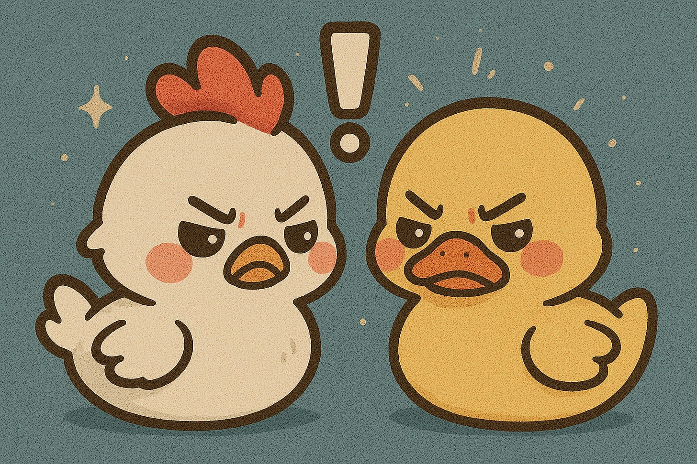
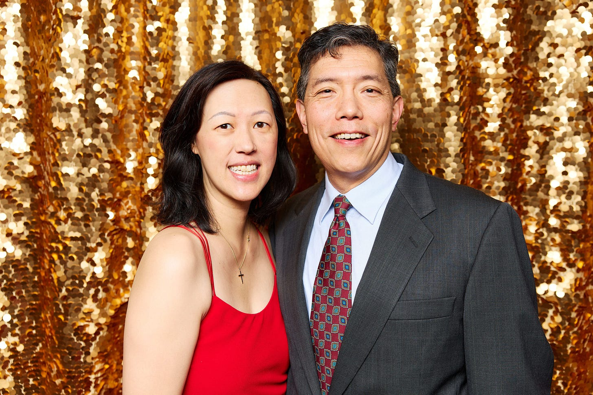

# Chickens Talking to Ducks

*How You Can Be Saying the Right Things Yet Be Misunderstood*

There's a Cantonese saying my mom often used: "雞同鴨講." It's like a chicken talking to a duck. Both are speaking their own language, both are making sense in their own eyes, but neither understands the other.

[The night before my breast cancer surgery](https://debliu.substack.com/p/what-we-learn-from-sickness), I couldn't sleep. It wasn't just the surgery. It was what they might find that could change everything. I asked David to stay and talk with me. But he was closing the sale of his company. He tucked me in, repeated his now-familiar line, "You'll be fine. It was caught early," and went back to his home office. I heard him working throughout the night (I couldn't sleep anyway) so he could be there when I came out of surgery.

Alone in the dark, I wrote him a long note about my fears and shared the Google doc. I'm fairly sure he never read it. After all, he was swamped with the deal.

David is a devoted husband of 25 years. We started dating almost 30 years ago. We've weathered highs and lows together, and I've never once doubted his love or loyalty. Yet in those moments, he felt miles away.

### **Who Are You Talking To?**

Recovery was slower than I wanted. I'm not a good patient, and I was impatient to get back to normal. After starting radiation treatment, I made the mistake of scheduling a two-week vacation to Asia just days after the month-long treatment ended. The doctor warned me: "It's after treatment where you'll really feel it."

Of course I struggled. I was bone-tired by evening. I was in pain for many days, and I could barely lift my arm. None of this was conducive to David's favorite type of vacation where every day is packed with physical activities. He was kind and helpful, but whenever I mentioned anything to do with radiation, he immediately said, "You don't have cancer anymore. You're fine."

Objectively, he wasn't wrong. [Thanks to my friend Mauria, who ensured I was diagnosed early, I had access to the best doctors and tolerated treatment well.](https://debliu.substack.com/p/drawing-the-cancer-card) After following all the protocols, chances were good that this would all be behind me.

But I wasn't looking for clinical accuracy. I wanted him to hear me. Instead, it felt like dismissal. Chicken talking to a duck.

[Leave a comment](https://debliu.substack.com/p/chickens-talking-to-ducks/comments)

### **The Why Behind the Words**

I know what some of you are thinking about how awful he sounds. But here's the thing. He's an incredible husband. [I've written about our 60-60 marriage](https://debliu.substack.com/p/the-60-60-relationship), about how a great partner can make a career possible. David has been that partner.

David and I at Golden Gate YPO

What I eventually realized is that his response wasn't for me. It was for him.

By repeating "You'll be fine," he was trying to cope with something outside his control. He thought minimizing the problem would take away my fear because that's what took away his fear.

When people found out my dad had Stage 4 cancer, they asked what kind. I'd say "lung cancer," and they'd ask if he smoked. I get why. They want to know if they're at risk. If he smoked, maybe he brought it on himself. If he didn't, then they could get it too.

No, he didn't smoke. And yes, non-smokers can and do get lung cancer.

I always answered their questions because I understood why they asked. They needed peace of mind. But each time, I wondered: "What if my dad had smoked? Would they think he deserved to suffer as much as he did?"

### **A Lesson From Pregnancy**

This wasn't the first time we had this dynamic. When I was pregnant with our third child, I had Symphysis Pubis Dysfunction (SPD). I was in constant pain. My doctor urged me to consider disability leave, even early induction. With two toddlers and a full-time job, every step was unbearable.

Then one evening, David strained his back. As the kids ran around, he asked me to put them to bed because he was hurting. I stared at him. "I'm in physical therapy twice a week. The doctor told me to stop working so I wouldn't have to walk places. And you want me to handle bedtime because you pulled a muscle?"

He looked surprised. "Well, you weren't complaining, so I thought you were okay."

I laughed. "If I complained every time I was in pain, I'd always be complaining."

He put the kids to bed.

Chicken meets duck.

This is the paradox of long relationships. [Even couples together for decades don't always communicate better than strangers.](https://news.uchicago.edu/story/couples-sometimes-communicate-no-better-strangers-study-finds) We assume the other person should understand us, when we're often speaking entirely different languages.

David thought he was being reassuring. I heard it as dismissal. Both were true in our own language, and untrue in each other's.

[Share](https://debliu.substack.com/p/chickens-talking-to-ducks?utm_source=substack&utm_medium=email&utm_content=share&action=share)

### **Say It Out Loud**

After the fiftieth time, I wondered why he kept saying I'd be okay, I finally understood. He wasn't trying to silence me, he was trying to reassure himself.

When I hear "You'll be fine" now, I remind myself: this is his way of coping with a scary situation. He watched both my parents die of cancer, including caring for my mom during her time in in-home hospice. His parents also recently passed within three months of each other. His mom was healthy one day and gone the next.

I finally told him what I actually needed: "I know you want to believe I'll be fine, and statistically, you're right. I'm very lucky it was caught early. But right now I need you to hear that I'm scared and hurting."

He completely changed his approach after that.

[Leave a comment](https://debliu.substack.com/p/chickens-talking-to-ducks/comments)

---

Long ago, I realized I was likely to put my foot in my mouth. So when someone is hurting, I now ask: "What does support look like to you?" Give the other person a chance to tell you their language, then learn to speak it, even if it's not your native tongue.

In all relationships, whether marriage, work, or friendship, sometimes it's a chicken talking to a duck. Two people may be speaking different languages, but try to bridge the gap anyway.