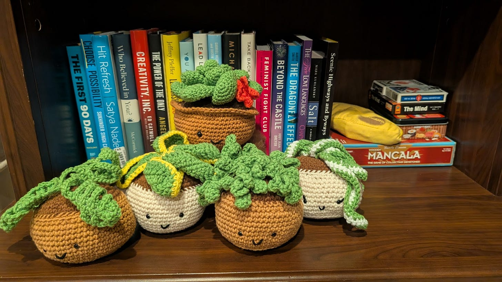
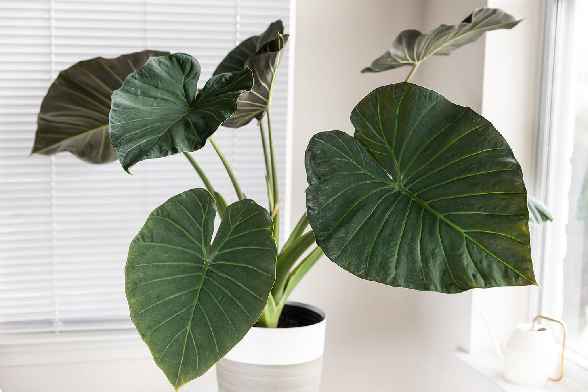
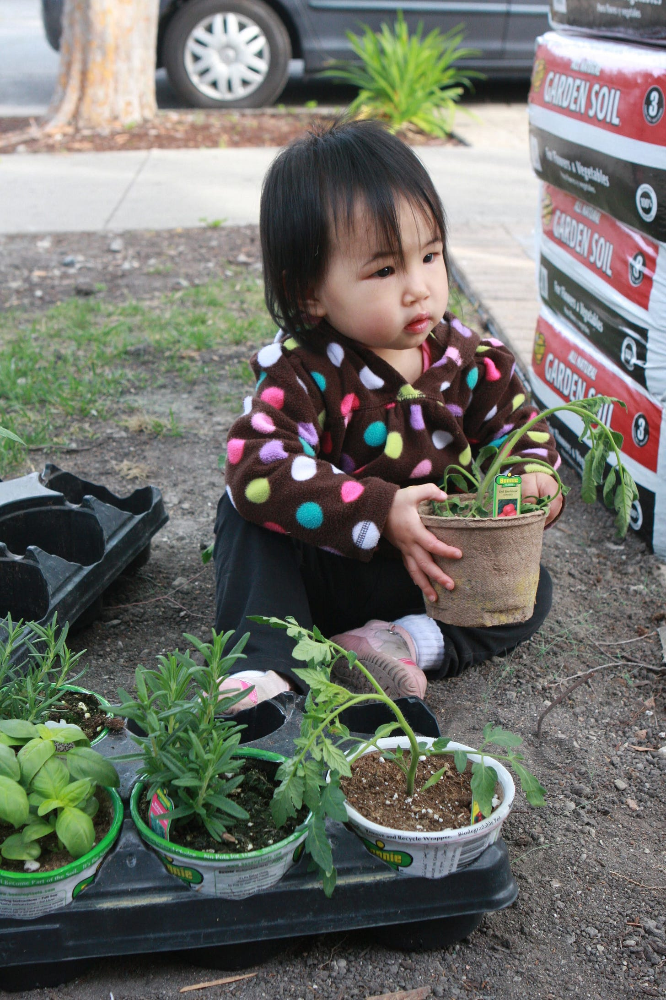

# How Does Your Garden Grow?

*What I Learned from the Plants in My Home*

David and I joked that I had a black thumb. For the life of me, I could not keep a plant alive. They just wilted around me. I forget to water or overwater or put them in the wrong light. We even planted a vegetable garden that David built, but it died off after just one year of success. Afterward, I tried repeatedly to revive it, but it never thrived again. Eventually, I gave up on gardening, deciding I simply wasn’t someone who could grow anything.

Then, when I was about to go into surgery, my friend Lindsay Trout sent me a beautiful plant: an Alocasia Regal Shields. It was huge. I opened it in my office and the smell of fresh soil permeated the room. It was love at first sight. David begged me to give it away to someone who could care for it, but I was determined. This was my chance for a do-over. This wasn’t just another houseplant, it was a living reminder of her care and resilience. I knew little about how to keep it alive, but I was determined to learn.

Alocasia Regal Shields known as an Elephant Ear (photo from The Spruce)

[Subscribe now](https://debliu.substack.com/subscribe?)

## **Lessons From My Parents’ Garden**

Growing up, my parents always had a vibrant garden. They longed for produce and melons from Asia, but we lived in a small town in South Carolina where the nearest Chinese grocery store was nearly 6 hours away. We couldn’t find their beloved foods in our local Piggly Wiggly or Food Lion, so they planted their own. Lemongrass, winter melon, bitter melon, long beans, and chives grew in a large patch in our backyard that my dad lovingly tilled. From nothing but some seeds and soil, they created a bounty of Chinese vegetables year-round.

My sister and I were assigned chores. We watered the plants, pulled weeds, and harvested things when told. But it never felt like mine. I never learned how to understand the needs of the plants. Rather, it was more a routine of just doing without thinking. It was their garden, and I was just a helper.

The same was true of the massive number of plants my parents had inside of the house. They had pothos winding down our windows, a 6’ dragon bone cactus by our dinner table, and even a rare [Queen of the Night](https://debliu.substack.com/p/planting-the-seeds) gracing our breakfast room. My parents loved plants with a great passion, but I was indifferent. To me, it was just one more chore on the list.

Now, as an adult, I look back and realize I missed an opportunity. My parents created a home in a far away land by bringing their beloved plants with them. It was an inheritance I didn’t recognize. I only saw the work, not the beauty of what was growing right in front of me.

## **The Temptation to Quit**

Over the years, friends gave me plants as gifts. Each time, I tried again. And each time, I failed. Most of the plants ended up being given away to someone who could actually care for them.

It’s easy to give up on the things that don’t come naturally. We convince ourselves that it’s not “our thing.” But in life, the very things that feel hard are often the ones that teach us the most. Lots of things come easy, but the process of learning is what makes us stronger over time.

Gardening is addictive precisely because it mirrors growth in ourselves. To see something thrive under your care is to realize your efforts matter. And that lesson goes far beyond plants.

[Leave a comment](https://debliu.substack.com/p/how-does-your-garden-grow/comments)

## **The Wrong Environment**

David, the failed co-gardener of my life, has been understandably reluctant to let me grow things at home. “We can barely keep the kids alive,” he joked. “Do we really need more responsibility?”

My youngest helping out in the garden almost 12+ years ago

Still, I set up a little garden in my office. I lined up a few succulents on a shelf behind my desk. I was so proud of myself. But then a founder I met with saw them in my background and said, “They’re going to struggle. They just won’t get enough light down here.” So I bought a grow light.

But he was right. A grow light can’t replace six hours of direct sunshine. I left the light on faithfully, but the succulents withered and grew sparse. Eventually, I carried them upstairs to the kitchen window box. Within weeks, they perked up.

It reminded me of something I’ve learned again and again in my career. [Growth happens when you are in the right environment](https://debliu.substack.com/p/blossoming-in-new-soil-a-different). You can’t artificially replace the right amount of sun with grow lights. Some plants just can’t be grown in certain places. I could water diligently and offer up all of the right plant food, but if the conditions were wrong, nothing would thrive. The same is true of people, teams, and even ourselves.

## **Tending to Relationships**

Someone once told me, “Your garden grows where you tend to it.” That’s true for plants, but it’s also true in relationships.

When you starve a friendship of attention, it withers. When you nurture it with time, care, and presence, it blooms. If you invest in your relationship with your spouse, kids, family or friends, they reciprocate. But if you ignore their needs or just place them where they give you joy but don’t get their needs met, you won’t get a thriving relationship.

I realized I had been starving my succulents of light because I wanted their company near me. But my need was not what they needed. By placing them where they could thrive, I saw them less often, but they became healthier, stronger, more beautiful.

Relationships are the same. Sometimes we hold too tightly, demanding they grow where we want them. But the healthiest ones flourish when we put them in the right conditions, even if that means letting them go a little.

[Share](https://debliu.substack.com/p/how-does-your-garden-grow?utm_source=substack&utm_medium=email&utm_content=share&action=share)

## **Learning to Care for Others**

The Alocasia Regal Shields taught me this lesson all over again. At first, it struggled. I moved it from room to room, trying to find a home. Too much light, not enough light, too much water, too little. To complicate matters, it was poisonous to dogs, so I had to keep it out of reach of Wonton (our dog), who was very curious about her potential new plaything.

For a few months, it looked unhappy. Its leaves drooped, and some even yellowed and withered. I was a bit afraid to ever invite Lindsay to my house again because of how sad the poor plant looked. Eventually, I found the right spot. Bright enough, safe enough, stable enough. And once I did, it settled in. Today, it thrives there, and every time I walk past it, I smile.

That plant became a reminder that trial and error is part of growth. Rarely do we get it right the first time whether in gardening, in careers, or in relationships. We have to learn how to help plants thrive by understanding their needs and finding ways to meet them. Rather than giving up this time, I read up on Alocasias, and I realized what I did wrong. I learned, adapted, and changed to make sure I took care of its needs. This week I even bought a larger self-watering pot to help it thrive when we travel.

## **Outgrowing the Box**

One of the succulents I kept in my office was given to me by my friend Vijaye Raji after I spoke at his company. I have had it for awhile, but lately it looks cramped, spilling over the edge of its pot. It has outgrown its container.

How many times do we do the same? We sit in a role, a company, or even a relationship that once fit us perfectly, only to realize it no longer gives us the space to grow.

I’ve seen this over and over in my own life and in the careers of people I’ve mentored. Sometimes the most important thing you can do is recognize when it’s time to repot yourself into a new job, a new environment, or even a new mindset.

Growth demands space. And sometimes, the box we’ve been in, no matter how comfortable, simply isn’t big enough anymore.

## **What Gardening Teaches Us**

* **Environment matters.** You can’t expect to thrive when the conditions are wrong.
* **Attention matters.** Growth requires consistency, not occasional bursts of energy.
* **Caring matters.** Learning, then implementing, is important. Trial and error are not signs of failure but of learning.
* **Space matters.** To flourish, sometimes we need to be repotted.

These lessons apply whether you are raising children, building a career, leading a team, or nurturing friendships.

---

I used to think gardening was about control. If I watered enough, or trimmed enough, or fussed enough, the plants would do what I wanted. Now I see it differently. Gardening is about partnership. The plant already knows how to grow. My job is simply to create the conditions where it can.

So how does your garden grow? Not perfectly. Not without mistakes. But with care, patience, and a willingness to try again, it can thrive.

And maybe you’ll discover that you don’t have a black thumb after all.

[Share Perspectives](https://debliu.substack.com/?utm_source=substack&utm_medium=email&utm_content=share&action=share)