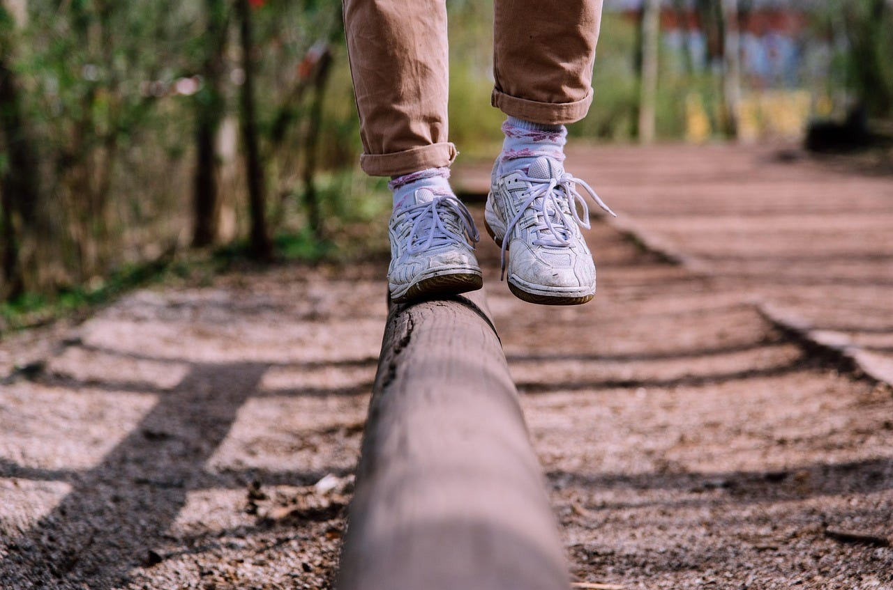

# No Pain, No Gain

*How physical and mental challenges make us stronger at any age*

A couple of years ago, a friend suggested I get a DEXA scan. My doctor, also an Asian woman, reassured me it was unnecessary, given it was not within the guidelines for screening at my age.

I hesitated. Maybe she was right. But I also thought back to what osteoporosis did to my mother-in-law and mom. Bone health is one of those things you cannot see until it is too late. I offered to pay for the scan out of pocket, just to be safe. She agreed to place the order, and I am grateful she did because the scan showed I had osteopenia, a condition where bone density is lower than normal but not yet at the point of osteoporosis.

When I looked at the risk factors, I could check nearly every box. Being Asian, getting little sun, eating very little dairy, and having done minimal weight-bearing exercise in my teenage years all put me in a higher risk category. The scan was my wake-up call.

[Subscribe now](https://debliu.substack.com/subscribe?)

### **Learning to Stand Again**

That diagnosis pushed me to start weight training in earnest. I had been working out for years, but mostly cardio. This was different. One of my biggest weaknesses was balance. I have always had terrible balance. I could be walking down the street and trip over nothing at all. As a teenager and into my early twenties, I always seemed to have a collection of bruises from falling.

My friend [Ami Vora](https://www.linkedin.com/in/ami-vora-5069728) suggested I get a [balance board](https://amzn.to/4mf7U6q). I bought the one she suggested, and I quickly discovered just how bad my balance really was. The first few dozen times I stepped on it, I couldn’t even last more than one or two seconds. In fact, I think I almost twisted my ankle several times. Then, somewhere around the fiftieth attempt holding onto the back of a chair, something shifted. I could stand for a few seconds. A few sessions later it was a minute, then several minutes, and now I can balance through most of a half-hour show without falling on my face. If you had told me this was possible a few months before, I would have laughed. But here I am. It was not magic. It was the result of doing something hard over and over until my body figured out what balance was. Better late than never.

[Share](https://debliu.substack.com/p/no-pain-no-gain?utm_source=substack&utm_medium=email&utm_content=share&action=share)

### **Why Growth Hurts**

That same friend writes a Substack called *[The Hard Parts of Growth](http://amivora.substack.com)*, where she shares the often-unseen work of building, leading, and scaling. She writes about how growth is not just the thrill of reaching the summit, but the struggle of climbing when you cannot even see the top.

When we are young, growth is built into the rhythm of life. New classes, new teachers, new challenges arrive every few months. As adults, it is easy to plateau, doing the same things in the same way for years. But growth happens when our beliefs are challenged, when we are pushed into unfamiliar territory, when we have to stretch beyond what feels comfortable.

Our muscles grow because we push them past their comfort zone. The fibers in the muscle tissue develop microscopic tears. Your body treats those microtears as damage and repairs them, adding extra protein strands in the process. Over time, this makes the muscle stronger than before.

Our minds work in a similar way. We grow because we push ourselves past our comfort zones. When I got my Tonal, inspired by [Bryce Clarke](https://www.linkedin.com/in/bryceclarke), I cursed it in almost every early session. But I kept going, and now I can lift two and a half times what I could when I started. The discomfort was the point because that is where the growth happens.

### **Learning Something New**

Encouraged by my friend Ha Nguyen, I recently started taking a vibe coding class. I have not coded since Fortran, a language that went out of style at least two or three decades ago.

Naturally, I was lost. I could not make sense of the instructions, the syntax, the logic. It felt like I was failing every day. And then, little by little, I began to understand. The first time I solved something on my own, it felt like a victory. That rush reminded me why I love doing hard things.

I picked a simple project for the class: build a simple website creator for Substack authors. Substack is fantastic for publishing writing, but it is not designed to showcase the other work authors often do. For example, [Marily Nika](https://marily.substack.com/), who wrote a recent column here, teaches incredible [AI Maven classes](https://maven.com/marily-nika), but you would not know it from visiting her Substack page. I wanted to build something that helps someone like her feature her courses, speaking events, and bio all in one place.

Having written a ton of PRDs, it is a totally different perspective to vibe code the experience myself. Seeing what is possible to build in just three days has been both incredibly frustrating and exhilarating at the same time.

[Share Perspectives](https://debliu.substack.com/?utm_source=substack&utm_medium=email&utm_content=share&action=share)

### **Why It Matters for the Long Game**

This is why I believe everyone should have challenges outside of their normal work whether they are hobbies, skills, and projects that keep us thinking and adapting. “Always be learning” is not just career advice. It is a way to keep your mind sharp and your life interesting.

There is also real science behind it. [Studies from the Mayo Clinic](https://newsnetwork.mayoclinic.org/discussion/mayo-clinic-researchers-find-mental-activities-may-protect-against-mild-cognitive-impairment/) and the National Institute on Aging show that challenging mental activities like learning an instrument, picking up a language, and [taking on complex projects can help build what researchers call “cognitive reserve.](https://en.wikipedia.org/wiki/Cognitive_reserve)” That reserve can delay the onset of dementia symptoms and slow age-related decline, even diagnosed with Alzheimer’s.

Just like physical exercise is good for your muscles, mental exercise keeps your brain sharp and your memory strong even as you age. Challenging yourself strains you and you respond by rising to the occasion.

### **Breaking the Rut**

For years, I went on the elliptical for thirty minutes a day. Same speed, same resistance, same everything. I was not getting weaker, but I was not getting stronger either. I had plateaued without even realizing it. Now I mix up my workouts. Some days it is weights, some days balance work, some days back on the machine. That variety keeps me engaged and pushes my limits.

---

Breaking out of the rut means challenging yourself to do something out of the ordinary. Take dance lessons. Try to vibe coding. Learn a new language. The hard part of growth is that it is uncomfortable and even at times painful. The best part of growth is that it changes you in ways you cannot imagine at the start.