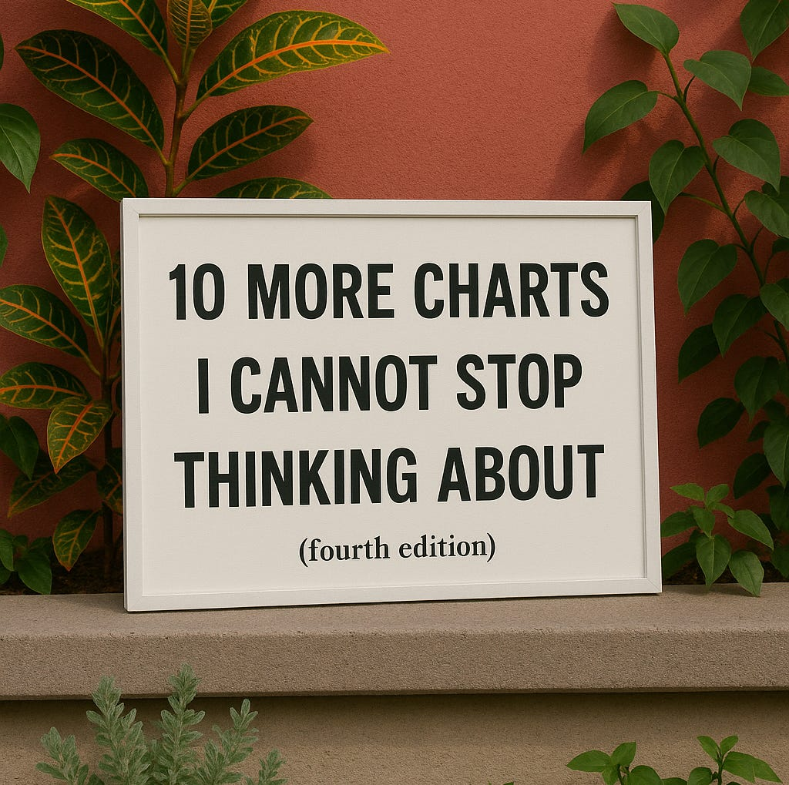
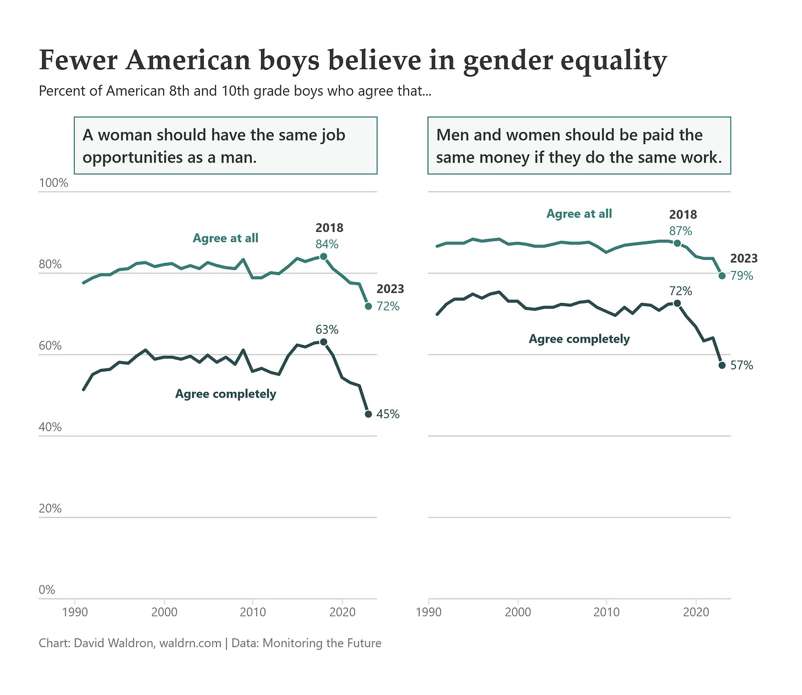
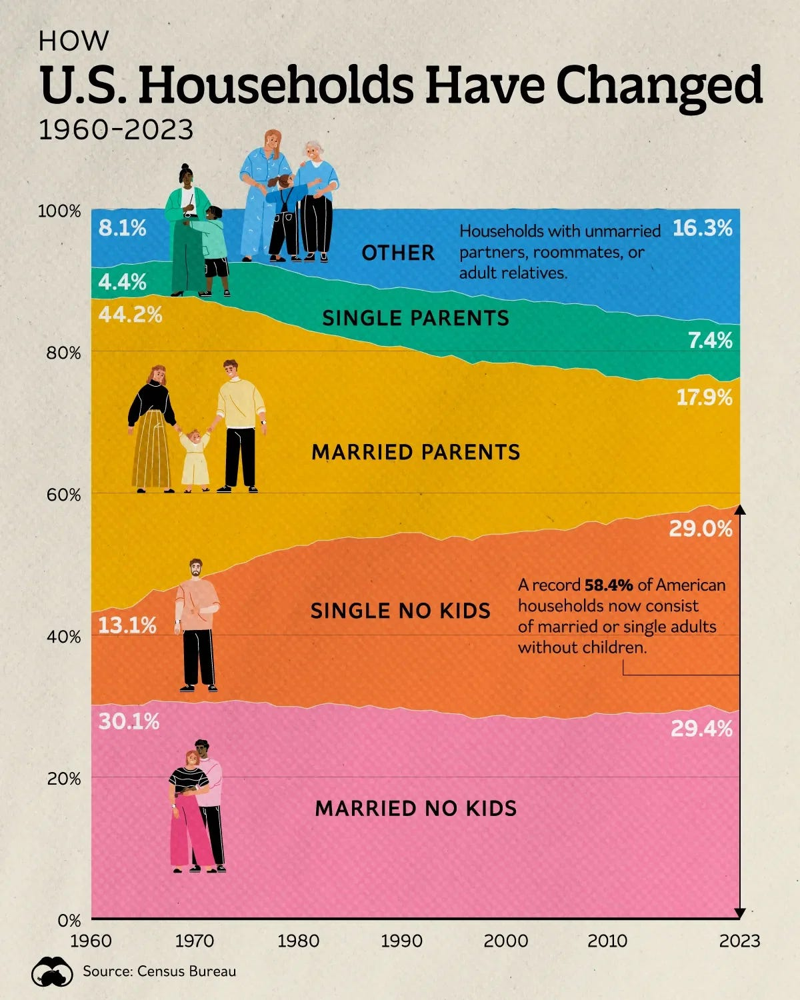
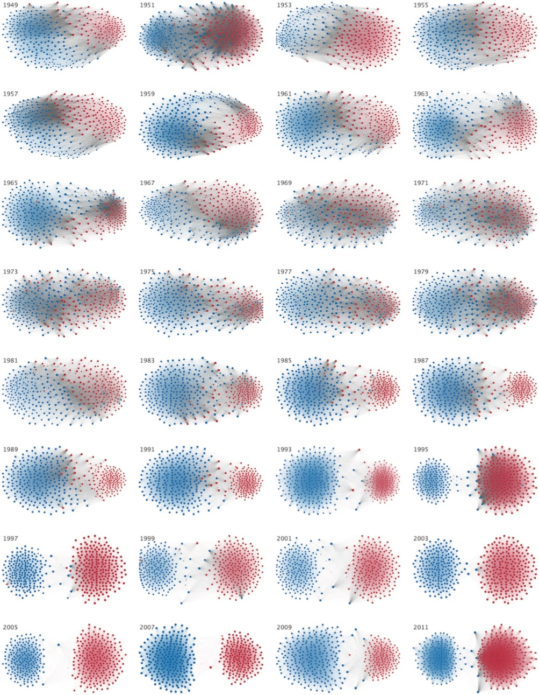
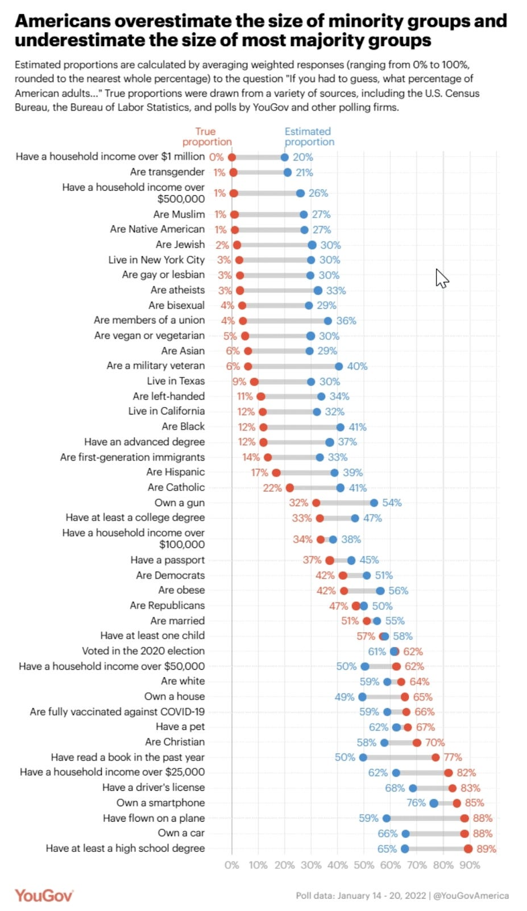
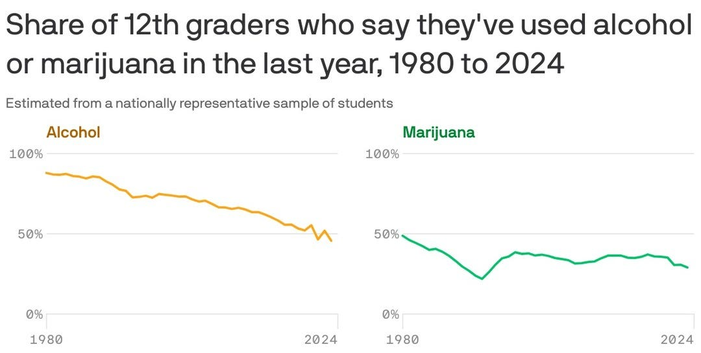
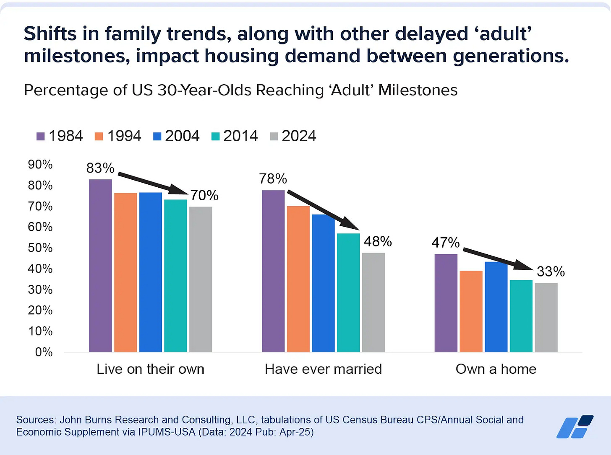
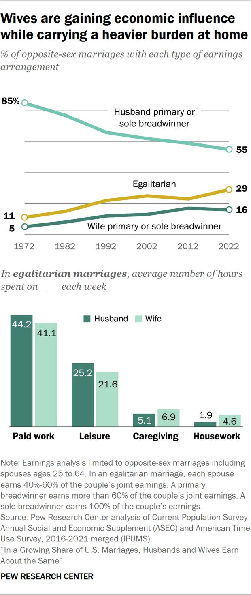
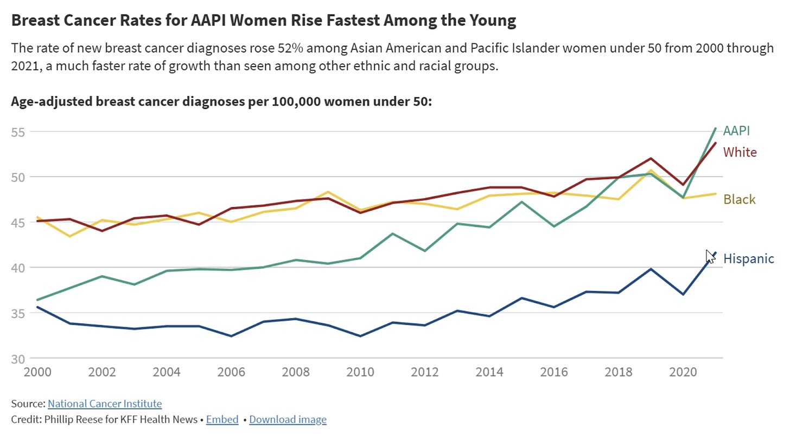
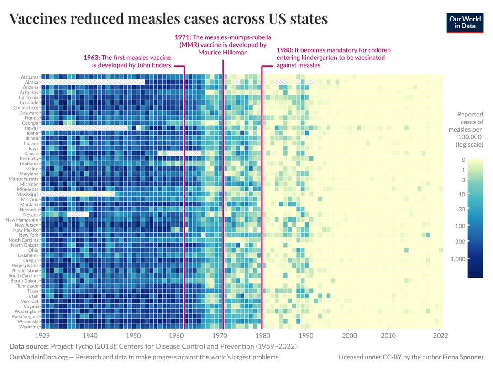

# Ten More Charts I Can’t Stop Thinking About - Fourth Edition 

When I first started collecting “Ten Charts I Can’t Stop Thinking About,” I didn’t expect it to become a series. But here we are at the fourth edition. I just collect them in my notes until I get about a dozen and then pull together a post. These are visuals I encounter in news articles, social media, or in books. Many are counterintuitive or surprising in some way. Sometimes, because they challenged what I thought I knew, sometimes because they confirmed something I’d felt but hadn’t seen in the data.

Great visualizations make it possible to see the world in new and interesting ways that weren’t obvious before. They can open our eyes and also teach us new things that are hard to explain in mere words.

If you want to explore the earlier ones, here are the first three editions:

* [Ten Charts I Can't Stop Thinking About](https://debliu.substack.com/p/ten-charts-i-cant-stop-thinking-about)
* [Ten More Charts I Can't Stop Thinking About](https://debliu.substack.com/p/ten-more-charts-i-cant-stop-thinking)
* [Ten Charts I Can't Stop Thinking About: Third Edition](https://debliu.substack.com/p/ten-charts-i-cant-stop-thinking-about-855)

Here’s what caught my attention over the past year.

[Subscribe now](https://debliu.substack.com/subscribe?)

## **1. American boys are becoming less supportive of gender equality**

[Source: David Waldron](https://blog.waldrn.com/p/american-boys-have-become-less-supportive)

Progress is not always linear. One of the more interesting cultural shifts is the decline in young men’s support for gender equality. This is happening in a time when girls are outpacing boys in educational attainment, yet still face barriers in the workplace. What this chart does not explain is “why”. [Dave Waldron does a good job debunking some common myths, such as the use of social media, playing online games, or social isolation,n driving this decline. His article on the topic is well worth reading, and he cites a correlation between religiosity and less support for gender equality as one area worth looking into](https://blog.waldrn.com/p/american-boys-have-become-less-supportive).

### **2. Nearly 60% of U.S. households don’t have kids**

[Source: Voronoi](https://www.voronoiapp.com/demographics/Over-Half-of-Households-in-the-US-Dont-Have-Kids--2933)

It’s a striking demographic shift in the US. Nearly 60% of US households don’t have a child at home. [According to Voronoi, this is partly due to the drop in fertility rate to 1.6, well below the replacement value of 2.1.](https://www.voronoiapp.com/demographics/Over-Half-of-Households-in-the-US-Dont-Have-Kids--2933) [This is happening throughout the world as mentioned in Chart 9 of my last post](https://debliu.substack.com/p/ten-charts-i-cant-stop-thinking-about-855). For decades, our society centered around the “typical” child-centric household, but that is changing. It has profound impact on the housing market, where people want to live, and how we organize our communities.

### **3. Political polarization is deepening**

[Source: One First](https://www.stevevladeck.com/p/171-partisan-gerrymandering-after)

I shared a version of this in Chart 4 of my last post about how Americans view the other side increasingly as dishonest, lazy, or immoral. This is also reflected in our legislative bodies. In the past, it was common for lawmakers to work across party lines to pass major legislation. Today, the distance between political parties has widened to historic levels so much so that there is no room for compromise or shared purpose. This chart illustrates this starkly. For leaders, whether in politics or business, polarization makes it harder to find common ground. [This Business Insider video shows this pattern over time](https://www.youtube.com/watch?v=tEczkhfLwqM), but seeing it in an image is also quite revealing.

[Share Perspectives](https://debliu.substack.com/?utm_source=substack&utm_medium=email&utm_content=share&action=share)

### **4. We overestimate the size of small population groups**

[Source: YouGov](https://today.yougov.com/politics/articles/41556-americans-misestimate-small-subgroups-population)

Ask people what percentage of the population belongs to certain minority groups, and the estimates are often wildly inflated. And when asked about majority groups, we underestimate. Some of this is driven by the salience of media attention a topic receives. This misperception can drive the wrong policy outcomes or skew our sense of what our society looks like for good or for bad. It also distorts resource allocation while fueling fears of change. [Before you look closely at this chart, tell me how many people you think have a household income of more than $500K](https://today.yougov.com/politics/articles/41556-americans-misestimate-small-subgroups-population)? Are Black? Or are vegetarians?

### **5. Teen drug and alcohol use is at historic lows**

[Source: Axios](https://www.axios.com/2024/12/30/teenage-drug-alcohol-use-declines)

While the data on teen boys’ support for gender equality was depressing, there are bright spots. Teen drug and alcohol use has fallen to record lows, suggesting that changes in cultural attitudes and prevention efforts are working. There’s a generational shift happening. Teens today are less likely to drink, smoke, or use drugs than their parents or older siblings were at the same age. It’s a reminder that social change can be for the better as young people pick up better habits toward wellness.

### **6. Young people are hitting life milestones later**

[Source: John Burns](https://jbrec.com/insights/life-choices-shift-us-homeownership/)

By the time I was 30, I was married, owned a home with my husband, and had a child on the way. But marriage, buying a home, and having children are happening later than ever. Some of this is by choice, some by circumstance. High housing costs, inflation, student loan debt, and a less stable job market all likely play a role. It is becoming harder and harder for young people to “launch” in our society. This is exacerbating the lower birth rates where it feels unaffordable to have children today.

### **7. Women are outearning husbands more often, but still doing more housework**

Source: Forbes

My husband and I have an egalitarian marriage. At different times we have been the breadwinner. I helped him pay off his law school loans, and he put me through business school. [We have always had a balanced relationship because we believe in the 60-60 relationship](https://debliu.substack.com/p/the-60-60-relationship).

When I saw this chart, it was a reminder that not all relationships are the same. I had always assumed that greater economic equality would naturally lead to equality in the home. Yet even in an egalitarian marriage, women work a bit less but do much more at home. Change at home still lags behind change in the workplace, and this is a reminder we still have a long way to go.

### **8. Breast cancer rates are rising among Asian American women**

[Source: CBS News](https://www.cbsnews.com/news/breast-cancer-asian-american-pacific-islander-women/)

While breast cancer rates have declined or stabilized for many groups, they’re rising for Asian American and Pacific Islander women. According to CBS News, “[The rate of new breast cancer cases among Asian American and Pacific Islander women under 50 grew by about 52% from 2000 through 2021. Rates for AAPI women 50 to 64 grew 33% and rates for AAPI women 65 and older grew by 43% during that period. By comparison, the rate for women of all ages, races, and ethnicities grew by 3%.](https://www.cbsnews.com/news/breast-cancer-asian-american-pacific-islander-women/)”

[I was recently diagnosed with DCIS, an early form of breast cancer thanks to my friend, Mauria](https://debliu.substack.com/p/drawing-the-cancer-card). Turns out that I am right in this demographic where cancer risk has been increasing quickly, and I never noticed. This could be due to a mix of genetic, lifestyle, and environmental factors at play. Given we don’t know the cause, early detection is key.

[Share](https://debliu.substack.com/p/ten-more-charts-i-cant-stop-thinking-beb?utm_source=substack&utm_medium=email&utm_content=share&action=share)

### **9. Weekly religious service attendance correlates with happiness**

People who attend weekly religious services report higher levels of happiness than those who don’t. While there is not a specifically cited cause, note that online attendance does not increase happiness, only in-person. I suspect it is due to what you build by going to a place to focus on the same thing together. To commune is to connect and build intimacy. Showing up is an important part of community we have yet to replicate online.

We are hosting an event this coming weekend where we invited all of the people from every Bible Study we have been a part of for the past two decades in California to celebrate our anniversary. We met these people at church and they became lifelong friends.

### **10. Vaccines have nearly eliminated measles in the U.S.**

[Source: Reddit post with accompanying links](https://www.reddit.com/r/dataisbeautiful/comments/1kqa84b/oc_vaccines_reduced_measles_cases_across_us_states/?share_id=nQoDFrRGSAqOZZza5uQjz&utm_content=1&utm_medium=android_app&utm_name=androidcss&utm_source=share&utm_term=1)

If you want a case study in how science changes lives, look at the drop in measles cases after widespread vaccination. Once a common and dangerous childhood illness, measles has been nearly eradicated in the U.S. But that success is fragile, and we need to stay vigilant. Outbreaks can resurface quickly if vaccination rates fall and herd immunity is not maintained. It’s a vivid example of how public health gains have changed lives so much that most of us don’t remember a time when we knew someone who was hospitalized or killed by this communicable disease.

[Share Perspectives](https://debliu.substack.com/?utm_source=substack&utm_medium=email&utm_content=share&action=share)

---

If you’ve seen a chart lately that made you rethink something you thought you knew or believed, I’d love to hear about it; leave me a note in the comments!. Maybe it will show up in Version Five!