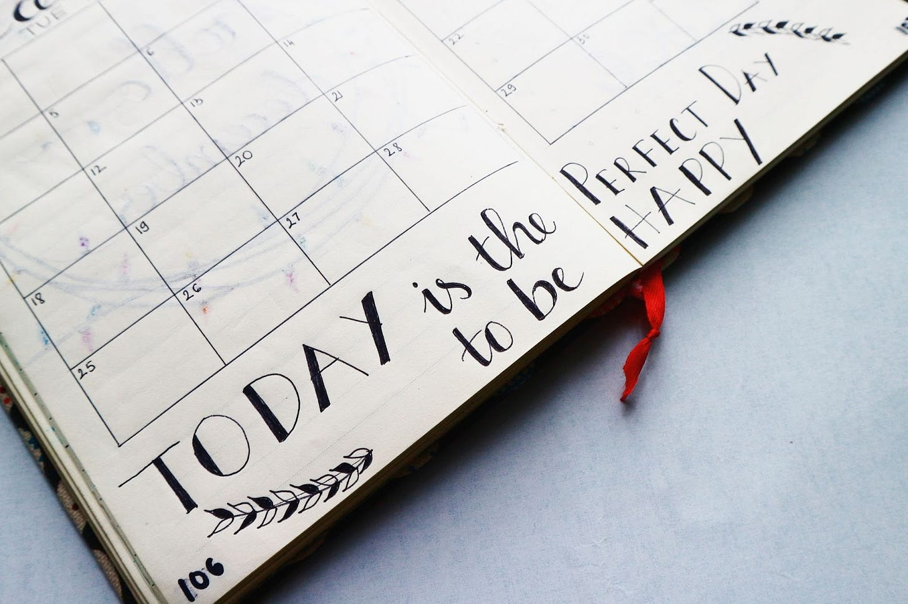
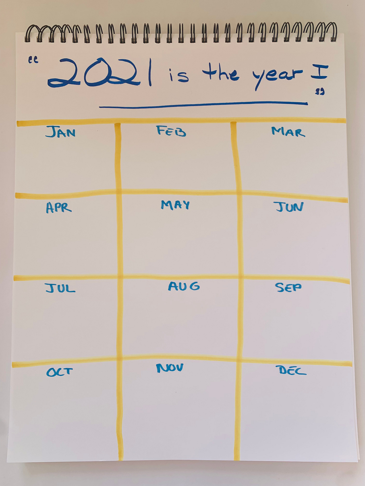

# Day 1: Celebrating 2021 Will Help Set You Up for Success in 2022

*Advice from Katia Verresen, KVA Leadership*

Photo by [Bich Tran](https://www.pexels.com/@thngocbich?utm_content=attributionCopyText&utm_medium=referral&utm_source=pexels) from [Pexels](https://www.pexels.com/photo/writings-in-a-planner-636246/?utm_content=attributionCopyText&utm_medium=referral&utm_source=pexels)

#### Katia Verresen, KVA Leadership

To create your best 2022, you first need to complete your 2021. Too many high performers are self-critical or struggle with imposter syndrome. As a result, they dismiss their well-earned accomplishments. Now’s your chance to take stock of your wins, your learnings, and your completions.

If a year is a movie, why not watch it again and zoom in on different scenes? When we review what we’ve created, we can learn, grow, and be ready for more. Grab a piece of paper. Draw three columns and four rows so you have 12 boxes, one for each month. Think in terms of months and quarters. Starting with January of 2021, go through each month and jot down what stands out: people, places, projects, launches, challenges, and dreams. Take your time and take stock of everything that happened.

When you are done, look at your year as a whole. What stands out? What patterns do you notice? What are you proud of? What was enjoyable? What was painful? How did you grow? What do you want to leave behind in 2021, and what do you want to take with you?

Now go one step further. Create a title to sum up what you have accomplished in 2021 and write it at the top of your poster. It could be something like, “This is the year I…”

This is your 2021 wrap-up. You crossed the finish line. Capture what you learned this year as a way to get started on the next. Wishing each of you your very best in 2022!

---

**Deb’s Note**: Katia’s Year in Review is a profound way to put a year of change and growth into perspective. We tend to want to look forward, but looking back and reflecting gives us the insight and wisdom to choose what is to come. Each year, my husband and I write down everything that happened in our family, month by month, and use it as a foundation to write our Christmas letter. It is a reminder of the many things our minds have deleted or rewritten. I have been coached my Katia for over a decade, and she continuously reminds me how important it is to remember and celebrate before moving forward to what is next.

[See the list of all of the posts to come here](https://debliu.substack.com/p/leadership-coaches-share-their-career).