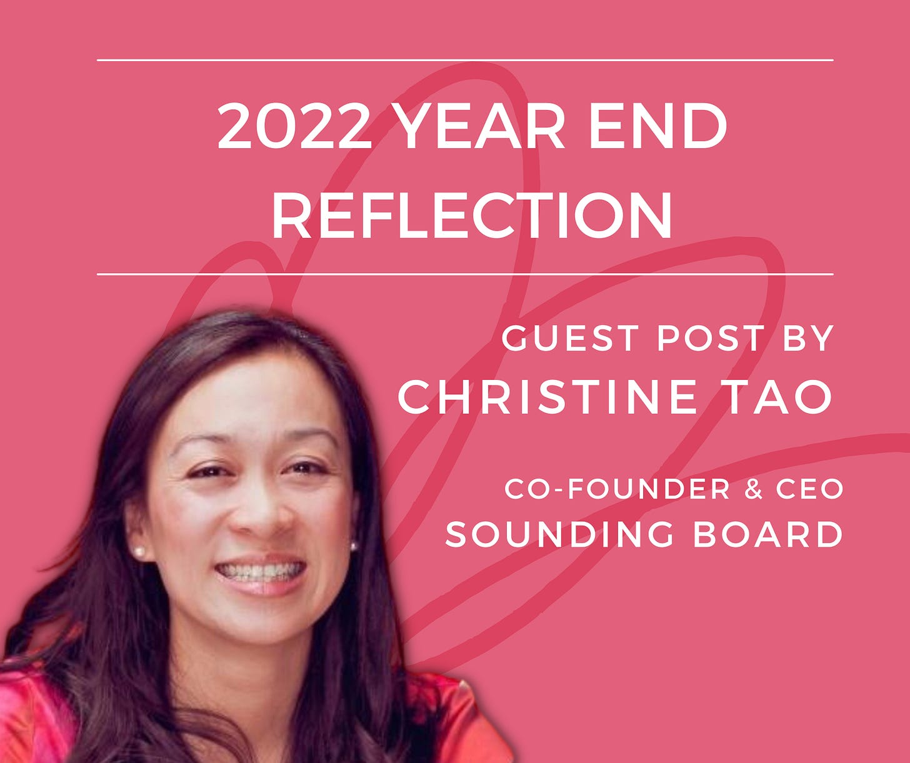

# 2022 Year-End Reflection

*End the year on a strong note with a year in review *

If I had told you at the end of last year that 2022 would shape up the way it has, would you have believed it? A war, a volatile stock market, continued inflation, and now a triple demic are all reminders that the world remains unpredictable. It can feel unsettling when so much uncertainty is unfolding all around us.

As we close the book on 2022, my friend Deb asked me to reflect on ways we can bring closure to a tumultuous year. As the co-founder of [Sounding Board](http://www.soundingboardinc.com), a Series B coaching platform, I have found that reflection is one of the best ways to build resilience. Here are a few ways you can use this practice to close out your year.

[Share](https://debliu.substack.com/p/2022-year-end-reflection?utm_source=substack&utm_medium=email&utm_content=share&action=share)

## **Make a List of Your 2022 Accomplishments**

Would you be able to tell me what your most important achievement was in 2016? What about in 2019? 2022? Most people can only highlight what happened in 2022 because we don’t recall what important things happened in any specific year. The human mind edits and rewrites over time as a way to sort through memories and filter new information. Rarely can we pinpoint when something happened, even if it was something pivotal, like a big launch or a promotion. Instead, we usually have only a fuzzy idea of the whens and the whats.

One professional and personal best practice is to make a list of your accomplishments at the end of the year. Reflect on everything you have achieved as a way of capturing it for yourself and others. Here are three ways to do this:

* **Update your resume and LinkedIn profile.** The end of the year is a great chance to polish up your resume. Remember to add any noteworthy highlights and achievements from the past year so you can keep your progress up to date. You will quickly forget the specifics of what you achieved in 2022, so make sure to capture them before that happens.
* **Write a letter to yourself.** A self-addressed letter is a great way to take a snapshot of your memories and close out the year. Email a copy to yourself and schedule it to arrive in June of 2023, so you can refresh yourself on your achievements well into the year.
* **[Create a Year in Review](https://debliu.substack.com/p/celebrating-2021-will-help-set-you).** Start by making a calendar of all of the things that happened in 2022. Next, take a moment to reflect on everything that happened and how you felt about each event. This will give closure to 2022 and be your perfect springboard into 2023.

Documenting your progress in real time ensures that you won't forget your achievements. It's also a fitting ending to a year that didn’t go the way any of us could have planned.

## **Focus on Learning, Not Just on Achievements**

**"Failures are finger posts on the road to achievement." - C.S. Lewis**

When you see posts about others’ successes on social media, what you're not seeing are the steps they've taken to get there. Those often go unseen and unspoken. You may marvel at their accomplishments and luck, but their hard work—and the failures they've experienced—are hidden from view.

That's why there is something else I recommend you add to your year-end review. Instead of just focusing on what you have done, ***focus on what you have learned***. Putting together a laundry list of achievements is valuable, but many of life’s lessons can only be learned through hardship, missteps, or even failure. If you neglect to reflect on those, you will miss out on at least half of what you have learned throughout the year. Taking stock of what challenges have taught you can help you uncover new mindsets and behaviors you want to carry into the new year.

Here are a few simple steps for taking stock of your learnings:

1. **Write down up to five challenges or failures you experienced this year.** Focus primarily on any recurring challenges you faced, and on the ones that stood out most in your mind. Ask for feedback from one or two people close to you if you are struggling to identify them.
2. **What patterns do you notice among these challenges?** Are they the same issues you face year after year? Are some new?

   1. For those that you were able to overcome this year, what finally changed? What was the behavior change? What was the underlying mindset change?
   2. For those that you are still struggling with, why do you think they continue to be a problem? What is one way you can get unstuck?
3. **What can you learn from this exercise to help you as you go into 2023?** How might you apply the things that worked to tackle new challenges? What will be different about how you address those challenges you are still struggling with?

Earlier this year, I had been struggling to organize our staff meeting. I found myself spending more and more time preparing for it, which made me frustrated when it didn’t go as planned. The stress of the meetings was eating into my productivity time. But this experience taught me that my strengths don’t lie in the details. I learned I was working against my natural tendencies. Luckily, my executive assistant, Laurel, is great at process and structure, and we partnered to find a way forward. Together we created a structure for the meeting, which she now manages, and it is one of our best-run meetings at the company.

As I look back on this challenge now, I see that it taught me an important lesson: when we can, we should play to our strengths, and we don’t always need to do everything ourselves. This is a lesson I’m taking with me into the new year, and I wouldn’t have learned it without facing that initial struggle.

Sometimes the biggest lessons are found within the journey, not just the year-end destination. Reflecting on your “year in learning” is a great way to capture how you have broken negative patterns in favor of new and more productive ones. It's also a way to diagnose the things you haven't yet changed, and to think about how those failures can be turned into successes in the next year.

---

**"The only way to avoid failure is to stop trying new things." - Unknown**

The end of the year often speeds by in a blur. Don’t forget to take some time to pause and reflect—not just on your accomplishments, but on what the challenges of the last year have taught you. Your 2023 will thank you for it!

[Subscribe now](https://debliu.substack.com/subscribe?)

---

Thank you to [Christine](https://www.linkedin.com/in/christineptao-leadership-coaching/) for sharing these thoughts as we head into 2023!

[Leave a comment](https://debliu.substack.com/p/2022-year-end-reflection/comments)