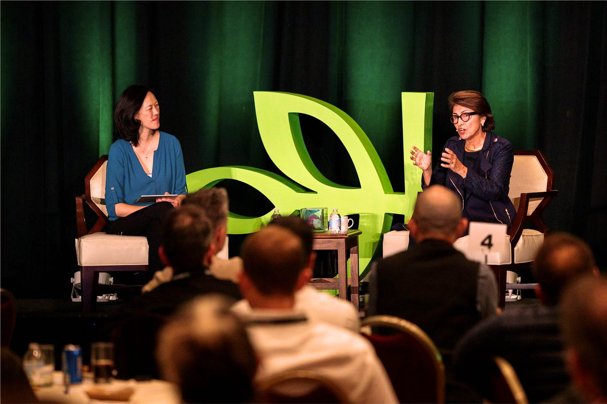
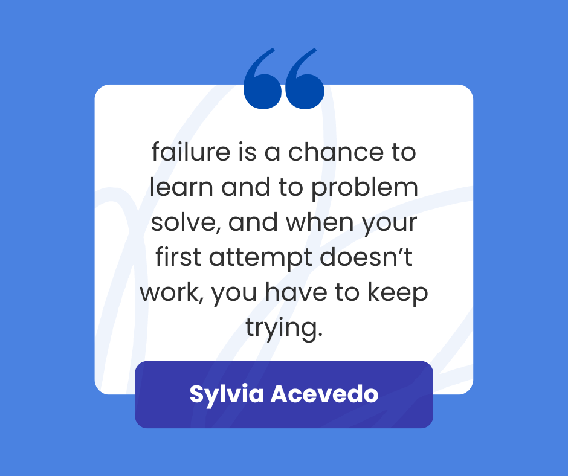
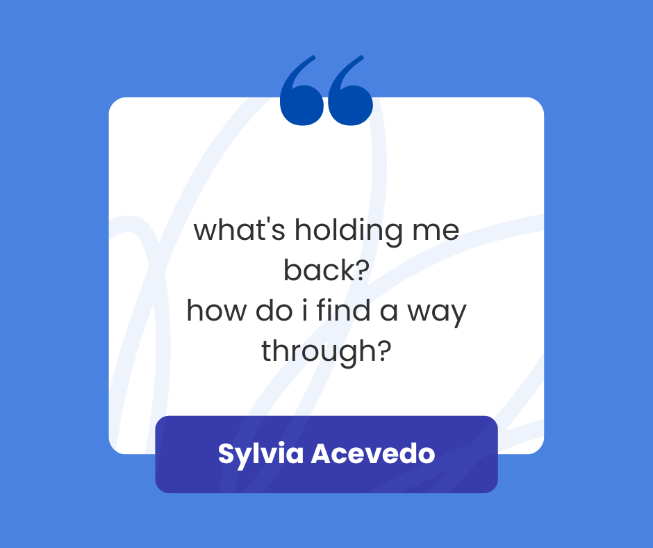
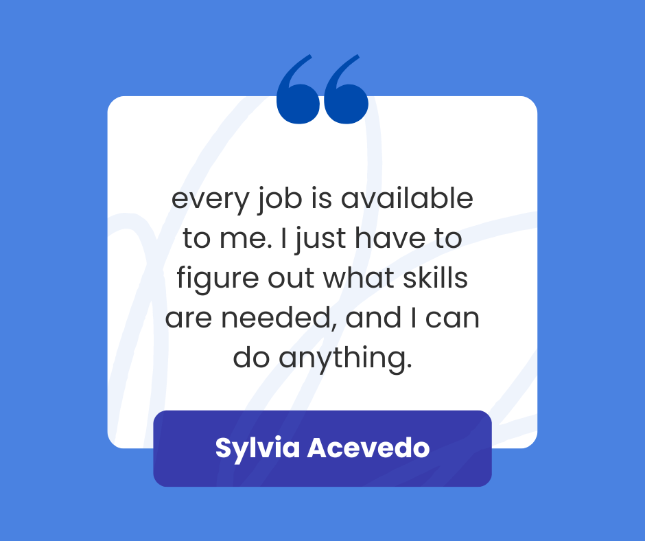
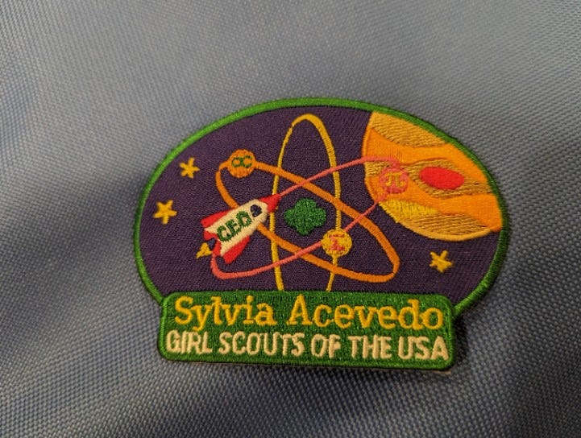

# Path to the Stars - An Interview with Sylvia Acevedo 

*Lessons from an innovator and inspiration to millions of girls *

I recently had the amazing opportunity to sit down with Sylvia Acevedo as part of the Ancestry Leadership offsite. For those of you who aren’t familiar with her story, Sylvia is a literal rocket scientist—she worked on NASA’s SPSP and *Voyager 2* teams—but that just scratches the surface of her accomplishments. She’s held executive roles at companies including Apple, Dell, and Autodesk, and she also founded her own company, CommuniCard. In 2011, she was appointed to the Commission on Educational Excellence for Hispanics by President Barack Obama, and in 2018, *Forbes* named her one of America’s Top 50 Women in Tech.

Most recently, Sylvia served as CEO of the Girl Scouts of the USA, where she led the largest program rollout in its history, including over 146 new badges in STEM, entrepreneurship, civics, and even cyber security. Her latest book, a middle-grade memoir titled *[Path to the Stars](https://www.amazon.com/Path-Stars-Journey-Rocket-Scientist/dp/0358206936?keywords=path+to+the+stars+by+sylvia+acevedo&qid=1670828580&sprefix=sylvia+ace,aps,185&sr=8-1&linkCode=sl1&tag=makerheart-20&linkId=528b4cb44e7c7f03238af4f669551d1f&language=en_US&ref_=as_li_ss_tl)*, was published in 2018 which I read with my girls.

I was lucky to be able to chat with Sylvia about her journey to NASA, the evolution of her career, and how she was able to turn a personal tragedy into the motivation to transform her career. You can find the highlights from our conversation below. I hope you find her advice as insightful as I did.

[Share](https://debliu.substack.com/p/path-to-the-stars-an-interview-with?utm_source=substack&utm_medium=email&utm_content=share&action=share)

### **Tell me a story behind how you became a rocket scientist. What started you on the path looking to the stars, and how did that bring you to where you are today?**

I was born in South Dakota— closer to the Canadian border than the Mexican border—but I grew up in Las Cruces, New Mexico. I joined the Girl Scouts at a young age, and one of the first things we did was an outdoor camping trip. I remember sitting there, staring up at the twinkly lights in the sky. My troop leader saw me, sat down next to me, and started pointing out all the different planets and constellations. Until then, I had been planning to earn my Cooking Badge, like all my friends, but then she said, “How about earning the Science Badge, so you can learn more about space?”

That was the inspiration I needed. I got a model rocket and started trying to get it to launch, and I failed time after time. That experience taught me an important lesson: *failure is a chance to learn and to problem solve, and when your first attempt doesn’t work, you have to keep trying*.

Eventually, I figured it out and made that rocket launch into the bright blue New Mexico sky, and I thought to myself, “I can do this. This is what I want to do.” At the time, you only ever heard about men working for NASA and becoming rocket scientists. But I also knew that, if I wanted to do it, all I really needed was to know science and math. So I worked hard in those subjects. When you’re a kid and you get good at something, you naturally do more of it. The more math I did, the better I got, and eventually I was so good at it that I was able to become a rocket scientist.

### **You shared the story of how you were one of the first women, and one of the first Hispanics, to actually receive a graduate degree from Stanford University. What brought you to Stanford?**

My fourth grade teacher, Mrs. Baldwin, showed us pictures of colleges. One time, she showed us this picture of a university with green, rolling hills, a red tile roof, and all this beautiful sandstone brick, and I blurted out, “I wanna go there.” And Mrs. Baldwin gets up from her desk, walks over to me, and says, “You know, Sylvia, that's one of the best universities in the world. You're a really smart kid. You can go there if you want to.” Just like that, I decided I was going to go to Stanford.

The thing was, my family was poor, and sometimes we ran out of money. We didn't always have a place to live, so for a time we had to go live with other family relatives. I was in the Girl Scouts, but we didn’t have money for everything I wanted to try and all of the badges I wanted to earn. I wanted to do everything that Girl Scouts had to offer.

My troop leader understood my dilemma, so she used selling cookies to demonstrate how I could create an opportunity, set a goal, and break it down into manageable pieces. She said I could cover the costs by selling Girl Scout cookies.  When I first heard how many cookies I had to sell to earn the badges I wanted, I thought, “There’s no way I can do that.” But then she showed me how if I broke it down—selling cookies six days a week, for six weeks—suddenly this overwhelming task became doable. The other advice she gave me was never to leave the site of a sale until I had heard the word “no” three times. My first sale outside of my family and friends was to a neighbor woman outside of her house. I tried to sell her cookies. And she said, “No.” I stood there, wondering what to do. I asked again, and again heard, “No.” I asked a third time, nodding toward the house, “Anyone there want some cookies?” And suddenly I had my first outside sale.

I ended up using those lessons later in life. I broke down that goal of going to Stanford into smaller parts. You have to get really good grades to get in, right? You have to have extracurricular activities. So I started focusing on hitting those smaller goals, as well as on saving money, since it was an-out-of-state school. By the time I was in my junior year of high school, I had a little cash set aside, and I had even set up a Certificate of Deposit at the bank so I could earn interest on it.

But no matter what your dream is, you should always have a Plan B. As I was getting ready to apply to Stanford, my maternal grandmother died while on a trip out of town, and my family desperately needed money to afford the burial. No one else in my family had the money, so I cashed out the CD, giving all that money to my family. I ended up going to New Mexico State, where scholarships paid for my education.

But I never gave up my dream of going to Stanford. I kept saving money and getting really good grades. I eventually did apply, and I got in. All that work finally paid off, I’m very grateful for that.

[Subscribe now](https://debliu.substack.com/subscribe?)

### **You’ve had to deal with things in your life that, you know, most people might never experience. Can you tell us a little bit more about that—about your parents and your sister? About how those events helped you build resilience?**

When my sister was 19 months old, she fell ill to meningitis which spread through the community. I was 5. That really changed our family trajectory. Much later, my father was also struggling with some issues that he never resolved and he felt hopeless. Unfortunately, he took it out on my mother and himself, and it was a massive family tragedy when he ended both of their lives when I was 28.

You can imagine how devastating that was to me, to my entire family. It’s something that shatters your sense of normalcy, your sense of family, your whole reality. It was such a betrayal, and it took a long time to even just be functional again.

At that point in my life, I’d had some success in my career, but after that, you know, I sort of meandered for 15 years, not really going anywhere, and that was frustrating. I was still pretty angry with my dad, so I ended up taking it out on my bosses, who were all male. That's not a great way to develop your career. Eventually I realized that I was still experiencing PTSD from what had happened to my family, and I knew something had to change. I got a lot of professional help, but it was a long, hard road. It’s painful to unring those bells, to own that part of your past and not use that anger to fuel you anymore.

When I finally got to that point of real forgiveness, though, all of a sudden the whole world changed. I think it was so important for me to realize that no matter where I went, there I was, and to get to that point of healing, of embracing the world and not being angry anymore. It was as though I had gone back to being that young person who thinks, “I can create, I can go after my dreams, and I can be resilient.” All these things had happened, but being able to not quit when things weren’t working was huge. It was about not giving up on myself, and asking myself, “What’s holding me back? How do I find a way through?”

After that, I turned things around and I began learning how to add value to my work and the organizations and communities with which I was involved. All of a sudden, I was awarded accolades and national and international recognition for the work I was doing.  The Mexican government gave me the highest award they give out to any non-national, the Ohtli Awar. President Obama invited me to join as a White House Educational Commissioner, I was invited to join the Girl Scouts board, and then the board asked me to be the CEO. Getting to that point changed everything.

### **What is one piece of advice you would give to people who feel a little stuck, or feel like they’re not getting to where they want to be?**

When you’re stuck, you tend to focus on what you can control, but not the really big rock that you need to face. I did that a lot. I didn't want to deal with the Big Issue of getting to real forgiveness after what happened with my parents. So I was spinning my wheels on a lot of other stuff and not getting anywhere.

When you’re trying to get unstuck, my advice is, “Don’t major in the minors.” Maybe those things are important, but they're not vital. And if you really want to get unstuck, you have to focus on what is vital. You have to ask yourself, “What is the most important thing that I can do?” Rather than what is easiest to do.

### **You and I have talked previously about how you don’t believe in labels. I would love for you to share why you have that philosophy, and how it has helped you over the years as you have broken down barrier after barrier.**

I don't look like what you would think of as a stereotypical engineer. When I worked in Silicon Valley, I like to say there were no ERGs or support groups for women or different groups. There was absolutely nothing like that. In fact, at my first technical job, we didn't even have any women's bathrooms. It wasn’t like Hidden Figures where the restrooms were far away. There were literally no women’s bathrooms. I knew I still wanted to take the job, so I kept working there until they relented and put in a bathroom.

It was the same thing when I was working in technology. The jobs I wanted were not advertising for a Latina engineer -- they were advertising for engineers. And so I wasn’t focused on the labels; I was focused on what skills I would need to get those jobs.

I also learned something really important at IBM. I had worked at NASA and gotten my graduate engineering degree from Stanford, and Silicon Valley was booming. All my Stanford cohorts were getting jobs, but I wasn’t getting a single nibble. Nothing. Finally, there was an opportunity at IBM, where they wanted me to be a facilities engineer. It wasn’t the role I wanted, but it was the only job I could get. I did that, and I did it well. Eventually they said, “Well, you know what, we need to expand our manufacturing facilities rapidly. Do you mind doing this one small sub-assembly coil facility design?” I took this small job and when I was designing the manufacturing line, I decided to interview the workers which nobody had done before. They told me about some ideas that they had to improve the production.

In then presented the production plan the way everybody normally did. Then I brought forward my innovative plan that was based on the input of the workers. The head of Manufacturing looked at my idea and said, “You know, we’ve never done that before. Let’s try it.” Productivity soared.

What that taught me was a really important lesson: that I needed to show people that I understood them before I tried to get them to innovate. I needed to show them a version of the plan the way plans were normally done, because if I had shown them this new idea right off the bat, they would have not even considered the innovated idea, instead saying, “We don’t do things like that around here.” When I showed them the traditional version first, it was as though I was signaling to them, “I get it. I get the IBM way of doing things. Now what do you think of this other idea?”

Something similar happened later, when I got into sales and marketing and was responding to RFPs. (Request for Proposals.) My teams actually ended up being responsible for the first fiber optic networks outside of the United States. How did we do that? We responded to an RFP of a network, but then I thought, “Hmm. This tall building would be really good for a fiber network, too.” So we submitted an RFP the way they were normally done with copper cables, and then we submitted another one, with fiber optic cables.. Guess which one won the bid? We showed that we understood what the client wanted, and that we heard them—but that we also understood the vision of where they wanted to take the organization.

As I moved up in my career, I realized people around me didn't know what to think because I didn’t look like others around me. Later when they saw that I had the skills and the expertise to do the job, I suddenly had a lot of opportunities. I told myself, “Every job is available to me. I just have to figure out what skills are needed, and I can do anything,”  versus, “Well, I don't know if we're looking for a Latina engineer right now.” I learned how to manage a P&L (profit and loss), grow an organization, and eventually be a CEO.

Don't try to fit in someone else's box. Don't allow labels to kind of define who you are. You will go further if you aren’t constrained by labels.

[Share](https://debliu.substack.com/p/path-to-the-stars-an-interview-with?utm_source=substack&utm_medium=email&utm_content=share&action=share)

---

Sylvia is an inspiration and innovator because she never let anything get in her way. She knew where she wanted to go from the time she was in fourth grade, and she got there even when her dreams were deferred. Though she suffered great tragedy and trauma in her life, she overcame them to become a pioneer in her field, and she went on to inspire millions of girls to pursue their dreams.

Her vision is exemplified by her personal Girl Scout CEO badge. Her favorite planet, Jupiter, an atom with the Girl Scout logo at the center, and her three favorite math symbols (infinity, PI, and sigma) orbiting it. She aimed for the stars and she is bringing the next generation along with her.

[Leave a comment](https://debliu.substack.com/p/path-to-the-stars-an-interview-with/comments)

---

**I hit 25000 subscribers this last month!** In the spirit of giving, I am giving away 25 paid yearly subscriptions. If you want to enter, please [fill out this form here](https://forms.gle/rDhxtxg23byjEBkF7) - all I need is your name and email. I will give you another year if you have already paid for a subscription. Winners will be notified via email on or around Dec 20th. A random number generator will be used to pick the 25 winners.

[Click Here To Fill Out Form](https://forms.gle/rDhxtxg23byjEBkF7)