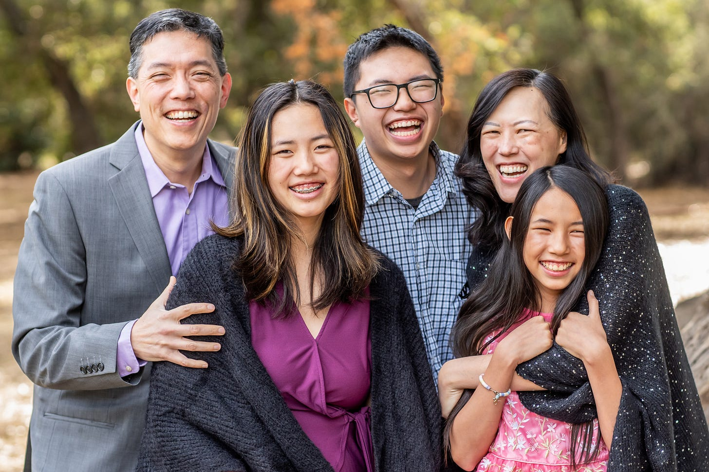

# Blind Spots

*On seeing the things you’re missing*

When we had our family photos done the other day, my husband wore a purple shirt with a blazer. The kids commented that he looked like George Santos. We joked about this with our photographer while we had the pictures taken. Later that day, he sent a preview shot to us of the photos he had taken—except he had photoshopped George Santos’ face onto David’s body. I posted the photo in our family chat with the kids.

This is the original photo from the photographer - the George Santos one was too embarrassing to post.

[Subscribe now](https://debliu.substack.com/subscribe?)

Here were their reactions:

Danielle (age 12): “I thought it was a cute picture.” (When I asked her about George Santos, she said, “Who?” After some interrogation, she admitted she didn't even notice her dad’s face had been replaced by a stranger’s.)

Bethany (age 14): “I don't love that expression that I have.” (Note that we were look

ing at the photo together, and standing right next to her in the photo was a guy who was not her dad. She, too, didn't even notice. I pointed it out to her and she just about died from embarrassment.)

Jonathan (age 17): “I thought we looked good.” (When I asked if he noticed that his dad was not his dad, he asked, “What do you mean, Mom?” I pulled up the photo in our group chat and showed it to him. He exclaimed, “Oh my gosh, that's George Santos!”)

I thought the joke was pretty obvious when I sent out the photo, but none of the kids got it. They each saw what they expected to see: a family photo. Yet the Photoshop job (which was admittedly a bit hacky, but not too bad) made their dad look like someone they had only ever seen on TV.

Before you start thinking my kids are crazy, I want to introduce you to [a study that I look at from time to time](https://www.npr.org/sections/health-shots/2013/02/11/171409656/why-even-radiologists-can-miss-a-gorilla-hiding-in-plain-sight). The first time I heard about it, I thought it was a joke, but then I looked it up and found out it was real. Here’s what happened: a researcher showed radiologists images of lung tissue and had them look for abnormalities. (This really hit home for me because [my dad died of lung cancer a couple of years before the article came out](https://debliu.substack.com/p/what-i-learned-about-empathy)). Superimposed on the images was a picture of a man in a gorilla suit. 83 percent of the radiologists didn’t notice the gorilla.

I tried this on my husband, showing him the same picture from the study and asking him if he saw the gorilla. He stared at it for a long time but couldn't figure out what I meant by gorilla. It only became obvious when I pointed it out to him. This is what scientists refer to as “inattentional blindness.” This phenomenon is what kept the majority of those radiologists from seeing the obvious gorilla on the lung tissue. It was also what kept my kids from noticing that their father’s face had been swapped out in our family photos.

The fact of the matter is, when we’re focused on looking for one specific thing, we often end up completely missing something else. Our brains simply don’t process things that fall outside that frame of reference. We are so used to zooming in on the one thing we’re searching for that we forget to see the bigger picture. These blind spots can be insidious, and that is exactly why making them visible is so important.

## **Revealing our blind spots**

The problem with blind spots is that unless you're aware of them, they're not visible. This is true even if somebody else can see them. That’s why when you learn to drive, you realize that you have to move in order to see what your mirrors don’t show you. Just because you can’t see the problem, that doesn’t mean the problem isn’t there.

I was once coaching somebody who was struggling to succeed in their role. I could see that they were ill-fitted for it, and yet time and time again, they told me they wanted to keep trying. Even after getting a bad review, struggling with their manager, and having trouble connecting with their peers, they still couldn’t seem to catch on to the fact that this wasn't working. Eventually I took them out for dinner, sat them down, and explained that their brilliance was in a totally different area. I had worked with them before, and I had seen how incredible they were—and yet now I saw them fighting just to tread water. It was heartbreaking. But their blind spot was just so large and so hard for them to see. I advised them to leave their current role and go back to what they were doing before, where they had been thriving. Eventually they took my advice. Not only were they able to find their place, but they were immediately promoted and given more responsibility. I could see the broad smile on their face when they gave me the news—I just wish I could have spared them all the pain, struggle, and frustration they felt leading up to it. So many times, they felt like they weren’t enough, but their blind spot was so large that nothing I said could get through to them.

[Share](https://debliu.substack.com/p/blind-spots?utm_source=substack&utm_medium=email&utm_content=share&action=share)

Other people see what you miss. They have objectivity and distance that give them clarity in a way you don’t have. When you're up close, they can see the big picture and understand the parts that you're missing. That’s why, if you ever feel like something isn’t working, I challenge you to ask three people for their advice. Hearing their takes on the situation can give you an astonishing amount of insight.

## **Forcing things out in the open**

We used to do executive reviews twice a year. And twice a year, my friend, who headed up another team, would send me his write-up and slides. Each time I read his, I realized something about my own presentation. So much of what we both wrote was “inside baseball.” We were approaching it from our own perspective, so we weren’t providing sufficient context for those who didn't live and breathe what we did day-to-day. As a result, we often struggled to get our point across, and instead focused on minutiae that were only really relevant to our teams. But the more I helped him with his presentations, the better mine got—and the more he helped me with mine, the better his became. Swapping our perspectives taught us how to broaden our communication and our messaging altitude. It also helped us to understand that the audience didn't see the world with the same level of understanding that we did.

At this point you’re probably wondering how you can make your blind spots visible when they are, by definition, invisible. Although this can be challenging, there are ways to become aware of our blind spots and get a more holistic view of the situation. These include:

1. **Ask the hard questions.** It’s easy to be biased towards positive outcomes, but this can limit your ability to learn and grow. Prioritize identifying the negatives. For example, rather than asking, “How did that go?” ask, “What is one thing I missed?”
2. **Seek missing information.** We tend to look for information that backs up our point of view rather than challenging it, even when this keeps us from getting to the truth. When you feel strongly about something, consider the possibility that you might not have all the information. Ask yourself, “What contrary data could I get to disprove my point of view?”
3. **Get an outside opinion.** It can be invaluable to have someone objective give you insight and feedback. When I advised the person I mentioned earlier to leave their current role, it was because I had a clearer perspective than they did on why they weren’t thriving. By talking to someone who has distance from the situation, it’s easier to see the big picture.
4. **Find grounding within your circle.** The better someone knows you, the better they know your flaws. That’s why having a trusted support network can help make you aware of your blind spots. Your circle of allies can point out your flaws and open your eyes to what you’ve missed—and because they’re your allies, you can trust that they have your best interests at heart.

Identifying your blind spots can sometimes feel like a moving target, but these strategies are important first steps toward getting a sharper picture of reality. In doing so, you can move forward with more clarity and wisdom.

---

My sister and I once went to visit my cousins in Australia when we were teens, and we told them they had strong Australian accents. They laughed and said, “We were thinking the same thing about you!”

We can live with a context and worldview that seem “normal” to us without ever noticing how our perspectives are limiting our reality. Our blind spots are obvious to others and not ourselves, which is why illuminating them can give us more clarity than we could ever get on our own.

What blind spots might you be missing?

[Leave a comment](https://debliu.substack.com/p/blind-spots/comments)