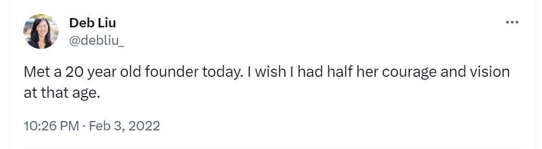
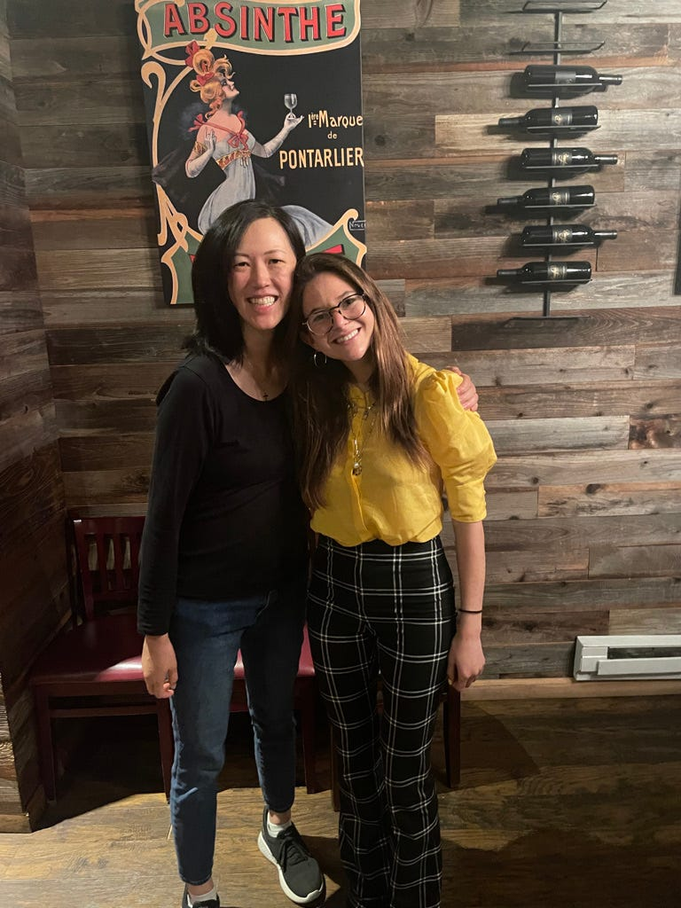
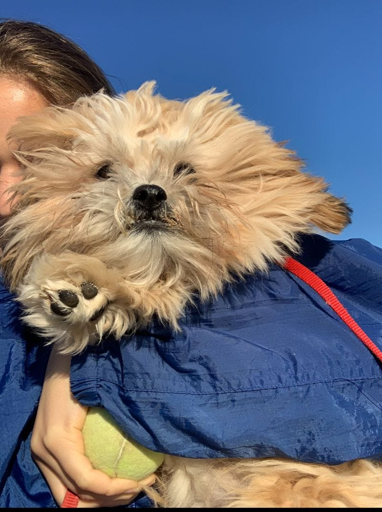

# Why Grit Trumps Genius: The Resilience Needed to Found a Startup

*Spoiler alert: They are soft skills, not hard ones*

**Note From Deb:**

Each month, my goal is to bring you a different perspective than the ones you’ve heard from me before. Over the course of this newsletter, I’ve had great voices like Wes Kao, Carol Isozaki, Ha Nguyen, Shyvee Shi, and Yuji Higaki share their experiences with you. This month, I invited a company founder to share her story.

I met [Audrey Wisch](https://www.linkedin.com/in/audrey-wisch/) through an introduction from [Nakul Mandan](https://www.nakulmandan.com/) from Audacious Ventures. He had never asked me to meet one of his founders before in all my time as an LP in his fund, so I obliged, albeit with low expectations. Audrey incredibly impressed me so much that I tweeted this after our discussion.

I ended up being a (tiny) investor—and also a Curious Cardinals Mom.

I have met many founders over the years, and while their stories are always unique, they all share a special kind of grit, resilience, and love for their work that I admire. I wanted Audrey to share the story of what drove her to become a founder and what she learned from that journey. If you have ever toyed with founding something, investing in or joining a startup, or advising young companies, Audrey’s story is a wonderful source of insight into the mind of a founder who lives and breathes her mission.

---

My childhood room boasted an iconic poster—not of Steve Jobs, but of feminist icon Ruth Bader Ginsburg. I aspired to follow in her footsteps to join the Supreme Court one day, shaping policy that would impact millions through my expertise in the law.

That little girl would not recognize who I am today: the leader of a tech platform that has enabled 47,000+ hours of mentorship between middle and high school kids and college-aged mentors. I didn’t set out to raise over $6M and stop out of college at 19. I didn’t plan to be a founder or CEO.

I chose to write this Perspectives article to share the journey of an entrepreneur—intentional or not—and what skills are necessary to succeed in a world where only one in 10 startups ever make it to a successful exit. My story shows that taking the entrepreneurial leap, whether as a founder or an early team member, doesn't necessitate a Computer Science degree from Stanford, or any sort of innate confidence. Rather, I share how five core capabilities have shaped my journey and brought me to where I am today: leader of a tech startup that’s been featured on the [Today Show](https://www.instagram.com/p/Cw7s7QYLOZi/) and [CNN.](https://www.youtube.com/watch?v=lHniFMV1j9k)

Even if you don’t plan on being a founder, I believe these are lessons for anyone who works in innovation or hopes to forge new paths within organizations.

[Share](https://debliu.substack.com/p/why-grit-trumps-genius-the-resilience?utm_source=substack&utm_medium=email&utm_content=share&action=share)

## **#1: Resilience**

When I’m asked what experience best set me up to be a founder, I always say it was my time as a competitive track runner.

When I was in the seventh grade, I ran the top mile time for my age group in New York state. Later that year, I stress-fractured both my shins, went through puberty, and didn’t beat that time until 10th grade—over three years later.

But even when my body told me no, or my track times should have made me feel defeated (seriously, you can’t beat your seventh-grade self?!), I didn’t stop believing it was possible. I showed up daily to run lackluster times and perform tedious plank routines. I visualized future victories as an Olympian-in-the-making, undefeated by the reality of my body’s current condition. But even after I finally beat my seventh-grade time, the work wasn’t over. Defeat was just around the corner. I lost to people I had formerly beaten. There were times when I ran 20 seconds behind my personal best. The experience was incredibly humbling, but I kept going.

Meanwhile, in the classroom, I lived in daily fear of failure. Unlike a bad running time, I felt like there was no bouncing back from a bad grade, so I was extremely risk-averse. I made choices to optimize for my grades rather than for what was best for my growth. I was protecting my GPA so I could stay on my path to law school. Each test felt like a one-way door to the future that could slam shut at any moment.

The thing no one tells you about being an entrepreneur is that the world around you is on fire all the time. Every decision feels fraught. Every day feels like a one-way-door. But track taught me to embrace failure and discomfort in a way that school never had. Each race was a fresh chance to prove my abilities that day. By relentlessly pushing forward, I saw my efforts compound into growth. I was learning to dig deep and find that grit.

The path of a founder involves constantly crashing into the mud and scraping your knees before getting back up again to run another day. This can be disheartening, but know that keeping your eyes fixed on the mission and putting one foot in front of the other does pay dividends over time. Like an airplane gradually building the momentum needed to take off from the runway, the compound effect of consistent action will lift your startup upward. I like to think of it as an entrepreneurial version of running uphill, fighting the gravitational forces trying to pull you down each day. Only by learning to embrace the burn in your lungs and legs will you develop the strength and skill needed to reach new heights.

So, how do you build resilience? Practice failing, and start embracing discomfort. (I actually think athletics are a great forum to practice this if you’re not ready to take the leap in your professional arena, or if you want to practice pushing yourself further than you think you can.) It also helps to find an area to commit to daily so you can uncover the power of compounding effects. If you improve by just one percent each day, you’ll be 37 times better in a year. Whether it be running every day, reading five pages, or meditating for five minutes, find something to practice a little at a time. You’ll see how far that continued commitment can take you when you keep at it.

[Subscribe now](https://debliu.substack.com/subscribe?)

## **#2: Lifelong learning**

Since I started [Curious Cardinals](https://www.curiouscardinals.com/) as a college student, I’ve committed to never pretending to know things I didn’t. I always wanted to be the first to ask the question, and I was willing to embarrass myself if needed to learn what I needed to. This meant forcing myself to acknowledge gaps in knowledge, even when it could have been easy to bluster my way through. I frequently asked, “What does that mean?” or “Can you slow down?” when industry lingo left me confused. But there was no shame in admitting I didn’t know what a SAFE note meant or how equity worked.

Now, 3.5 years into building [Curious Cardinals](https://www.google.com/url?q=http://curiouscardinals.com&sa=D&source=docs&ust=1701393920547398&usg=AOvVaw1RxXYGbBjpMnknyTWZiKy5), I still embrace lifelong learning as a daily mantra. Unless it’s tried and true and has been turned into a systematized process, I consider everything we do an experiment full of lessons waiting to be extracted. All outcomes offer insights to build upon, not failures to dwell on.

To model and practice lifelong learning as a leader, I also hold myself accountable to:

* Read at least one book per month (these don’t have to be strictly business books, but can vary across genres, with lots of fiction too)
* Listen weekly to diverse podcasts spanning topics from news to entrepreneurship
* Host monthly lifelong learning sessions for our team where we can learn from an industry leader

After every meeting with an industry professional, I stop to ask myself, “What did I learn from this?” I always try my best to send a follow-up to share my learnings so the busy person on the other end, who was generous enough to share their time and insights with me, knows just how much I appreciated it.

These are just a few of the ways I’ve made a learning mindset part of my philosophy. Lifelong growth not only removes shame from mistakes, but it also unlocks the creativity to pivot boldly. Intellectual curiosity remains the jet fuel powering innovation on this entrepreneurial adventure.

## **#3: Feedback is the greatest gift**

After raising our first round of $6.8 million in seed funding, I looked around and inquired “Why are there so few women on our cap table? Why is it so hard to find female investors?”

I ended up asking our investors if they could connect me to a female founder or CEO who could mentor me. A few weeks later, I got 15 minutes on the calendar of my first female mentor prospect:  Deb Liu, CEO of Ancestry.

15 minutes turned to 45. I logged off the Zoom.

My co-founder, [Alec](https://www.linkedin.com/in/alec-katz-657b461b2/), burst into the room, eagerly asking, “How'd it go?!”

“I feel like Tuna after a haircut,” I replied.

For clarification, I was referring to my dog, Tuna, not the fish. After a haircut, Tuna always goes from flaunting her lush fur to looking like a naked mole rat, suddenly aware of how small she really is and the fact that everyone can see it. That was how I felt at that moment—like Tuna after a haircut.

"What?!" My co-founder looked back at me in confusion as he tried to assure me that I had likely crushed it.

"She ripped into me," I said. "She saw every one of my flaws and told me explicitly!"

A few hours later, I got a text from one of our investors: "Well done, sounds like you left a great impression."

He also included a link to a tweet: "Met a 20-year-old founder today. Wish I had half her courage and vision. Audrey Wisch is a rockstar." The tweet was from Deb Liu.

Just like that, my sense of fear evaporated, and I let out a scream of excitement and joy. In that moment, I learned another one of my favorite lessons: feedback is the greatest gift. It's not brutal honesty; it's candor with care.

Deb tested my product, watched my videos, and shared her insights as a parent and prospective customer. She thought about what I said I wanted to build in interviews and how it showed up on the website and in the product. She took the time to explain that my passion and vision weren’t translating into her experience, and she was right. Her feedback was a gift because it was given with care. Later, she told me that my reaction to that feedback was what brought her to our cap table.

## **#4: All you can do is move forward**

Momentum is everything when you’re building something from scratch. It’s better to ship something at 60% and make iterations along the way than wait to share it with the world until it’s 100% perfect. Why? Because nothing will ever be 100% perfect. That’s why, coupled with resilience, I aim to practice purposeful inclination toward action.

Whenever I’m bummed about the outcome of a project, I do my best to ask myself: “What can we learn from this? What will we do differently going forward?” It’s been a proclivity towards action, getting things out in the world, and iterating along the way that has gotten me to where I am today.

I remember my co-founder approaching one day after I’d gotten off the phone with the only marketer we had on our team at the time and asking how the call went. "She quit," I replied bluntly. Shock and dismay flickered across his face, but before he could respond, I strode into the office with a broad smile to enthusiastically greet the group of interns who were waiting to start their first day. Dwelling on the setback wasn't worth the energy. The minutes spent complaining could have been better spent developing a new action plan.

No founder can avoid setbacks. My only decision is how I choose to deal with them when they happen—and I choose to move forward, not look back.

## **#5: Self-advocacy**

I won’t lie: founding a company involves luck. But the saying “make your own luck” is also true—and this is especially important for people whose voices are often silenced.

Women are socialized to avoid asking for things—to be grateful, modest, and selfless—and I was no different. But the most successful people I know ask for what they want and need. They do so unapologetically. Yes, it sucks to hear no, but I’ve learned to dust myself off and ask again until I get a yes. I was lucky to be connected to Deb through my investor, Nakul, but I would never have met her if I hadn’t asked Nakul for an introduction to a woman mentor.

I recently participated in a women’s leadership retreat with a group called [NUSHU](https://nushu.com/). On the retreat, we did an exercise called “Outrageous Asks.” Making the requests was nerve-wracking—after all, they were supposed to be outrageous—but I found the courage to voice the things I wanted:

* To be connected to Sara Blakely, the founder of SPANX and my dream mentor, and gift her kids Curious Cardinals sessions (with the hope of having her share our story with others)
* Introductions to top journalists who could spread our story in parallel ways to the [Today Show](https://www.instagram.com/curiouscardinals/) segment we secured
* To have the other participants share Curious Cardinals with all the parents in their networks as a valuable resource to check out for their kids

This exercise was a revelation. It was so energizing and empowering to ask for support from others and be able to offer support in return.

The lesson? Ask unapologetically for what you want and need. People want to be helpful, and you will be surprised by how many yeses you end up getting. Just remember to express gratitude and offer your support in exchange. The worst outcome of any ask is simply hearing “no,” but the payoff when you succeed can be truly limitless.

---

My path to where I am hasn’t always been an easy one. There have been setbacks, and there will be more. I never thought I would end up where I am, putting aside my Supreme Court dreams to take an entirely new direction. But looking back, I wouldn’t change a thing.

I am now on a new path, one of being a founder and CEO. And I’ve come to realize that I don’t have to have that magical Stanford degree or limitless confidence, because I have something else:

* **Resilience** to learn through adversity's lessons
* **A love of learning** to invent solutions and follow my curiosity
* **Openness to feedback** and willingness to self-reflect
* **Momentum** to turn ideas into action
* **Self-advocacy** to make my wishes known

These superpowers took me from a history nerd with a passion for the law to the CEO of my own company. There was no innate confidence or special gene that got me to where I am; just a willingness to try new things, learn from my mistakes, and keep moving forward. If you’ve ever felt under-qualified or questioned if you have “founder DNA,” I hope hearing my story makes you reconsider your own hidden potential.

[Leave a comment](https://debliu.substack.com/p/why-grit-trumps-genius-the-resilience/comments)

Audrey, class of TBD at Stanford University, is the founder & CEO of [Curious Cardinals](http://curiouscardinals.com), a mentorship platform that empowers K-12 students to unlock their potential, while also providing college-aged students with the most meaningful part-time work.

To learn more, follow Curious Cardinals on [Instagram](https://www.instagram.com/curiouscardinals/), [Linkedin](https://www.linkedin.com/company/curiouscardinals/), and subscribe to our [newsletter here.](https://21557089.hs-sites.com/subscribe-to-curious-cardinals?utm_campaign=Weekly%20Parent%20Newsletter&utm_source=hs_email&utm_medium=email&_hsenc=p2ANqtz--crSv2299db3m2bFchbXRIgc94VsWELaunHCNtR0lPIAVmed2ABpEkjhGnVqLGBZyFhHPv)

To match your student to their dream mentor at Curious Cardinals, schedule a free consultation call [here](https://www.curiouscardinals.com/get-started/basic-info?utm_source=outreach&utm_medium=owned_mktg&utm_campaign=evergreen&utm_id=Always+On&utm_term=google&utm_content=inlinetxt) with their team.

