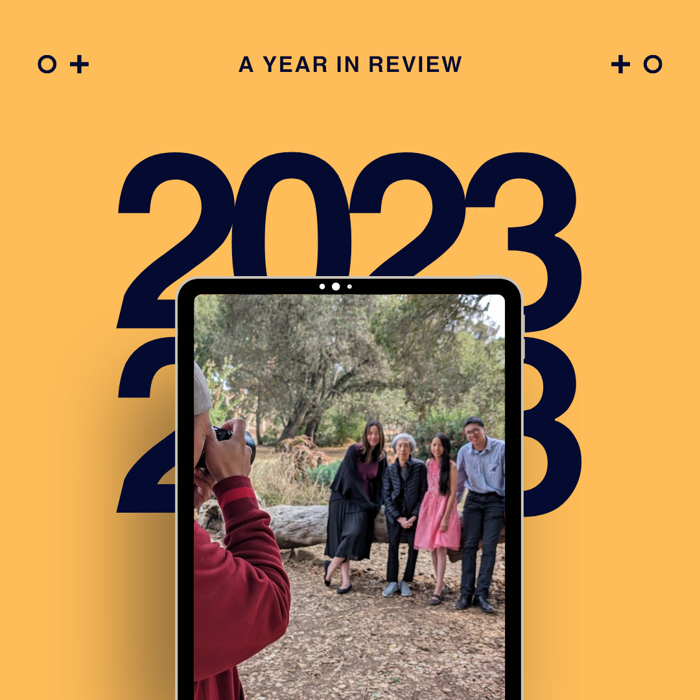

# Writing a Year in Review 

*Looking back at 2023; what will you remember from this year?*

If you asked me what year I went on vacation to Italy or took my parents and in-laws on a cruise to Alaska, I would have to stop and think about it.

We all have certain years that are touchstones in our lives. These periods are close together when we are young, but they grow farther and farther apart as we get older until everything blends into a massive blur. So, to place an event, we use milestones to figure out the date. We went to Italy on our babymoon, so it must have been early in 2006 since our son was born mid-year. We took our parents on an all-expenses-paid vacation to Alaska just after I got my first job in tech and we could afford such an extravagant gift. (Our room was in steerage, next to the anchor, but it was still a lot of money for us.)

Time seems to go by so quickly when we don’t mark these milestones.

For YPO, one of our activities is to create a timeline of meaningful events in our lives—the highs and the lows. In a life of 40-plus years, you can usually see around ten peaks and valleys. But what about everything that happens in between?

It can be so easy to get caught up in looking ahead that we forget to reflect on everything that happens throughout a single year in our lives. These are the events that so often get lost between the highs and lows, leaving us with a blurry picture that doesn’t capture the richness of our experiences. Writing a year in review as the year draws to a close allows us to reflect in ways we wouldn’t otherwise.

[Subscribe now](https://debliu.substack.com/subscribe?)

## **The family year in review**

Each year, my husband writes a year in review for our family. He starts by going through our calendars, looking at what we each did, and marking all of the important dates. Then he writes a narrative around those events. We use this family year in review as the letter in our Christmas card. It’s totally cheesy… and it is one of my very favorite things he does all year. Sometimes there are highs, and sometimes there are lows. Either way, it reminds us that the past year mattered and wasn’t just one of many in the march of life.

If this resonates with you, here are my suggestions for writing your own family year in review:

* **Start with the facts.** There are no rules about what you can include in your year in review. You could mark down family trips, major events (graduations, performances), life transitions, and celebrations. Ask your kids about what they found most memorable or important, and be sure to include those milestones.
* **Put down all of the dates.** Create a bulleted list that includes everything, aiming to have at least 12 to 15 items to track. Organize the events in the order they happened, starting from January and progressing until the end of the year.
* **Fill in the narrative.** Add the story behind the events. You can get as creative as you like with your storytelling, but it’s also okay to just recount the facts. Try to include enough detail to jog your memory when you look back on your timeline in future years.
* **Collaborate and collate.** Finalize your narrative, making sure to get input from your family members, and save it for the year.

Not only does writing a year in review make a great family activity, but it also forces us to reflect on all that’s happened in our lives. So much can happen in a year for just one person, but when you factor in multiple people, you see how much things can truly change.

## **Personal year in review**

A year is often marked by highs and lows. For example, this year I had the second-worst migraine I've ever had… but if you ask me when it happened, I'm not sure I could recall, even though at the time it seemed like the most important thing in the world.

A personal review allows you to look back with grace and distance at what’s taken place over the past 365 days, the good and the bad. This can help center you for the year to come.

What were the moments you celebrated this past year? If you had to tell a story to your friends about all that’s happened, what three things would you include?

For us, this year marked a time of loss. After having our Christmas photos taken last year, my father-in-law collapsed in the shower, and he never came back home. For six months he was in the hospital ICU and in recovery over and over, until he finally passed in July. My mother-in-law then ended up in the hospital and passed at the end of October. Our son got into Boston College, and he's planning a life far away from home—at least for a little while. We unsuccessfully worked on our house, which we still haven’t finished building. (Every six months, we are convinced that it is six months from completion.)

This is the ebb and flow of life. Some events are joyous, and others are tragic, but in this regard, the experience is universal. Taking the time to be with those memories, even the painful ones, allows us to reconnect with what’s most important.

[Share](https://debliu.substack.com/p/writing-a-year-in-review?utm_source=substack&utm_medium=email&utm_content=share&action=share)

## **Looking back**

The act of reflection is both meditative and cathartic. It is a chance to reconnect with your memories of the past year and decide what makes the list of highlights in your highlight reel. It also gives you a chance to sort through the quieter moments and reflect on your relationships and connections.

I have found this exercise to be extremely valuable because it's a reminder that the days are long and the years are short.

In cleaning up my in-laws’ things, I came across a packet of memories from the year my father-in-law moved to America from Taiwan. There were letters from his old high school teacher, as well as his acceptance letter for a UCLA summer program. There was also a letter from North Carolina State urging him to reconsider attending graduate school because he had applied so late.

By chance, I had found myself transported back to a monumental year in my father-in-law’s life, one that he had never told us about. For all the years we knew him, he never shared those memories with us. But the way I see it, in looking through those photos, letters, and documents, I got a chance to get to know him a little bit better. I was able to get a glimpse of him as a young man with big dreams in a country he forged his own way in.

---

Looking back is often something we take for granted, skimming briefly over the year’s biggest moments before putting all our attention on the year ahead. And while looking forward is also important, it can often blind us to everything that’s led us to where we are.

As 2023 draws to a close, I encourage you to take this opportunity to reflect—on both the big milestones and the quieter moments. Consider writing a year in review. It may not feel like much now, but your future self will thank you for preserving those memories.

[Leave a comment](https://debliu.substack.com/p/writing-a-year-in-review/comments)