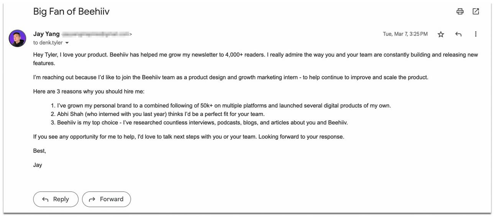
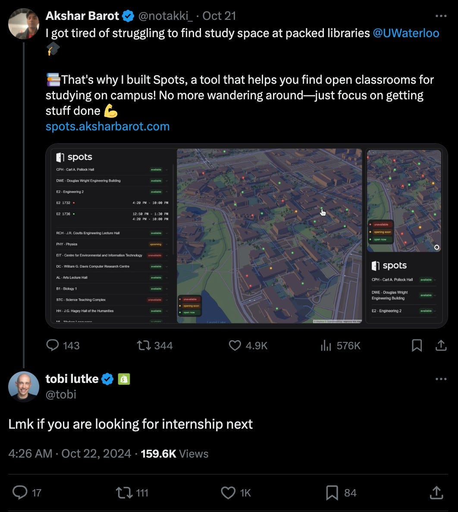
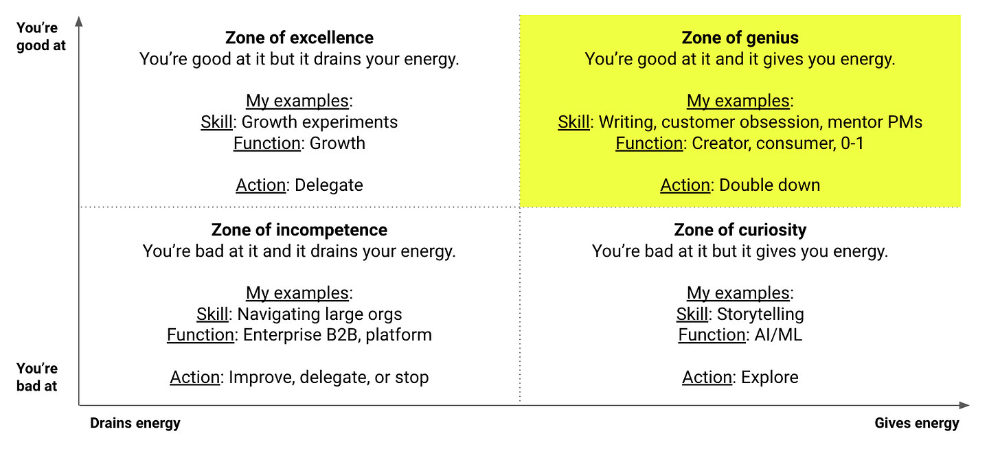
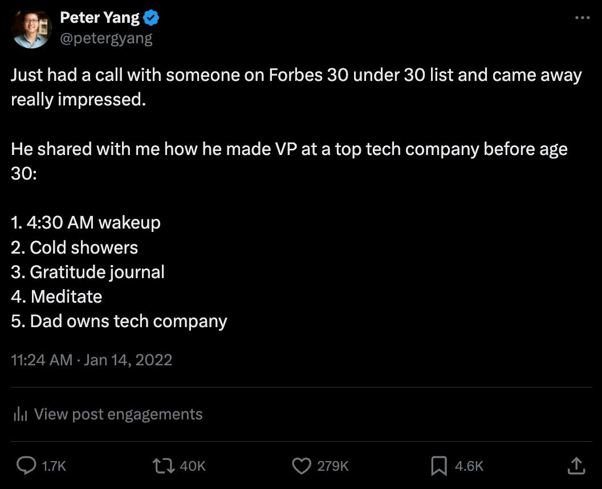
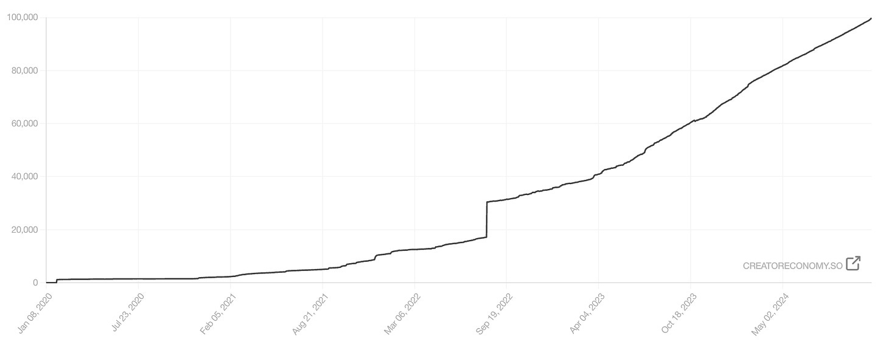

# 5 Steps to Take Back Power in Your Career

*How I grew from 0 to 100K readers by finding my authentic voice*

**Deb’s note:** From time to time, I bring in guest voices to share their perspectives. What I love about [Peter Yang](https://creatoreconomy.so/) is how his voice is so much stronger than his job. He successfully created a newsletter and podcast that reach over 100K people a month, teaching thousands how to be better product leaders even as he improves his own craft. He didn’t wait for some lofty title or huge team; instead, he iterated and grew into an incredible voice on behalf of product managers everywhere.

---

Peter here. I’m grateful to Deb for letting me tell my story.

Here’s the thing about working in tech: one day you might be crushing it at your job, and the next day you might be caught in a reorg or a layoff. When you go through this cycle a few times, it’s easy to feel like things are out of your control.

That’s why, over the past decade, I’ve been taking back the power in my career. Instead of being defined by “ex-(fancy company)” on LinkedIn, I sought to be defined by my own knowledge, values, and curiosities. This has led to me writing a [newsletter](https://creatoreconomy.so/) read by 100K readers, hosting a [podcast](https://www.youtube.com/@peteryangyt) where I interview leaders like Deb, and continuing to cultivate an amazing network.

But I’ve also made plenty of mistakes along the way, and I hope you can benefit from what I’ve learned. Today, I’ll share five tactical steps to take back power in your career—to be defined by who you are, not by your company or your title.

---

## **1. Stop waiting for the perfect job**

Over a decade ago, I was a product marketing manager at Meta. Even back then, I knew I wanted to build products, so I built trust with PMs, found leadership sponsors, and delivered products that made an impact.

Nevertheless, I failed the Meta PM interview loop three years in a row. After every rejection, I'd tell myself:

> **“If only I can get this PM job, then I can finally build great products!”**

But this thinking was shortsighted. The fact is, you don’t need a PM title from Meta, or any other company, to build great products. You don’t need permission from recruiters, hiring managers, or anyone else to do your best work.

Here's what I wish I’d known then:

1. **Make the job you have into the one you want.** The best people I’ve worked with aren’t defined by their job titles. They’re designers who code, engineers who love customer research, and product leaders who get their hands dirty. With AI collapsing the talent stack, this is more relevant than ever.
2. **Skip the gatekeepers.** Jay Yang is a 19-year-old who has already worked with two successful founders before college. He got his first internship by cold-emailing Tyler Denk, founder of the newsletter platform Beehiiv:

   

   He then made a [full deck](https://docs.google.com/presentation/d/1ptEFCbpwvGNfVi9KDB8fgyL90nrY0Y5Ue61f7t7VrBs/edit#slide=id.p) that convinced Noah Kagan, CEO of AppSumo, to hire him as the Head of Growth. Jay got what he wanted by delivering value to the people who mattered, and you can, too—no fancy resume required.
3. **Learn by building.** With AI and other tools, bringing your ideas to life is easier than ever. For example, [Akshar](https://www.linkedin.com/in/aksharbarot/), a Waterloo undergrad, built an app that helps students find study spots on campus and shared it on X/Twitter. Tobi Lütke, Shopify's CEO, noticed and hired him directly.

   
4. **Turn your voice into your product.** My life changed when I started sharing my product insights and knowledge online. I found product-market fit with people who shared similar values, and I now reach more people with my voice than most products I’ve built at other companies.

   [Subscribe now](https://debliu.substack.com/subscribe?)

---

## **2. Chase your curiosity**

Four years ago, I was a fintech PM running experiments to grow a credit card marketplace. I was good at it, but the work drained me. I was stuck in my zone of excellence instead of my zone of genius:

So I decided to share some [creator economy lessons](https://creatoreconomy.so/p/lessons-about-creator-economy) I learned from Twitch and Substack. People found the post and loved it, which made me realize I had knowledge that resonated with people. Now, here’s the secret:

**You don't need to be the world's foremost expert to share your knowledge. Often, people learn best from someone just a few steps ahead of them on the journey.**

Four years later, I’m still chasing my curiosity—whether it’s learning how to use AI to save time, getting better as a product leader, or building a creator business.

---

## **3. Express your authentic point of view**

You may be wondering why I joined a fintech company if I didn’t enjoy selling credit cards. The truth is, I joined the company because I wanted to become a PM manager. Like many others during the ZIRP days, I believed that you had to become a manager to progress in your PM career.

Of course, the ZIRP days of growing headcount and ever-larger teams are over. The best companies now believe that keeping teams small and rewarding senior ICs is the path to shipping faster with less bureaucracy. Which brings me to my next point:

**The best way to build a “personal brand” is to express your authentic values and have a little fun.**

If you share the values that you believe in, you’ll naturally attract people who think the same way. I believe in [building with the customer community](https://creatoreconomy.so/p/community-led-product), [obsessing over product quality](https://creatoreconomy.so/p/the-day-you-stopped-making-compromises), and having a low tolerance for [product management theater](https://creatoreconomy.so/p/why-is-everyone-hating-on-product-managers). Posting (ranting?) about this stuff has led to a large audience and speaking opportunities at companies who think the same way (e.g., Figma, Linear, Stripe).

I actually dislike the terms “influencer” and “personal brand.” I post online because I want to express my authentic POV and help others succeed. I love being judged by the marketplace of ideas instead of just by my direct management chain. Of course, I also enjoy shitposting once in a while:

[Share](https://debliu.substack.com/p/5-steps-to-take-back-power-in-your?utm_source=substack&utm_medium=email&utm_content=share&action=share)

---

## **4. Show up every week**

If you look at my journey to 100K readers above, you’ll see that my newsletter barely grew in the first year. But I kept writing because I enjoyed the process itself. I found motivation in expressing my thoughts instead of in external factors like subscriber counts.

**The magic happens when you find the torture that you enjoy, as Jerry Seinfeld puts it.**

What I mean by that is finding the activity that you can do more reps of than anyone else. That doesn’t have to be writing newsletters—it could be building communities, delivering products, teaching others, or something else entirely. Just keep showing up, week after week. Consistency beats intensity every time.

---

## **5. Automate and delegate**

People often ask me how I have time to create content with a full-time job and two kids.

The truth is, I have my in-laws helping at home (as Deb says, busy parents who get help shouldn’t be shy about talking about it). But I’m also ruthless about automating and delegating tasks that I don’t find joy in:

1. **I automate with AI** for tasks like editing newsletter posts, generating YouTube thumbnail copy, drafting social posts, and more.
2. **I delegate to others** for tasks like video and podcast production. I also recently started working with a UCLA undergrad who helps me with transcript editing and other tasks.

*These two are my top priority*

[Leave a comment](https://debliu.substack.com/p/5-steps-to-take-back-power-in-your/comments)

---

## **Take back power in your career**

Today, I love my job at Roblox, but I’m not dependent on it.

People know who I am and what I stand for. Job opportunities find me, especially at companies that value product craft like I do.

That's what taking back your power looks like. It's not about chasing followers or going viral. It's about consistently showing your authentic self to the world. It's about building something that's truly yours, something that can't be taken away in a reorg or a layoff.

When you do that, you'll never feel like a cog in the wheel again. Instead, you'll be the operator of your own career. Let me know in the comments if you have any questions—I’m wishing you the best of luck!

[Share Perspectives](https://debliu.substack.com/?utm_source=substack&utm_medium=email&utm_content=share&action=share)