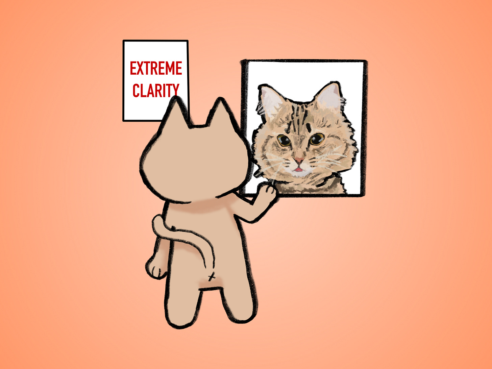
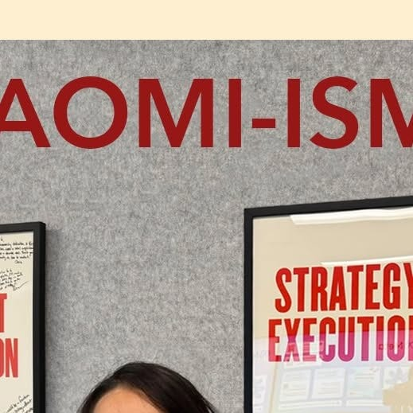

# Driving Extreme Clarity

*Better a clear "no" than a messy "yes"*

Multiple teams were stuck in a morass. We were endlessly debating how a product that cut across multiple Product Groups and different apps would work, and it felt like we were trapped in endless debates that went nowhere. At one point, I joked that we spent more time after the meetings debating what we discussed in the meetings because we couldn’t figure out how to land the decisions.

Then came [Naomi Gleit](https://www.instagram.com/p/DRANzP3ibgj/?utm_source=ig_web_copy_link), who at the time was the VP of Growth. She met with each team individually and forced us to capture our point of view on a spreadsheet. You could vote for one of the columns someone else filled out with their recommendation, but if you had a single deviation, you had to capture it. Suddenly, the disagreements came to life. Little things and big things that were glossed over surfaced. We actually agreed on more than we thought in some ways, but on the fuzzy margin was the mess of where our teams were trapped negotiating the details.

In black and white, we were forced to face things that we had not seen from each point of view. In the end, there were over a dozen columns of areas where we deviated, all staring back at us. That last ten or twenty percent was where the real misalignment came, even though on the surface we all had nodded and generally agreed. Extreme clarity means defining and aligning on the sharp edges.

[@naomigleit](https://instagram.com/@naomigleit)

Naomi Gleit on Instagram: "When I joined [@Meta](https://instagram.com/Meta) more than 20 yea…

### **If it doesn’t hurt, you are not prioritizing hard enough**

I remember one meeting where someone said, “Mark that as a P0.” At the end of the meeting, there were several P0s. We joked that we should start moving to P-negative-1s instead. Naomi said, “If everything is P0, then nothing is.” Then she pulled out her computer and projected a list, and we all had to collectively stack-rank the top 10 items together.

Extreme clarity is about choosing. It is about facing the truth instead of skirting around it. It is about taking the time to look directly at the places where we differ, because those are the places that matter most.

Naomi and I.

[Share](https://debliu.substack.com/p/driving-extreme-clarity?utm_source=substack&utm_medium=email&utm_content=share&action=share)

The funny thing is that Naomi was always clear, but I think it took the rest of the people around her time to learn what she was teaching us. I had a phrase I used called “strategic ambiguity,” which [I have written about before](https://debliu.substack.com/p/stop-practicing-strategic-ambiguity?r=3k88l). Strategic ambiguity is the desire we have to avoid the hard truths and difficult choices. We feel safe in not facing the harsh reality. We assume alignment because we don’t want to hash out the details or offend anyone. But strategic ambiguity, while comfortable in the short term, is a temporary salve for a deep wound.

Yes, it avoids discomfort today, only to create confusion tomorrow. Teams cling to the illusion of agreement and then wonder months later why there is so much friction. I have lived through so many moments where we all believed we had made a decision, only to discover that each person had walked away with a different version in their head.

### **Eliminate the “messy yes”**

“Better a clear no than a messy yes” is a mantra I tell myself.

Saying no hurts. It is the elimination of an option, but it also drives extreme clarity.

What is a messy yes? It is your manager telling you they will try to get you promoted, but without any milestones or clarity on what is required. It is a team saying they will squeeze in 60% of your asks, but without alignment on which parts. It is getting told that your project is a priority, but without resources. Messy yeses are all over. They avoid the hard “no” but are in so many ways much worse.

A messy yes is the quiet enemy of great execution. That vague, non-committal agreement that lets everyone leave the room faster without friction or conflict. While it speeds things up in the beginning, it eventually catches up with you in the form of inter-team conflict, missed deadlines, and product rework. It is the recipe for a can of frustration you are just kicking down the road.

When I was managing the PayPal side of the eBay-PayPal integration roadmap, I saw the messy yes get us in trouble over and over. PayPal knew they could not accommodate all of eBay’s asks, but as the acquired company, our executives also felt they could not say no. So they would handwave a yes, and my job was to fit just enough into the roadmap to look like we were making an effort. I was so frustrated with the process because I knew the messy yeses were going to come back to bite us (and they did), but no one wanted to call out the elephant in the room. We burned so many cycles when we could have drawn a clear line in the sand and just dropped half of the things we knew we couldn’t do anyway.

I have learned, time and time again, that it is far better to have a clear no than a messy yes.

[Subscribe now](https://debliu.substack.com/subscribe?)

### **Five Ways to Drive Extreme Clarity**

1. **Write down everything ahead of time**Everyone should do the pre-work to articulate and document their point of view. Focus not just on things you agree with, but also on areas of conflict.
2. **Force ranking, not grouping**Saying everything is important is a way of saying nothing. Prioritization hurts. If it does not feel painful, you are not prioritizing clearly enough.
3. **Document in live notes as decisions are made**Have someone take live notes and show agreements as they are made. That way, people can disagree on the spot rather than doing a sidebar afterward. Have agreements outlined.
4. **Restate the decision before leaving the room**

   Go around the table and ask each person to review the agreement and verbally articulate any differences they have. You will be shocked by how often people have different perceptions of what something means, even when written down.
5. **Keep a running alignment document**Clarity fades over time. Writing down the decision (and when you will revisit it) keeps drift from reintroducing ambiguity later. Reinforce in future conversations.

### **Clarity is respect**

Extreme clarity means getting your camera in focus and capturing the sharp details. It is respect for each other to get to a true yes or a clear no.

Extreme clarity is not always comfortable, but it is always kinder than strategic ambiguity, where things are left up to interpretation.

Naomi taught me that alignment does not come from a surface yes, but rather true alignment on the murky last 10%. It comes from choosing clarity over comfort so everyone can move forward together.

[Leave a comment](https://debliu.substack.com/p/driving-extreme-clarity/comments)

---

**Related** ***Perspectives*****:**