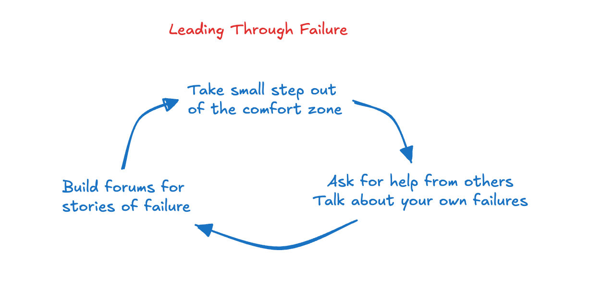

# Failure as a Feature, Not a Bug

*How to leverage your imperfections to build resilient teams*

***Note from Deb:** From time to time, I invite guest authors to bring their perspectives to my Perspectives newsletter. Yue Zhao has been a product leader in many different capacities at many storied companies, and she shares that wisdom to others as a leadership coach, author, and writer.  
  
When she approached me about writing about failure, I was intrigued by her take on the topic. So much of what she shares I have seen in my own career and in those I mentor. When we are afraid to fail, we stop taking risks. When we stop taking risks, we are setting ourselves up for a different kind of failure. I hope she inspires you to take a risk today that will lead to greater things.*

---

I was told from a young age that I was smart, fortunate, and pretty. Learning new tasks came easily to me, I did well in school, and I knew how to get along with most people. Everyone around me expected me to do great things: get good grades in school, win sports competitions, and become an executive. And in the early parts of my career, from McKinsey to Harvard Business School to Instagram, life seemed to be going as expected.

And then my growth stalled. At Thumbtack, even though I was one of the more senior and tenured product leaders, I hesitated to raise my hand for high-risk, high-visibility projects. Instead, I stuck with safer bets I knew how to deliver. I avoided reaching out to executives I might not naturally connect with, for fear of rejection.

It turns out that the same remarks that fueled my self-belief also gave me a fear of failure. In a well-known series of studies, Dr. Dweck demonstrated that when you tell kids that they are smart after completing a task, they are [less likely to take on more challenging tasks](https://bingschool.stanford.edu/news/carol-dweck-praising-intelligence-costs-childrens-self-esteem-and-motivation). The “smart” kids did not want to risk failing and losing their “smart” label. Meanwhile, kids who were told they were persistent or hardworking attempted more challenging tasks without a strong fear of failure.

My fear of losing my label as “competent” or “smart” prevented me from taking on the necessary risks required for continued career growth. As the leadership challenges became more complex and the playing field increasingly less fair, avoiding risks meant staying on the sidelines.

The business environment is changing rapidly thanks to AI and shifting geopolitics. As the cost to build lowers with AI, companies need to reinvent their core businesses and reestablish their competitive moat. This involves huge risk-taking that necessarily comes with failures. With regulations and politics shifting, teams that know not to dwell on failure due to factors outside their control and move forward will win against their competition. In 2026, leaders and teams must learn to fail forward to stay relevant and ahead of the competition.

[Share](https://debliu.substack.com/p/failure-as-a-feature-not-a-bug?utm_source=substack&utm_medium=email&utm_content=share&action=share)

### Overcoming Our Own Fears

It is natural to shy away from the unknown and uncomfortable. The oldest part of our brain constantly tries to pull us back to what is safe and known. However, in an increasingly complex and rapidly changing environment, having the skills to make a bet, fail, and learn from failure is what unlocks the path to the executive levels.

In my experience, taking a concrete first step outside your comfort zone is 80% of the battle. Our minds try to keep us from action through many creative excuses and reasons: “It didn’t work last time.” “This other person tried and failed.” “You have many other priorities to tackle.” There are many reasons to stay where it is safe. However, once you do get out of the comfort zone and learn that it isn’t as bad as you had thought, continuing down the path comes more easily.

Here are some methods that helped me activate my risk appetite:

1. **Identify a small, concrete task you can complete next week:** Starting small was crucial for me. If you think you need to introduce a controversial topic in a group meeting of 10 leaders, you will not do it. Instead, start with 5 minutes of putting an idea out there at the beginning of a 1-1 conversation. Put it out there, get feedback, and then bring more people into the conversation.
2. **Separate your identity from the outcome:**  Attempts are what I am doing, not who I am. The results speak to the efficacy of the idea, not me. You are not a failure if you fail. You are learning. Your first try at building a new product didn’t work? Very normal. Learn from the mistakes, rally that courage, and try again.
3. **Create external accountability:** If it were solely up to me, I would’ve stayed locked inside my own pursuit of perfection. My colleagues challenged me, and that unlocked the door. Find a way to generate external motivation so it doesn’t solely rely on your own intrinsic motivation. Mention it to a coworker you trust. Join a group with a similar purpose. Get a coach. [Research shows](https://www.inc.com/jeff-haden/want-to-be-more-successful-research-shows-an-accountability-buddy-makes-a-huge-difference-but-with-one-literally-meaningful-catch.html) that those who complete weekly check-ins with someone they admire are most likely to achieve their goals.

When you move towards fear, it diminishes.

[Subscribe now](https://debliu.substack.com/subscribe?)

### Failure is Necessary for Growth

My risk-averse self back in the Instagram days.

When I started as a PM manager at Instagram, I played it safe, working on features that most people agreed with. However, this also meant that I played small. My team of senior engineers and designers encouraged me to explore more controversial hypotheses. With their encouragement, we finally shipped a year-long redesign of the profile to incorporate Shopping and IGTV. This led to fundamental breakthroughs in how Instagram worked, and much more visibility and credibility for myself and my team.

It was the first time I saw that failure could be *good*, or even necessary.

Not only did I begin to understand the virtue in failing forward, but I saw how it was changing my team for the better. When I started taking risks, it created a shift in our team’s culture. Suddenly, everyone else felt they had permission to make mistakes, too. Those mistakes were stepping stones to solutions, not permanent marks on our otherwise spotless records. We became more dynamic, more creative, more effective.

My fears hadn’t just held *me* back; they stifled the potential of the people I was managing. The fear of failure puts entire teams and companies in a holding pattern.

Now in my capacity as an executive coach, I can see that pattern reflected in the clients I work with.

A while ago, a Director of Product came to me at a critical juncture in his career. He was a rising star at his 500-person SaaS startup and hand-picked by the COO to launch a new business line. His team and he feared a failed launch. So they worked to add one more feature, talk to a few more customers, and rehash the launch plan. A competitor launched ahead of the team and stole the company’s anchor customers. It cost the company millions of dollars in revenue.

As leaders, we spend a lot of time coaching our teams on how to be successful. It turns out that it is equally important to teach our teams how to fail.

Me now, coaching executive leaders at an event for Sidebar.

[Leave a comment](https://debliu.substack.com/p/failure-as-a-feature-not-a-bug/comments)

### Be the Inspiration For Failure

[Project Aristotle at Google](https://www.nytimes.com/2016/02/28/magazine/what-google-learned-from-its-quest-to-build-the-perfect-team.html) found that those who had psychological safety were more likely to share new ideas. Teams that are supported to try unconventional approaches are more creative and innovative. With my teams at Meta and Fuzzy, I found that when I normalized failure, I knew earlier and more clearly where projects went wrong, allowing me to coach my teams more effectively.

We can’t just preach the ideals of failing forward; we have to model it for those we lead. When your team hears you encourage risk-taking and talk about your failures, it becomes normalized. Even the more timid team members may be encouraged to take bigger risks.

To build a team that swings smartly for the fences, try incorporating these norms:

1. **Model vulnerability:** Be the one who asks for help with problems you’re facing. Model for your team how to say: “I don’t know right now. Let me get back to you.”Avoid glorifying someone working extra hours alone to solve a problem; instead, encourage them to share bottlenecks and seek support.
2. **Talk about your failures:** Proactively share your own mistakes and how you worked through them in a 1:1 conversation. Your imperfections make you human, and being human makes you a more trustworthy leader.
3. **Designate someone to play devil’s advocate:** It’s rumored that at Coca-Cola, there is often a person in a meeting whose role is to voice what Pepsi would do. At Amazon, there is an [empty seat](https://www.inc.com/john-koetsier/why-every-amazon-meeting-has-at-least-one-empty-chair.html) left for the voice of the customer. Encourage someone on the team to play the contrarian and voice counter-arguments to a decision.

When talking about failure is the norm and met with validation and encouragement, more, better ideas bubble up naturally. Teams move faster to execute and get ideas to market.

### Tell Stories from Failure

A team that knows how to extract learnings from mistakes will learn faster and become more impactful over time. And storytelling is one of the best ways to carry learnings through time and past organizational boundaries.

Here are three tips for implementing this in your team:

1. **Reflect on failures together:** Create systems to talk about failure as a group without judgment and criticism. Start team meetings with “What surprised us this week?” Take turns analyzing a situation and sharing mistakes.
2. **Be harsh on the idea, not the person:** Focus the conversation on the situation, root causes, and unexpected effects. Avoid criticizing individuals or overly focusing on “we should’ve” statements.
3. **Create forums for failure lore:** Create forums that encourage your team to tell a story about the failures and learning. This helps everyone remember the key learnings and gives the story a chance to spread. Consider dedicated times at all-hands, lunch & learns, or quarterly reviews for stories about failure.

When we process and normalize failure together, we turn individual disappointment and frustration into productive synergy. Encouraging great storytelling about failures helps spread the learnings quickly throughout an organization and over time. Instead of allowing the past failure to become an elephant in the room or wallowing in shame over what could’ve been, you pull the failure out into the light of day. You put it on display. You build a culture of safety that allows everyone on your team the freedom to grow. And your team becomes more dynamic and resilient as a result.

At the senior leadership levels, there are no clear-cut decisions. Failure is often the more likely outcome. This means that while we hope to be a regular success, we also need the skills to gracefully manage failure. Becoming a great leader means being able to move organizations forward in both cases.

---

*Yue is an executive coach for women and minority leaders who want to accelerate their careers with AI and reach the C-suite. She is a CPO & CTO in Silicon Valley with 15+ years of leadership experience across Meta, Thumbtack, and McKinsey. Yue is also a published author and teaches a course on Mastering Executive Presence & Communication with AI. Find her at [The Uncommon Executive](https://www.theuncommonexecutive.com).*