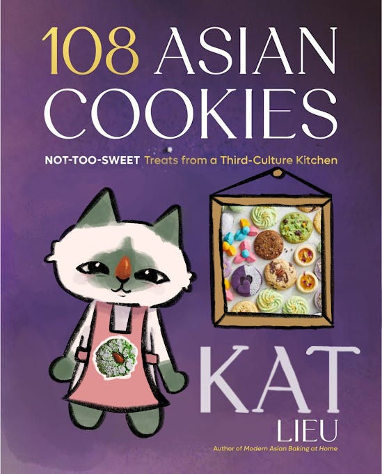
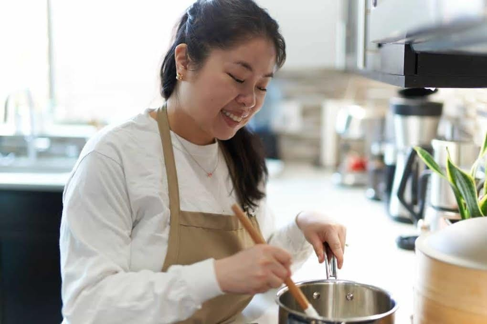
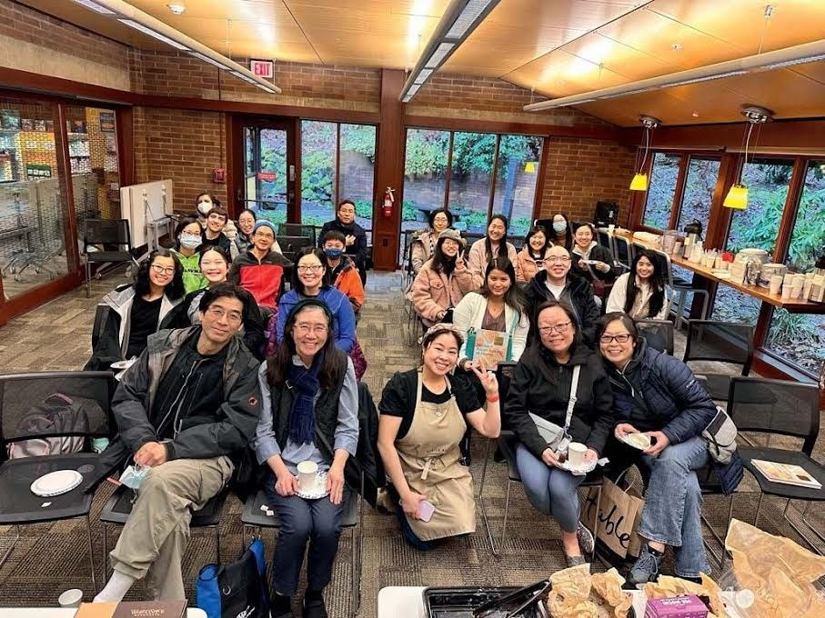
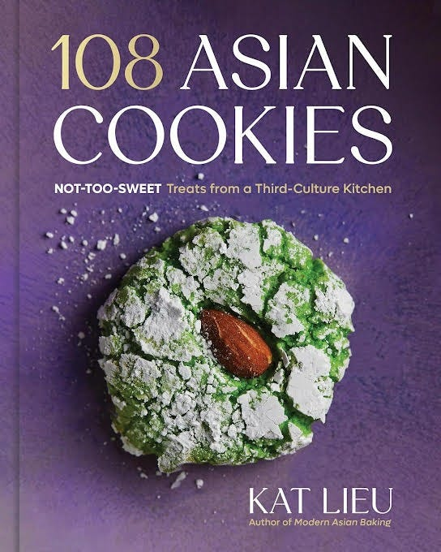
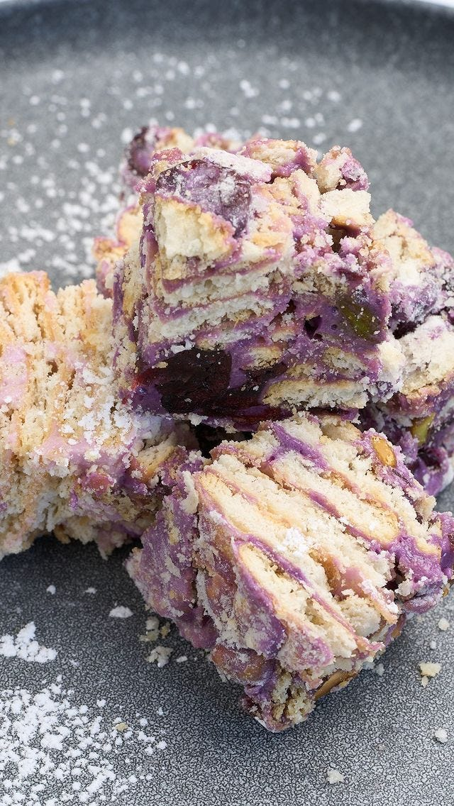
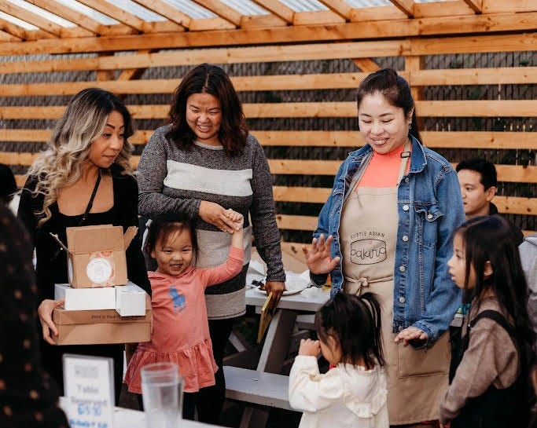
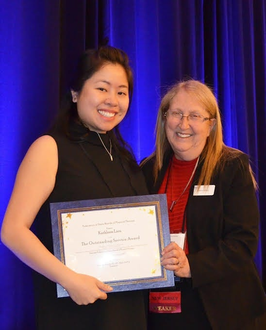

# From White Coats to Chiffon Cakes: One Doctor's Journey Home

*Reflecting on five years of finding my own path*

Artwork by Deb’s daughter, Danielle.

**Note from Deb:** I was a fan of Kat before I knew we were cousins. I followed her on [Instagram](https://www.instagram.com/katlieu/?hl=en) and her group, Subtle Asian Baking, for a long time. I was at my cousin’s house in New York when I saw a copy of her book [Modern Asian Baking at Home](https://amzn.to/3XVWtWW) on his table. I mentioned having a copy of the book and being a huge fan. He said, “You know Kat is my cousin, so that means she is your cousin too!”

Small world.

Kat is someone who gives her whole heart to everything she does. When she was a doctor of physical therapy, she gave everything to her patients. When she founded [Subtle Asian Baking](https://www.instagram.com/subtleasian.baking/?hl=en) during the pandemic, she poured that same devotion into creating a space where 160,000 people could celebrate Asian food. When her father passed away in 2020, she made a courageous choice: she walked away from the career her parents had chosen for her and lived a life her father would have celebrated.

Kat is now a bestselling author, content creator, and voice for Asian American food. Her book, [108 Asian Cookies](https://amzn.to/3XS9mRS), is a love letter to our mutual heritage. I asked Kat to share the story of her journey with all of you.

[Subscribe now](https://debliu.substack.com/subscribe?)

---

I have many fond memories in the kitchen, but the most special is around 1988, when my father baked a cake with me. I was so small I don’t remember any of it, but my grand-uncle (Deb’s uncle!) recorded it all, and I have it as a video. I watched my father, so handsome he could have been a Food Network star, as he so patiently and gently measured each ingredient of his mother’s chiffon cake recipe. All those I’ve mentioned here – my grand-uncle, my father, and my grandmother – are gone, but I have this super precious memory, immortalized on film.

It’s clear now that’s where I always belonged, in the kitchen, baking with loved ones, but it took a while to figure out.

### **The Path I Walked For Them**

Like any good Asian daughter, I chose the career my parents wanted me to—a nice, stable, professional career as a doctor of physical therapy. I loved my job and enjoyed helping people. I gave everything to my patients, but I longed for freedom. Creativity. I wouldn’t say I was unfulfilled, but something was missing that I just couldn’t put my finger on.

Then, in 2020, my dad got sick. The pandemic hit. Stuck at home and wrestling with my father’s mortality, I found so much comfort in baking and cooking. After hanging out in a Facebook group called [Subtle Asian Traits](https://www.facebook.com/share/g/17sJDdP9Ji/) (a meme group about the experiences of the Asian diaspora), I founded the baking version, [Subtle Asian Baking](https://www.instagram.com/subtleasian.baking/?hl=en), on a whim just two months before he would leave us. I never thought an online group would turn into anything; I was just excited to create and share Asian baking recipes.

As it got closer to the end of my father’s life, I realized I didn’t know what his dreams were, or if he fulfilled them during his lifetime. It changed something in me. I was so burned out from being a doctor of physical therapy, giving my all to my patients year after year, and I brought that all home with me. I found myself thinking about *my* dreams. What had I buried? What had I put aside in order to fulfill my parents’ wishes?

After going to the hospital a few times to visit my father when he was very sick, it reminded me of how much the setting traumatized me. I never wanted to put on a white coat or stethoscope again. I never wanted to have so much access to people who are sick, who trust me so much.

When Dad died, I told myself that now it was my responsibility to dream enough for both of us. I was ready to do something different, and it was time.

The Subtle Asian Baking group was growing. (Like, a lot.) I began developing food videos and content, and it became a part of my everyday life. I’m always feeding my family anyway, so when I tested recipes, I also got to make lunch and dinner for my husband, mother, and son. I surprised myself with the amazing flavor combinations (I mean, I put fish sauce in a chocolate chip cookie and bakers loved it!) It gave me a much-needed outlet during an incredibly difficult time.

Writing and food opportunities kept falling into my lap, like little gifts from my dad, saying, “You’re on the right track”. It felt right to say goodbye to the career that Dad and Mom had chosen for me. I hung up my white coat and grabbed an apron.

[Share](https://debliu.substack.com/p/from-white-coats-to-chiffon-cakes?utm_source=substack&utm_medium=email&utm_content=share&action=share)

### **The Year That Changed Everything**

My confidence soared. After years of burnout, giving my all for patients, I had almost forgotten what I was capable of.

I realized that I am a culinary genius. I learned to trust myself more and to really embrace my inner child when developing recipes. My creativity was set free. I was able to spend more time with my family, which helped me slow down and appreciate the little things. My relationship with food was starting to heal.

Though I had always been a foodie, I never permitted myself to enjoy food. I used to yo-yo diet or binge eat. I would go hungry, feel ashamed of eating, and feel like I would gain weight even by just drinking water. I hated and loved food at the same time. I was trapped in an unhealthy cycle. By dedicating myself to Subtle Asian Baking, I had permission to love food again.

It also deepened my love and connection to Asian culture, especially as I watched others across the diaspora do the same. Creating a community that fosters the space for cultural authenticity and discovery isn’t something I anticipated when I randomly made that Facebook page five years ago, but it’s been one of the most powerful parts of my journey.

Food is identity, and for so long, Asian cuisine has been treated as “weird,” “exotic,” or less than. Baking spaces, in particular, have been dominated by Eurocentric standards of what’s considered classic, elegant, or worthy. (When I was working on my [first book](https://amzn.to/3XVWtWW), I wanted to title it Not Too Sweet, but I was told it wouldn’t sell with a title like that. Two years later, a not-Asian celebrity wrote a book called “Not Too Sweet,” and it sold just fine.)

Representation, like Subtle Asian Baking, changes that. It shows the world that our flavors are valid, beautiful, and worth celebrating. It gives marginalized voices and Asian bakers permission to take up space, be visible, reclaim the narrative, and create something entirely their own – like the 108 cookies in my cookbook, [108 Asian Cookies](https://amzn.to/3XS9mRS).

You don’t have to be Asian to bake the recipes in this book, and even if you are Asian, you will learn something from the book. I hope readers embrace their inner child more, become bolder and more creative in the kitchen, and learn to love flavors like durian and fish sauce, and realize that MSG is not poisonous, and how it can amplify umami in a salty-sweet cookie. And that our stories and our voices and our matter.

Through writing and cooking and building this incredible community, I was coming back to myself. I wish that everyone would discover something new within themselves by playing around in the kitchen.

[@katlieu](https://instagram.com/@katlieu)

Kat Lieu on Instagram: "Taiwanese snowflake crisps ❄️🇹🇼🥰 a d…

[Leave a comment](https://debliu.substack.com/p/from-white-coats-to-chiffon-cakes/comments)

### **What My Father Would’ve Wanted**

Turns out that the same skills that made me a great PT doc also made me great at content creation.

As a physical therapist, you’re always writing notes, teaching patients, learning new things about the body, and you need to be confident and have a stage presence. I had gone to conferences, got on stage, and taught nationally. All those skills I picked up – perfect bedside manners, great writing, excellent teaching skills – translated to my work as a content creator, journalist, food writer, and cookbook author. (My readers always tell me how my recipes are easy to follow, and that’s because I always think about the person I’m teaching. I ask, “How can I make things as seamless and painless as possible for them?”)

Naturally, baking and writing morphed into philanthropy. (I wasn’t done helping people just because I left medicine.) Whenever I hosted a cookie pop-up, I donated the proceeds to a local organization. Thanks to my recipes and my food, Subtle Asian Baking has grown into a platform and a very loyal community, and in turn, I’m able to use this great platform for advocacy and activism.

This month, we launched a beer with Lucky Envelope Brewing, and I hosted a book signing and a cookie pop-up. All the proceeds from my cookie sales went to Ballard Food Bank to help those living with food insecurity. (My cookies raised a whopping $1008! And we got a kind soul in Seattle to match the donation and donate to ACRS in Seattle!) This year, I’ve raised over $15,000 selling cookies online through my social platforms. Since 2020, we’ve raised money for AANHPI charities, hosted bake-offs online, published thousands of Asian baking recipes, and really grown the love and appreciation for Asian flavors and ingredients.

I never thought my little pandemic side project would amass 160k followers on Instagram or as a private group on Facebook. I never thought I’d be releasing my third cookbook highlighting the beauty and culture of Asian flavors. I never thought I’d be able to raise over a hundred thousand dollars for important causes. Or give a 16-minute [TEDx talk!](https://www.youtube.com/watch?v=JdmAzLu4QE0) But five years later, I can see how every piece fell into place perfectly.

When I look back at that grainy footage of a little me admiring her dad, stirring chiffon cake in the kitchen, surrounded by loved ones who are no longer with us, I can see that making memories and forming connections through food was always the path meant for me. I don’t view any part of my journey as a detour or a waste of time. Every part of it had meaning and purpose. I don’t have any regrets.

Today I live fully, joyful and present, knowing that by living out my dreams, I am honoring every person in that video – my father, my family, my ancestors – and most of all, me.

---

*Kat Lieu is a cookbook author, content creator, and the founder of Subtle Asian Baking. Her book, [108 Asian Cookies](https://amzn.to/3XS9mRS), is available now. You can find her recipes and follow her work on social media @subtleasian.baking.*