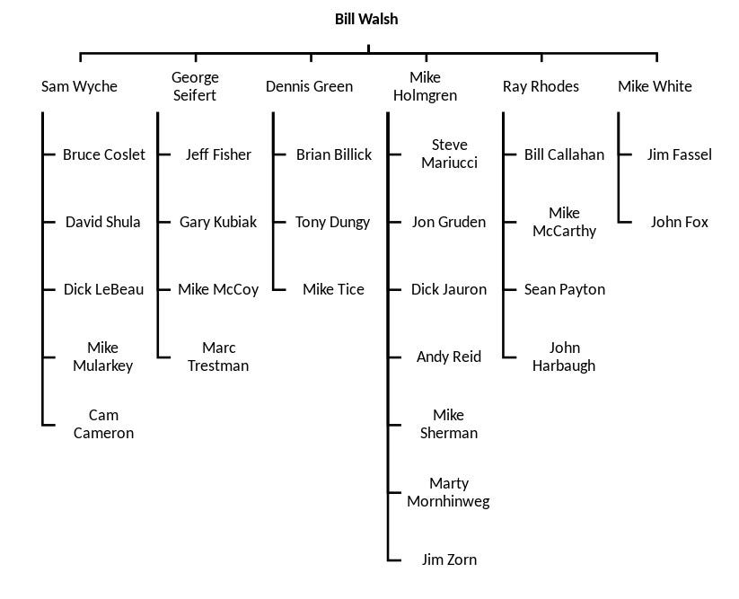
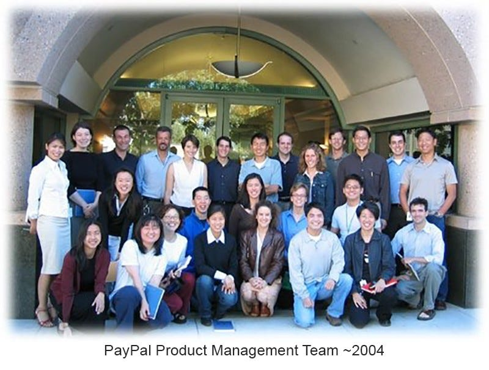

# Coaching Trees and How We Pay It Forward 

*What do you want your legacy to be?*

Photo by [Emma Gossett](https://unsplash.com/@emmagossett?utm_source=unsplash&utm_medium=referral&utm_content=creditCopyText) on [Unsplash](https://unsplash.com/photos/B645igbiKCw?utm_source=unsplash&utm_medium=referral&utm_content=creditCopyText)

[Share](https://debliu.substack.com/p/coaching-trees-and-how-we-pay-it?utm_source=substack&utm_medium=email&utm_content=share&action=share)

Last year, someone I sponsored on my team reached out to me asking for advice. Before he left Meta to join his current company, he had asked for my insight into the opportunity, and we talked about the risks and rewards he faced. He was taking on half the product team with the idea that he would expand his scope to become CPO at some point. Then, when he was made CPO months later, he stopped by to meet up with me and share the wonderful news.

When we met up, we talked about how many of the strong people from our teams went on to become incredible product leaders in their own right. He said, “In football, they call it a coaching tree.” He went on to explain the concept to me, and then he sent me a link to [this Wikipedia article](https://en.m.wikipedia.org/wiki/Coaching_tree). It highlights the coaching tree of Bill Walsh, who became the storied coach of the San Francisco 49ers in 1979. His assistant coaches went on to win multiple Super Bowls and train well-known head coaches whose legacies extend to this day.

I read the article with curiosity, and gradually I realized that I myself had been part of a coaching tree, with my own branch of leaders all stemming from it. They will go forth to create their own branches and pay it forward to future leaders.

Source: Wikipedia.org

Coaching trees illustrate the power of advice and mentorship in professional circles. The image got me thinking about how far good advice can travel, so as a follow-on to my last few articles on mentors (including [my post for International Mentor Day](https://debliu.substack.com/p/how-mentors-can-change-your-trajectory)), I’ve decided to explore this idea in more detail: what a coaching tree is, how it grows, and how it helps us pay the wisdom of our mentors forward.

## **At the Top of a Coaching Tree**

The top of a coaching tree usually starts with a single leader whose advice shapes the careers of those who follow them. These successors then pass their knowledge on to future “branches” of the tree, and so on.

[Bill Campbell](https://en.wikipedia.org/wiki/Bill_Campbell_(business_executive)) is a great example of how far coaching trees can extend. Former Google CEO Eric Schmidt, one of those he mentored, dubbed him the [Trillion Dollar Coach](https://amzn.to/3YheeP1) in a 2019 book of the same name. A legendary leader in Silicon Valley, Campbell served as CEO of several companies, including Intuit (where he later became board chair), and as a board member of Apple. Though I never had the pleasure of meeting him before his passing in 2016, I have had the benefit of hearing his life and business lessons through the leadership and board of Intuit who had a chance to know him and learn from his wisdom.

After Robby sent me the article on coaching trees, I started mentally constructing the tree of those I had learned from—a “product tree” of sorts. At the top was Amy Klement, the VP of Product who took a chance on me, someone fresh out of business school with no idea what being a PM entailed. She not only gave me a job, but she also taught me how to thrive in the tech industry. I owe my success to her, and so do many others.

Amy became the top of a coaching tree that has yielded so many incredible leaders throughout the industry. So many founders, investors, CEOs, CPOs and VPs of Products, COOs, and more have been touched by her influence. We all learned from her—and from each other—and even to this day, we still gather to connect and remember where we all started. Amy’s mentorship is a part of our past and our legacy, and our mini “family reunions” are a reminder that time does not wash away our connection. These leaders, in turn, have all gone on to create their own coaching trees—all thanks to one person who took a chance on all of us.

A good coach has a cascading effect, one that sends ripples through their circles and the circles of others. When you think about being a strong mentor, it’s important to remember that your influence doesn’t just shape the person you’re mentoring—it trickles down to everyone they mentor as well. Your advice can go on to affect the careers of dozens of others. As leaders, this is a humbling reminder of the responsibility we have to those who succeed us.

## **Appreciating Those Who Came Before**

I am deeply grateful for the managers and mentors who have developed me. Part of the unintentional joy of writing this newsletter is that I have had a chance to reflect on their impact on me and distill their lessons for others to enjoy. (You can find more on this in my articles on [the best advice I’ve received from my mentors](https://debliu.substack.com/p/wisdom-from-mentors-that-i-still), as well as [how to show appreciation](https://debliu.substack.com/p/the-power-of-gratitude-thanking-the).)

It can be easy to forget just how much help you’ve been given in getting to where you are today. But when you zoom out, you see all the ways the people around you have shaped your career.

Try this as an exercise: if you had to narrow down the top five leaders who made you who you are today, who would you put on that list? Take a moment to write their names down, along with up to three valuable things you learned from each one. Then, write a note of thanks to each of them for what they taught you and the impact they had on you.

I did this exercise when I wrote my last post. Listing the top nine lessons my mentors taught me was a reminder of how many people made a difference in my life, and what their words meant. It also gave me an excuse to thank each of them for their positive influence.

By reflecting on those who helped you get to where you are, you’re making space to thank them for the help they’ve given you. This will allow you to capture their most valuable lessons—and pass them along to others.

## **Paying It Forward**

In the Bible, there’s a saying: “You will know them by their fruit” ([ref](https://www.gotquestions.org/you-will-know-them-by-their-fruit.html)). This is referring to how good trees bear good fruit. Similarly, those who learn *from* great coaches also learn how to *become* great coaches. Those who see and live the example of working with strong leaders will likewise impart those lessons to the next generation.

When someone dedicates their time and energy to helping you become a great leader, one of the best things you can do to show your appreciation is to pay it forward. That means listening well to the lessons of your best managers and spreading that wisdom to those around you.

Take a moment to think about the advice you’ve been given that you now make a point to pass on. This is what makes up the philosophy of your coaching tree. Here are several kernels of wisdom that I hold dear from my own tree, which I try to live by in my own relationships:

* **Inclusive leadership:** I truly believe in making sure there is a seat at the table for everyone, and that everyone at the table has an equal voice. I have not always gotten this right, but trying to live by this value has allowed me to recognize so much hidden talent that I might not have seen otherwise.
* **Trust people:** I believe people do their best work when they are extended the courtesy of trust. I know there are others who want their teams to "prove their worth first,” but this isn’t how I like to lead. I was extended a great deal of trust with little or no track record, and I aspire to do the same for others.
* **Build connection:** We are not robots or automatons. People are not interchangeable; they all want different things, and they all see the world from a unique perspective. Building human connections unlocks what makes them special. I saw early in my career how powerful these connections are, which is why I strive to continue to forge them every day.
* **Relationships last beyond jobs:** Many people consider their time together at work temporary. However, as I say to team members who have departed, or whom I have left behind, "Life is long, and the world is small. Someday I hope we have the chance to work together again." And guess what: you would be surprised how many times I have had a chance to advise, support, or connect with those I work with again and again.

The great thing about coaching trees is that they allow the best advice to filter down to future branches, which in turn continue to carry it to others. By sharing the wisdom we’ve been given from our own leaders, we can allow others to benefit from it while practicing what we preach.

## **Creating Your Own Coaching Tree**

I want you to do one more experiment. Think about what your own coaching tree looks like today. Next, think about what you hope it will look like when your career ends. You may be thinking that you aren't senior enough to do this, or that you haven't had the chance to develop others yet. But think about Amy Klement: throughout her career, she shaped the futures of countless leaders, and you have the same power. Whether or not you’ve had a chance to mentor or grow someone yet, your potential impact extends far beyond where you are. Your actions, though many are small, ripple through others in more ways than you can count.

Remembering this is critical to leaving behind a leadership legacy that you can be proud of. Just like you are a branch on the trees of the managers and mentors who helped you, your influence is touching people every day, directly or indirectly. You may have already started a coaching tree without even realizing it.

Once you know what lessons you want to pass on to others, your job is to determine how you can best put them into practice. By living them out in your life and work, you are creating new branches that extend farther than you would believe.

---

I am proud to see those who worked with me become founders, leaders, and advisors. I hope someday that my tree will be one with branches that reach out far and wide, one that will leave a lasting legacy in the industry. I aspire to extend the lessons that I myself have been taught by those who mentored me further up my tree.

I urge you all to think about the trees you want to plant. From a humble acorn, a mighty oak can grow, so ask yourself now: what do you want your legacy to be?

Thank you for reading Perspectives. This post is public so feel free to share it.

[Share](https://debliu.substack.com/p/coaching-trees-and-how-we-pay-it?utm_source=substack&utm_medium=email&utm_content=share&action=share)