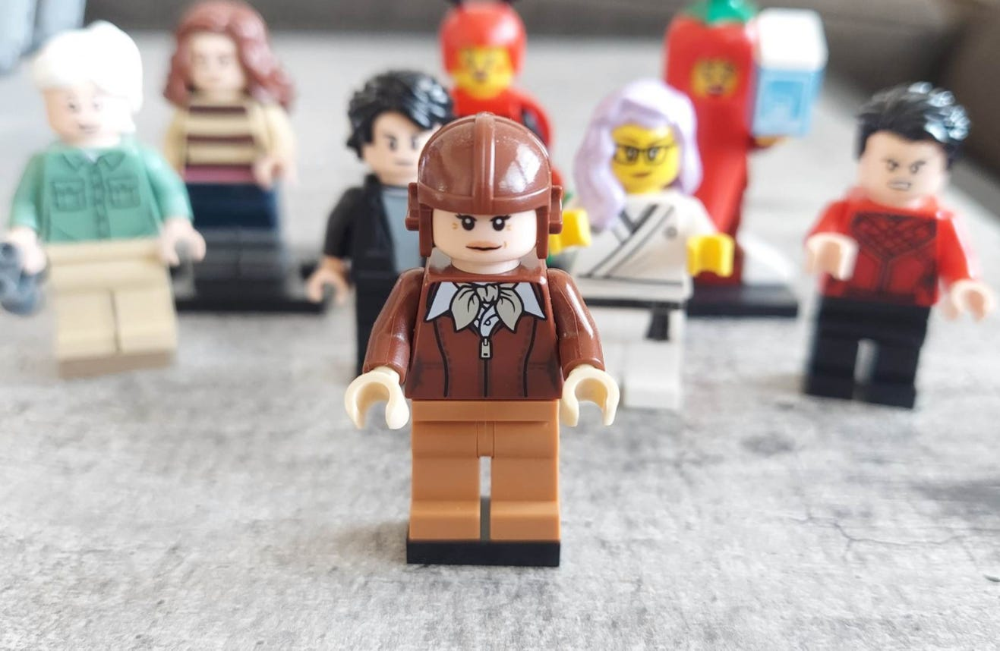

# Everyone is the Hero of Their Own Story

*How to see the world from someone else’s eyes *

Everyone has this experience: you work with someone who drives you completely crazy. Their actions appear erratic, self-serving, and frustrating. Their questions are not inquisitive, but rather aggressive. Their input is critical rather than helpful. Their invasive style seems undermining and provocative, rather than partnering and supportive. They see the world completely differently than you, and you ascribe negative motives to their actions.

[Share](https://debliu.substack.com/p/everyone-is-the-hero-of-their-own?utm_source=substack&utm_medium=email&utm_content=share&action=share)

This has happened to me multiple times in my career. A few years ago, I was describing one of these situations to a mentor, and she asked, “**What if you retold the story with them as the hero**?”

I balked at first. What could possibly justify someone acting the way this person did, when they only left chaos in their wake? I sat on this for a week, and then I allowed myself to gradually start to retell the story. Suddenly, my perspective changed. Rather than seeing them as erratic and uncaring, I began to see the *why* behind their actions. It was as if I could see the whole world from a different point of view—theirs, not mine.

## **“Everyone is the hero of their own story.”**

We understand our own behavior because we understand our intent. Others don't have the ability to see beyond the veil of our actions, so what they do is make assumptions about us. We do the same thing to others. We take the data that we get as clues to what their true character is. Using these breadcrumbs, we attempt to conclude whether they are a good actor or a bad one with ill intent.

But what if they turn out to be neither? No person is all good or all bad. Most people are responding to the stimulus around them. If they are rewarded for bad behavior, they will do that more. But if they're rewarded for good behavior, then you'll see more of that. We are shaped way more by our environment than we think.

One peer was constantly publicly challenging me about my product. I felt like he was trying to undermine me by poking holes in my strategy and questioning my execution. I found it exhausting and demoralizing. Then, one day, someone pointed out that his hitting his goal was completely dependent on my team (a platform service) delivering on ours. Suddenly, I realized why he was always on my case: he felt unsure about my ability to deliver, and thus, he felt that his own goals—and those of his team—were at risk, without any recourse. Looking at it from his point of view helped me see that in his story, he was relying on a partner who was evasive and defensive. We ended up sitting down to discuss our mutual concerns and move forward with less animosity.

These sorts of conflicts show up time and time again in the workplace. By reframing them from the other person's perspective, we can discover that, more often than not, we're on the same side.

## **Our perspective vs. reality**

I remember a time earlier in my career when someone asked to transfer to my team with the blessing of his current manager. The manager reached out to me as we did the handoff, and she shared a bit about his work, strengths, and weaknesses. Then she said that she found him to be dishonest and unreliable. I was completely confused. We were all friendly, and we worked together for a while. This came as a shock, so I asked her what she meant. She shared a list of examples, including how he would always promise to submit his weekly report, but sometimes it would be a couple of extra days. We were swamped at the time, so I chalked this up to him being busy. She also claimed that he wasn’t responsive to our vice president because he would take more than 24 hours to respond, which she found unprofessional. I was confused by this, so I didn’t say much.

This colleague transferred to my team, and we worked together successfully for years. I never witnessed any dishonesty or unprofessionalism. What was the disconnect between me and his former manager? She took his actions and ascribed a negative intent to them, whereas I saw his actions as actions of prioritization.

Our differing takes on his actions were a matter of perspective. One of us saw him as having positive intent, and the other as having negative intent. His behavior was not substantially different on my team, but my perception of him colored our interactions, just as hers did.

[I've previously written about the difference between our intent and our behavior.](https://debliu.substack.com/p/tough-love-how-hard-feedback-changed) At the end of the day, all anyone else can do is witness our actions, since they can't possibly know the intentions behind them. This influences their perception of us and the things we do—and this discrepancy can be the cause of many workplace conflicts.

If you struggle to work with a manager, ask yourself whether this is what is happening between you. If so, consider a reset and realignment of your expectations. Seeing your actions through their eyes could be the breakthrough you need to help you through this misunderstanding, and the key to unlocking your relationship.

## **How we look to others**

We are always the heroes in our own stories. We understand our own motives. We understand our own actions. And no matter what, they seem to make sense in our minds, because our collective set of experiences tells us so. But if we look at the world from someone else's perspective, we see that we can appear mysterious. We can appear duplicitous. We might even appear irrational. [One thing that Katia taught me during our coaching](https://debliu.substack.com/p/career-coaching-how-an-outside-perspective) was that everyone has a movie playing in their own head. They are watching their version of the movie, and you are watching your own, and a lot of things that may seem obvious to you are sometimes not obvious to them.

In my [previous article about coaching trees](https://debliu.substack.com/p/coaching-trees-and-how-we-pay-it), I opened with a story about how someone shared with me what they were. He went on to explain them to me, then he asked, “Did I just mansplain? Please call me out if I did.” He worried about insulting me, but I took no offense because we were close. I happen to know absolutely nothing about sports (so he was right), but even if I were an avid sports enthusiast, our relationship helps me see that he was trying to be helpful, not condescending.

Relationships dictate how we look at the actions of others. We filter the world through our experiences, and we assume most others see the world in a similar way unless told otherwise.

## **Forcing yourself to have perspective**

One of my favorite questions to ask candidates during job interviews was always, "Who is the most difficult person you've ever worked with and why?" Candidates often shared harrowing tales of working with people that they could not get along with. Some of these people sounded genuinely horrible as colleagues or managers.

I would always follow this with another question: "If I called this person up right now, what would they say about you?"

Suddenly, the shoe was on the other foot. I would ask them to look at a person that they had just told me terrible tales about and then tell me how that person would feel about them. Some had written off the other person altogether, but those who were insightful and had perspective could tell the story of their experience from the other person's point of view. This was a sign that the candidate had the ability to take themselves out of an otherwise fraught situation and see it with grace and empathy. This self-awareness and consideration for others is an admirable quality in a colleague and an employee.

---

Perspective matters a lot in relationships—and a lot of our perspectives are shaped by our existing relationships. Seeing through the eyes of someone else means giving ourselves a chance to look at the world beyond our own filters. This allows us to see past our prejudices and preconceived notions to arrive at a more objective version of the story.

[Subscribe now](https://debliu.substack.com/subscribe?)